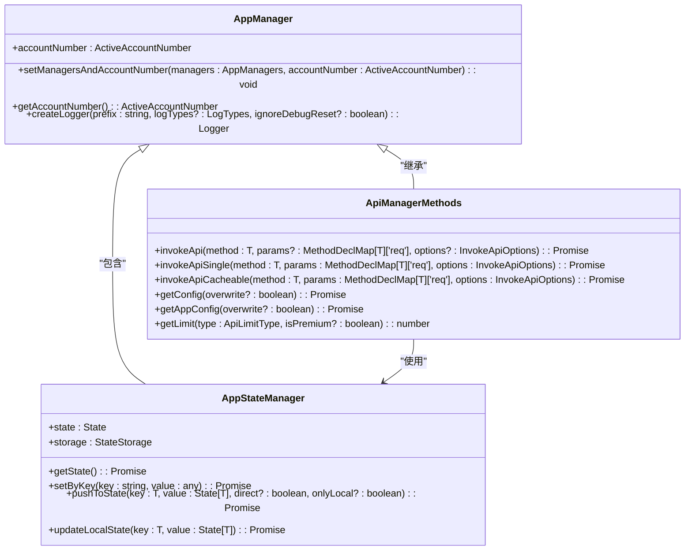
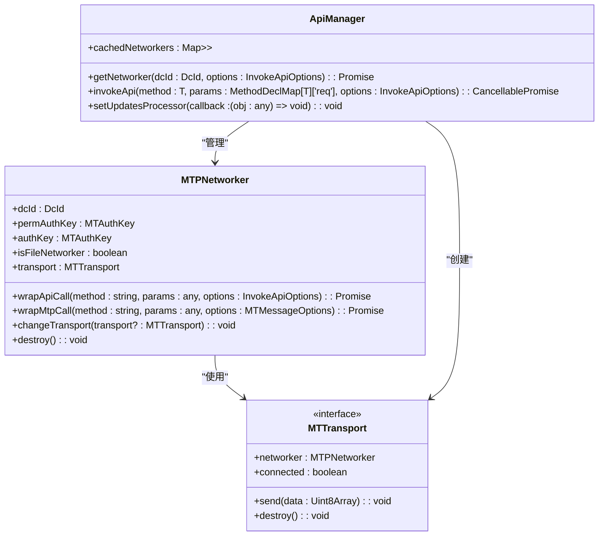
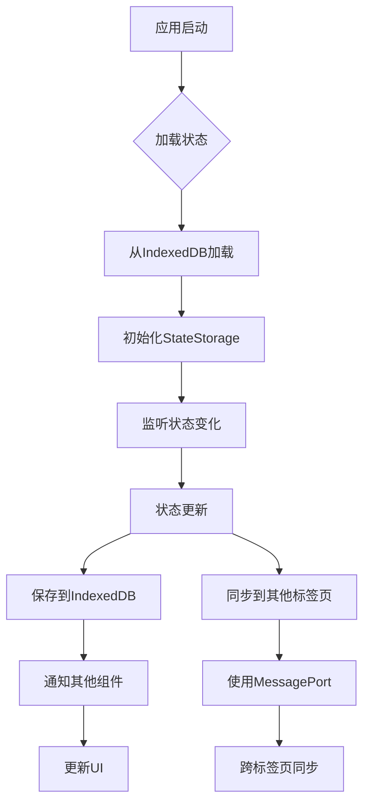
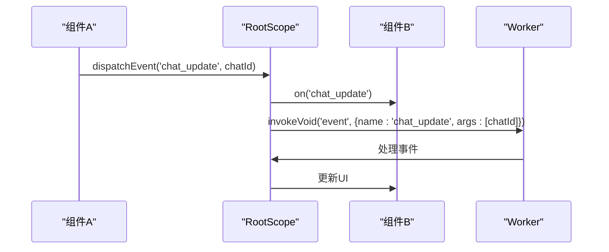
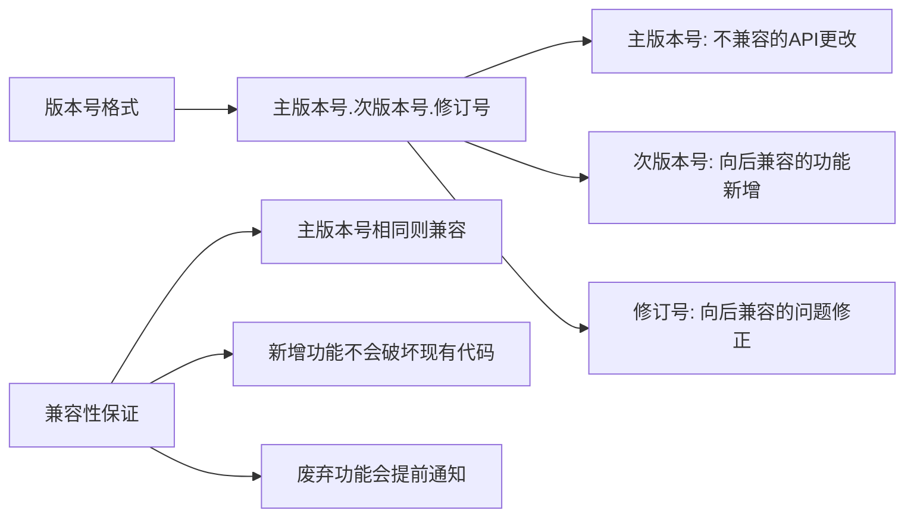

# API参考

<cite>
**本文档中引用的文件**   
- [appManagers.ts](file://src/lib/appManagers/managers.d.ts)
- [apiManager.ts](file://src/lib/mtproto/apiManager.ts)
- [api_methods.ts](file://src/lib/mtproto/api_methods.ts)
- [rootScope.ts](file://src/lib/rootScope.ts)
- [stateStorage.ts](file://src/lib/stateStorage.ts)
- [appStateManager.ts](file://src/lib/appManagers/appStateManager.ts)
- [manager.ts](file://src/lib/appManagers/manager.ts)
- [networker.ts](file://src/lib/mtproto/networker.ts)
- [transport.ts](file://src/lib/mtproto/transports/transport.ts)
</cite>

## 目录
1. [简介](#简介)
2. [业务逻辑API](#业务逻辑API)
3. [协议API](#协议API)
4. [数据模型和类型定义](#数据模型和类型定义)
5. [状态存储API](#状态存储API)
6. [事件系统和消息总线](#事件系统和消息总线)
7. [版本控制策略](#版本控制策略)
8. [客户端实现指南](#客户端实现指南)

## 简介
本文档提供了tweb项目的全面API参考，涵盖了appManagers中的业务逻辑API和mtproto中的协议API。文档详细描述了每个方法的参数、返回值、异常和使用示例，以及数据模型、状态存储、事件系统和版本控制策略。

**Section sources**
- [appManagers.ts](file://src/lib/appManagers/managers.d.ts)
- [apiManager.ts](file://src/lib/mtproto/apiManager.ts)

## 业务逻辑API
业务逻辑API由appManagers目录中的各类管理器提供，这些管理器封装了与Telegram API的交互逻辑，为上层应用提供简洁的接口。



**Diagram sources **
- [manager.ts](file://src/lib/appManagers/manager.ts)
- [api_methods.ts](file://src/lib/mtproto/api_methods.ts)
- [appStateManager.ts](file://src/lib/appManagers/appStateManager.ts)

### API调用方法
业务逻辑API提供了多种API调用方法，以满足不同的使用场景：

- `invokeApi`: 基本的API调用方法，直接与MTProto协议交互
- `invokeApiSingle`: 单次处理的API调用，确保相同请求不会并发执行
- `invokeApiCacheable`: 可缓存的API调用，对结果进行缓存以提高性能
- `invokeApiHashable`: 支持哈希比较的API调用，用于增量更新

这些方法都支持选项参数，可以控制请求的行为，如超时、重试、缓存等。

**Section sources**
- [api_methods.ts](file://src/lib/mtproto/api_methods.ts)
- [apiManager.ts](file://src/lib/mtproto/apiManager.ts)

## 协议API
协议API基于MTProto 2.0协议实现，提供了与Telegram服务器通信的底层机制。mtproto目录包含了协议实现的核心组件。



**Diagram sources **
- [networker.ts](file://src/lib/mtproto/networker.ts)
- [transport.ts](file://src/lib/mtproto/transports/transport.ts)
- [apiManager.ts](file://src/lib/mtproto/apiManager.ts)

### 传输层
协议API支持多种传输方式，包括WebSocket、TCP混淆和HTTP。传输层的抽象允许在不同网络条件下灵活切换：

- **WebSocket**: 主要的实时通信方式，提供低延迟的双向通信
- **TCP混淆**: 用于绕过网络审查，提供更稳定的连接
- **HTTP**: 作为备用方案，在WebSocket不可用时使用长轮询

传输层的切换是透明的，上层应用无需关心具体的传输方式。

**Section sources**
- [transports](file://src/lib/mtproto/transports)
- [networker.ts](file://src/lib/mtproto/networker.ts)

## 数据模型和类型定义
项目使用TypeScript定义了丰富的数据模型和类型，确保类型安全和代码可维护性。

```mermaid
classDiagram
class State {
+chatPositions : Map<string, ChatSavedPosition>
+drafts : Map<PeerId, MyDraftMessage>
+settings : StateSettings
}
class StateStorage {
+db : AccountDatabase
+table : string
+get<T>(key : string) : Promise<T>
+set<T>(value : T, onlyLocal? : boolean) : Promise<void>
+delete(key : string) : Promise<void>
}
class BroadcastEvents {
+chat_update : ChatId
+user_update : UserId
+peer_pinned_messages : {peerId : PeerId, mids? : number[], pinned? : boolean}
+dialog_draft : {peerId : PeerId, dialog : Dialog | ForumTopic, drop : boolean, draft : MyDraftMessage | undefined}
+message_sent : {storageKey : MessagesStorageKey, tempId : number, tempMessage : any, mid : number, message : MyMessage}
+stars_balance : {balance : Long, fulfilledReservedStars? : number, ton : boolean}
}
StateStorage --> State : "存储"
StateStorage --> AccountDatabase : "使用"
RootScope --> BroadcastEvents : "定义"
```

**Diagram sources **
- [stateStorage.ts](file://src/lib/stateStorage.ts)
- [state.ts](file://src/config/state.ts)
- [rootScope.ts](file://src/lib/rootScope.ts)

### 核心数据类型
项目定义了多种核心数据类型，用于表示Telegram的各种实体：

- **PeerId**: 表示用户、群组或频道的唯一标识符
- **ChatId**: 表示聊天的唯一标识符
- **UserId**: 表示用户的唯一标识符
- **DocId**: 表示文档的唯一标识符
- **Long**: 表示64位整数，用于处理大数值

这些类型在数据传输和存储中广泛使用，确保了数据的一致性和正确性。

**Section sources**
- [types.d.ts](file://src/types.d.ts)
- [layer.d.ts](file://src/layer.d.ts)

## 状态存储API
状态存储API负责管理应用的本地状态，包括聊天位置、草稿消息和用户设置等。



**Diagram sources **
- [stateStorage.ts](file://src/lib/stateStorage.ts)
- [appStateManager.ts](file://src/lib/appManagers/appStateManager.ts)

### 状态管理流程
状态管理遵循以下流程：

1. **初始化**: 应用启动时，从IndexedDB加载持久化状态
2. **监听**: 设置状态变化监听器，响应状态更新
3. **更新**: 当状态发生变化时，立即更新内存中的状态
4. **持久化**: 将状态变化保存到IndexedDB，确保数据不丢失
5. **同步**: 通过MessagePort机制，将状态变化同步到其他标签页

这种设计确保了状态的一致性和可靠性，即使在页面刷新或崩溃后也能恢复。

**Section sources**
- [stateStorage.ts](file://src/lib/stateStorage.ts)
- [appStateManager.ts](file://src/lib/appManagers/appStateManager.ts)

## 事件系统和消息总线
事件系统和消息总线是应用内部通信的核心机制，实现了组件间的松耦合。



**Diagram sources **
- [rootScope.ts](file://src/lib/rootScope.ts)
- [mtprotoMessagePort.ts](file://src/lib/mtproto/mtprotoMessagePort.ts)

### 事件类型
系统定义了丰富的事件类型，涵盖了应用的各个方面：

- **聊天相关**: `chat_update`, `chat_full_update`, `chat_participant`
- **用户相关**: `user_update`, `user_auth`, `user_full_update`
- **消息相关**: `message_sent`, `message_edit`, `message_error`
- **对话相关**: `dialog_draft`, `dialog_unread`, `dialog_notify_settings`
- **状态相关**: `state_synchronized`, `state_synchronizing`, `state_cleared`

这些事件为应用提供了灵活的响应机制，使得各个组件能够及时响应系统状态的变化。

**Section sources**
- [rootScope.ts](file://src/lib/rootScope.ts)

## 版本控制策略
项目采用语义化版本控制策略，确保API的向后兼容性。



**Diagram sources **
- [version.js](file://scripts/change_version.js)

### 向后兼容性
项目严格遵守向后兼容性原则：

- **新增功能**: 通过可选参数或新方法添加，不影响现有代码
- **废弃功能**: 标记为废弃并提供替代方案，至少保留一个主版本周期
- **错误修复**: 不会改变API的行为，只修复bug
- **性能优化**: 在不改变API行为的前提下进行

这种策略确保了客户端能够平稳升级，减少了升级带来的风险。

**Section sources**
- [CHANGELOG.md](file://CHANGELOG_ru.md)
- [version.js](file://scripts/change_version.js)

## 客户端实现指南
本节提供客户端实现的最佳实践和指南。

### API调用最佳实践
- **错误处理**: 始终处理API调用可能抛出的异常
- **重试机制**: 对于网络错误，实现指数退避重试
- **缓存策略**: 合理使用缓存，避免不必要的网络请求
- **并发控制**: 避免对同一资源的并发修改
- **资源清理**: 及时清理不再使用的资源，防止内存泄漏

### 性能优化建议
- **批量操作**: 尽量使用批量API，减少网络往返
- **懒加载**: 延迟加载非关键资源，提高启动速度
- **数据压缩**: 对大数据量的传输进行压缩
- **连接复用**: 复用网络连接，减少连接建立开销
- **本地缓存**: 充分利用本地存储，减少网络依赖

**Section sources**
- [performance.js](file://scripts/build.js)
- [optimization.md](file://README.md)