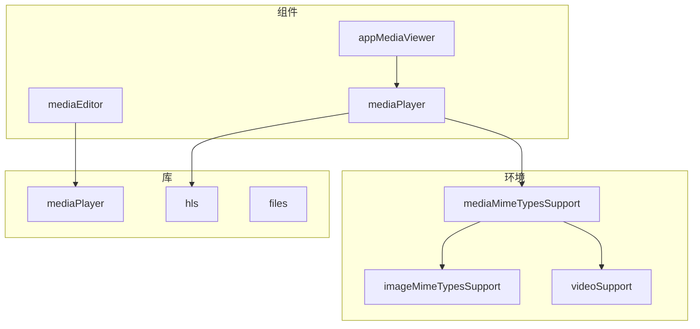
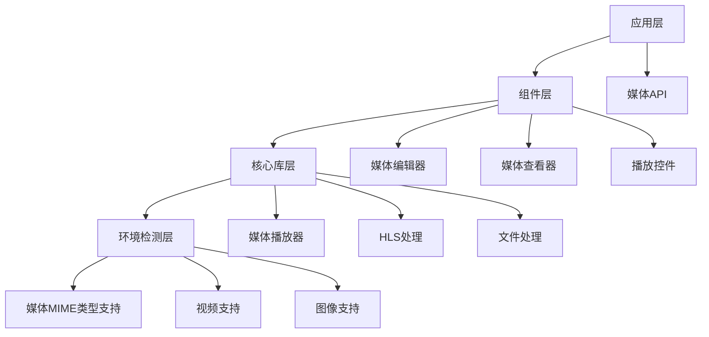
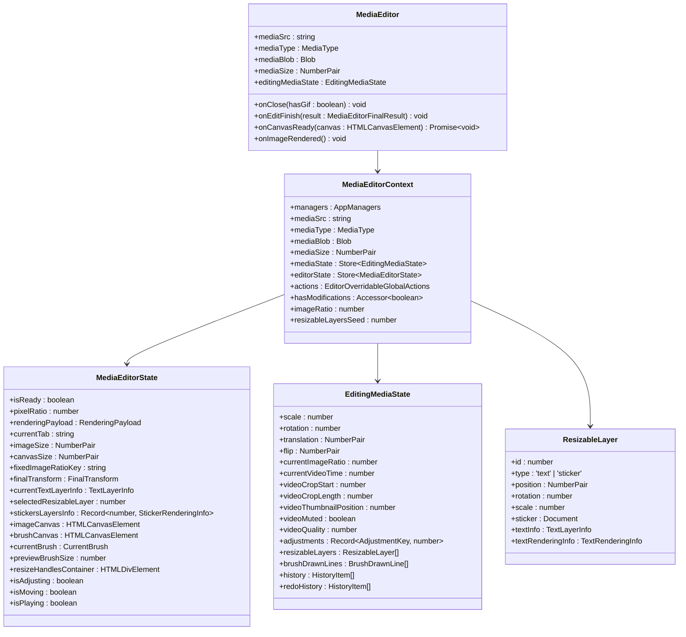
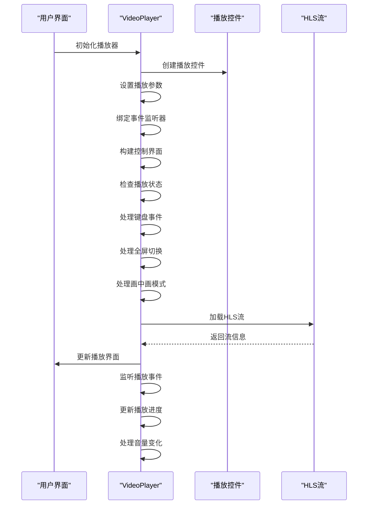
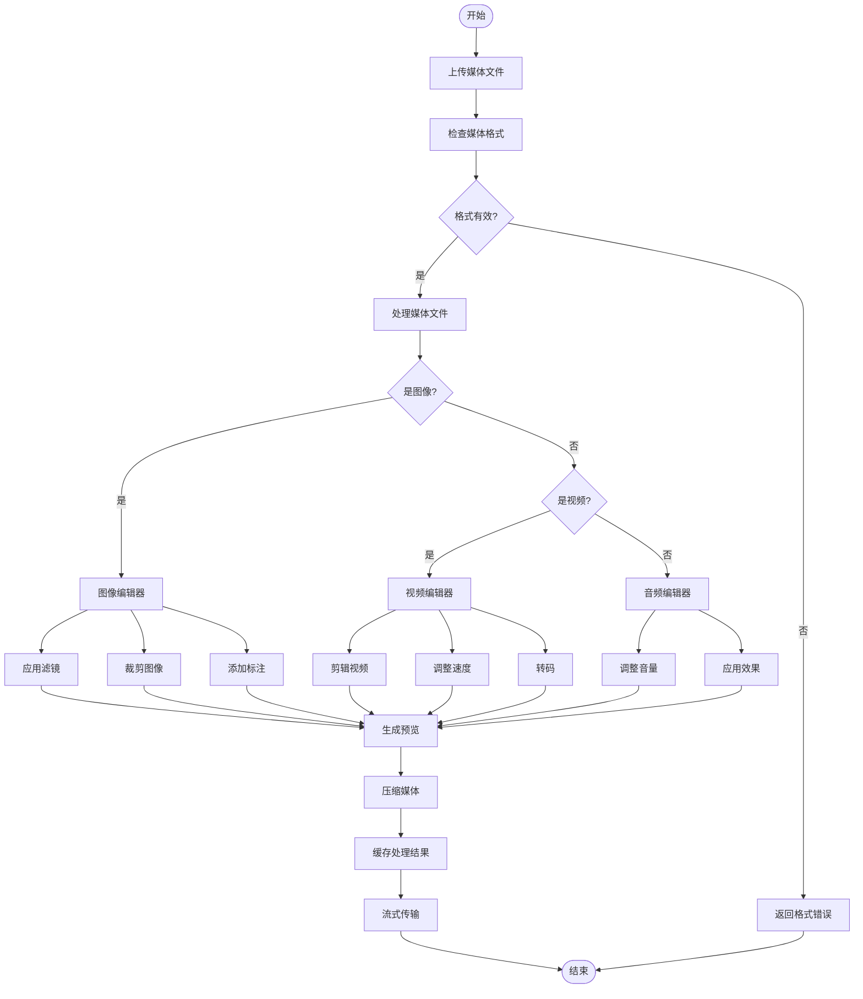
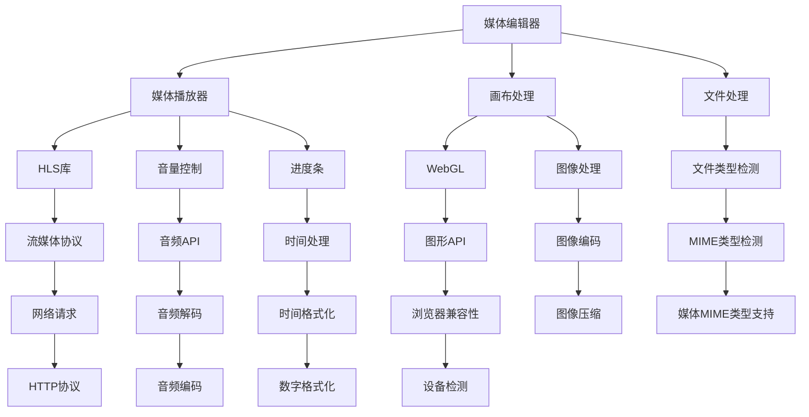

# 媒体API

<cite>
**本文档中引用的文件**  
- [mediaEditor.tsx](file://src/components/mediaEditor/mediaEditor.tsx)
- [types.ts](file://src/components/mediaEditor/types.ts)
- [context.ts](file://src/components/mediaEditor/context.ts)
- [mainCanvas.tsx](file://src/components/mediaEditor/canvas/mainCanvas.tsx)
- [createFinalResult.ts](file://src/components/mediaEditor/finalRender/createFinalResult.ts)
- [index.ts](file://src/lib/mediaPlayer/index.ts)
- [appMediaViewer.ts](file://src/components/appMediaViewer.ts)
- [mediaMimeTypesSupport.ts](file://src/environment/mediaMimeTypesSupport.ts)
- [adjustments.ts](file://src/components/mediaEditor/adjustments.ts)
- [calcCodecAndBitrate.ts](file://src/components/mediaEditor/finalRender/calcCodecAndBitrate.ts)
- [getResultSize.ts](file://src/components/mediaEditor/finalRender/getResultSize.ts)
- [getResultTransform.ts](file://src/components/mediaEditor/finalRender/getResultTransform.ts)
</cite>

## 目录
1. [简介](#简介)
2. [项目结构](#项目结构)
3. [核心组件](#核心组件)
4. [架构概述](#架构概述)
5. [详细组件分析](#详细组件分析)
6. [依赖分析](#依赖分析)
7. [性能考虑](#性能考虑)
8. [故障排除指南](#故障排除指南)
9. [结论](#结论)

## 简介
本项目实现了一个完整的媒体处理系统，支持图片、视频和音频文件的上传、编辑、播放和流式传输。系统提供了丰富的媒体编辑功能，包括裁剪、滤镜、标注和画笔工具。媒体播放器支持HLS流媒体、画中画(PiP)模式和多种播放控制。系统还实现了智能的媒体缓存和性能优化策略，确保在各种设备上都能流畅运行。

## 项目结构
项目采用模块化架构，主要分为组件、库和环境配置三个部分。媒体相关功能主要集中在`src/components/mediaEditor`和`src/lib/mediaPlayer`目录中。

**Diagram sources**
- [mediaEditor.tsx](file://src/components/mediaEditor/mediaEditor.tsx)
- [index.ts](file://src/lib/mediaPlayer/index.ts)
- [appMediaViewer.ts](file://src/components/appMediaViewer.ts)
- [mediaMimeTypesSupport.ts](file://src/environment/mediaMimeTypesSupport.ts)

**Section sources**
- [mediaEditor.tsx](file://src/components/mediaEditor/mediaEditor.tsx)
- [index.ts](file://src/lib/mediaPlayer/index.ts)

## 核心组件
系统的核心组件包括媒体编辑器、媒体播放器和媒体查看器。媒体编辑器提供完整的图像和视频编辑功能，支持多种滤镜和标注工具。媒体播放器实现专业的视频播放控制，包括播放速率调整、画质切换和全屏控制。媒体查看器提供沉浸式的媒体浏览体验，支持前后导航和上下文操作。

**Section sources**
- [mediaEditor.tsx](file://src/components/mediaEditor/mediaEditor.tsx)
- [index.ts](file://src/lib/mediaPlayer/index.ts)
- [appMediaViewer.ts](file://src/components/appMediaViewer.ts)

## 架构概述
系统采用分层架构设计，从下到上分为环境检测层、核心库层、组件层和应用层。环境检测层负责检测浏览器对各种媒体格式的支持情况。核心库层提供媒体处理的基础功能。组件层实现具体的用户界面和交互逻辑。应用层将各个组件组合成完整的功能模块。

**Diagram sources**
- [mediaMimeTypesSupport.ts](file://src/environment/mediaMimeTypesSupport.ts)
- [index.ts](file://src/lib/mediaPlayer/index.ts)
- [mediaEditor.tsx](file://src/components/mediaEditor/mediaEditor.tsx)
- [appMediaViewer.ts](file://src/components/appMediaViewer.ts)

## 详细组件分析

### 媒体编辑器分析
媒体编辑器组件提供完整的图像和视频编辑功能，支持裁剪、旋转、滤镜调整和标注。

#### 对象导向组件

**Diagram sources**
- [mediaEditor.tsx](file://src/components/mediaEditor/mediaEditor.tsx)
- [context.ts](file://src/components/mediaEditor/context.ts)
- [types.ts](file://src/components/mediaEditor/types.ts)

**Section sources**
- [mediaEditor.tsx](file://src/components/mediaEditor/mediaEditor.tsx)
- [context.ts](file://src/components/mediaEditor/context.ts)

### 媒体播放器分析
媒体播放器组件提供专业的视频播放功能，支持多种播放控制和流媒体协议。

#### API/服务组件

**Diagram sources**
- [index.ts](file://src/lib/mediaPlayer/index.ts)
- [appMediaViewer.ts](file://src/components/appMediaViewer.ts)

**Section sources**
- [index.ts](file://src/lib/mediaPlayer/index.ts)
- [appMediaViewer.ts](file://src/components/appMediaViewer.ts)

### 媒体处理流程分析
媒体处理流程包括上传、编辑、转码和播放等多个阶段，每个阶段都有相应的优化策略。

#### 复杂逻辑组件

**Diagram sources**
- [createFinalResult.ts](file://src/components/mediaEditor/finalRender/createFinalResult.ts)
- [calcCodecAndBitrate.ts](file://src/components/mediaEditor/finalRender/calcCodecAndBitrate.ts)
- [getResultSize.ts](file://src/components/mediaEditor/finalRender/getResultSize.ts)
- [getResultTransform.ts](file://src/components/mediaEditor/finalRender/getResultTransform.ts)

**Section sources**
- [createFinalResult.ts](file://src/components/mediaEditor/finalRender/createFinalResult.ts)
- [calcCodecAndBitrate.ts](file://src/components/mediaEditor/finalRender/calcCodecAndBitrate.ts)

## 依赖分析
系统依赖关系清晰，各组件之间耦合度低，便于维护和扩展。

**Diagram sources**
- [mediaEditor.tsx](file://src/components/mediaEditor/mediaEditor.tsx)
- [index.ts](file://src/lib/mediaPlayer/index.ts)
- [mediaMimeTypesSupport.ts](file://src/environment/mediaMimeTypesSupport.ts)

**Section sources**
- [mediaEditor.tsx](file://src/components/mediaEditor/mediaEditor.tsx)
- [index.ts](file://src/lib/mediaPlayer/index.ts)
- [mediaMimeTypesSupport.ts](file://src/environment/mediaMimeTypesSupport.ts)

## 性能考虑
系统在性能方面做了大量优化，包括懒加载、缓存策略和资源压缩。媒体编辑器采用WebGL进行实时渲染，确保编辑操作的流畅性。媒体播放器支持自适应码率切换，根据网络状况自动调整视频质量。系统还实现了智能的预加载机制，提前加载用户可能访问的媒体内容。

## 故障排除指南
常见问题包括媒体格式不支持、播放卡顿和编辑功能异常。对于格式不支持的问题，需要检查`mediaMimeTypesSupport.ts`中定义的支持格式列表。播放卡顿可能是由于网络状况不佳或设备性能不足，可以尝试降低视频质量。编辑功能异常通常与浏览器兼容性有关，建议使用最新版本的主流浏览器。

**Section sources**
- [mediaMimeTypesSupport.ts](file://src/environment/mediaMimeTypesSupport.ts)
- [index.ts](file://src/lib/mediaPlayer/index.ts)
- [mediaEditor.tsx](file://src/components/mediaEditor/mediaEditor.tsx)

## 结论
本媒体API系统提供了完整的媒体处理解决方案，从上传、编辑到播放和流式传输，覆盖了媒体处理的各个环节。系统架构清晰，组件职责明确，具有良好的可扩展性和维护性。通过合理的性能优化和错误处理机制，确保了在各种使用场景下的稳定性和用户体验。