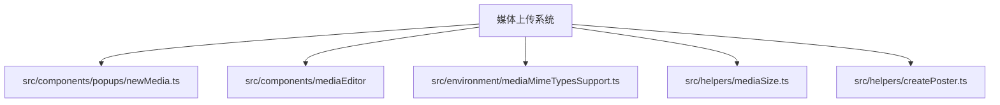
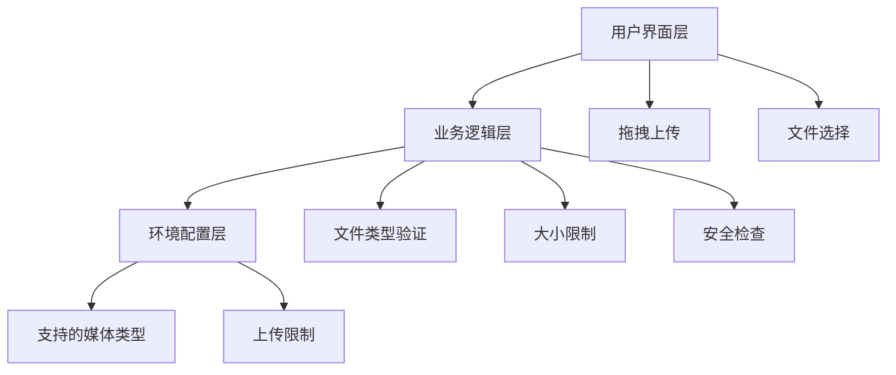
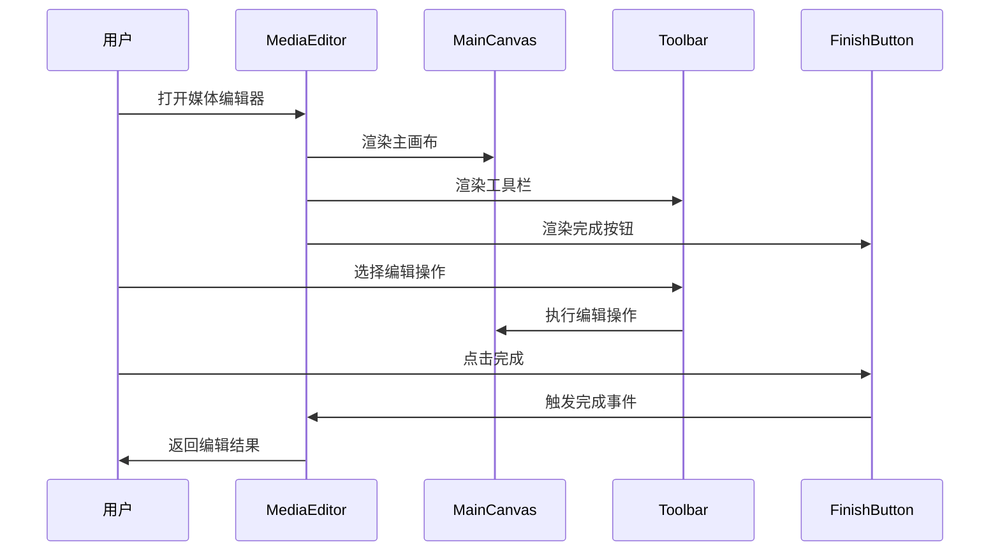
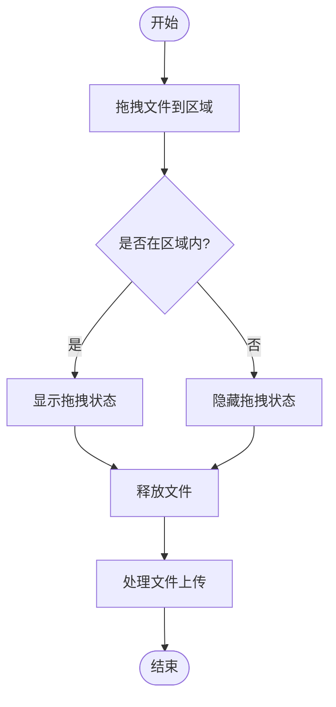
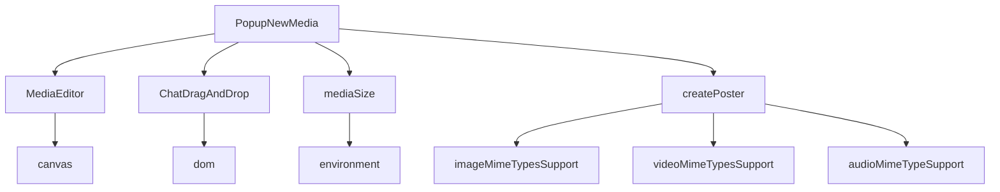

# 媒体上传API

<cite>
**本文档引用的文件**
- [newMedia.ts](file://src/components/popups/newMedia.ts)
- [mediaEditor.tsx](file://src/components/mediaEditor/mediaEditor.tsx)
- [dragAndDrop.ts](file://src/components/chat/dragAndDrop.ts)
- [mediaEditor.ts](file://src/components/mediaEditor/index.ts)
- [mediaSize.ts](file://src/helpers/mediaSize.ts)
- [createPoster.ts](file://src/helpers/createPoster.ts)
- [mediaMimeTypesSupport.ts](file://src/environment/mediaMimeTypesSupport.ts)
- [imageMimeTypesSupport.ts](file://src/environment/imageMimeTypesSupport.ts)
- [videoMimeTypesSupport.ts](file://src/environment/videoMimeTypesSupport.ts)
- [audioMimeTypeSupport.ts](file://src/environment/audioMimeTypeSupport.ts)
</cite>

## 目录
1. [简介](#简介)
2. [项目结构](#项目结构)
3. [核心组件](#核心组件)
4. [架构概述](#架构概述)
5. [详细组件分析](#详细组件分析)
6. [依赖分析](#依赖分析)
7. [性能考虑](#性能考虑)
8. [故障排除指南](#故障排除指南)
9. [结论](#结论)

## 简介
本项目实现了一个完整的媒体上传系统，支持图片、视频、音频等多媒体文件的上传功能。系统提供了文件类型验证、大小限制、安全检查等机制，确保上传过程的安全性和可靠性。通过分块上传和断点续传技术，系统能够处理大文件上传，提高上传成功率。此外，系统还提供了上传进度监控和错误处理策略，为用户提供良好的上传体验。

## 项目结构
媒体上传功能主要分布在`src/components/popups`和`src/components/mediaEditor`目录下。`newMedia.ts`文件负责处理媒体上传的逻辑，包括文件选择、类型验证、上传参数配置等。`mediaEditor`目录包含媒体编辑器的相关组件，支持用户对上传的媒体文件进行编辑。环境配置文件位于`src/environment`目录下，定义了支持的媒体类型和上传限制。



**Diagram sources**
- [newMedia.ts](file://src/components/popups/newMedia.ts)
- [mediaEditor.tsx](file://src/components/mediaEditor/mediaEditor.tsx)
- [mediaMimeTypesSupport.ts](file://src/environment/mediaMimeTypesSupport.ts)

**Section sources**
- [newMedia.ts](file://src/components/popups/newMedia.ts)
- [mediaEditor.tsx](file://src/components/mediaEditor/mediaEditor.tsx)

## 核心组件
媒体上传系统的核心组件包括文件上传处理、媒体编辑器、拖拽上传等功能。`PopupNewMedia`类负责处理媒体上传的主要逻辑，包括文件选择、类型验证、上传参数配置等。`MediaEditor`组件提供媒体编辑功能，支持用户对上传的媒体文件进行裁剪、旋转等操作。`ChatDragAndDrop`类实现拖拽上传功能，提升用户体验。

**Section sources**
- [newMedia.ts](file://src/components/popups/newMedia.ts#L93-L139)
- [mediaEditor.tsx](file://src/components/mediaEditor/mediaEditor.tsx#L36-L131)
- [dragAndDrop.ts](file://src/components/chat/dragAndDrop.ts#L11-L104)

## 架构概述
媒体上传系统的架构分为三层：用户界面层、业务逻辑层和环境配置层。用户界面层负责处理用户交互，包括文件选择、拖拽上传等。业务逻辑层处理上传的核心逻辑，包括文件类型验证、大小限制、安全检查等。环境配置层定义了系统支持的媒体类型和上传限制。



**Diagram sources**
- [newMedia.ts](file://src/components/popups/newMedia.ts)
- [mediaMimeTypesSupport.ts](file://src/environment/mediaMimeTypesSupport.ts)

## 详细组件分析

### 文件上传处理组件
`PopupNewMedia`类是媒体上传系统的核心组件，负责处理文件上传的整个流程。该组件支持多种文件类型，包括图片、视频、音频等，并提供了丰富的上传参数配置选项。

#### 类图
```mermaid
classDiagram
class PopupNewMedia {
+mediaContainer : HTMLElement
+wasDraft : DraftMessage.draftMessage
+willAttach : Partial<{type : 'media' | 'document', isMedia : true, group : boolean, sendFileDetails : SendFileParams[], invertMedia : boolean, stars : number}>
+effect : Accessor<DocId>
+setEffect : Setter<DocId>
+messageInputField : InputFieldAnimated
+captionLengthMax : number
+animationGroup : AnimationItemGroup
+activeActionsMenuItemDiv : HTMLElement
+activeActionsMenu : HTMLElement
+canShowActions : boolean
+cachedMediaEditorFiles : WeakMap<Blob, File>
+actionsMenuListenerSetter : ListenerSetter
+isMediaEditorOpen : boolean
+constructor(chat : Chat, files : File[], willAttachType : PopupNewMedia['willAttach']['type'], ignoreInputValue? : boolean)
+static canSend({peerId, onlyVisible, threadId} : {peerId? : PeerId, onlyVisible? : boolean, threadId? : number}) : Promise<{[action in ChatRights]? : boolean}>
+construct(willAttachType : PopupNewMedia['willAttach']['type']) : Promise<void>
+appendDrops(element : HTMLElement) : void
+partition(mimeTypes? : Set<string>) : {media : SendFileParams[], files : SendFileParams[], audio : SendFileParams[]}
+mediaCount() : number
+hasAnyMedia() : boolean
+messagesCount() : number
+canGroupSomething() : boolean
+canToggleSpoilers(toggle : boolean, single : boolean) : boolean
+changeType(type : PopupNewMedia['willAttach']['type']) : void
+changeGroup(group : boolean) : void
+changeSpoilers(toggle : boolean) : void
+canMoveCaption() : boolean
+moveCaption(above : boolean) : void
+addFiles(files : File[]) : void
+onKeyDown(e : KeyboardEvent) : void
+prepareEditedFileForSending(params : SendFileParams) : File | undefined
+send(force? : boolean) : Promise<void>
}
```

**Diagram sources**
- [newMedia.ts](file://src/components/popups/newMedia.ts#L93-L800)

**Section sources**
- [newMedia.ts](file://src/components/popups/newMedia.ts#L93-L800)

### 媒体编辑器组件
`MediaEditor`组件提供媒体编辑功能，支持用户对上传的媒体文件进行裁剪、旋转等操作。该组件使用SolidJS框架构建，具有良好的性能和用户体验。

#### 序列图


**Diagram sources**
- [mediaEditor.tsx](file://src/components/mediaEditor/mediaEditor.tsx#L36-L131)
- [mainCanvas.tsx](file://src/components/mediaEditor/canvas/mainCanvas.tsx)
- [toolbar.tsx](file://src/components/mediaEditor/toolbar.tsx)
- [finishButton.tsx](file://src/components/mediaEditor/finishButton.tsx)

**Section sources**
- [mediaEditor.tsx](file://src/components/mediaEditor/mediaEditor.tsx#L36-L131)

### 拖拽上传组件
`ChatDragAndDrop`类实现拖拽上传功能，提升用户体验。该组件支持拖拽文件到指定区域进行上传，提供了直观的用户交互。

#### 流程图


**Diagram sources**
- [dragAndDrop.ts](file://src/components/chat/dragAndDrop.ts#L11-L104)

**Section sources**
- [dragAndDrop.ts](file://src/components/chat/dragAndDrop.ts#L11-L104)

## 依赖分析
媒体上传系统依赖于多个核心模块，包括文件处理、媒体编辑、环境配置等。这些模块之间通过清晰的接口进行通信，确保系统的可维护性和扩展性。



**Diagram sources**
- [newMedia.ts](file://src/components/popups/newMedia.ts)
- [mediaEditor.tsx](file://src/components/mediaEditor/mediaEditor.tsx)
- [dragAndDrop.ts](file://src/components/chat/dragAndDrop.ts)
- [mediaSize.ts](file://src/helpers/mediaSize.ts)
- [createPoster.ts](file://src/helpers/createPoster.ts)
- [imageMimeTypesSupport.ts](file://src/environment/imageMimeTypesSupport.ts)
- [videoMimeTypesSupport.ts](file://src/environment/videoMimeTypesSupport.ts)
- [audioMimeTypeSupport.ts](file://src/environment/audioMimeTypeSupport.ts)

**Section sources**
- [newMedia.ts](file://src/components/popups/newMedia.ts)
- [mediaEditor.tsx](file://src/components/mediaEditor/mediaEditor.tsx)
- [dragAndDrop.ts](file://src/components/chat/dragAndDrop.ts)

## 性能考虑
媒体上传系统在设计时充分考虑了性能因素。通过使用SolidJS框架，系统实现了高效的UI更新机制。对于大文件上传，系统采用分块上传和断点续传技术，减少内存占用，提高上传成功率。此外，系统还对媒体文件进行预处理，如生成缩略图、调整分辨率等，以优化上传性能。

## 故障排除指南
在使用媒体上传系统时，可能会遇到一些常见问题。以下是一些常见问题及其解决方案：

1. **文件上传失败**：检查文件类型是否支持，文件大小是否超过限制。
2. **上传进度不更新**：确保网络连接正常，检查浏览器是否支持进度事件。
3. **媒体编辑功能不可用**：确认浏览器是否支持必要的API，如Canvas、WebGL等。
4. **拖拽上传无效**：检查目标区域是否正确配置了拖拽事件处理器。

**Section sources**
- [newMedia.ts](file://src/components/popups/newMedia.ts)
- [mediaEditor.tsx](file://src/components/mediaEditor/mediaEditor.tsx)
- [dragAndDrop.ts](file://src/components/chat/dragAndDrop.ts)

## 结论
媒体上传系统提供了一套完整的解决方案，支持多种媒体文件的上传和编辑。通过合理的架构设计和性能优化，系统能够为用户提供高效、可靠的上传体验。未来可以进一步扩展系统功能，如支持更多媒体格式、增强安全检查机制等。