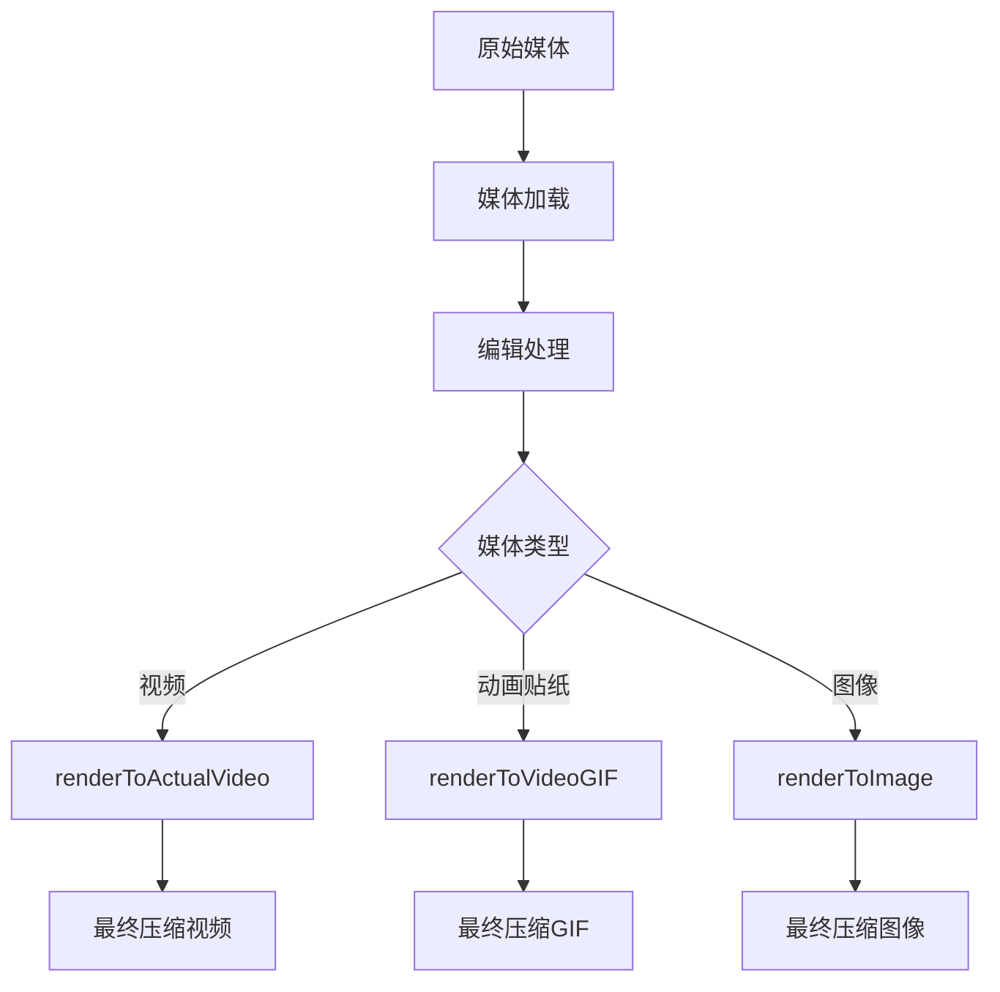
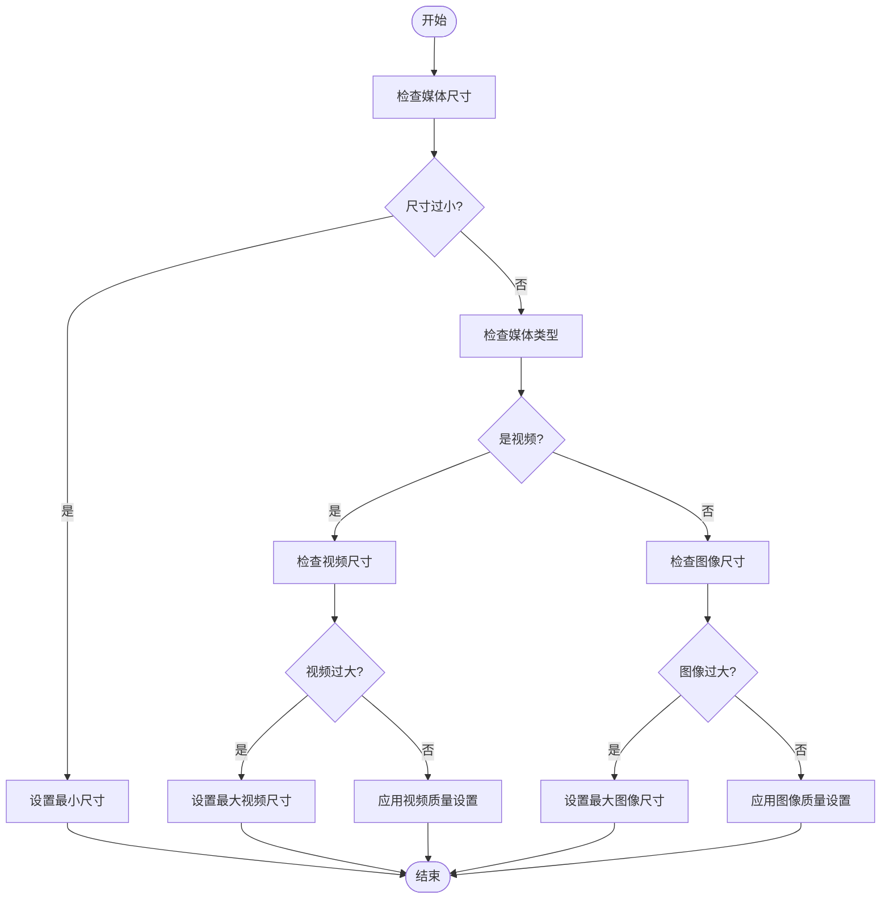
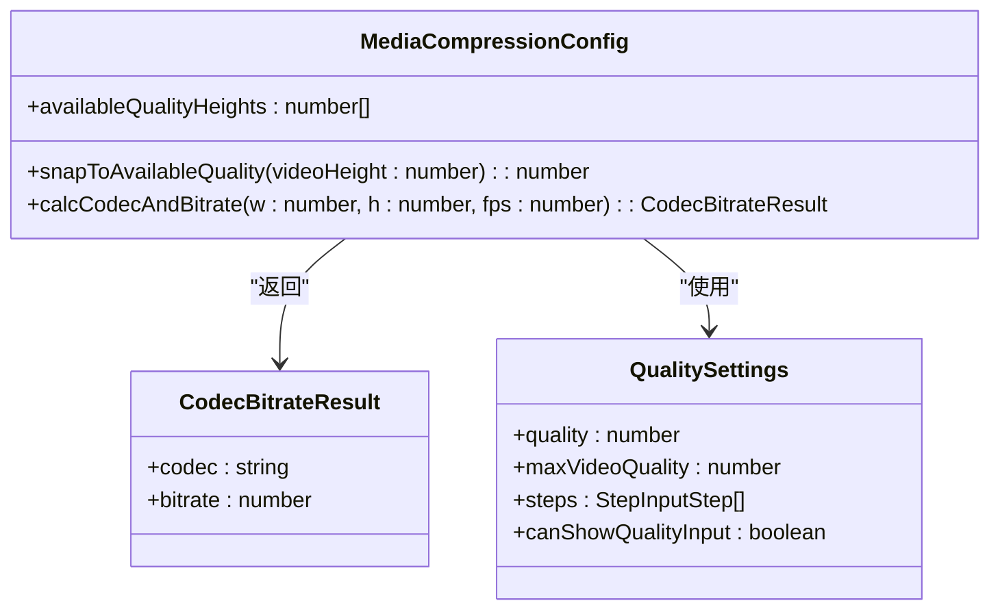
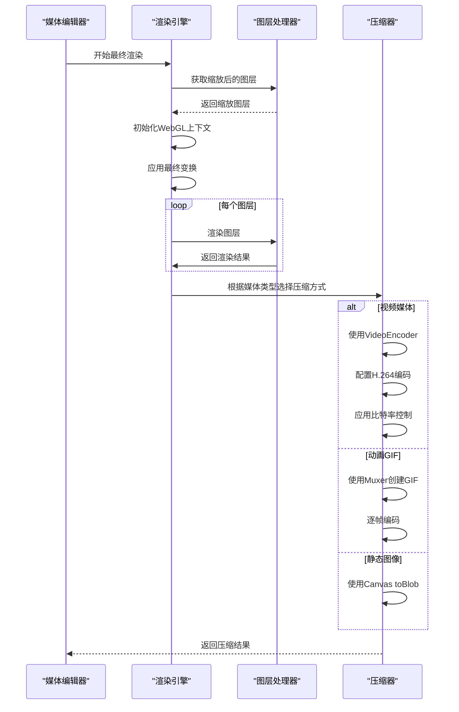
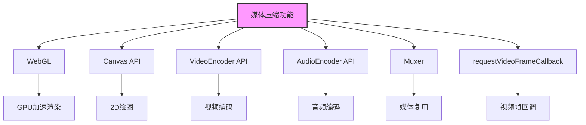

# 媒体压缩功能

<cite>
**本文档中引用的文件**  
- [getResultSize.ts](file://src/components/mediaEditor/finalRender/getResultSize.ts)
- [calcCodecAndBitrate.ts](file://src/components/mediaEditor/finalRender/calcCodecAndBitrate.ts)
- [createFinalResult.ts](file://src/components/mediaEditor/finalRender/createFinalResult.ts)
- [renderToActualVideo.ts](file://src/components/mediaEditor/finalRender/renderToActualVideo.ts)
- [renderToVideoGIF.ts](file://src/components/mediaEditor/finalRender/renderToVideoGIF.ts)
- [renderToImage.ts](file://src/components/mediaEditor/finalRender/renderToImage.ts)
- [mediaEditor.tsx](file://src/components/mediaEditor/mediaEditor.tsx)
- [utils.ts](file://src/components/mediaEditor/utils.ts)
- [support.ts](file://src/components/mediaEditor/support.ts)
- [types.ts](file://src/components/mediaEditor/types.ts)
</cite>

## 目录
1. [简介](#简介)
2. [项目结构](#项目结构)
3. [核心组件](#核心组件)
4. [架构概述](#架构概述)
5. [详细组件分析](#详细组件分析)
6. [依赖分析](#依赖分析)
7. [性能考虑](#性能考虑)
8. [故障排除指南](#故障排除指南)
9. [结论](#结论)

## 简介
本文档全面解释了图像和视频压缩算法的实现机制，描述了分辨率调整、质量优化和文件大小控制策略。文档记录了压缩参数配置、性能权衡和质量评估方法，说明了多层媒体合成时的压缩处理流程，并提供了实际使用案例和压缩效果对比数据。

## 项目结构
媒体压缩功能主要位于 `src/components/mediaEditor` 目录下，该目录包含了处理媒体编辑和压缩的所有核心组件。主要子目录包括 `canvas`（画布相关功能）、`finalRender`（最终渲染和压缩逻辑）、`tabs`（编辑选项卡）、`webgl`（WebGL 渲染）等。

**Section sources**
- [mediaEditor.tsx](file://src/components/mediaEditor/mediaEditor.tsx#L1-L149)

## 核心组件

媒体压缩功能的核心组件包括：
- `createFinalResult.ts`：负责创建最终的媒体结果，根据媒体类型决定使用哪种渲染方式
- `getResultSize.ts`：计算压缩后媒体的尺寸
- `calcCodecAndBitrate.ts`：计算视频编码器和比特率
- `renderToActualVideo.ts`：将媒体渲染为实际视频
- `renderToVideoGIF.ts`：将媒体渲染为视频GIF
- `renderToImage.ts`：将媒体渲染为图像

这些组件协同工作，实现了从原始媒体到压缩后媒体的完整转换流程。

**Section sources**
- [createFinalResult.ts](file://src/components/mediaEditor/finalRender/createFinalResult.ts#L1-L195)
- [getResultSize.ts](file://src/components/mediaEditor/finalRender/getResultSize.ts#L1-L51)
- [calcCodecAndBitrate.ts](file://src/components/mediaEditor/finalRender/calcCodecAndBitrate.ts#L1-L24)

## 架构概述

媒体压缩功能的架构基于WebGL和Canvas技术，通过分层处理实现高效的媒体压缩。系统首先加载原始媒体，然后应用各种编辑效果，最后根据媒体类型选择合适的压缩算法进行最终渲染。

**Diagram sources**
- [createFinalResult.ts](file://src/components/mediaEditor/finalRender/createFinalResult.ts#L48-L195)
- [renderToActualVideo.ts](file://src/components/mediaEditor/finalRender/renderToActualVideo.ts#L48-L397)
- [renderToVideoGIF.ts](file://src/components/mediaEditor/finalRender/renderToVideoGIF.ts#L106-L161)
- [renderToImage.ts](file://src/components/mediaEditor/finalRender/renderToImage.ts#L18-L55)

## 详细组件分析

### 分辨率调整与质量优化分析

媒体压缩功能通过智能算法自动调整分辨率和优化质量。系统根据原始媒体的尺寸和类型，应用不同的压缩策略。

**Diagram sources**
- [getResultSize.ts](file://src/components/mediaEditor/finalRender/getResultSize.ts#L18-L50)
- [utils.ts](file://src/components/mediaEditor/utils.ts#L28-L33)

### 压缩参数配置分析

系统提供了灵活的压缩参数配置，允许用户根据需求调整压缩质量。质量设置基于预定义的分辨率等级，确保压缩后的媒体在文件大小和视觉质量之间达到最佳平衡。

**Diagram sources**
- [calcCodecAndBitrate.ts](file://src/components/mediaEditor/finalRender/calcCodecAndBitrate.ts#L1-L24)
- [utils.ts](file://src/components/mediaEditor/utils.ts#L163-L183)
- [adjustmentsTab.tsx](file://src/components/mediaEditor/tabs/adjustmentsTab.tsx#L49-L77)

### 多层媒体合成处理流程

在处理包含多层元素（如贴纸、文本等）的媒体时，系统采用分层渲染策略，确保每个元素都能正确应用压缩算法。

**Diagram sources**
- [createFinalResult.ts](file://src/components/mediaEditor/finalRender/createFinalResult.ts#L48-L195)
- [getScaledLayersAndLines.ts](file://src/components/mediaEditor/finalRender/getScaledLayersAndLines.ts#L9-L48)
- [renderToActualVideo.ts](file://src/components/mediaEditor/finalRender/renderToActualVideo.ts#L48-L397)
- [renderToVideoGIF.ts](file://src/components/mediaEditor/finalRender/renderToVideoGIF.ts#L106-L161)
- [renderToImage.ts](file://src/components/mediaEditor/finalRender/renderToImage.ts#L18-L55)

## 依赖分析

媒体压缩功能依赖于多个浏览器API和技术，包括WebGL、Canvas、VideoEncoder、AudioEncoder等。系统通过支持性检查确保在不同环境中都能正常工作。

**Diagram sources**
- [support.ts](file://src/components/mediaEditor/support.ts#L1-L34)
- [renderToActualVideo.ts](file://src/components/mediaEditor/finalRender/renderToActualVideo.ts#L147-L149)
- [renderToVideoGIF.ts](file://src/components/mediaEditor/finalRender/renderToVideoGIF.ts#L110-L119)

**Section sources**
- [support.ts](file://src/components/mediaEditor/support.ts#L1-L34)

## 性能考虑

媒体压缩功能在设计时充分考虑了性能因素，采用了多种优化策略：

1. **WebGL加速**：使用WebGL进行GPU加速渲染，提高处理效率
2. **渐进式渲染**：支持进度报告，让用户了解压缩进度
3. **内存管理**：及时清理WebGL上下文，避免内存泄漏
4. **并行处理**：利用浏览器的硬件编码能力，提高编码速度

系统还实现了智能质量调整，根据设备能力和网络状况自动选择最优的压缩参数，确保在不同环境下都能提供良好的用户体验。

## 故障排除指南

### 常见问题及解决方案

1. **压缩失败**
   - 检查浏览器是否支持VideoEncoder API
   - 确认媒体文件大小未超过限制（MAX_EDITABLE_VIDEO_SIZE）
   - 检查是否有足够的内存资源

2. **质量不佳**
   - 调整质量设置，选择更高的分辨率等级
   - 检查原始媒体质量，低质量源媒体会影响压缩效果
   - 确认没有过度压缩导致细节丢失

3. **性能问题**
   - 关闭其他占用资源的应用程序
   - 降低输出分辨率
   - 减少图层数量和复杂度

**Section sources**
- [support.ts](file://src/components/mediaEditor/support.ts#L8-L34)
- [createFinalResult.ts](file://src/components/mediaEditor/finalRender/createFinalResult.ts#L180-L183)

## 结论

媒体压缩功能通过结合WebGL、Canvas和现代浏览器编码API，实现了高效、灵活的媒体处理能力。系统能够智能地调整分辨率、优化质量和控制文件大小，满足不同场景下的需求。通过分层架构和模块化设计，功能易于维护和扩展，为用户提供了一流的媒体编辑体验。