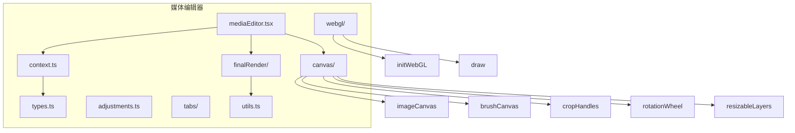
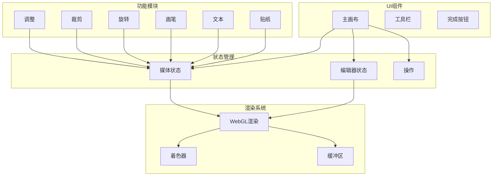
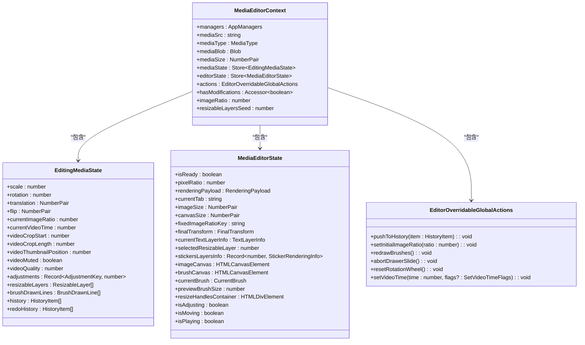
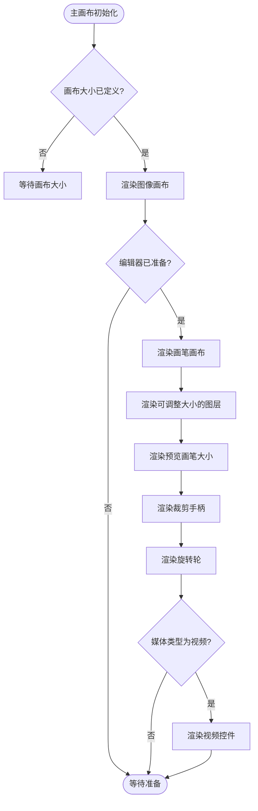
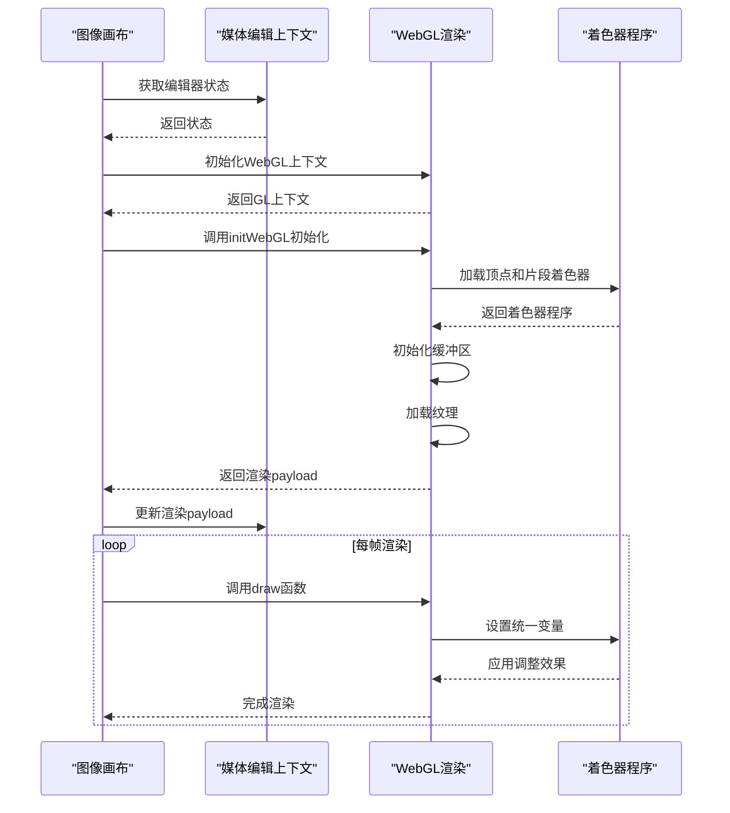
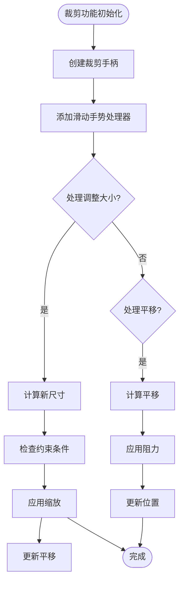
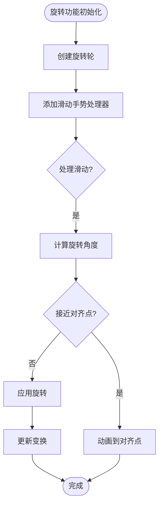
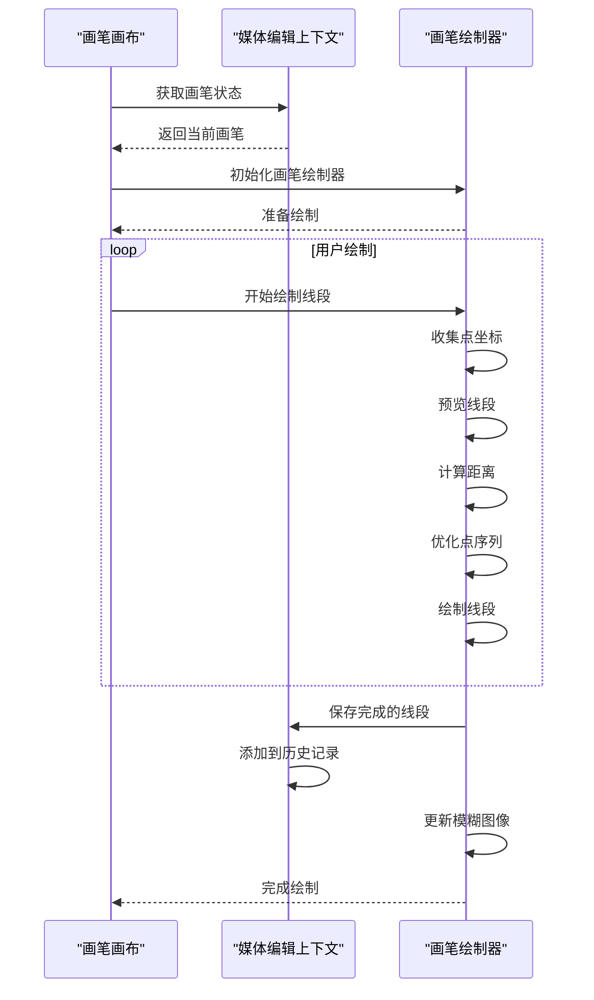
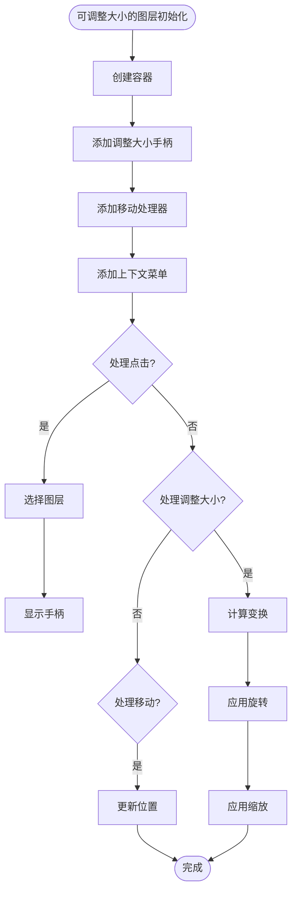
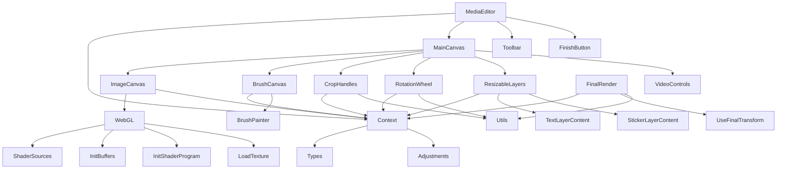

# 媒体处理API

<cite>
**本文档引用的文件**
- [mediaEditor.tsx](file://src/components/mediaEditor/mediaEditor.tsx)
- [context.ts](file://src/components/mediaEditor/context.ts)
- [types.ts](file://src/components/mediaEditor/types.ts)
- [adjustments.ts](file://src/components/mediaEditor/adjustments.ts)
- [mainCanvas.tsx](file://src/components/mediaEditor/canvas/mainCanvas.tsx)
- [imageCanvas.tsx](file://src/components/mediaEditor/canvas/imageCanvas.tsx)
- [cropHandles.tsx](file://src/components/mediaEditor/canvas/cropHandles.tsx)
- [rotationWheel.tsx](file://src/components/mediaEditor/canvas/rotationWheel.tsx)
- [brushCanvas.tsx](file://src/components/mediaEditor/canvas/brushCanvas.tsx)
- [resizableLayers.tsx](file://src/components/mediaEditor/canvas/resizableLayers.tsx)
- [initWebGL.ts](file://src/components/mediaEditor/webgl/initWebGL.ts)
- [draw.ts](file://src/components/mediaEditor/webgl/draw.ts)
- [createFinalResult.ts](file://src/components/mediaEditor/finalRender/createFinalResult.ts)
- [useFinalTransform.ts](file://src/components/mediaEditor/canvas/useFinalTransform.ts)
- [utils.ts](file://src/components/mediaEditor/utils.ts)
</cite>

## 目录
1. [介绍](#介绍)
2. [项目结构](#项目结构)
3. [核心组件](#核心组件)
4. [架构概述](#架构概述)
5. [详细组件分析](#详细组件分析)
6. [依赖分析](#依赖分析)
7. [性能考虑](#性能考虑)
8. [故障排除指南](#故障排除指南)
9. [结论](#结论)
10. [附录](#附录)（如有必要）

## 介绍
本文档全面介绍了媒体处理API的实现，重点是媒体编辑功能，包括裁剪、旋转、滤镜应用和标注功能。系统利用WebGL进行高性能图像处理，支持图像和视频的编辑操作。媒体编辑器采用模块化架构，将不同的编辑功能分离到独立的组件中，确保代码的可维护性和可扩展性。系统实现了完整的编辑状态管理，包括撤销/重做功能，以及高效的渲染管道，确保在各种设备上都能提供流畅的用户体验。

## 项目结构
媒体处理功能主要位于`src/components/mediaEditor`目录下，采用模块化设计，将不同的功能分离到独立的文件和子目录中。核心组件包括画布处理、最终渲染、标签页管理和WebGL集成。系统使用TypeScript和SolidJS框架构建，确保类型安全和响应式UI更新。



**图源**
- [mediaEditor.tsx](file://src/components/mediaEditor/mediaEditor.tsx)
- [context.ts](file://src/components/mediaEditor/context.ts)
- [types.ts](file://src/components/mediaEditor/types.ts)

**本节来源**
- [mediaEditor.tsx](file://src/components/mediaEditor/mediaEditor.tsx)
- [context.ts](file://src/components/mediaEditor/context.ts)
- [types.ts](file://src/components/mediaEditor/types.ts)

## 核心组件
媒体编辑器的核心组件包括媒体编辑上下文、画布系统、调整功能、画笔工具、裁剪手柄、旋转轮和可调整大小的图层。这些组件协同工作，提供完整的媒体编辑体验。系统使用WebGL进行高性能渲染，支持实时预览编辑效果。编辑状态通过响应式存储管理，确保UI与数据的一致性。

**本节来源**
- [mediaEditor.tsx](file://src/components/mediaEditor/mediaEditor.tsx)
- [context.ts](file://src/components/mediaEditor/context.ts)
- [types.ts](file://src/components/mediaEditor/types.ts)

## 架构概述
媒体处理API采用分层架构，将UI组件、状态管理和渲染逻辑分离。系统使用WebGL进行图像处理，通过着色器实现各种滤镜效果。编辑操作的状态通过响应式存储管理，确保UI与数据的一致性。系统实现了完整的撤销/重做功能，允许用户回退到之前的编辑状态。



**图源**
- [mediaEditor.tsx](file://src/components/mediaEditor/mediaEditor.tsx)
- [context.ts](file://src/components/mediaEditor/context.ts)
- [imageCanvas.tsx](file://src/components/mediaEditor/canvas/imageCanvas.tsx)

## 详细组件分析
本节详细分析媒体编辑器的关键组件，包括其功能、实现细节和相互关系。每个组件都经过精心设计，以提供特定的编辑功能，同时与其他组件无缝集成。

### 媒体编辑上下文分析
媒体编辑上下文是整个编辑器的核心，负责管理所有共享状态和操作。它使用SolidJS的响应式系统来确保状态变化时UI的自动更新。



**图源**
- [context.ts](file://src/components/mediaEditor/context.ts)
- [types.ts](file://src/components/mediaEditor/types.ts)

### 主画布组件分析
主画布组件是媒体编辑器的容器，负责协调各个子组件的显示和交互。它根据当前编辑模式动态显示不同的工具和控件。



**图源**
- [mainCanvas.tsx](file://src/components/mediaEditor/canvas/mainCanvas.tsx)
- [context.ts](file://src/components/mediaEditor/context.ts)

### 图像画布组件分析
图像画布组件负责使用WebGL渲染媒体内容，并应用各种调整效果。它通过着色器程序实现高性能的实时滤镜应用。



**图源**
- [imageCanvas.tsx](file://src/components/mediaEditor/canvas/imageCanvas.tsx)
- [initWebGL.ts](file://src/components/mediaEditor/webgl/initWebGL.ts)
- [draw.ts](file://src/components/mediaEditor/webgl/draw.ts)

### 裁剪功能分析
裁剪功能允许用户调整媒体内容的可见区域，通过拖拽手柄来改变裁剪框的大小和位置。系统实现了智能的边界检测和比例锁定功能。



**图源**
- [cropHandles.tsx](file://src/components/mediaEditor/canvas/cropHandles.tsx)
- [context.ts](file://src/components/mediaEditor/context.ts)
- [utils.ts](file://src/components/mediaEditor/utils.ts)

### 旋转功能分析
旋转功能通过旋转轮组件实现，允许用户精确控制媒体内容的旋转角度。系统提供了15度的增量步进和智能的对齐功能。



**图源**
- [rotationWheel.tsx](file://src/components/mediaEditor/canvas/rotationWheel.tsx)
- [context.ts](file://src/components/mediaEditor/context.ts)
- [utils.ts](file://src/components/mediaEditor/utils.ts)

### 画笔功能分析
画笔功能允许用户在媒体内容上自由绘制，支持多种画笔样式和颜色。系统实现了高性能的画笔渲染和撤销/重做功能。



**图源**
- [brushCanvas.tsx](file://src/components/mediaEditor/canvas/brushCanvas.tsx)
- [brushPainter.ts](file://src/components/mediaEditor/canvas/brushPainter.ts)
- [context.ts](file://src/components/mediaEditor/context.ts)

### 可调整大小的图层分析
可调整大小的图层组件管理文本和贴纸等可调整大小的元素，支持拖拽、旋转和缩放操作。系统实现了智能的布局和交互处理。



**图源**
- [resizableLayers.tsx](file://src/components/mediaEditor/canvas/resizableLayers.tsx)
- [context.ts](file://src/components/mediaEditor/context.ts)
- [utils.ts](file://src/components/mediaEditor/utils.ts)

## 依赖分析
媒体编辑器组件之间存在复杂的依赖关系，这些关系确保了功能的完整性和一致性。核心依赖包括状态管理、WebGL渲染和用户交互处理。



**图源**
- [mediaEditor.tsx](file://src/components/mediaEditor/mediaEditor.tsx)
- [context.ts](file://src/components/mediaEditor/context.ts)
- [mainCanvas.tsx](file://src/components/mediaEditor/canvas/mainCanvas.tsx)

**本节来源**
- [mediaEditor.tsx](file://src/components/mediaEditor/mediaEditor.tsx)
- [context.ts](file://src/components/mediaEditor/context.ts)
- [mainCanvas.tsx](file://src/components/mediaEditor/canvas/mainCanvas.tsx)

## 性能考虑
媒体处理API在设计时充分考虑了性能因素，采用了多种优化策略来确保流畅的用户体验。系统使用WebGL进行硬件加速渲染，避免了CPU密集型的图像处理操作。响应式状态管理确保只有必要的组件才会重新渲染。对于复杂的编辑操作，系统实现了防抖和节流机制，避免频繁的状态更新。画笔功能使用了优化的点序列处理算法，减少了不必要的绘制操作。视频处理采用了智能的帧缓冲和预加载策略，确保视频播放的流畅性。

## 故障排除指南
本节提供常见问题的解决方案和调试建议。如果遇到渲染问题，首先检查WebGL上下文是否正确初始化。对于性能问题，可以检查是否有不必要的状态更新或过度的组件重新渲染。如果编辑操作不响应，检查手势处理器是否正确绑定。对于内存问题，确保在组件销毁时正确清理WebGL资源和事件监听器。调试时可以使用浏览器的开发者工具检查WebGL状态和性能指标。

**本节来源**
- [imageCanvas.tsx](file://src/components/mediaEditor/canvas/imageCanvas.tsx)
- [utils.ts](file://src/components/mediaEditor/utils.ts)
- [context.ts](file://src/components/mediaEditor/context.ts)

## 结论
媒体处理API提供了一套完整的媒体编辑功能，包括裁剪、旋转、滤镜应用和标注等。系统采用现代化的Web技术栈，利用WebGL实现高性能的图像处理。模块化的架构设计使得功能扩展和维护变得简单。响应式状态管理确保了UI与数据的一致性。通过精心设计的用户交互和性能优化，系统能够在各种设备上提供流畅的编辑体验。未来可以考虑增加更多的滤镜效果、支持更多的媒体格式，以及优化移动端的用户体验。

## 附录
### 调整效果配置
系统支持多种图像调整效果，每种效果都有对应的着色器统一变量和用户界面标签。

| 效果 | 统一变量 | 标签 | 范围 |
|------|---------|------|------|
| 增强 | uEnhance | 增强 | 0-100 |
| 亮度 | uBrightness | 亮度 | -50至50 |
| 对比度 | uContrast | 对比度 | -50至50 |
| 饱和度 | uSaturation | 饱和度 | -50至50 |
| 色温 | uWarmth | 色温 | -50至50 |
| 褪色 | uFade | 褪色 | 0-100 |
| 高光 | uHighlights | 高光 | -50至50 |
| 阴影 | uShadows | 阴影 | -50至50 |
| 暗角 | uVignette | 暗角 | 0-100 |
| 颗粒 | uGrain | 颗粒 | 0-100 |
| 锐化 | uSharpen | 锐化 | 0-100 |

**本节来源**
- [adjustments.ts](file://src/components/mediaEditor/adjustments.ts)

### 媒体类型定义
系统支持两种主要的媒体类型，每种类型都有特定的处理逻辑和属性。

```typescript
type MediaType = 'image' | 'video';

type NumberPair = [number, number];

type ResizableLayer = {
  id: number;
  type: 'text' | 'sticker';
  position: NumberPair;
  rotation: number;
  scale: number;
  sticker?: Document.document;
  textInfo?: TextLayerInfo;
  textRenderingInfo?: TextRenderingInfo;
};

type TextLayerInfo = {
  color: string;
  alignment: string;
  style: string;
  size: number;
  font: FontKey;
};
```

**本节来源**
- [types.ts](file://src/components/mediaEditor/types.ts)