# 媒体编辑功能

<cite>
**本文档引用的文件**  
- [mediaEditor.tsx](file://src/components/mediaEditor/mediaEditor.tsx)
- [context.ts](file://src/components/mediaEditor/context.ts)
- [mainCanvas.tsx](file://src/components/mediaEditor/canvas/mainCanvas.tsx)
- [imageCanvas.tsx](file://src/components/mediaEditor/canvas/imageCanvas.tsx)
- [cropTab.tsx](file://src/components/mediaEditor/tabs/cropTab.tsx)
- [adjustmentsTab.tsx](file://src/components/mediaEditor/tabs/adjustmentsTab.tsx)
- [textTab.tsx](file://src/components/mediaEditor/tabs/textTab.tsx)
- [stickersTab.tsx](file://src/components/mediaEditor/tabs/stickersTab.tsx)
- [createFinalResult.ts](file://src/components/mediaEditor/finalRender/createFinalResult.ts)
- [initWebGL.ts](file://src/components/mediaEditor/webgl/initWebGL.ts)
- [shaderSources.ts](file://src/components/mediaEditor/webgl/shaderSources.ts)
- [adjustments.ts](file://src/components/mediaEditor/adjustments.ts)
- [types.ts](file://src/components/mediaEditor/types.ts)
- [brushesSvg.tsx](file://src/components/mediaEditor/brushesSvg.tsx)
</cite>

## 目录
1. [简介](#简介)
2. [项目结构](#项目结构)
3. [核心组件](#核心组件)
4. [架构概述](#架构概述)
5. [详细组件分析](#详细组件分析)
6. [依赖分析](#依赖分析)
7. [性能考虑](#性能考虑)
8. [故障排除指南](#故障排除指南)
9. [结论](#结论)

## 简介
媒体编辑功能为用户提供了一套完整的图像和视频编辑工具，支持裁剪、旋转、滤镜应用、画笔标注、贴纸和文字添加等多种操作。该功能基于WebGL和HTML5 Canvas技术实现，确保了高性能的实时预览和渲染能力。编辑器采用模块化设计，各功能组件独立且可扩展，支持撤销/重做操作，并能处理静态图片和动态视频内容。

**Section sources**
- [mediaEditor.tsx](file://src/components/mediaEditor/mediaEditor.tsx#L1-L149)

## 项目结构
媒体编辑功能位于`src/components/mediaEditor`目录下，采用功能模块化组织方式。主要包含画布渲染、最终渲染、工具标签页、WebGL处理、调整工具、画笔SVG、上下文管理、类型定义等子模块。这种结构清晰地分离了关注点，便于维护和扩展。

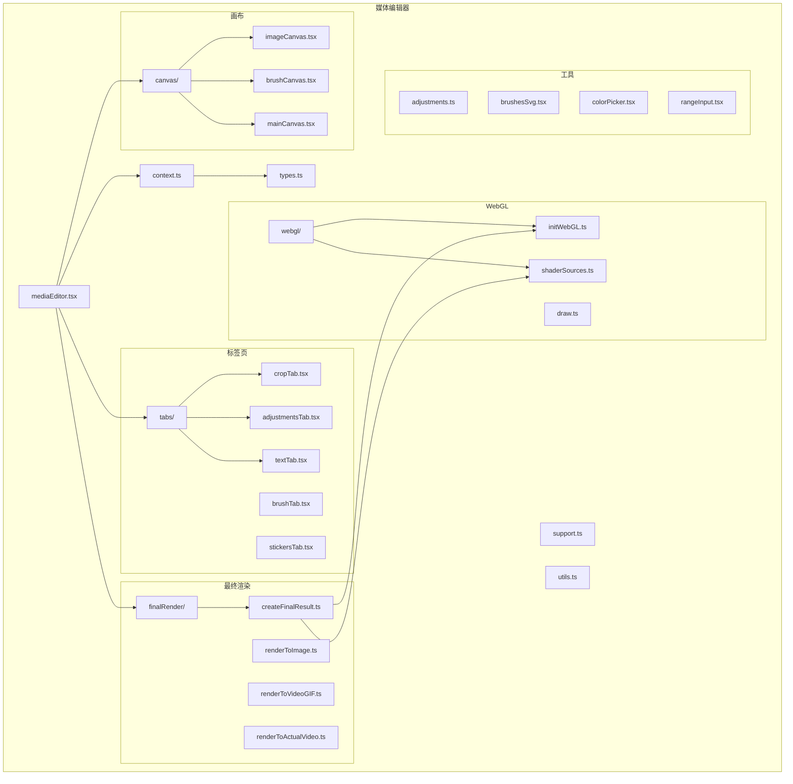

**Diagram sources**
- [mediaEditor.tsx](file://src/components/mediaEditor/mediaEditor.tsx#L1-L149)
- [context.ts](file://src/components/mediaEditor/context.ts#L1-L266)

**Section sources**
- [mediaEditor.tsx](file://src/components/mediaEditor/mediaEditor.tsx#L1-L149)
- [context.ts](file://src/components/mediaEditor/context.ts#L1-L266)

## 核心组件
媒体编辑器的核心组件包括主编辑器组件、上下文管理、画布渲染、最终结果生成和各种编辑工具。这些组件通过SolidJS的状态管理机制协同工作，实现了高效的响应式更新和用户交互处理。

**Section sources**
- [mediaEditor.tsx](file://src/components/mediaEditor/mediaEditor.tsx#L1-L149)
- [context.ts](file://src/components/mediaEditor/context.ts#L1-L266)

## 架构概述
媒体编辑器采用分层架构设计，从上到下分为UI层、状态管理层、渲染层和数据层。UI层负责用户交互和界面展示，状态管理层管理编辑状态和用户操作，渲染层处理图像和视频的实时预览和最终输出，数据层提供必要的配置和工具函数。

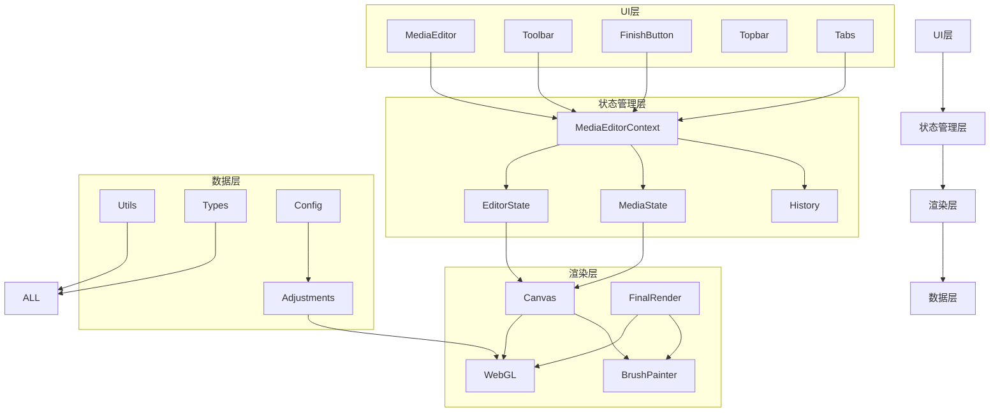

**Diagram sources**
- [mediaEditor.tsx](file://src/components/mediaEditor/mediaEditor.tsx#L1-L149)
- [context.ts](file://src/components/mediaEditor/context.ts#L1-L266)
- [createFinalResult.ts](file://src/components/mediaEditor/finalRender/createFinalResult.ts#L1-L195)

## 详细组件分析

### 主编辑器组件分析
主编辑器组件是整个媒体编辑功能的入口点，负责初始化编辑环境、管理生命周期和协调各子组件的工作。它使用SolidJS的上下文机制将状态和操作方法传递给所有子组件。

#### 组件关系图
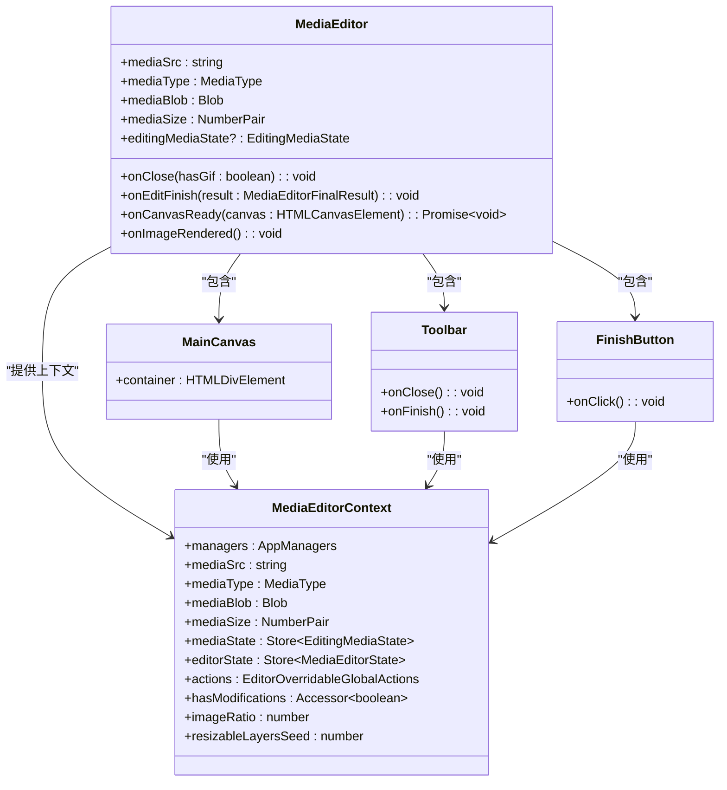

**Diagram sources**
- [mediaEditor.tsx](file://src/components/mediaEditor/mediaEditor.tsx#L1-L149)
- [context.ts](file://src/components/mediaEditor/context.ts#L1-L266)

**Section sources**
- [mediaEditor.tsx](file://src/components/mediaEditor/mediaEditor.tsx#L1-L149)
- [context.ts](file://src/components/mediaEditor/context.ts#L1-L266)

### 裁剪功能分析
裁剪功能允许用户调整媒体内容的显示比例和位置。通过预设的宽高比选项和自由裁剪模式，用户可以轻松地将内容调整为适合不同平台的格式。

#### 裁剪功能交互流程
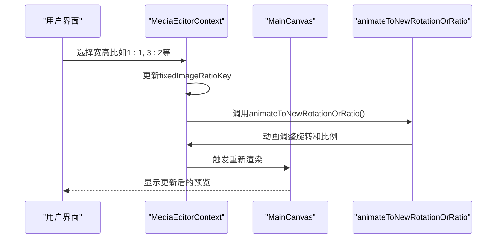

**Diagram sources**
- [cropTab.tsx](file://src/components/mediaEditor/tabs/cropTab.tsx#L1-L107)
- [context.ts](file://src/components/mediaEditor/context.ts#L1-L266)
- [canvas/animateToNewRotationOrRatio.ts](file://src/components/mediaEditor/canvas/animateToNewRotationOrRatio.ts)

**Section sources**
- [cropTab.tsx](file://src/components/mediaEditor/tabs/cropTab.tsx#L1-L107)

### 滤镜应用功能分析
滤镜应用功能通过WebGL着色器实现各种图像调整效果，包括亮度、对比度、饱和度、暖色调等。这些调整通过统一的调整配置系统管理，确保了一致的用户体验。

#### 滤镜调整配置
| 调整类型 | 均匀变量 | 取值范围 | 标签 |
|---------|--------|--------|------|
| 增强 | uEnhance | 0-100 | 增强 |
| 亮度 | uBrightness | -50-50 | 亮度 |
| 对比度 | uContrast | -50-50 | 对比度 |
| 饱和度 | uSaturation | -50-50 | 饱和度 |
| 暖色调 | uWarmth | -50-50 | 暖色调 |
| 褪色 | uFade | 0-100 | 褪色 |
| 高光 | uHighlights | -50-50 | 高光 |
| 阴影 | uShadows | -50-50 | 阴影 |
| 暗角 | uVignette | 0-100 | 暗角 |
| 颗粒 | uGrain | 0-100 | 颗粒 |
| 锐化 | uSharpen | 0-100 | 锐化 |

#### WebGL着色器处理流程
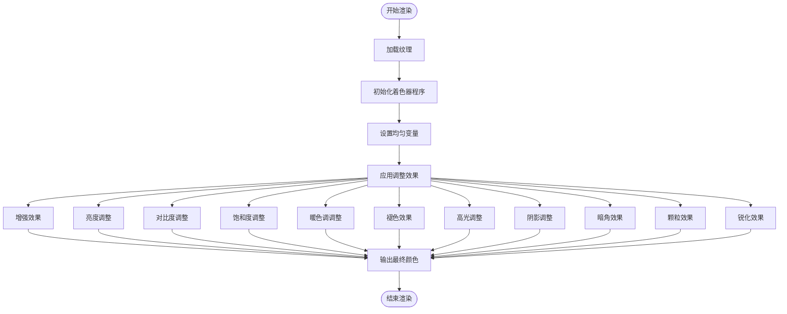

**Diagram sources**
- [adjustments.ts](file://src/components/mediaEditor/adjustments.ts#L1-L75)
- [shaderSources.ts](file://src/components/mediaEditor/webgl/shaderSources.ts#L1-L331)
- [adjustmentsTab.tsx](file://src/components/mediaEditor/tabs/adjustmentsTab.tsx#L1-L157)

**Section sources**
- [adjustments.ts](file://src/components/mediaEditor/adjustments.ts#L1-L75)
- [shaderSources.ts](file://src/components/mediaEditor/webgl/shaderSources.ts#L1-L331)
- [adjustmentsTab.tsx](file://src/components/mediaEditor/tabs/adjustmentsTab.tsx#L1-L157)

### 标注功能分析
标注功能包括画笔工具、贴纸和文字添加，允许用户在媒体内容上进行创意标注。这些功能通过独立的画布层实现，确保了标注内容与原始媒体的分离。

#### 画笔工具实现
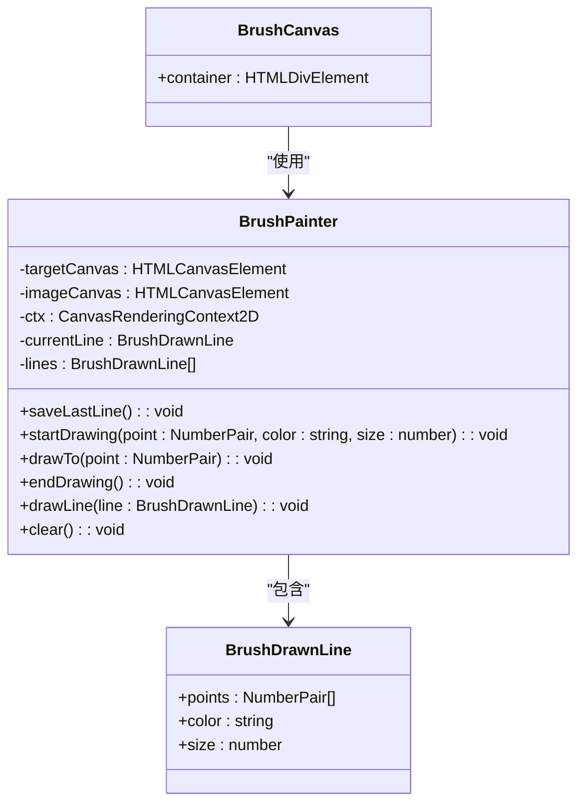

**Diagram sources**
- [canvas/brushPainter.ts](file://src/components/mediaEditor/canvas/brushPainter.ts)
- [canvas/brushCanvas.tsx](file://src/components/mediaEditor/canvas/brushCanvas.tsx)
- [brushesSvg.tsx](file://src/components/mediaEditor/brushesSvg.tsx#L1-L589)

**Section sources**
- [canvas/brushPainter.ts](file://src/components/mediaEditor/canvas/brushPainter.ts)
- [canvas/brushCanvas.tsx](file://src/components/mediaEditor/canvas/brushCanvas.tsx)

### 画布渲染流程分析
画布渲染流程是媒体编辑功能的核心，负责将原始媒体内容与用户编辑操作实时合成并显示。该流程采用WebGL进行高性能渲染，确保了流畅的用户体验。

#### 画布渲染序列图
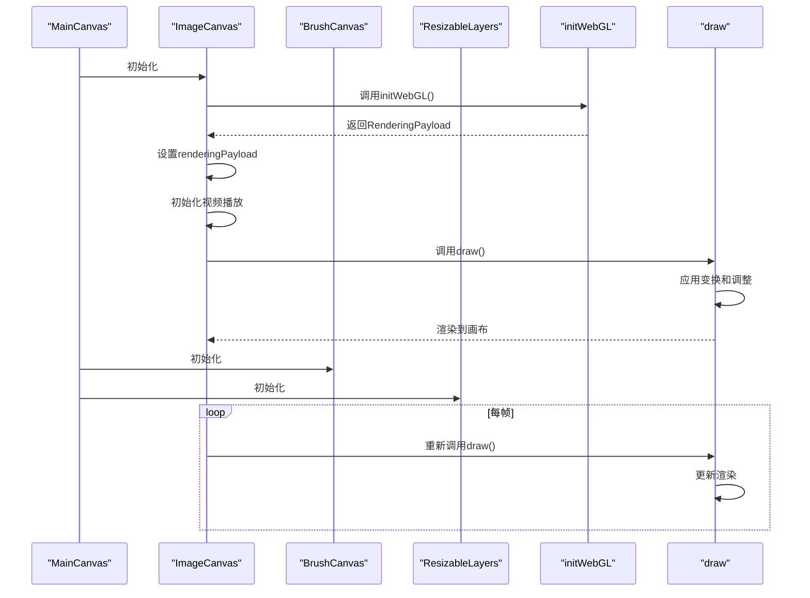

**Diagram sources**
- [canvas/mainCanvas.tsx](file://src/components/mediaEditor/canvas/mainCanvas.tsx#L1-L54)
- [canvas/imageCanvas.tsx](file://src/components/mediaEditor/canvas/imageCanvas.tsx#L1-L89)
- [webgl/initWebGL.ts](file://src/components/mediaEditor/webgl/initWebGL.ts#L1-L57)
- [webgl/draw.ts](file://src/components/mediaEditor/webgl/draw.ts)

**Section sources**
- [canvas/mainCanvas.tsx](file://src/components/mediaEditor/canvas/mainCanvas.tsx#L1-L54)
- [canvas/imageCanvas.tsx](file://src/components/mediaEditor/canvas/imageCanvas.tsx#L1-L89)

### 用户交互处理分析
用户交互处理系统负责捕获和响应用户的操作，包括触摸、鼠标和键盘事件。该系统通过SolidJS的响应式机制与状态管理层紧密集成，确保了操作的即时反馈。

#### 用户交互处理流程
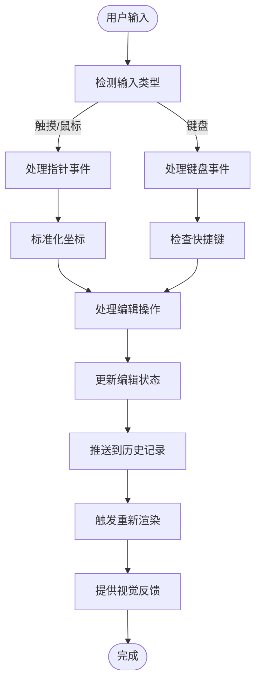

**Diagram sources**
- [context.ts](file://src/components/mediaEditor/context.ts#L1-L266)
- [canvas/useProcessPoint.ts](file://src/components/mediaEditor/canvas/useProcessPoint.ts)
- [canvas/useNormalizePoint.ts](file://src/components/mediaEditor/canvas/useNormalizePoint.ts)

**Section sources**
- [context.ts](file://src/components/mediaEditor/context.ts#L1-L266)

### 实时预览技术分析
实时预览技术通过WebGL着色器实现实时的图像处理效果，用户在调整参数时可以立即看到结果。这种技术利用GPU加速，确保了高性能的实时渲染。

#### 实时预览技术架构
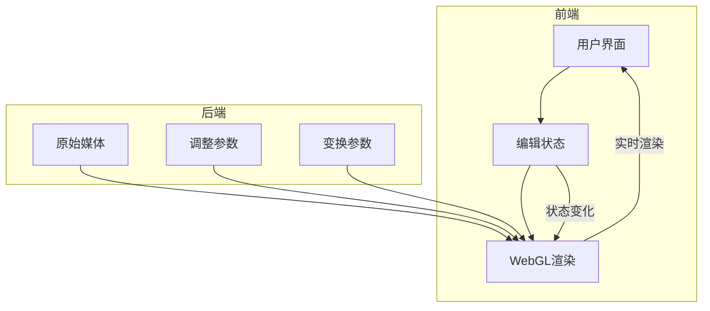

**Diagram sources**
- [webgl/initWebGL.ts](file://src/components/mediaEditor/webgl/initWebGL.ts#L1-L57)
- [webgl/shaderSources.ts](file://src/components/mediaEditor/webgl/shaderSources.ts#L1-L331)
- [canvas/imageCanvas.tsx](file://src/components/mediaEditor/canvas/imageCanvas.tsx#L1-L89)

**Section sources**
- [webgl/initWebGL.ts](file://src/components/mediaEditor/webgl/initWebGL.ts#L1-L57)
- [webgl/shaderSources.ts](file://src/components/mediaEditor/webgl/shaderSources.ts#L1-L331)

### 编辑工具接口设计
各种编辑工具通过统一的接口设计与主编辑器集成，确保了功能的一致性和可扩展性。每个工具都有明确的职责和交互方式。

#### 调整工具接口
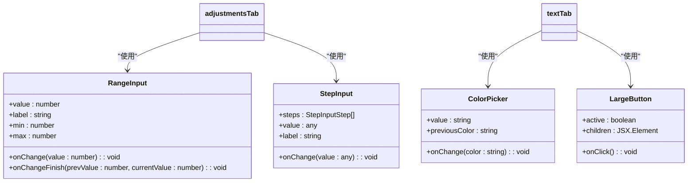

**Diagram sources**
- [rangeInput.tsx](file://src/components/mediaEditor/rangeInput.tsx)
- [stepInput.tsx](file://src/components/mediaEditor/stepInput.tsx)
- [colorPicker.tsx](file://src/components/mediaEditor/colorPicker.tsx)
- [largeButton.tsx](file://src/components/mediaEditor/largeButton.tsx)

**Section sources**
- [rangeInput.tsx](file://src/components/mediaEditor/rangeInput.tsx)
- [stepInput.tsx](file://src/components/mediaEditor/stepInput.tsx)
- [colorPicker.tsx](file://src/components/mediaEditor/colorPicker.tsx)
- [largeButton.tsx](file://src/components/mediaEditor/largeButton.tsx)

### 组件状态管理分析
组件状态管理采用SolidJS的响应式状态系统，通过可变状态(store)和上下文(context)机制实现跨组件的状态共享和响应式更新。

#### 状态管理架构
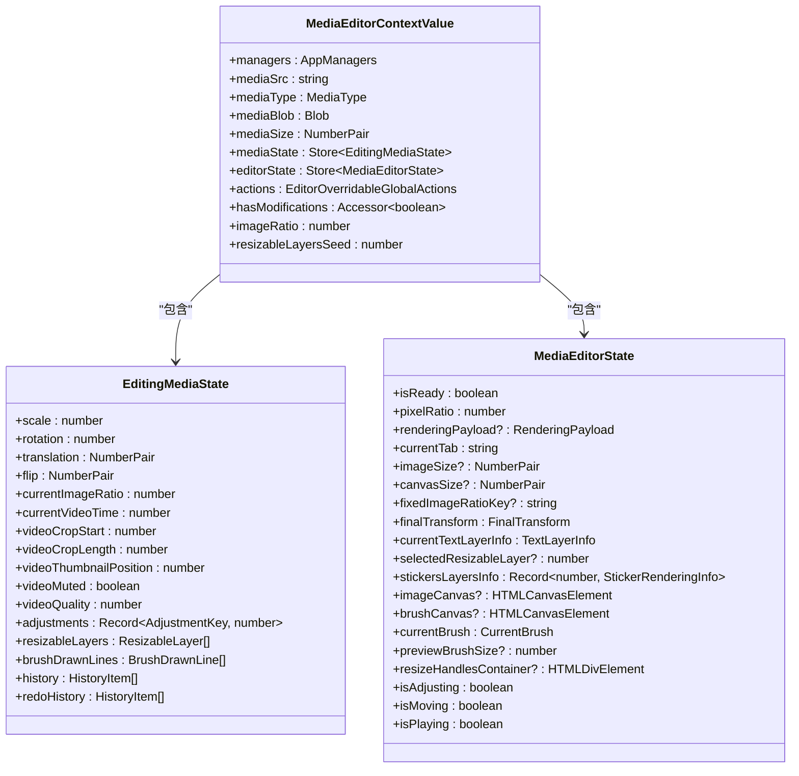

**Diagram sources**
- [context.ts](file://src/components/mediaEditor/context.ts#L1-L266)
- [types.ts](file://src/components/mediaEditor/types.ts#L1-L65)

**Section sources**
- [context.ts](file://src/components/mediaEditor/context.ts#L1-L266)

### 性能优化策略分析
性能优化策略包括WebGL渲染优化、资源管理、内存清理和异步处理，确保了编辑器在各种设备上的流畅运行。

#### 性能优化策略
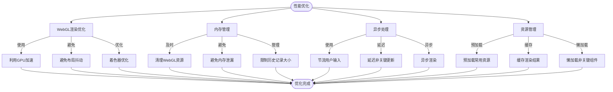

**Diagram sources**
- [webgl/initWebGL.ts](file://src/components/mediaEditor/webgl/initWebGL.ts#L1-L57)
- [webgl/draw.ts](file://src/components/mediaEditor/webgl/draw.ts)
- [finalRender/createFinalResult.ts](file://src/components/mediaEditor/finalRender/createFinalResult.ts#L1-L195)
- [context.ts](file://src/components/mediaEditor/context.ts#L1-L266)

**Section sources**
- [webgl/initWebGL.ts](file://src/components/mediaEditor/webgl/initWebGL.ts#L1-L57)
- [finalRender/createFinalResult.ts](file://src/components/mediaEditor/finalRender/createFinalResult.ts#L1-L195)

## 依赖分析
媒体编辑功能依赖于多个内部和外部组件，这些依赖关系确保了功能的完整性和可扩展性。

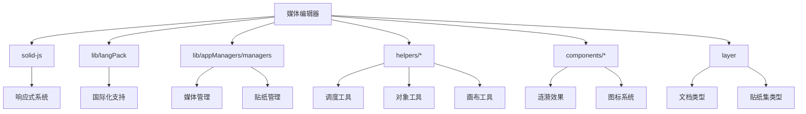

**Diagram sources**
- [mediaEditor.tsx](file://src/components/mediaEditor/mediaEditor.tsx#L1-L149)
- [context.ts](file://src/components/mediaEditor/context.ts#L1-L266)

**Section sources**
- [mediaEditor.tsx](file://src/components/mediaEditor/mediaEditor.tsx#L1-L149)

## 性能考虑
媒体编辑功能在设计时充分考虑了性能因素，通过WebGL硬件加速、合理的内存管理和异步处理策略，确保了在各种设备上的流畅运行。对于大型媒体文件，系统会自动调整渲染质量和处理策略，以平衡性能和效果。

**Section sources**
- [webgl/initWebGL.ts](file://src/components/mediaEditor/webgl/initWebGL.ts#L1-L57)
- [finalRender/createFinalResult.ts](file://src/components/mediaEditor/finalRender/createFinalResult.ts#L1-L195)

## 故障排除指南
### 常见问题及解决方案
1. **问题：编辑器无法加载媒体文件**
   - 检查文件路径是否正确
   - 确认文件格式是否支持
   - 检查网络连接（如果是远程文件）

2. **问题：滤镜效果不显示**
   - 确认WebGL支持
   - 检查浏览器是否禁用了硬件加速
   - 尝试重启浏览器

3. **问题：画笔标注不流畅**
   - 降低画布分辨率
   - 关闭其他占用资源的应用
   - 检查是否有其他脚本冲突

4. **问题：最终渲染失败**
   - 检查文件大小是否超出限制
   - 确认有足够的磁盘空间
   - 尝试简化编辑内容

**Section sources**
- [createFinalResult.ts](file://src/components/mediaEditor/finalRender/createFinalResult.ts#L1-L195)
- [initWebGL.ts](file://src/components/mediaEditor/webgl/initWebGL.ts#L1-L57)

## 结论
媒体编辑功能通过模块化设计和先进的Web技术，提供了一套强大而灵活的编辑工具。其基于WebGL的渲染引擎确保了高性能的实时预览，而响应式状态管理系统则保证了流畅的用户体验。该功能不仅支持基本的裁剪和旋转，还提供了丰富的滤镜和标注工具，满足了用户多样化的编辑需求。