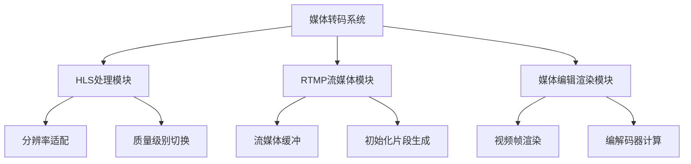
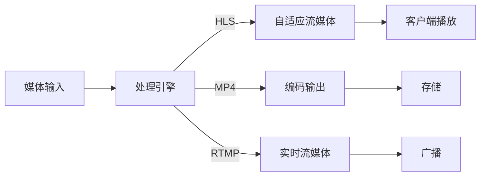
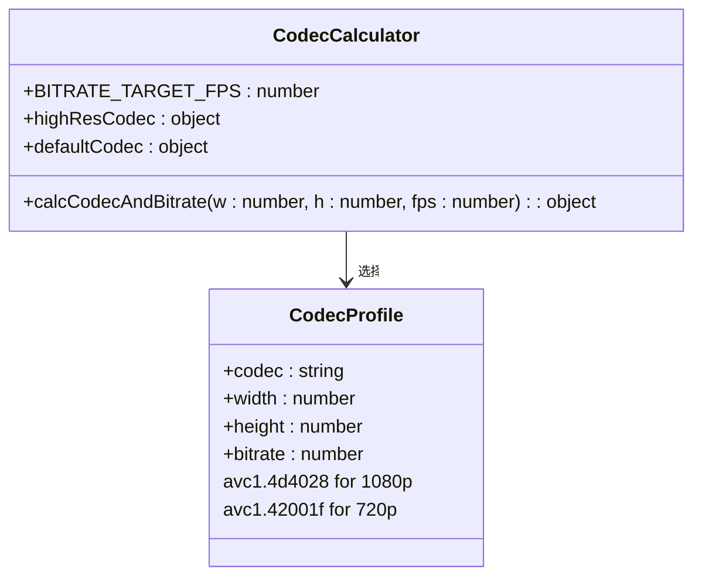
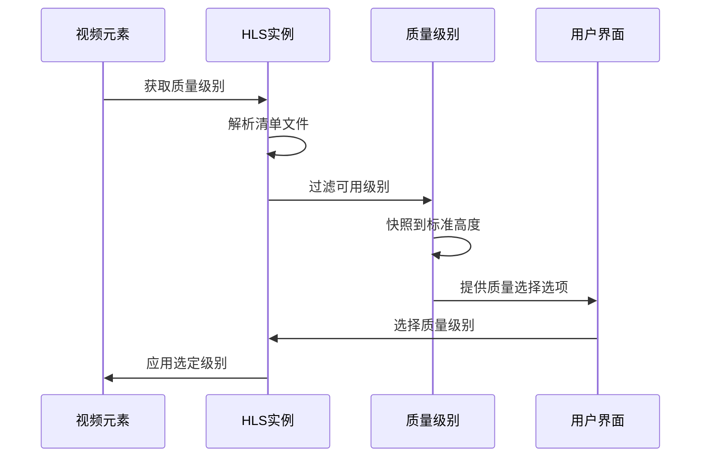
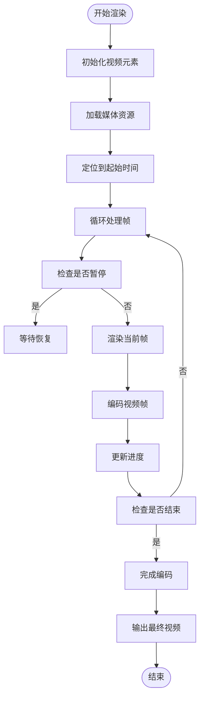
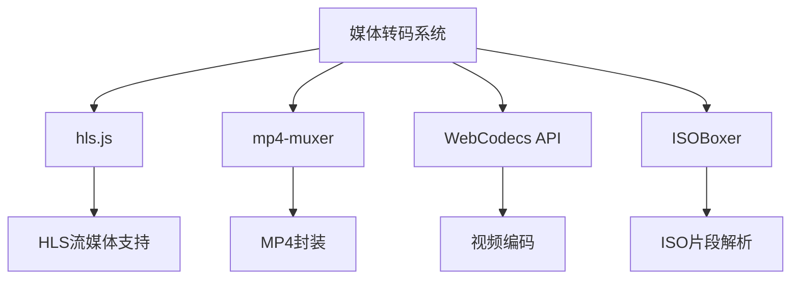

# 媒体转码功能

<cite>
**本文档引用的文件**  
- [calcCodecAndBitrate.ts](file://src/lib/mediaPlayer/calcCodecAndBitrate.ts)
- [snapQualityHeight.ts](file://src/lib/hls/snapQualityHeight.ts)
- [qualityLevelsSwitchButton.tsx](file://src/lib/mediaPlayer/qualityLevelsSwitchButton.tsx)
- [rtmp.ts](file://src/lib/serviceWorker/rtmp.ts)
- [renderToActualVideo.ts](file://src/components/mediaEditor/finalRender/renderToActualVideo.ts)
- [videoStickerFrameByFrameRenderer.ts](file://src/components/mediaEditor/finalRender/videoStickerFrameByFrameRenderer.ts)
- [types.ts](file://src/lib/hls/types.ts)
</cite>

## 目录
1. [简介](#简介)
2. [项目结构](#项目结构)
3. [核心组件](#核心组件)
4. [架构概述](#架构概述)
5. [详细组件分析](#详细组件分析)
6. [依赖分析](#依赖分析)
7. [性能考虑](#性能考虑)
8. [故障排除指南](#故障排除指南)
9. [结论](#结论)

## 简介
本文档全面解释了视频转码、格式转换和流媒体适配的实现机制。重点描述了HLS视频源创建、编解码器选择和比特率计算算法，记录了视频渲染流程、帧处理和格式封装技术，并说明了自适应流媒体生成和跨平台兼容性策略。

## 项目结构
项目结构显示了媒体转码功能主要分布在`src/lib/hls`、`src/lib/serviceWorker`和`src/components/mediaEditor/finalRender`目录中。这些模块协同工作以实现完整的媒体处理流水线。

**图表来源**  
- [snapQualityHeight.ts](file://src/lib/hls/snapQualityHeight.ts)
- [rtmp.ts](file://src/lib/serviceWorker/rtmp.ts)
- [renderToActualVideo.ts](file://src/components/mediaEditor/finalRender/renderToActualVideo.ts)

**章节来源**  
- [src/lib/hls](file://src/lib/hls)
- [src/lib/serviceWorker](file://src/lib/serviceWorker)
- [src/components/mediaEditor/finalRender](file://src/components/mediaEditor/finalRender)

## 核心组件
核心组件包括HLS质量级别切换、编解码器和比特率计算、视频帧逐帧渲染以及RTMP流媒体处理。这些组件共同实现了高效的媒体转码和流媒体适配功能。

**章节来源**  
- [calcCodecAndBitrate.ts](file://src/lib/mediaPlayer/calcCodecAndBitrate.ts)
- [qualityLevelsSwitchButton.tsx](file://src/lib/mediaPlayer/qualityLevelsSwitchButton.tsx)
- [videoStickerFrameByFrameRenderer.ts](file://src/components/mediaEditor/finalRender/videoStickerFrameByFrameRenderer.ts)

## 架构概述
系统架构采用分层设计，包括媒体输入层、处理层和输出层。HLS和RTMP模块提供流媒体支持，而媒体编辑器负责视频渲染和格式转换。

**图表来源**  
- [rtmp.ts](file://src/lib/serviceWorker/rtmp.ts)
- [renderToActualVideo.ts](file://src/components/mediaEditor/finalRender/renderToActualVideo.ts)

## 详细组件分析

### 编解码器与比特率计算
系统根据视频分辨率和帧率动态选择合适的编解码器和比特率。对于1080p及以上分辨率使用高性能编解码器，而对于720p及以下则使用标准编解码器。

**图表来源**  
- [calcCodecAndBitrate.ts](file://src/lib/mediaPlayer/calcCodecAndBitrate.ts)

### HLS质量级别管理
HLS质量级别切换组件负责管理不同分辨率的质量级别，根据网络带宽和设备能力自动选择最佳质量。

**图表来源**  
- [qualityLevelsSwitchButton.tsx](file://src/lib/mediaPlayer/qualityLevelsSwitchButton.tsx)
- [snapQualityHeight.ts](file://src/lib/hls/snapQualityHeight.ts)

### 视频帧渲染流程
视频帧渲染流程采用逐帧处理方式，结合WebGL和Canvas技术实现高效的视频编辑和渲染。

**图表来源**  
- [renderToActualVideo.ts](file://src/components/mediaEditor/finalRender/renderToActualVideo.ts)
- [videoStickerFrameByFrameRenderer.ts](file://src/components/mediaEditor/finalRender/videoStickerFrameByFrameRenderer.ts)

**章节来源**  
- [renderToActualVideo.ts](file://src/components/mediaEditor/finalRender/renderToActualVideo.ts)
- [videoStickerFrameByFrameRenderer.ts](file://src/components/mediaEditor/finalRender/videoStickerFrameByFrameRenderer.ts)

## 依赖分析
系统依赖于多个关键模块和外部库来实现完整的媒体转码功能。

**图表来源**  
- [rtmp.ts](file://src/lib/serviceWorker/rtmp.ts)
- [renderToActualVideo.ts](file://src/components/mediaEditor/finalRender/renderToActualVideo.ts)

**章节来源**  
- [package.json](file://package.json)
- [rtmp.ts](file://src/lib/serviceWorker/rtmp.ts)

## 性能考虑
在实现媒体转码功能时，需要考虑以下性能优化策略：
- 使用Web Workers进行后台编码以避免UI阻塞
- 实现智能缓冲策略以适应网络波动
- 采用渐进式加载和渲染技术
- 优化编解码参数以平衡质量和性能
- 实现暂停/恢复机制以节省资源

## 故障排除指南
常见问题及解决方案：

**章节来源**  
- [rtmp.ts](file://src/lib/serviceWorker/rtmp.ts)
- [renderToActualVideo.ts](file://src/components/mediaEditor/finalRender/renderToActualVideo.ts)

## 结论
本文档详细介绍了媒体转码功能的实现机制，涵盖了从视频转码、格式转换到流媒体适配的各个方面。通过HLS和RTMP技术的结合，系统能够提供高质量的自适应流媒体服务，同时支持复杂的视频编辑和渲染功能。