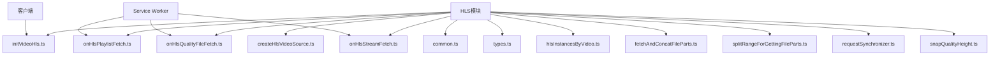
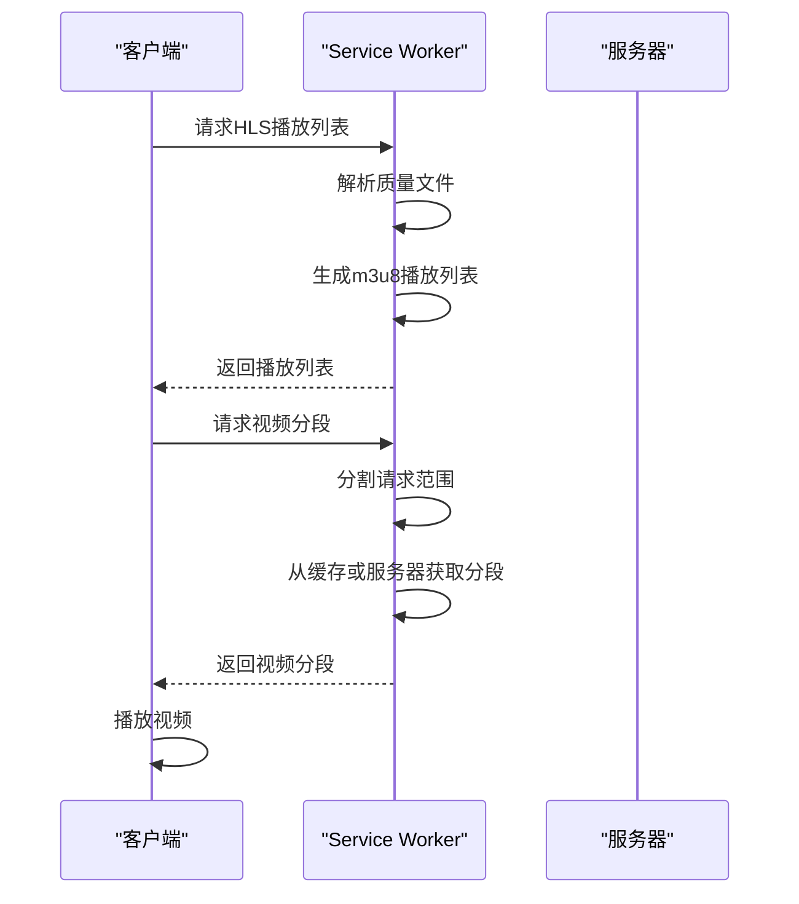
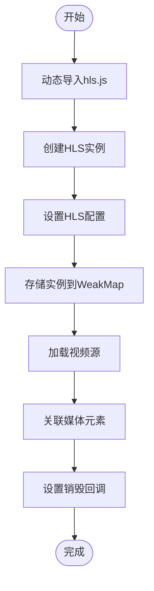
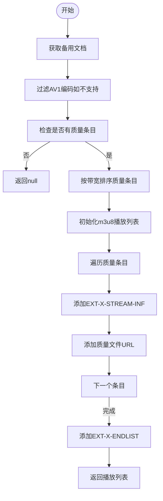
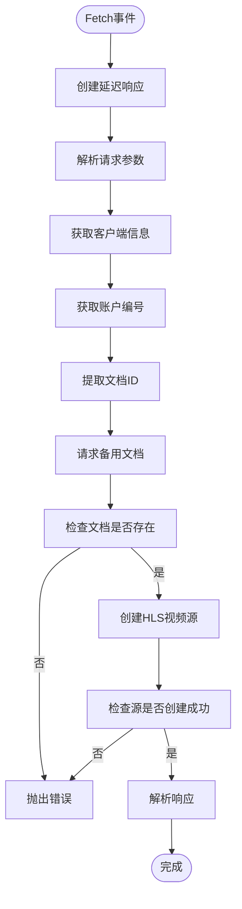
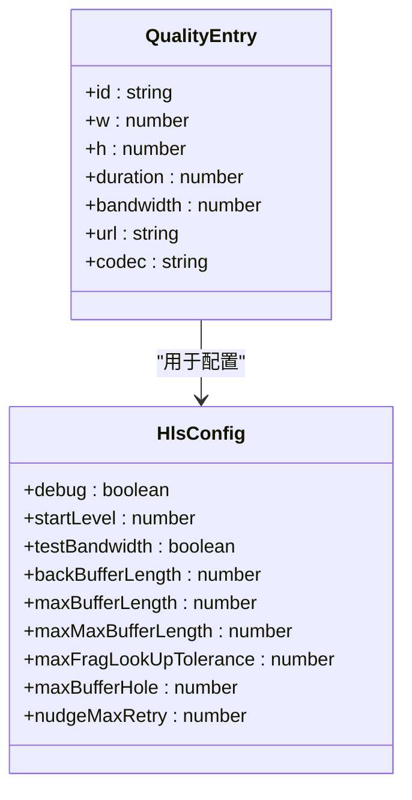
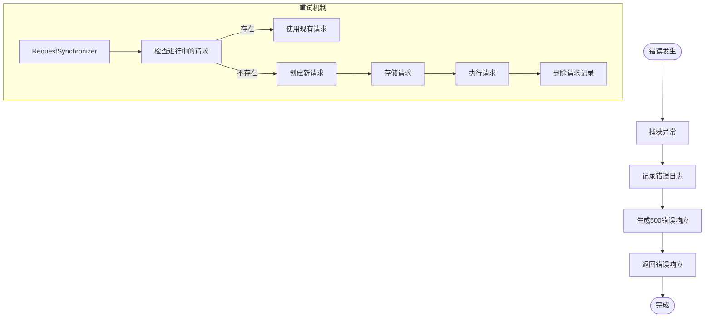
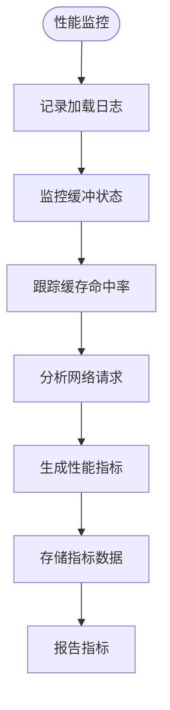
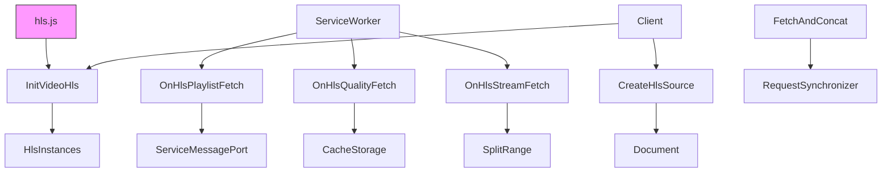
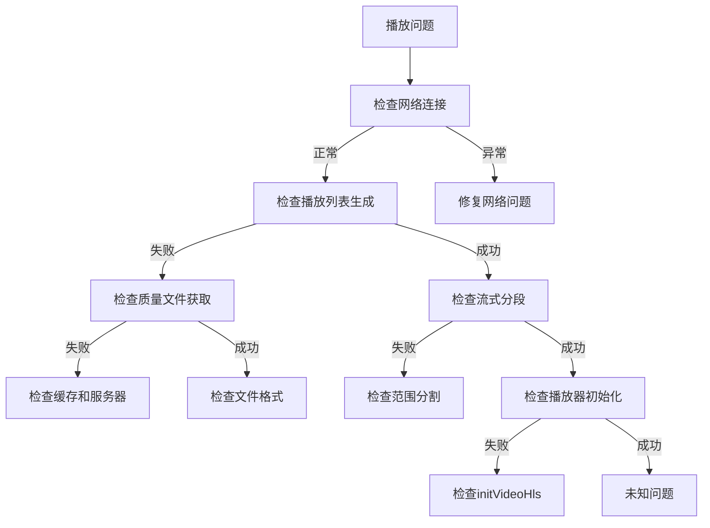

# HLS流媒体播放

<cite>
**本文档中引用的文件**  
- [initVideoHls.ts](file://src/lib/hls/initVideoHls.ts)
- [createHlsVideoSource.ts](file://src/lib/hls/createHlsVideoSource.ts)
- [onHlsPlaylistFetch.ts](file://src/lib/hls/onHlsPlaylistFetch.ts)
- [onHlsQualityFileFetch.ts](file://src/lib/hls/onHlsQualityFileFetch.ts)
- [onHlsStreamFetch.ts](file://src/lib/hls/onHlsStreamFetch.ts)
- [common.ts](file://src/lib/hls/common.ts)
- [types.ts](file://src/lib/hls/types.ts)
- [hlsInstancesByVideo.ts](file://src/lib/hls/hlsInstancesByVideo.ts)
- [fetchAndConcatFileParts.ts](file://src/lib/hls/fetchAndConcatFileParts.ts)
- [splitRangeForGettingFileParts.ts](file://src/lib/hls/splitRangeForGettingFileParts.ts)
- [requestSynchronizer.ts](file://src/lib/hls/requestSynchronizer.ts)
- [snapQualityHeight.ts](file://src/lib/hls/snapQualityHeight.ts)
- [serviceWorker/rtmp.ts](file://src/lib/serviceWorker/rtmp.ts)
</cite>

## 目录
1. [简介](#简介)
2. [项目结构](#项目结构)
3. [核心组件](#核心组件)
4. [架构概述](#架构概述)
5. [详细组件分析](#详细组件分析)
6. [依赖分析](#依赖分析)
7. [性能考虑](#性能考虑)
8. [故障排除指南](#故障排除指南)
9. [结论](#结论)

## 简介
本文档详细描述了项目中HLS（HTTP Live Streaming）流媒体播放的实现机制。系统通过Service Worker拦截视频请求，动态生成m3u8播放列表，并管理分段下载、缓冲策略和自适应码率切换。整个流程涉及多个核心组件协同工作，包括播放列表生成、质量文件处理、流式分段获取和客户端HLS初始化。

## 项目结构
HLS相关功能主要集中在`src/lib/hls/`目录下，通过Service Worker机制实现流媒体的代理和优化。系统采用模块化设计，各组件职责明确，通过弱引用和缓存机制管理资源生命周期。

**Diagram sources**
- [src/lib/hls/](file://src/lib/hls/)

**Section sources**
- [src/lib/hls/](file://src/lib/hls/)

## 核心组件
本系统实现了完整的HLS流媒体播放功能，包括播放列表解析、分段下载、缓冲管理和自适应码率切换。核心组件通过Service Worker拦截网络请求，动态生成和修改HLS流，实现高效的视频流传输和播放控制。

**Section sources**
- [src/lib/hls/initVideoHls.ts](file://src/lib/hls/initVideoHls.ts#L1-L40)
- [src/lib/hls/createHlsVideoSource.ts](file://src/lib/hls/createHlsVideoSource.ts#L1-L106)
- [src/lib/hls/onHlsPlaylistFetch.ts](file://src/lib/hls/onHlsPlaylistFetch.ts#L1-L37)

## 架构概述
系统采用客户端-Service Worker协同架构，实现HLS流媒体的高效播放。客户端负责HLS播放器的初始化和媒体元素管理，Service Worker负责拦截请求、生成播放列表和处理流式数据。

**Diagram sources**
- [src/lib/hls/onHlsPlaylistFetch.ts](file://src/lib/hls/onHlsPlaylistFetch.ts#L12-L37)
- [src/lib/hls/onHlsStreamFetch.ts](file://src/lib/hls/onHlsStreamFetch.ts#L14-L53)

## 详细组件分析

### initVideoHls.ts初始化流程
该模块负责初始化HLS播放器实例，将其与HTML视频元素关联，并管理其生命周期。通过动态导入hls.js库，实现按需加载。

**Diagram sources**
- [src/lib/hls/initVideoHls.ts](file://src/lib/hls/initVideoHls.ts#L13-L40)

**Section sources**
- [src/lib/hls/initVideoHls.ts](file://src/lib/hls/initVideoHls.ts#L1-L40)

### createHlsVideoSource.ts源创建逻辑
该模块负责从备用文档中提取质量信息，生成标准的m3u8播放列表。它处理视频属性、带宽计算和URL转换，确保生成的播放列表符合HLS规范。

**Diagram sources**
- [src/lib/hls/createHlsVideoSource.ts](file://src/lib/hls/createHlsVideoSource.ts#L13-L41)

**Section sources**
- [src/lib/hls/createHlsVideoSource.ts](file://src/lib/hls/createHlsVideoSource.ts#L1-L106)

### onHlsPlaylistFetch.ts播放列表处理
该Service Worker处理器负责拦截HLS播放列表请求，获取相关文档的质量信息，并生成相应的m3u8播放列表返回给客户端。

**Diagram sources**
- [src/lib/hls/onHlsPlaylistFetch.ts](file://src/lib/hls/onHlsPlaylistFetch.ts#L12-L37)

**Section sources**
- [src/lib/hls/onHlsPlaylistFetch.ts](file://src/lib/hls/onHlsPlaylistFetch.ts#L1-L37)

### 自适应码率切换算法
系统通过分析视频质量和网络状况实现自适应码率切换。在`createHlsVideoSource.ts`中，质量条目按带宽排序，HLS.js库根据当前网络状况自动选择合适的码率。

**Diagram sources**
- [src/lib/hls/createHlsVideoSource.ts](file://src/lib/hls/createHlsVideoSource.ts#L44-L65)
- [src/lib/hls/initVideoHls.ts](file://src/lib/hls/initVideoHls.ts#L18-L29)

### 网络状况检测机制
系统通过HLS.js库内置的网络检测机制来监控网络状况。配置中的`testBandwidth: false`表明系统可能依赖其他机制或让HLS.js自动管理带宽检测。

**Section sources**
- [src/lib/hls/initVideoHls.ts](file://src/lib/hls/initVideoHls.ts#L18-L29)

### 错误处理策略和重试机制
系统实现了多层次的错误处理和重试机制，确保流媒体播放的稳定性和可靠性。

**Diagram sources**
- [src/lib/hls/onHlsPlaylistFetch.ts](file://src/lib/hls/onHlsPlaylistFetch.ts#L32-L35)
- [src/lib/hls/requestSynchronizer.ts](file://src/lib/hls/requestSynchronizer.ts#L1-L16)

**Section sources**
- [src/lib/hls/onHlsPlaylistFetch.ts](file://src/lib/hls/onHlsPlaylistFetch.ts#L1-L37)
- [src/lib/hls/requestSynchronizer.ts](file://src/lib/hls/requestSynchronizer.ts#L1-L16)

### 性能监控指标收集
系统通过日志记录和缓存管理来监控性能指标。虽然没有直接的性能指标收集代码，但通过日志可以间接分析加载时间、缓冲情况等。

**Section sources**
- [src/lib/hls/common.ts](file://src/lib/hls/common.ts#L8-L9)
- [src/lib/hls/fetchAndConcatFileParts.ts](file://src/lib/hls/fetchAndConcatFileParts.ts#L60-L64)

## 依赖分析
HLS模块依赖多个内部和外部组件，形成复杂的依赖网络。

**Diagram sources**
- [package.json](file://package.json)
- [src/lib/hls/](file://src/lib/hls/)

**Section sources**
- [src/lib/hls/](file://src/lib/hls/)

## 性能考虑
系统在性能方面进行了多项优化，包括缓存策略、请求同步和资源管理。

- **缓存策略**：使用CacheStorageController缓存质量文件和流式分段，减少重复请求
- **请求同步**：通过RequestSynchronizer避免重复请求相同资源
- **内存管理**：使用WeakMap存储HLS实例，避免内存泄漏
- **分段优化**：合理分割请求范围，符合Telegram CDN限制
- **生命周期管理**：在适当时候销毁HLS实例，释放资源

**Section sources**
- [src/lib/hls/fetchAndConcatFileParts.ts](file://src/lib/hls/fetchAndConcatFileParts.ts#L21-L22)
- [src/lib/hls/requestSynchronizer.ts](file://src/lib/hls/requestSynchronizer.ts#L2-L3)
- [src/lib/hls/hlsInstancesByVideo.ts](file://src/lib/hls/hlsInstancesByVideo.ts#L3)

## 故障排除指南
当HLS流媒体播放出现问题时，可参考以下常见问题和解决方案：

**Section sources**
- [src/lib/hls/onHlsPlaylistFetch.ts](file://src/lib/hls/onHlsPlaylistFetch.ts#L32-L35)
- [src/lib/hls/onHlsQualityFileFetch.ts](file://src/lib/hls/onHlsQualityFileFetch.ts#L39-L42)
- [src/lib/hls/onHlsStreamFetch.ts](file://src/lib/hls/onHlsStreamFetch.ts#L48-L51)

## 结论
本HLS流媒体播放系统实现了完整的流媒体处理功能，包括播放列表生成、分段下载、缓冲管理和自适应码率切换。通过Service Worker拦截机制，系统能够动态生成和优化HLS流，提供高效的视频播放体验。系统设计考虑了性能、可靠性和可维护性，采用模块化架构和良好的错误处理机制，确保在各种网络条件下都能稳定运行。