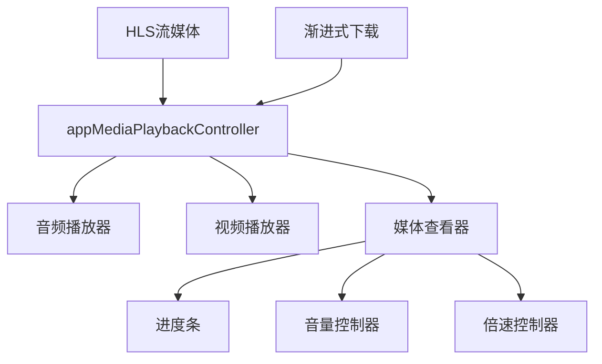
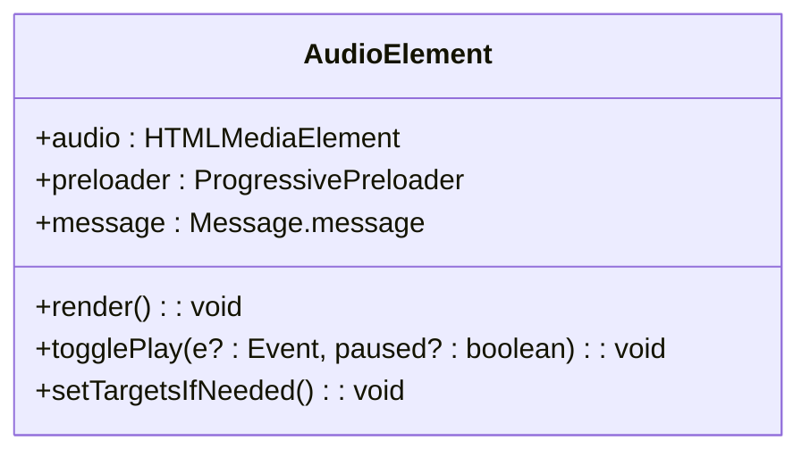
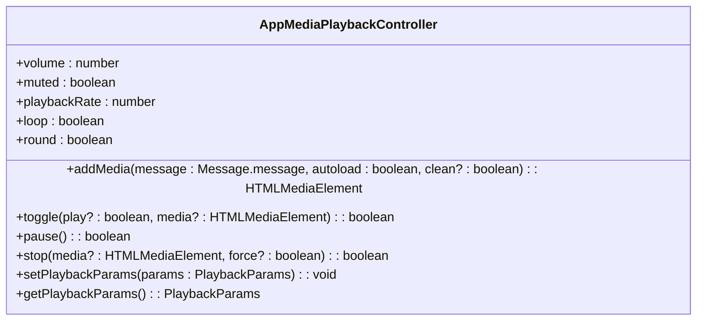
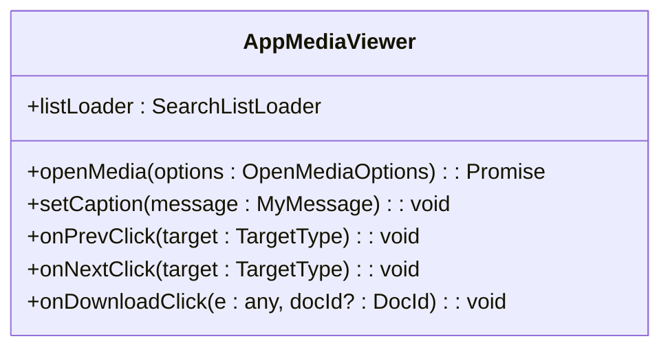
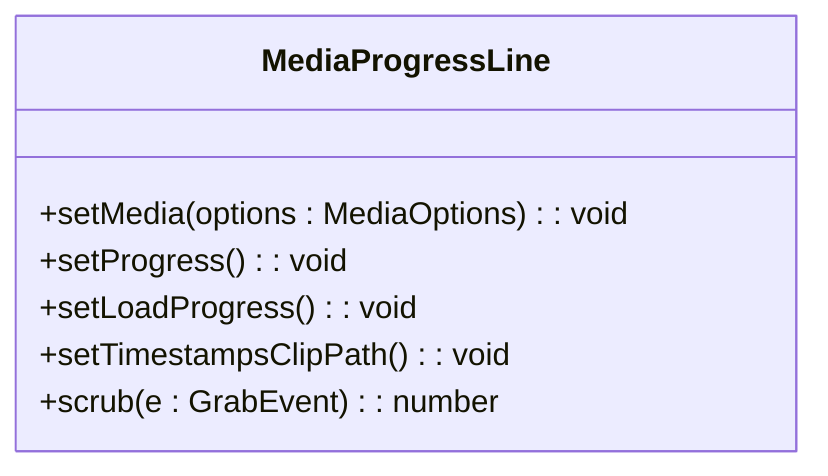
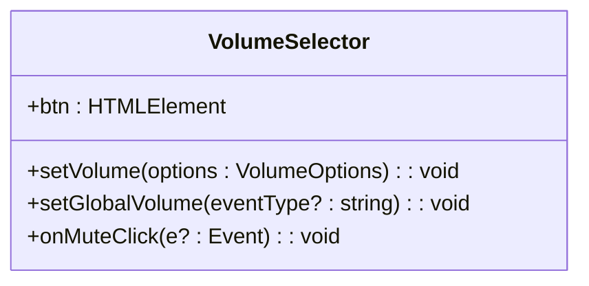
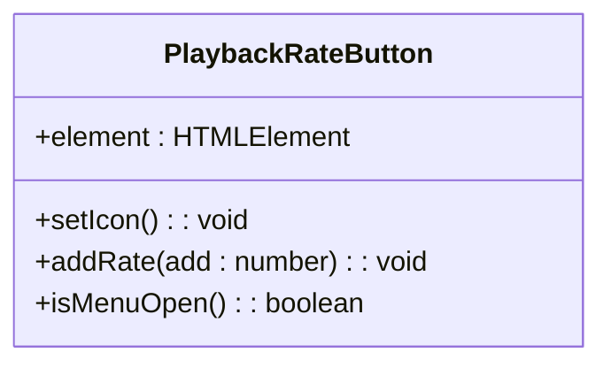
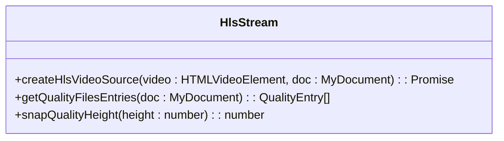
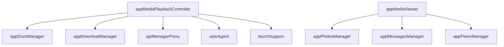

# 媒体播放API

<cite>
**本文档引用的文件**   
- [audio.ts](file://src/components/audio.ts)
- [chat/audio.ts](file://src/components/chat/audio.ts)
- [appMediaPlaybackController.ts](file://src/components/appMediaPlaybackController.ts)
- [appMediaViewer.ts](file://src/components/appMediaViewer.ts)
- [appMediaViewerBase.ts](file://src/components/appMediaViewerBase.ts)
- [mediaProgressLine.ts](file://src/components/mediaProgressLine.ts)
- [playbackRateButton.ts](file://src/components/playbackRateButton.ts)
- [volumeSelector.ts](file://src/components/volumeSelector.ts)
- [hls](file://src/lib/hls)
</cite>

## 目录
1. [简介](#简介)
2. [项目结构](#项目结构)
3. [核心组件](#核心组件)
4. [架构概述](#架构概述)
5. [详细组件分析](#详细组件分析)
6. [依赖分析](#依赖分析)
7. [性能考虑](#性能考虑)
8. [故障排除指南](#故障排除指南)
9. [结论](#结论)

## 简介
本文档详细描述了媒体播放API的实现，包括音频和视频播放器的接口、配置选项、HLS流媒体播放实现、渐进式下载机制、播放控制功能（播放、暂停、seek和倍速播放）、字幕支持、音轨切换、画中画模式、播放性能监控、缓冲策略配置、自适应码率切换和网络状况检测等。

## 项目结构
项目结构中与媒体播放相关的组件主要位于`src/components`目录下，包括音频、视频播放器、媒体查看器、播放控制、进度条、音量控制、倍速播放等组件。HLS流媒体相关实现位于`src/lib/hls`目录下。

**Section sources**
- [src/components](file://src/components)
- [src/lib/hls](file://src/lib/hls)

## 核心组件
核心组件包括音频播放器、视频播放器、媒体查看器、播放控制器、进度条、音量控制器和倍速播放控制器。

**Section sources**
- [audio.ts](file://src/components/audio.ts)
- [appMediaPlaybackController.ts](file://src/components/appMediaPlaybackController.ts)
- [appMediaViewer.ts](file://src/components/appMediaViewer.ts)
- [mediaProgressLine.ts](file://src/components/mediaProgressLine.ts)
- [volumeSelector.ts](file://src/components/volumeSelector.ts)
- [playbackRateButton.ts](file://src/components/playbackRateButton.ts)

## 架构概述
媒体播放系统采用模块化设计，核心是`appMediaPlaybackController`，负责管理所有媒体的播放状态、音量、倍速、循环等。媒体查看器`appMediaViewer`负责展示媒体内容，支持缩放、滑动切换等交互。播放控制组件如`mediaProgressLine`、`volumeSelector`、`playbackRateButton`提供用户交互界面。

**Diagram sources **
- [appMediaPlaybackController.ts](file://src/components/appMediaPlaybackController.ts)
- [appMediaViewer.ts](file://src/components/appMediaViewer.ts)

## 详细组件分析

### 音频播放器分析
音频播放器组件`AudioElement`实现了音频消息的播放功能，支持语音消息和音乐文件的播放。它集成了波形图显示、播放控制、下载预加载等功能。

**Diagram sources **
- [audio.ts](file://src/components/audio.ts)

### 播放控制器分析
`appMediaPlaybackController`是核心播放控制器，管理所有媒体的播放状态。它支持播放、暂停、停止、音量控制、倍速播放、循环播放等功能，并提供媒体会话API集成。

**Diagram sources **
- [appMediaPlaybackController.ts](file://src/components/appMediaPlaybackController.ts)

### 媒体查看器分析
`appMediaViewer`组件提供媒体内容的查看功能，支持图片、视频、文档等多种媒体类型。它集成了缩放、滑动切换、下载、删除等操作。

**Diagram sources **
- [appMediaViewer.ts](file://src/components/appMediaViewer.ts)

### 进度条分析
`mediaProgressLine`组件提供媒体播放进度的可视化，支持拖动seek、显示缓冲进度、时间戳跳转等功能。

**Diagram sources **
- [mediaProgressLine.ts](file://src/components/mediaProgressLine.ts)

### 音量控制器分析
`VolumeSelector`组件提供音量控制功能，支持点击静音、拖动调节音量，并可与全局音量同步。

**Diagram sources **
- [volumeSelector.ts](file://src/components/volumeSelector.ts)

### 倍速播放器分析
`PlaybackRateButton`组件提供倍速播放控制，支持0.5x、1x、1.5x、2x四种播放速度切换。

**Diagram sources **
- [playbackRateButton.ts](file://src/components/playbackRateButton.ts)

### HLS流媒体分析
HLS流媒体实现位于`src/lib/hls`目录下，提供自适应码率切换、网络状况检测、缓冲策略配置等功能。

**Diagram sources **
- [hls](file://src/lib/hls)

## 依赖分析
媒体播放系统依赖于多个核心模块，包括媒体管理器、下载管理器、缓存系统、用户代理检测等。这些模块协同工作，确保媒体播放的流畅性和兼容性。

**Diagram sources **
- [appMediaPlaybackController.ts](file://src/components/appMediaPlaybackController.ts)
- [appMediaViewer.ts](file://src/components/appMediaViewer.ts)

## 性能考虑
媒体播放系统在性能方面做了多项优化，包括：
- 使用`requestAnimationFrame`进行动画和进度更新
- 对媒体加载进行懒加载和预加载管理
- 在Safari浏览器中特殊处理流媒体缓冲问题
- 使用Web Workers进行后台处理
- 对DOM操作进行批处理和优化

**Section sources**
- [appMediaPlaybackController.ts](file://src/components/appMediaPlaybackController.ts)
- [appMediaViewerBase.ts](file://src/components/appMediaViewerBase.ts)

## 故障排除指南
### 播放问题
- **问题**: Safari浏览器中流媒体无法播放
  - **解决方案**: 检查是否启用了Safari特殊处理，确保正确设置缓冲策略
- **问题**: 媒体加载缓慢
  - **解决方案**: 检查网络状况，优化HLS码率切换策略，调整缓冲大小

### 兼容性问题
- **问题**: 某些设备上无法播放特定格式
  - **解决方案**: 检查`mediaMimeTypesSupport`配置，确保支持的MIME类型正确
- **问题**: 移动设备上触摸事件冲突
  - **解决方案**: 检查`swipeHandler`的事件处理逻辑，确保正确识别触摸意图

**Section sources**
- [appMediaPlaybackController.ts](file://src/components/appMediaPlaybackController.ts)
- [appMediaViewerBase.ts](file://src/components/appMediaViewerBase.ts)

## 结论
媒体播放API提供了完整的音频和视频播放解决方案，支持多种播放控制功能、HLS流媒体、渐进式下载、自适应码率切换等高级特性。通过模块化设计和性能优化，确保了在各种设备和网络条件下的良好用户体验。