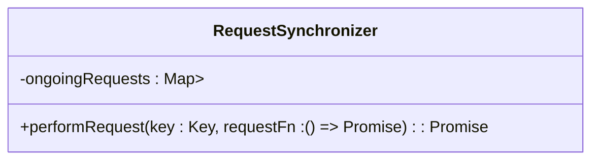
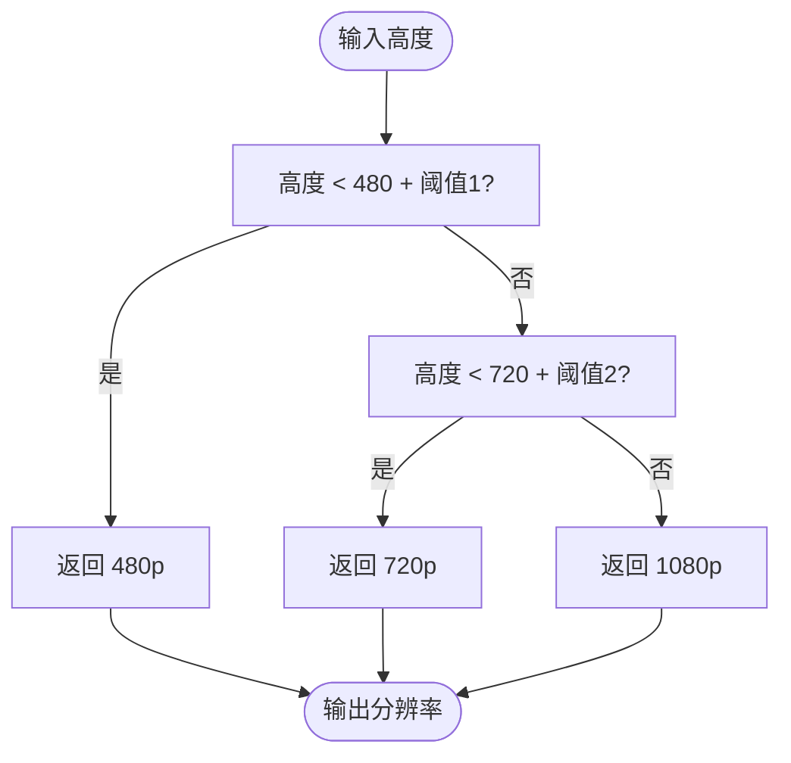
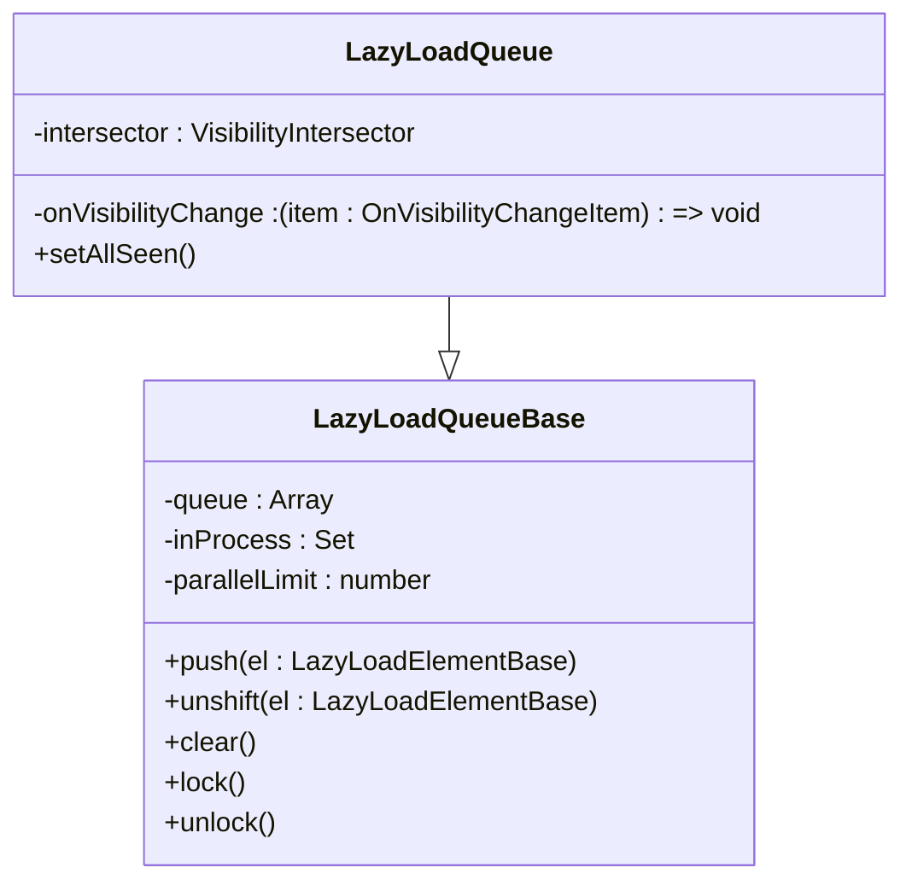
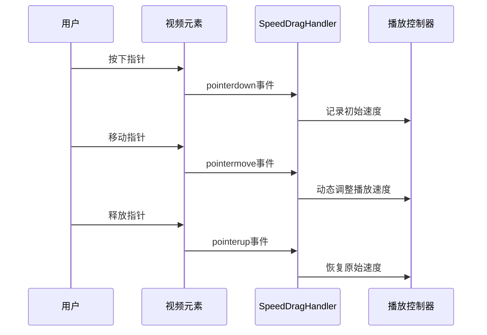
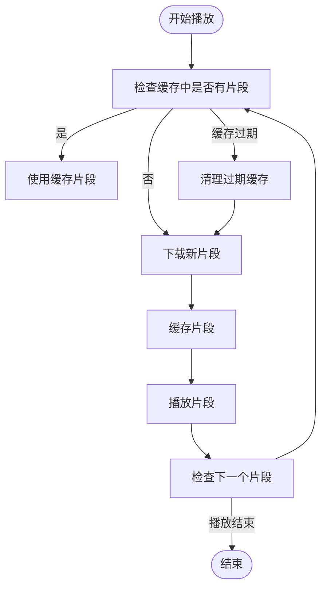

# 播放性能优化

<cite>
**本文档引用的文件**  
- [requestSynchronizer.ts](file://src/lib/hls/requestSynchronizer.ts)
- [snapQualityHeight.ts](file://src/lib/hls/snapQualityHeight.ts)
- [speedDragHandler.tsx](file://src/lib/mediaPlayer/speedDragHandler.tsx)
- [lazyLoadQueue.ts](file://src/components/lazyLoadQueue.ts)
- [lazyLoadQueueBase.ts](file://src/components/lazyLoadQueueBase.ts)
- [lazyLoadQueueIntersector.ts](file://src/components/lazyLoadQueueIntersector.ts)
- [lazyLoadQueueRepeat.ts](file://src/components/lazyLoadQueueRepeat.ts)
- [lazyLoadQueueRepeat2.ts](file://src/components/lazyLoadQueueRepeat2.ts)
- [appMediaPlaybackController.ts](file://src/components/appMediaPlaybackController.ts)
- [common.ts](file://src/lib/hls/common.ts)
- [fetchAndConcatFileParts.ts](file://src/lib/hls/fetchAndConcatFileParts.ts)
</cite>

## 目录
1. [简介](#简介)
2. [请求同步机制](#请求同步机制)
3. [分辨率适配算法](#分辨率适配算法)
4. [懒加载队列与媒体预加载](#懒加载队列与媒体预加载)
5. [播放速度控制与用户体验](#播放速度控制与用户体验)
6. [缓冲策略与网络带宽检测](#缓冲策略与网络带宽检测)
7. [性能监控与关键指标](#性能监控与关键指标)
8. [结论](#结论)

## 简介
本文档详细阐述了播放性能优化的核心机制，涵盖请求同步、分辨率适配、懒加载队列、播放速度控制、缓冲策略及性能监控等方面。通过分析关键代码文件，揭示了系统如何在保证用户体验的同时，最大化网络资源利用效率和播放流畅性。

## 请求同步机制

`requestSynchronizer.ts` 实现了请求同步机制，通过 `RequestSynchronizer` 类管理并发请求，避免重复请求导致的网络拥塞。该机制使用 `Map` 存储正在进行的请求，当新请求到来时，若已有相同键的请求正在进行，则直接复用其 `Promise`，避免重复发起请求。

**图示来源**  
- [requestSynchronizer.ts](file://src/lib/hls/requestSynchronizer.ts#L1-L16)

**本节来源**  
- [requestSynchronizer.ts](file://src/lib/hls/requestSynchronizer.ts#L1-L16)

## 分辨率适配算法

`snapQualityHeight.ts` 实现了分辨率适配算法，通过 `snapQualityHeight` 函数将输入高度映射到标准分辨率（480p、720p、1080p）。该算法根据输入高度与标准分辨率的阈值关系，选择最接近的标准分辨率，确保视频播放质量的同时，减少不必要的带宽消耗。

**图示来源**  
- [snapQualityHeight.ts](file://src/lib/hls/snapQualityHeight.ts#L3-L13)

**本节来源**  
- [snapQualityHeight.ts](file://src/lib/hls/snapQualityHeight.ts#L3-L13)

## 懒加载队列与媒体预加载

懒加载队列通过 `lazyLoadQueue.ts` 及其基类 `lazyLoadQueueBase.ts` 实现，用于管理媒体资源的异步加载。该机制通过 `VisibilityIntersector` 监听元素可见性，当元素进入视口时触发加载，有效减少初始加载时间，提升用户体验。

`LazyLoadQueueBase` 类定义了基础的懒加载队列，支持并行加载限制和中间件处理。`LazyLoadQueue` 类在此基础上增加了可见性监听功能，确保资源在需要时才加载。

**图示来源**  
- [lazyLoadQueueBase.ts](file://src/components/lazyLoadQueueBase.ts#L20-L145)
- [lazyLoadQueue.ts](file://src/components/lazyLoadQueue.ts#L13-L76)

**本节来源**  
- [lazyLoadQueueBase.ts](file://src/components/lazyLoadQueueBase.ts#L20-L145)
- [lazyLoadQueue.ts](file://src/components/lazyLoadQueue.ts#L13-L76)
- [lazyLoadQueueIntersector.ts](file://src/components/lazyLoadQueueIntersector.ts#L18-L101)

## 播放速度控制与用户体验

`speedDragHandler.tsx` 实现了播放速度的拖拽交互，通过监听鼠标或触摸事件，动态调整播放速度。该组件提供了直观的视觉反馈，用户可通过拖拽操作快速调整播放速度，提升操作便捷性。

**图示来源**  
- [speedDragHandler.tsx](file://src/lib/mediaPlayer/speedDragHandler.tsx#L38-L284)

**本节来源**  
- [speedDragHandler.tsx](file://src/lib/mediaPlayer/speedDragHandler.tsx#L38-L284)

## 缓冲策略与网络带宽检测

系统通过 `fetchAndConcatFileParts.ts` 实现了HLS流的缓冲策略，利用 `cacheStorage` 缓存已下载的流片段，并通过定时任务清理过期缓存，确保缓存的有效性和存储空间的合理利用。

**图示来源**  
- [fetchAndConcatFileParts.ts](file://src/lib/hls/fetchAndConcatFileParts.ts#L92-L117)

**本节来源**  
- [fetchAndConcatFileParts.ts](file://src/lib/hls/fetchAndConcatFileParts.ts#L92-L117)
- [common.ts](file://src/lib/hls/common.ts#L1-L14)

## 性能监控与关键指标

系统通过 `logger` 模块集成性能监控，记录关键操作的执行时间和错误信息。关键指标包括请求响应时间、缓存命中率、播放流畅度等，为性能优化提供数据支持。

**本节来源**  
- [lazyLoadQueueBase.ts](file://src/components/lazyLoadQueueBase.ts#L28-L29)
- [fetchAndConcatFileParts.ts](file://src/lib/hls/fetchAndConcatFileParts.ts#L100-L114)

## 结论
本文档详细分析了播放性能优化的各个关键组件，展示了系统如何通过请求同步、分辨率适配、懒加载、速度控制和缓冲策略等机制，实现高效、流畅的媒体播放体验。这些优化措施不仅提升了用户体验，也有效降低了网络资源消耗。