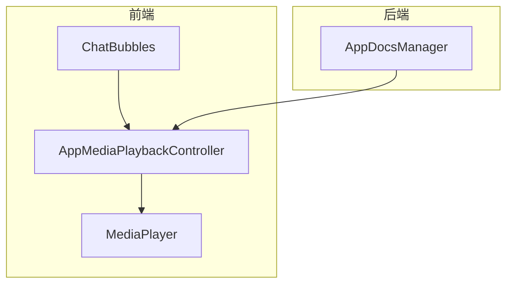
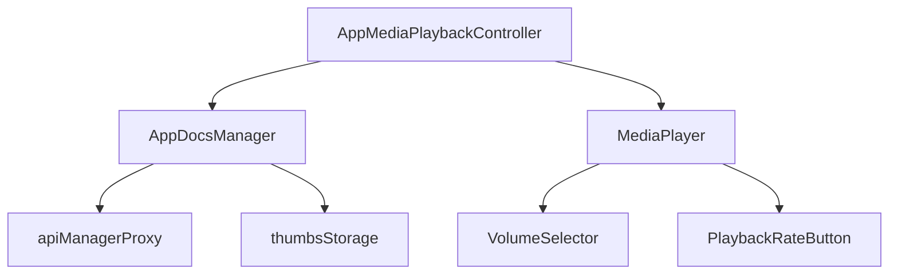

# 本地媒体播放

<cite>
**本文档引用的文件**
- [appDocsManager.ts](file://src/lib/appManagers/appDocsManager.ts)
- [bubbles.ts](file://src/components/chat/bubbles.ts)
- [appMediaPlaybackController.ts](file://src/components/appMediaPlaybackController.ts)
- [index.ts](file://src/lib/mediaPlayer/index.ts)
- [safePlay.ts](file://src/helpers/dom/safePlay.ts)
- [videoSupport.ts](file://src/environment/videoSupport.ts)
- [videoMimeTypesSupport.ts](file://src/environment/videoMimeTypesSupport.ts)
- [mediaMimeTypesSupport.ts](file://src/environment/mediaMimeTypesSupport.ts)
- [audio.ts](file://src/components/audio.ts)
- [chat/audio.ts](file://src/components/chat/audio.ts)
</cite>

## 目录
1. [简介](#简介)
2. [项目结构](#项目结构)
3. [核心组件](#核心组件)
4. [架构概述](#架构概述)
5. [详细组件分析](#详细组件分析)
6. [依赖分析](#依赖分析)
7. [性能考虑](#性能考虑)
8. [故障排除指南](#故障排除指南)
9. [结论](#结论)

## 简介
本文档详细介绍了本地媒体播放功能的实现，包括从 `appDocsManager.ts` 获取媒体元数据的流程，以及在 `chat/bubbles.ts` 中渲染播放器的实现。文档还描述了支持的媒体格式和浏览器兼容性处理，记录了播放控制功能如播放、暂停、seek和倍速播放的实现机制，说明了音量控制、全屏播放和画中画模式的集成方式，并包含媒体预加载策略和内存管理的最佳实践。

## 项目结构
项目结构清晰，主要分为以下几个部分：
- `src/components/chat/bubbles.ts`：负责聊天气泡的渲染，包括媒体播放器的集成。
- `src/lib/appManagers/appDocsManager.ts`：负责管理文档和媒体元数据的获取。
- `src/components/appMediaPlaybackController.ts`：负责媒体播放的控制，包括播放、暂停、seek等操作。
- `src/lib/mediaPlayer/index.ts`：提供媒体播放的核心功能，包括音量控制、全屏播放和画中画模式。

**Section sources**
- [bubbles.ts](file://src/components/chat/bubbles.ts#L1-L10306)
- [appDocsManager.ts](file://src/lib/appManagers/appDocsManager.ts#L1-L460)

## 核心组件
### 媒体元数据获取
`appDocsManager.ts` 文件中的 `AppDocsManager` 类负责从服务器获取媒体元数据。该类通过 `saveDoc` 方法保存文档信息，并根据文档类型（如音频、视频、图片等）进行分类和处理。`getDoc` 方法用于获取特定文档的元数据。

**Section sources**
- [appDocsManager.ts](file://src/lib/appManagers/appDocsManager.ts#L41-L459)

### 播放器渲染
`bubbles.ts` 文件中的 `ChatBubbles` 类负责在聊天界面中渲染媒体播放器。该类通过 `renderMessage` 方法将媒体消息渲染为气泡，并在气泡中嵌入播放器控件。播放器控件包括播放/暂停按钮、进度条、音量控制等。

**Section sources**
- [bubbles.ts](file://src/components/chat/bubbles.ts#L442-L10306)

## 架构概述
系统架构主要包括以下几个组件：
- **AppDocsManager**：负责管理文档和媒体元数据的获取。
- **AppMediaPlaybackController**：负责媒体播放的控制。
- **MediaPlayer**：提供媒体播放的核心功能。
- **ChatBubbles**：负责在聊天界面中渲染媒体播放器。

**Diagram sources**
- [appDocsManager.ts](file://src/lib/appManagers/appDocsManager.ts#L41-L459)
- [appMediaPlaybackController.ts](file://src/components/appMediaPlaybackController.ts#L66-L1036)
- [index.ts](file://src/lib/mediaPlayer/index.ts#L88-L706)
- [bubbles.ts](file://src/components/chat/bubbles.ts#L442-L10306)

## 详细组件分析
### 媒体元数据获取流程
`AppDocsManager` 类通过 `saveDoc` 方法保存文档信息。该方法首先检查文档是否为空，然后根据文档的 `file_reference` 属性保存上下文信息。接着，根据文档的属性（如 `documentAttributeFilename`、`documentAttributeAudio` 等）提取文件名、持续时间、类型等信息。最后，根据文档类型设置 `supportsStreaming` 属性，以支持流媒体播放。

**Section sources**
- [appDocsManager.ts](file://src/lib/appManagers/appDocsManager.ts#L84-L297)

### 播放器渲染实现
`ChatBubbles` 类通过 `renderMessage` 方法将媒体消息渲染为气泡。该方法首先检查消息类型，如果是媒体消息，则调用 `wrapMedia` 方法生成媒体播放器控件。`wrapMedia` 方法根据媒体类型（如音频、视频）生成相应的播放器控件，并将其嵌入到气泡中。

**Section sources**
- [bubbles.ts](file://src/components/chat/bubbles.ts#L442-L10306)

### 播放控制功能
`AppMediaPlaybackController` 类提供了播放控制功能，包括播放、暂停、seek和倍速播放。`play` 方法用于播放媒体，`pause` 方法用于暂停播放，`seek` 方法用于跳转到指定时间点，`setPlaybackRate` 方法用于设置播放速度。

**Section sources**
- [appMediaPlaybackController.ts](file://src/components/appMediaPlaybackController.ts#L584-L1036)

### 音量控制、全屏播放和画中画模式
`MediaPlayer` 类提供了音量控制、全屏播放和画中画模式的功能。`setVolume` 方法用于设置音量，`toggleFullScreen` 方法用于切换全屏模式，`requestPictureInPicture` 方法用于请求画中画模式。

**Section sources**
- [index.ts](file://src/lib/mediaPlayer/index.ts#L88-L706)

## 依赖分析
系统依赖于以下几个关键组件：
- **AppDocsManager**：依赖于 `apiManagerProxy` 和 `thumbsStorage` 来获取和缓存文档信息。
- **AppMediaPlaybackController**：依赖于 `AppDocsManager` 和 `MediaPlayer` 来控制媒体播放。
- **MediaPlayer**：依赖于 `VolumeSelector` 和 `PlaybackRateButton` 来提供音量和播放速度控制。

**Diagram sources**
- [appDocsManager.ts](file://src/lib/appManagers/appDocsManager.ts#L41-L459)
- [appMediaPlaybackController.ts](file://src/components/appMediaPlaybackController.ts#L66-L1036)
- [index.ts](file://src/lib/mediaPlayer/index.ts#L88-L706)

## 性能考虑
为了提高性能，系统采用了以下策略：
- **媒体预加载**：通过 `preloadVideo` 函数预加载视频，减少播放延迟。
- **内存管理**：通过 `cleanup` 方法清理不再使用的资源，避免内存泄漏。
- **懒加载**：通过 `LazyLoadQueue` 类实现媒体的懒加载，减少初始加载时间。

**Section sources**
- [preloadVideo.ts](file://src/helpers/preloadVideo.ts#L1-L19)
- [appMediaPlaybackController.ts](file://src/components/appMediaPlaybackController.ts#L666-L678)
- [lazyLoadQueue.ts](file://src/components/lazyLoadQueue.ts#L1-L100)

## 故障排除指南
### 媒体无法播放
- 检查网络连接是否正常。
- 检查媒体文件是否损坏。
- 检查浏览器是否支持该媒体格式。

### 音量控制失效
- 检查 `VolumeSelector` 是否正确初始化。
- 检查 `appMediaPlaybackController.volume` 是否正确设置。

### 全屏播放失败
- 检查浏览器是否支持全屏模式。
- 检查是否有其他全屏应用正在运行。

**Section sources**
- [volumeSelector.ts](file://src/components/volumeSelector.ts#L79-L129)
- [appMediaPlaybackController.ts](file://src/components/appMediaPlaybackController.ts#L584-L1036)

## 结论
本文档详细介绍了本地媒体播放功能的实现，涵盖了从媒体元数据获取到播放器渲染的全过程。通过合理的架构设计和性能优化，系统能够高效地处理各种媒体格式，并提供流畅的用户体验。希望本文档能帮助开发者更好地理解和维护这一功能。