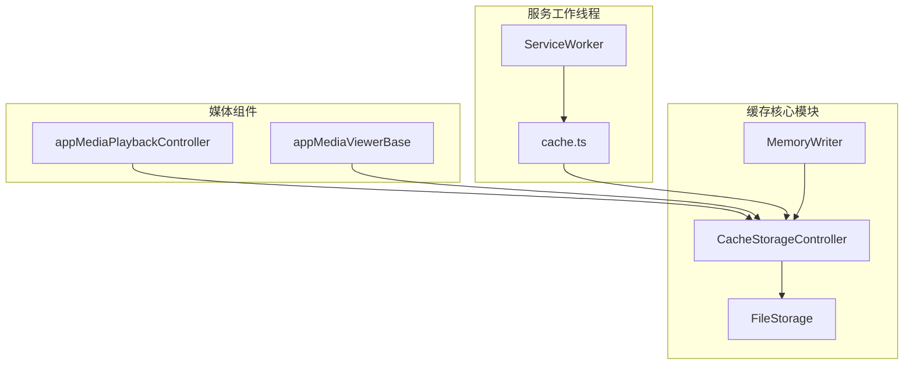
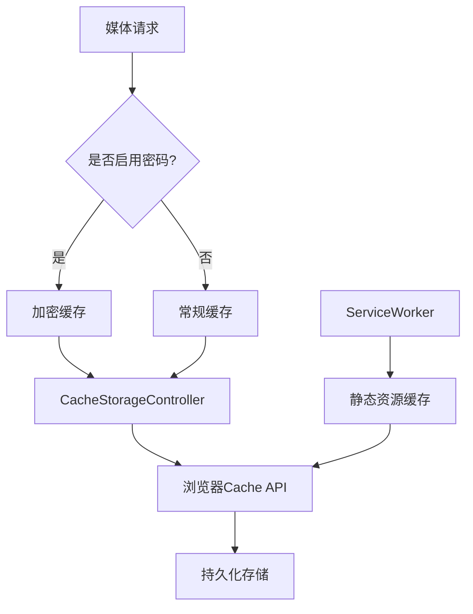
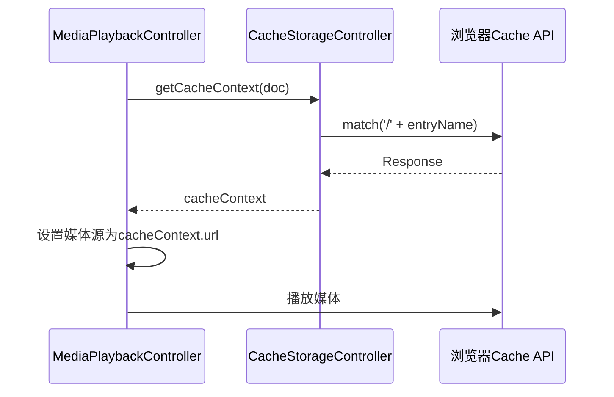
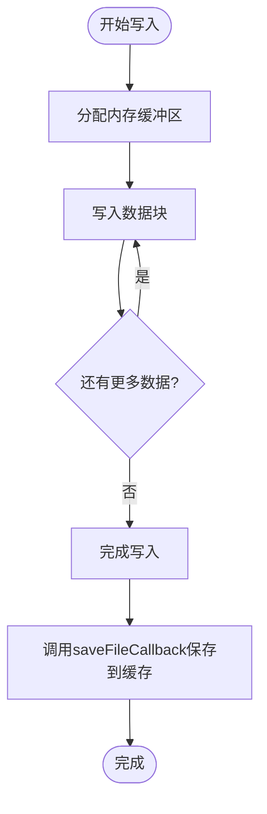
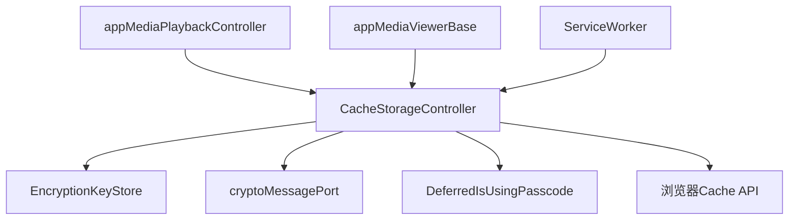

# 媒体缓存API

<cite>
**本文档引用的文件**  
- [cacheStorage.ts](file://src/lib/files/cacheStorage.ts)
- [cache.ts](file://src/lib/serviceWorker/cache.ts)
- [appMediaPlaybackController.ts](file://src/components/appMediaPlaybackController.ts)
- [appMediaViewerBase.ts](file://src/components/appMediaViewerBase.ts)
- [fileStorage.ts](file://src/lib/files/fileStorage.ts)
- [memoryWriter.ts](file://src/lib/files/memoryWriter.ts)
- [cacheFunctionPolyfill.ts](file://src/helpers/cacheFunctionPolyfill.ts)
- [cacheType.ts](file://src/lib/appManagers/utils/stories/cacheType.ts)
</cite>

## 目录
1. [简介](#简介)
2. [项目结构](#项目结构)
3. [核心组件](#核心组件)
4. [架构概述](#架构概述)
5. [详细组件分析](#详细组件分析)
6. [依赖分析](#依赖分析)
7. [性能考虑](#性能考虑)
8. [故障排除指南](#故障排除指南)
9. [结论](#结论)

## 简介
本文档详细描述了媒体缓存API的实现机制，包括媒体文件和缩略图的本地缓存策略、缓存存储结构与索引机制、缓存清理与空间管理策略、缓存命中率优化与预加载机制、缓存有效性验证与更新策略，以及离线访问支持和缓存同步模式的实现细节。

## 项目结构
项目中的媒体缓存功能主要分布在`src/lib/files`和`src/components`目录下。核心缓存逻辑由`CacheStorageController`类实现，该类基于浏览器的Cache API进行封装，并支持加密存储。媒体播放和查看组件通过调用缓存接口获取媒体资源。



**图示来源**  
- [cacheStorage.ts](file://src/lib/files/cacheStorage.ts#L48-L322)
- [fileStorage.ts](file://src/lib/files/fileStorage.ts#L10-L13)
- [memoryWriter.ts](file://src/lib/files/memoryWriter.ts#L10-L58)
- [cache.ts](file://src/lib/serviceWorker/cache.ts#L10-L50)

**本节来源**  
- [cacheStorage.ts](file://src/lib/files/cacheStorage.ts)
- [fileStorage.ts](file://src/lib/files/fileStorage.ts)

## 核心组件
媒体缓存系统的核心是`CacheStorageController`类，它实现了`FileStorage`接口，提供统一的文件读写操作。该类支持多种缓存数据库，包括`cachedAssets`、`cachedBackgrounds`、`cachedFiles`等，并根据配置决定是否对数据进行加密存储。

缓存系统通过`MemoryWriter`类实现内存中的数据写入，支持分块写入和最终持久化到缓存存储。`ServiceWorker`中的缓存机制则负责静态资源的离线访问支持。

**本节来源**  
- [cacheStorage.ts](file://src/lib/files/cacheStorage.ts#L48-L322)
- [memoryWriter.ts](file://src/lib/files/memoryWriter.ts#L10-L58)
- [cache.ts](file://src/lib/serviceWorker/cache.ts#L10-L50)

## 架构概述
媒体缓存系统采用分层架构设计，底层基于浏览器的Cache API，中间层通过`CacheStorageController`提供统一的缓存操作接口，上层由媒体播放和查看组件调用缓存接口获取资源。

系统支持两种缓存模式：常规缓存和加密缓存。对于启用了密码保护的用户，敏感媒体文件会被加密存储。缓存键使用文件路径作为标识，确保资源的唯一性。



**图示来源**  
- [cacheStorage.ts](file://src/lib/files/cacheStorage.ts#L149-L177)
- [cache.ts](file://src/lib/serviceWorker/cache.ts#L23-L48)

## 详细组件分析

### 缓存存储控制器分析
`CacheStorageController`是整个缓存系统的核心，负责管理不同类型的缓存数据库。每个缓存类型都有独立的配置，决定是否支持加密。

```mermaid
classDiagram
class CacheStorageController {
+dbName : CacheStorageDbName
+isEncryptable : boolean
-config : CacheStorageDbConfigEntry
-openDbPromise : Promise~Cache~
+get(entryName : string) : Promise~Response~
+save(entryName : string, response : Response) : Promise~void~
+delete(entryName : string) : Promise~boolean~
+deleteAll() : Promise~boolean~
+getFile(fileName : string, method : 'blob'|'json'|'text') : Promise~any~
+saveFile(fileName : string, blob : Blob|Uint8Array) : Promise~Blob~
+prepareWriting(fileName : string, fileSize : number, mimeType : string) : {deferred, getWriter}
}
class FileStorage {
<<abstract>>
+getFile(fileName : string) : Promise~any~
+prepareWriting(...args : any[]) : {deferred : CancellablePromise~any~, getWriter : () => StreamWriter}
}
CacheStorageController --|> FileStorage
```

**图示来源**  
- [cacheStorage.ts](file://src/lib/files/cacheStorage.ts#L48-L322)
- [fileStorage.ts](file://src/lib/files/fileStorage.ts#L10-L13)

### 媒体播放缓存分析
媒体播放组件通过`appMediaPlaybackController`与缓存系统交互，实现媒体文件的高效加载和播放。



**图示来源**  
- [appMediaPlaybackController.ts](file://src/components/appMediaPlaybackController.ts#L330-L360)
- [cacheStorage.ts](file://src/lib/files/cacheStorage.ts#L138-L161)

### 内存写入器分析
`MemoryWriter`类负责在内存中累积数据块，最终将完整文件保存到缓存存储中。



**图示来源**  
- [memoryWriter.ts](file://src/lib/files/memoryWriter.ts#L21-L48)

**本节来源**  
- [cacheStorage.ts](file://src/lib/files/cacheStorage.ts#L48-L322)
- [appMediaPlaybackController.ts](file://src/components/appMediaPlaybackController.ts#L330-L360)
- [memoryWriter.ts](file://src/lib/files/memoryWriter.ts#L10-L58)

## 依赖分析
媒体缓存系统依赖于多个核心模块，包括加密服务、服务工作线程、媒体播放控制器等。这些模块通过清晰的接口进行交互，确保系统的可维护性和可扩展性。



**图示来源**  
- [cacheStorage.ts](file://src/lib/files/cacheStorage.ts#L13-L15)
- [appMediaPlaybackController.ts](file://src/components/appMediaPlaybackController.ts#L359-L360)
- [appMediaViewerBase.ts](file://src/components/appMediaViewerBase.ts#L1762)

**本节来源**  
- [cacheStorage.ts](file://src/lib/files/cacheStorage.ts#L13-L15)
- [appMediaPlaybackController.ts](file://src/components/appMediaPlaybackController.ts)
- [appMediaViewerBase.ts](file://src/components/appMediaViewerBase.ts)

## 性能考虑
缓存系统通过多种机制优化性能：
- 使用`timeoutOperation`方法防止缓存操作无限期挂起
- 对加密操作进行异步处理，避免阻塞主线程
- 通过`MemoryWriter`实现流式写入，减少内存占用
- 在ServiceWorker中实现静态资源缓存，提升页面加载速度

缓存命中率通过预加载机制得到优化，系统会预测用户可能访问的媒体资源并提前缓存。

## 故障排除指南
当遇到缓存相关问题时，可以检查以下方面：
- 确认浏览器是否支持Cache API
- 检查存储空间是否充足
- 验证密码保护设置是否影响缓存操作
- 查看ServiceWorker是否正常注册和运行

系统提供了`deleteAllStorages`和`clearEncryptableStorages`等方法用于清理缓存，在出现问题时可以尝试重置缓存状态。

**本节来源**  
- [cacheStorage.ts](file://src/lib/files/cacheStorage.ts#L271-L319)
- [cache.ts](file://src/lib/serviceWorker/cache.ts#L46-L48)

## 结论
媒体缓存API通过分层架构设计，实现了高效、安全的媒体文件本地存储。系统支持加密存储、流式写入、预加载等多种高级特性，为用户提供流畅的媒体体验。通过ServiceWorker的配合，系统还实现了静态资源的离线访问支持，提升了应用的整体性能和可用性。