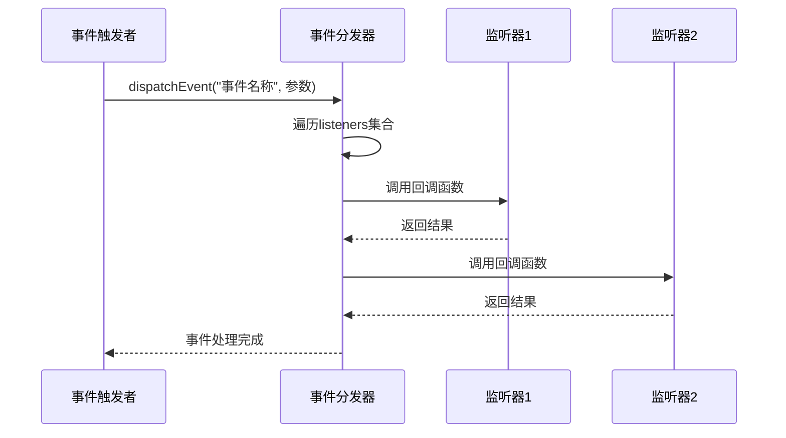
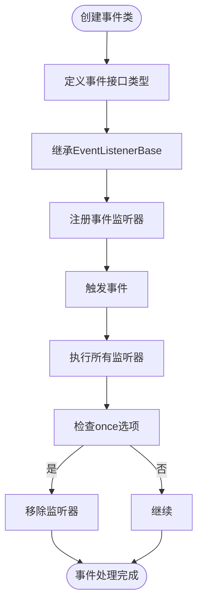

# 事件管理

<cite>
**本文档中引用的文件**   
- [eventListenerBase.ts](file://src\helpers\eventListenerBase.ts)
- [listenerSetter.ts](file://src\helpers\listenerSetter.ts)
- [superMessagePort.ts](file://src\lib\mtproto\superMessagePort.ts)
</cite>

## 目录
1. [简介](#简介)
2. [事件生命周期管理](#事件生命周期管理)
3. [事件类型分类与过滤](#事件类型分类与过滤)
4. [事件分发机制](#事件分发机制)
5. [事件优先级与队列管理](#事件优先级与队列管理)
6. [自定义事件实现](#自定义事件实现)
7. [最佳实践与陷阱规避](#最佳实践与陷阱规避)

## 简介
本系统基于 `EventListenerBase` 类实现了一套完整的事件管理系统，为应用程序提供了注册、触发和销毁事件的完整生命周期管理。该系统支持同步和异步事件处理模式，通过类型安全的事件监听器机制确保事件处理的可靠性。事件系统被广泛应用于组件间通信、状态变更通知和跨模块交互等场景，构成了整个应用架构的核心通信机制。

**Section sources**
- [eventListenerBase.ts](file://src\helpers\eventListenerBase.ts#L1-L50)

## 事件生命周期管理
事件管理系统通过 `EventListenerBase` 类实现完整的事件生命周期控制。事件的生命周期始于注册，通过 `addEventListener` 方法将监听器注册到特定事件名称上。当事件被触发时，系统会调用所有注册的监听器，并在处理完成后维持监听器的活跃状态，直到显式调用 `removeEventListener` 方法将其销毁。

事件注册时支持多种选项，包括 `once` 选项，该选项确保监听器在首次触发后自动销毁。`cleanup` 方法提供了批量销毁所有监听器的能力，用于组件卸载或状态重置场景。事件的触发通过 `dispatchEvent` 和 `dispatchResultableEvent` 方法实现，前者用于普通的事件广播，后者则收集所有监听器的返回结果，适用于需要响应式处理的场景。

**Section sources**
- [eventListenerBase.ts](file://src\helpers\eventListenerBase.ts#L85-L193)

## 事件类型分类与过滤
系统通过泛型约束 `EventListenerListeners` 实现了类型安全的事件分类机制。事件监听器被定义为字符串键和函数值的记录类型，确保了事件名称和处理函数之间的类型关联。这种设计允许开发者在编译时就能发现事件类型错误，提高了代码的可靠性和可维护性。

事件过滤策略主要通过监听器的注册和注销机制实现。通过 `addEventListener` 和 `removeEventListener` 方法，可以精确控制哪些组件接收特定类型的事件。此外，系统支持事件选项参数，允许为不同监听器设置不同的行为特征，如一次性执行、捕获阶段执行等，从而实现细粒度的事件过滤控制。

```mermaid
classDiagram
class EventListenerBase {
+listeners : Partial<{[k in keyof Listeners] : Set<ListenerObject<Listeners[k]>>}>
+listenerResults : Partial<{[k in keyof Listeners] : ArgumentTypes<Listeners[k]>}>
-reuseResults : boolean
+addEventListener(name, callback, options)
+addMultipleEventsListeners(obj)
+removeEventListener(name, callback, options)
+dispatchResultableEvent(name, ...args)
+dispatchEvent(name, ...args)
+cleanup()
}
class ListenerObject {
+callback : T
+options : boolean | AddEventListenerOptions
}
EventListenerBase --> ListenerObject : "包含"
```

**Diagram sources **
- [eventListenerBase.ts](file://src\helpers\eventListenerBase.ts#L65-L193)

## 事件分发机制
事件分发机制的核心实现位于 `EventListenerBase` 类的 `_dispatchEvent` 方法中。该方法支持同步和异步两种处理模式，通过 `collectResults` 参数控制是否收集监听器的返回结果。在分发过程中，系统会遍历所有注册的监听器，依次调用其处理函数，并处理可能发生的异常情况。

对于需要异步处理的场景，系统通过 Promise 机制实现了非阻塞的事件分发。当监听器返回 Promise 时，事件分发器会等待 Promise 解析完成后再继续处理后续监听器，确保了异步操作的有序执行。`invokeListenerCallback` 方法封装了监听器调用的通用逻辑，包括异常处理、一次性监听器的自动清理等功能，保证了事件处理的健壮性。



**Diagram sources **
- [eventListenerBase.ts](file://src\helpers\eventListenerBase.ts#L149-L174)

## 事件优先级与队列管理
虽然基础事件系统本身不直接提供优先级管理功能，但通过与其他模块的集成实现了高级的事件调度能力。`SuperMessagePort` 类继承了 `EventListenerBase` 并扩展了任务队列管理功能，通过 `insertInDescendSortedArray` 方法实现了基于优先级的任务排序。每个任务可以指定优先级数值，系统会按照优先级从高到低的顺序处理事件。

队列管理还支持批量处理模式，通过 `USE_BATCHING` 配置项控制是否启用批量任务处理。当启用时，多个小任务可以被合并为一个批量任务，减少系统调用开销，提高处理效率。`downloadCheck` 方法展示了队列处理的典型模式：检查活动限制、获取待处理任务、更新状态并递归处理剩余任务。

**Section sources**
- [apiFileManager.ts](file://src\lib\mtproto\apiFileManager.ts#L216-L254)
- [superMessagePort.ts](file://src\lib\mtproto\superMessagePort.ts#L104-L163)

## 自定义事件实现
创建自定义事件需要继承 `EventListenerBase` 类并定义具体的事件类型接口。通过泛型参数指定事件名称和对应处理函数的类型签名，实现类型安全的事件系统。例如，可以定义一个包含 "update"、"error" 等事件的接口，然后创建继承 `EventListenerBase` 的具体类。

发布自定义事件时，使用 `dispatchEvent` 方法触发特定名称的事件，并传递相应的参数。事件处理函数会接收到这些参数，并根据业务逻辑进行处理。系统支持为同一事件注册多个监听器，所有监听器都会按照注册顺序被调用，实现了发布-订阅模式的完整功能。



**Diagram sources **
- [eventListenerBase.ts](file://src\helpers\eventListenerBase.ts#L85-L113)

## 最佳实践与陷阱规避
在使用事件管理系统时，应遵循以下最佳实践：首先，避免在监听器回调函数中同步移除自身，这可能导致迭代器失效问题；其次，确保所有注册的监听器在组件销毁时都被正确清理，防止内存泄漏；最后，合理使用 `reuseResults` 选项，对于频繁触发的事件，重用结果可以提高性能。

常见陷阱包括：忘记移除监听器导致的内存泄漏、在事件处理中引发无限循环、以及在异步操作中丢失上下文。为规避这些陷阱，建议使用 `ListenerSetter` 工具类来集中管理监听器，它提供了 `removeAll` 方法可以一次性清理所有监听器。此外，对于一次性事件，应使用 `once` 选项而不是手动移除，确保清理逻辑的可靠性。

**Section sources**
- [eventListenerBase.ts](file://src\helpers\eventListenerBase.ts#L56-L59)
- [listenerSetter.ts](file://src\helpers\listenerSetter.ts#L34-L109)