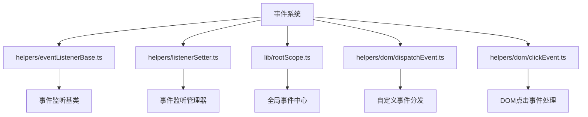
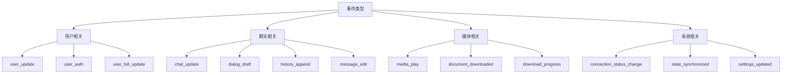
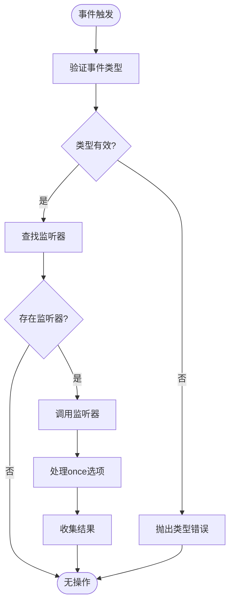
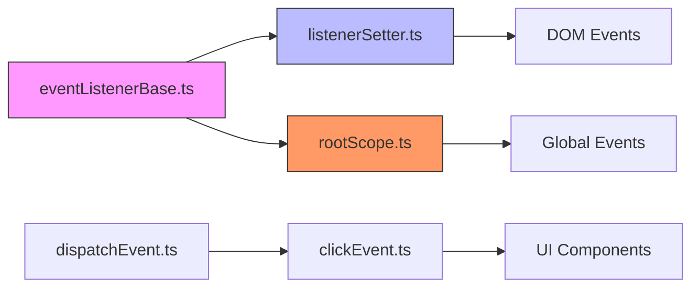

# 事件订阅

<cite>
**本文档中引用的文件**  
- [eventListenerBase.ts](file://src/helpers/eventListenerBase.ts)
- [listenerSetter.ts](file://src/helpers/listenerSetter.ts)
- [rootScope.ts](file://src/lib/rootScope.ts)
- [dispatchEvent.ts](file://src/helpers/dom/dispatchEvent.ts)
- [clickEvent.ts](file://src/helpers/dom/clickEvent.ts)
</cite>

## 目录
1. [简介](#简介)
2. [项目结构](#项目结构)
3. [核心组件](#核心组件)
4. [架构概述](#架构概述)
5. [详细组件分析](#详细组件分析)
6. [依赖分析](#依赖分析)
7. [性能考虑](#性能考虑)
8. [故障排除指南](#故障排除指南)
9. [结论](#结论)

## 简介
本文档详细描述了基于发布-订阅模式的事件系统架构，该系统用于在应用程序的不同组件之间进行通信。事件系统允许组件在不直接耦合的情况下相互通信，通过事件的发布和订阅实现松散耦合的架构。系统支持自定义事件、事件过滤、事件监听器的注册与销毁，以及事件冒泡和捕获机制。

## 项目结构
事件订阅系统主要由以下几个核心文件构成，分布在不同的目录中：



**Diagram sources**  
- [eventListenerBase.ts](file://src/helpers/eventListenerBase.ts)
- [listenerSetter.ts](file://src/helpers/listenerSetter.ts)
- [rootScope.ts](file://src/lib/rootScope.ts)

**Section sources**
- [eventListenerBase.ts](file://src/helpers/eventListenerBase.ts)
- [listenerSetter.ts](file://src/helpers/listenerSetter.ts)
- [rootScope.ts](file://src/lib/rootScope.ts)

## 核心组件
事件订阅系统的核心组件包括事件监听基类 `EventListenerBase`、事件监听管理器 `ListenerSetter` 和全局事件中心 `rootScope`。这些组件共同构成了一个完整的事件发布-订阅系统，支持同步和异步事件处理、事件结果收集以及事件监听器的生命周期管理。

**Section sources**
- [eventListenerBase.ts](file://src/helpers/eventListenerBase.ts#L52-L194)
- [listenerSetter.ts](file://src/helpers/listenerSetter.ts#L34-L109)
- [rootScope.ts](file://src/lib/rootScope.ts#L250-L314)

## 架构概述
事件系统采用发布-订阅模式，核心是 `EventListenerBase` 类，它提供了事件监听、触发和清理的基本功能。`ListenerSetter` 类用于管理 DOM 事件监听器的生命周期，确保事件监听器能够正确地添加和移除。`rootScope` 是一个全局事件中心，继承自 `EventListenerBase`，用于在整个应用程序中广播各种状态变化事件。

```mermaid
classDiagram
class EventListenerBase {
+listeners : Partial<Set<ListenerObject>>
+listenerResults : Partial<ArgumentTypes>
-reuseResults : boolean
+addEventListener(name, callback, options)
+addMultipleEventsListeners(obj)
+removeEventListener(name, callback, options)
+dispatchEvent(name, ...args)
+dispatchResultableEvent(name, ...args)
+cleanup()
}
class ListenerSetter {
-listeners : Set<Listener>
+add(element)
+addManual(listener)
+remove(listener)
+removeAll()
}
class RootScope {
+myId : PeerId
+settings : StateSettings
+managers : AppManagers
+premium : boolean
+getConnectionStatus()
+getPremium()
+getMyId()
+dispatchEventSingle(name, ...args)
}
EventListenerBase <|-- RootScope
ListenerSetter --> "DOM Events" : manages
RootScope --> "Global Events" : broadcasts
```

**Diagram sources**  
- [eventListenerBase.ts](file://src/helpers/eventListenerBase.ts#L65-L194)
- [listenerSetter.ts](file://src/helpers/listenerSetter.ts#L34-L109)
- [rootScope.ts](file://src/lib/rootScope.ts#L250-L314)

## 详细组件分析

### 事件监听基类分析
`EventListenerBase` 是事件系统的核心基类，提供了事件监听和触发的完整功能。它使用 `WeakMap` 来存储事件监听器，确保不会造成内存泄漏。

#### 类图
```mermaid
classDiagram
class EventListenerBase {
+addEventListener(name, callback, options)
+removeEventListener(name, callback, options)
+dispatchEvent(name, ...args)
+dispatchResultableEvent(name, ...args)
+cleanup()
}
class ListenerObject {
+callback : Function
+options : boolean | AddEventListenerOptions
}
EventListenerBase --> "Set<ListenerObject>" : contains
ListenerObject --> "Function" : references
```

**Diagram sources**  
- [eventListenerBase.ts](file://src/helpers/eventListenerBase.ts#L65-L194)

**Section sources**
- [eventListenerBase.ts](file://src/helpers/eventListenerBase.ts#L65-L194)

### 全局事件中心分析
`rootScope` 是一个全局事件中心，继承自 `EventListenerBase`，用于在整个应用程序中广播各种状态变化事件。它定义了超过 200 种不同的事件类型，涵盖了用户、聊天、媒体播放、连接状态等各种应用场景。

#### 事件类型分类


**Diagram sources**  
- [rootScope.ts](file://src/lib/rootScope.ts#L35-L244)

**Section sources**
- [rootScope.ts](file://src/lib/rootScope.ts#L35-L244)

### 事件过滤机制
事件系统通过 TypeScript 的泛型和类型约束实现了事件过滤机制。`BroadcastEvents` 接口定义了所有可能的事件类型及其对应的参数类型，确保事件监听器只能监听已定义的事件类型，并且参数类型正确。



**Diagram sources**  
- [rootScope.ts](file://src/lib/rootScope.ts#L35-L244)
- [eventListenerBase.ts](file://src/helpers/eventListenerBase.ts#L149-L175)

**Section sources**
- [rootScope.ts](file://src/lib/rootScope.ts#L35-L244)
- [eventListenerBase.ts](file://src/helpers/eventListenerBase.ts#L149-L175)

## 依赖分析
事件系统各组件之间的依赖关系如下：



**Diagram sources**  
- [eventListenerBase.ts](file://src/helpers/eventListenerBase.ts)
- [listenerSetter.ts](file://src/helpers/listenerSetter.ts)
- [rootScope.ts](file://src/lib/rootScope.ts)

**Section sources**
- [eventListenerBase.ts](file://src/helpers/eventListenerBase.ts)
- [listenerSetter.ts](file://src/helpers/listenerSetter.ts)
- [rootScope.ts](file://src/lib/rootScope.ts)

## 性能考虑
事件系统在设计时考虑了性能优化，主要体现在以下几个方面：
- 使用 `Set` 数据结构存储监听器，确保添加和删除操作的时间复杂度为 O(1)
- 通过 `reuseResults` 参数控制是否重用事件参数，减少内存分配
- 在事件触发时使用 `try-catch` 块捕获监听器执行中的错误，防止一个监听器的错误影响其他监听器
- 提供 `cleanup` 方法用于清理所有事件监听器，防止内存泄漏

## 故障排除指南
### 常见问题
1. **事件监听器未触发**：检查事件名称是否正确，确保事件名称与 `BroadcastEvents` 接口中定义的一致
2. **内存泄漏**：确保在组件销毁时调用 `cleanup` 方法或 `removeAll` 方法清理事件监听器
3. **事件参数类型错误**：检查事件监听器的参数类型是否与 `BroadcastEvents` 接口中定义的类型匹配

**Section sources**
- [eventListenerBase.ts](file://src/helpers/eventListenerBase.ts#L190-L193)
- [listenerSetter.ts](file://src/helpers/listenerSetter.ts#L104-L108)

## 结论
本文档详细描述了基于发布-订阅模式的事件系统架构。该系统通过 `EventListenerBase` 类提供了事件监听和触发的基本功能，通过 `ListenerSetter` 类管理 DOM 事件监听器的生命周期，通过 `rootScope` 实现全局事件广播。系统支持类型安全的事件过滤、事件结果收集和高效的事件处理，是应用程序中组件间通信的核心基础设施。