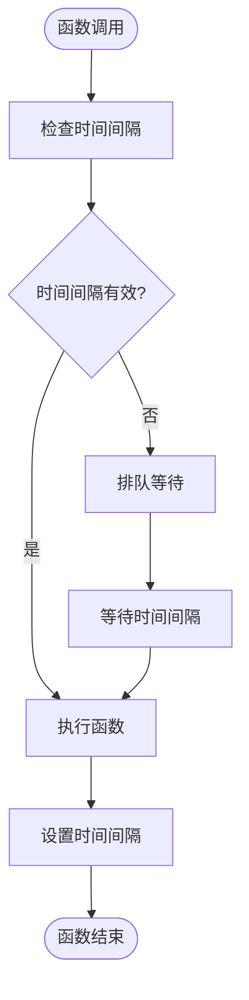
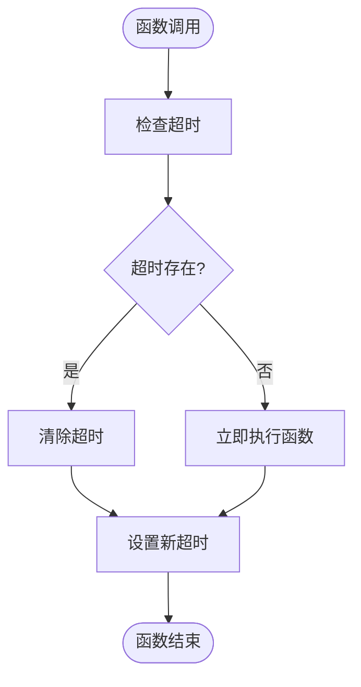
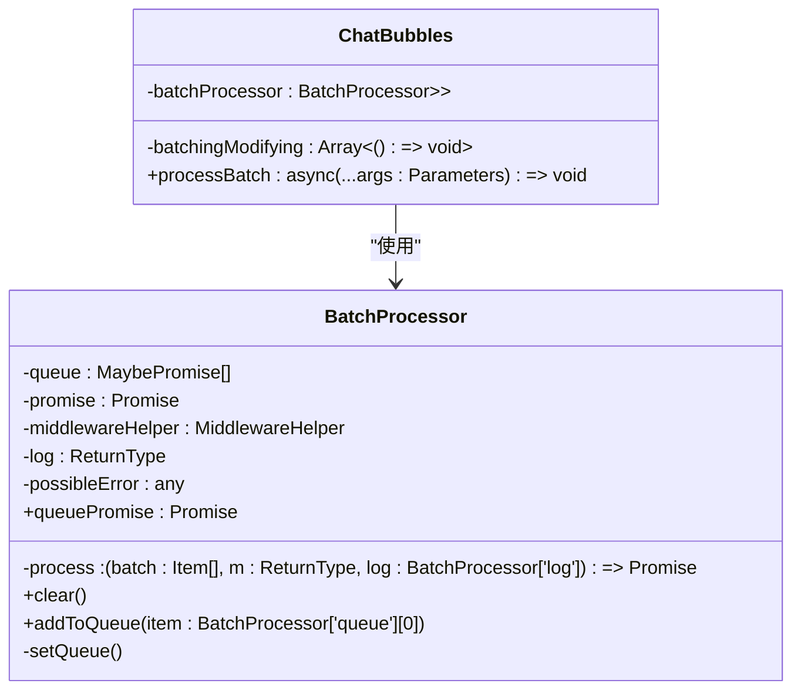
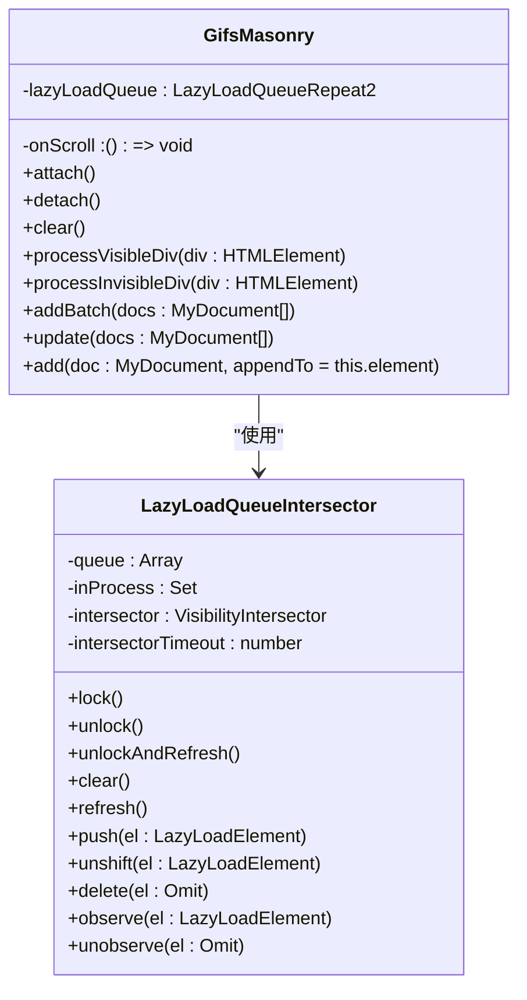
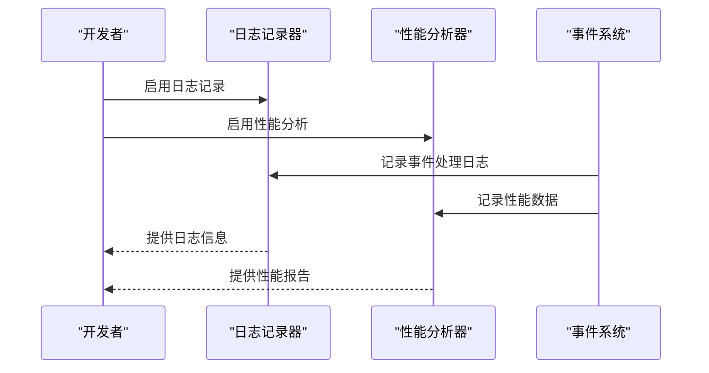
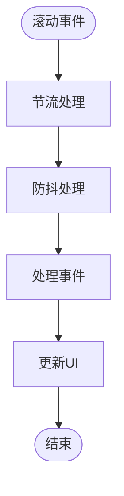

# 性能优化

<cite>
**本文档引用的文件**
- [eventListenerBase.ts](file://src/helpers/eventListenerBase.ts)
- [listenerSetter.ts](file://src/helpers/listenerSetter.ts)
- [schedulers.ts](file://src/helpers/schedulers.ts)
- [debounce.ts](file://src/helpers/schedulers/debounce.ts)
- [throttle.ts](file://src/helpers/schedulers/throttle.ts)
- [throttleWithRaf.ts](file://src/helpers/schedulers/throttleWithRaf.ts)
- [sortedList.ts](file://src/helpers/sortedList.ts)
- [lazyLoadQueueIntersector.ts](file://src/components/lazyLoadQueueIntersector.ts)
- [gifsMasonry.ts](file://src/components/gifsMasonry.ts)
- [appMediaViewerBase.ts](file://src/components/appMediaViewerBase.ts)
- [chat/bubbles.ts](file://src/components/chat/bubbles.ts)
- [appMessagesManager.ts](file://src/lib/appManagers/appMessagesManager.ts)
</cite>

## 目录
1. [引言](#引言)
2. [事件系统架构](#事件系统架构)
3. [性能瓶颈分析](#性能瓶颈分析)
4. [事件节流与防抖机制](#事件节流与防抖机制)
5. [批处理机制实现](#批处理机制实现)
6. [事件监听器的懒加载与按需激活](#事件监听器的懒加载与按需激活)
7. [内存使用监控与性能分析工具](#内存使用监控与性能分析工具)
8. [高频事件处理优化示例](#高频事件处理优化示例)
9. [大规模事件系统响应性能保持](#大规模事件系统响应性能保持)
10. [结论](#结论)

## 引言
本文档详细描述了事件系统的性能优化策略，重点分析了事件节流、防抖和批处理机制的实现。文档记录了事件监听器的懒加载和按需激活技术，并提供了事件系统内存使用监控和性能分析工具的使用方法。通过代码示例展示了如何优化高频事件的处理，以及如何在大规模事件系统中保持良好的响应性能。

## 事件系统架构
事件系统基于`EventListenerBase`类构建，该类提供了事件监听器的注册、移除和分发功能。系统使用`WeakMap`来存储事件监听器，确保对象的垃圾回收不会受到事件监听器的影响。

```mermaid
classDiagram
class EventListenerBase {
+listeners : Partial<{[k in keyof Listeners] : Set<ListenerObject<Listeners[k]>>}>
+listenerResults : Partial<{[k in keyof Listeners] : ArgumentTypes<Listeners[k]>}>
-reuseResults : boolean
+addEventListener(name : T, callback : Listeners[T], options? : boolean | AddEventListenerOptions)
+addMultipleEventsListeners(obj : {[name in keyof Listeners]? : Listeners[name]})
+removeEventListener(name : T, callback : Listeners[T], options? : boolean | AddEventListenerOptions)
+dispatchResultableEvent(name : T, ...args : ArgumentTypes<Listeners[T]>)
+dispatchEvent(name : T, ...args : ArgumentTypes<L[T]>)
+cleanup()
}
class ListenerSetter {
-listeners : Set<Listener>
+add(element : T) : T['addEventListener']
+addManual(listener : Listener)
+remove(listener : Listener)
+removeAll()
}
EventListenerBase <|-- ListenerSetter : "继承"
```

**图示来源**
- [eventListenerBase.ts](file://src/helpers/eventListenerBase.ts#L65-L194)
- [listenerSetter.ts](file://src/helpers/listenerSetter.ts#L34-L109)

## 性能瓶颈分析
事件系统的主要性能瓶颈包括：
1. 高频事件的频繁触发导致的性能下降
2. 事件监听器的重复注册和移除
3. 大量事件监听器导致的内存占用过高
4. 事件处理函数的执行时间过长

通过分析`EventListenerBase`类的实现，可以发现事件监听器的存储和查找操作的时间复杂度为O(1)，但事件分发操作的时间复杂度为O(n)，其中n为事件监听器的数量。因此，减少事件监听器的数量和优化事件处理函数的执行时间是性能优化的关键。

**本节来源**
- [eventListenerBase.ts](file://src/helpers/eventListenerBase.ts#L65-L194)

## 事件节流与防抖机制
事件节流和防抖是两种常用的性能优化技术，用于减少高频事件的触发次数。

### 节流机制
节流机制通过设置一个时间间隔，确保事件处理函数在指定的时间间隔内最多执行一次。在本项目中，`throttle`函数的实现如下：



**图示来源**
- [throttle.ts](file://src/helpers/schedulers/throttle.ts#L5-L46)

### 防抖机制
防抖机制通过设置一个延迟时间，确保事件处理函数在指定的延迟时间内没有再次被触发时才执行。在本项目中，`debounce`函数的实现如下：



**图示来源**
- [debounce.ts](file://src/helpers/schedulers/debounce.ts#L13-L78)

## 批处理机制实现
批处理机制通过将多个事件处理任务合并为一个批次来执行，从而减少事件处理的开销。在本项目中，`BatchProcessor`类的实现如下：



**图示来源**
- [sortedList.ts](file://src/helpers/sortedList.ts#L21-L87)
- [chat/bubbles.ts](file://src/components/chat/bubbles.ts#L553-L568)

## 事件监听器的懒加载与按需激活
事件监听器的懒加载和按需激活技术通过延迟事件监听器的注册和激活，减少不必要的事件处理开销。在本项目中，`LazyLoadQueueIntersector`类的实现如下：



**图示来源**
- [lazyLoadQueueIntersector.ts](file://src/components/lazyLoadQueueIntersector.ts#L18-L100)
- [gifsMasonry.ts](file://src/components/gifsMasonry.ts#L38-L180)

## 内存使用监控与性能分析工具
事件系统的内存使用监控和性能分析工具通过记录事件处理的性能数据，帮助开发者识别和解决性能瓶颈。在本项目中，`logger`和`performance`API的使用如下：



**图示来源**
- [sortedList.ts](file://src/helpers/sortedList.ts#L7-L87)
- [appMessagesManager.ts](file://src/lib/appManagers/appMessagesManager.ts#L10091-L10132)

## 高频事件处理优化示例
以下是一个高频事件处理优化的示例，展示了如何使用节流和防抖机制来优化滚动事件的处理：



**本节来源**
- [appMediaViewerBase.ts](file://src/components/appMediaViewerBase.ts#L180-L411)
- [chat/bubbles.ts](file://src/components/chat/bubbles.ts#L1255-L1794)

## 大规模事件系统响应性能保持
在大规模事件系统中，保持良好的响应性能需要综合运用多种优化技术。以下是一些关键策略：

1. **事件节流和防抖**：减少高频事件的触发次数
2. **批处理**：合并多个事件处理任务为一个批次
3. **懒加载和按需激活**：延迟事件监听器的注册和激活
4. **内存使用监控**：定期检查和优化内存使用
5. **性能分析**：使用性能分析工具识别和解决性能瓶颈

通过这些策略的综合运用，可以在大规模事件系统中保持良好的响应性能。

**本节来源**
- [eventListenerBase.ts](file://src/helpers/eventListenerBase.ts#L65-L194)
- [listenerSetter.ts](file://src/helpers/listenerSetter.ts#L34-L109)
- [schedulers.ts](file://src/helpers/schedulers.ts#L27-L82)

## 结论
本文档详细描述了事件系统的性能优化策略，包括事件节流、防抖和批处理机制的实现，事件监听器的懒加载和按需激活技术，以及事件系统内存使用监控和性能分析工具的使用方法。通过这些优化技术，可以显著提高事件系统的性能，确保在大规模事件系统中保持良好的响应性能。