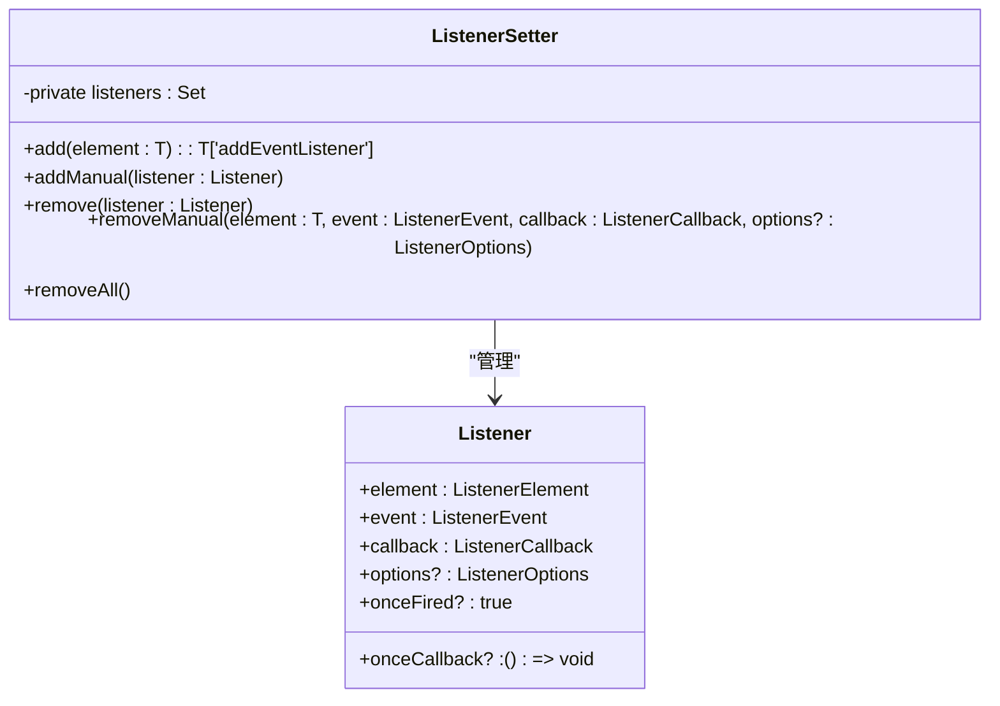
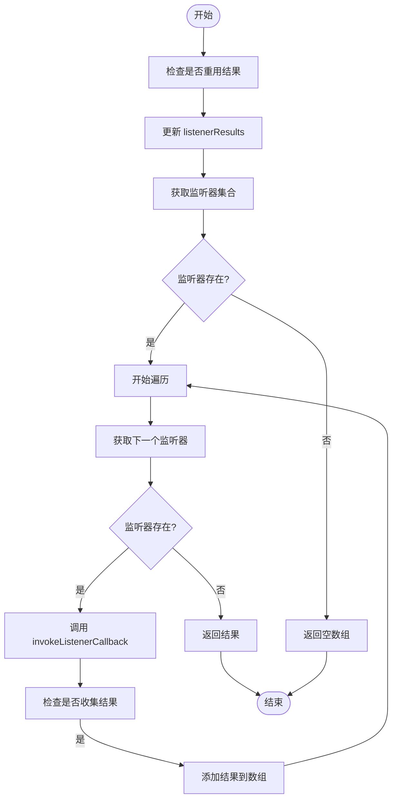
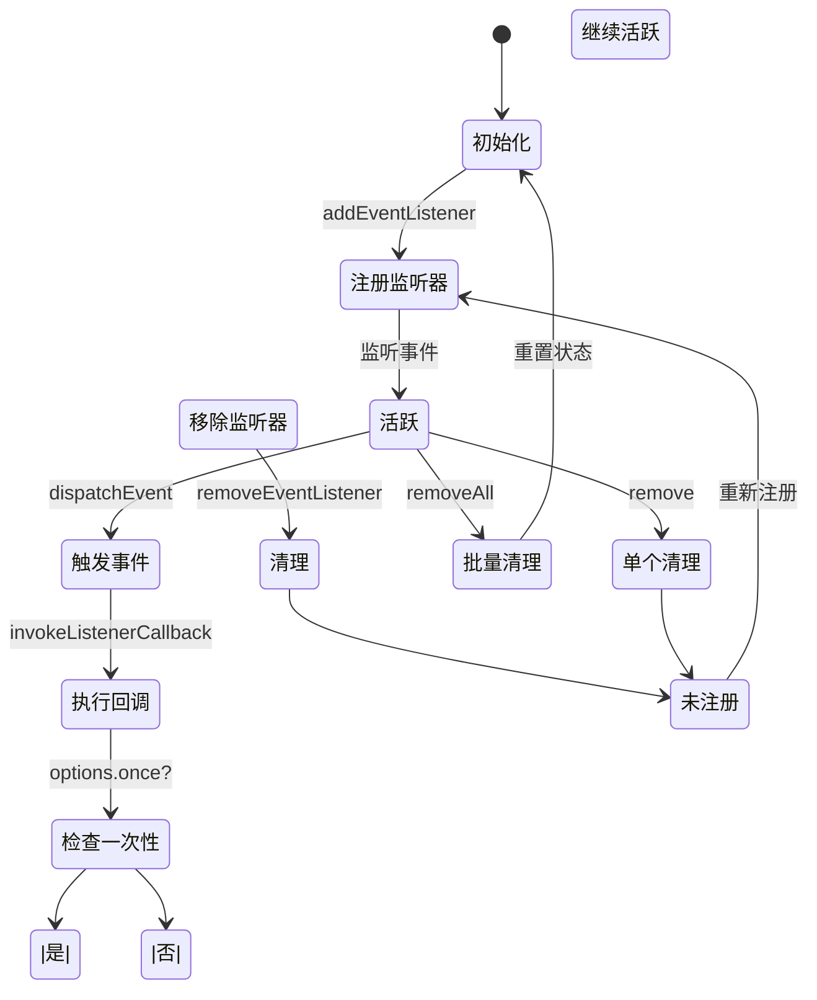
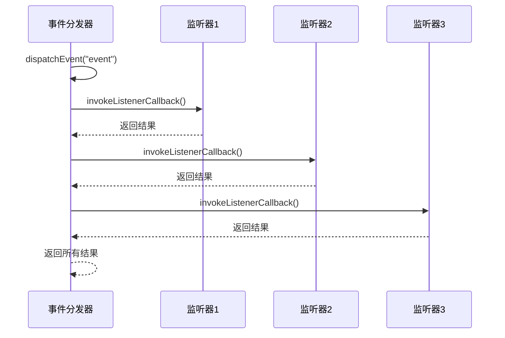
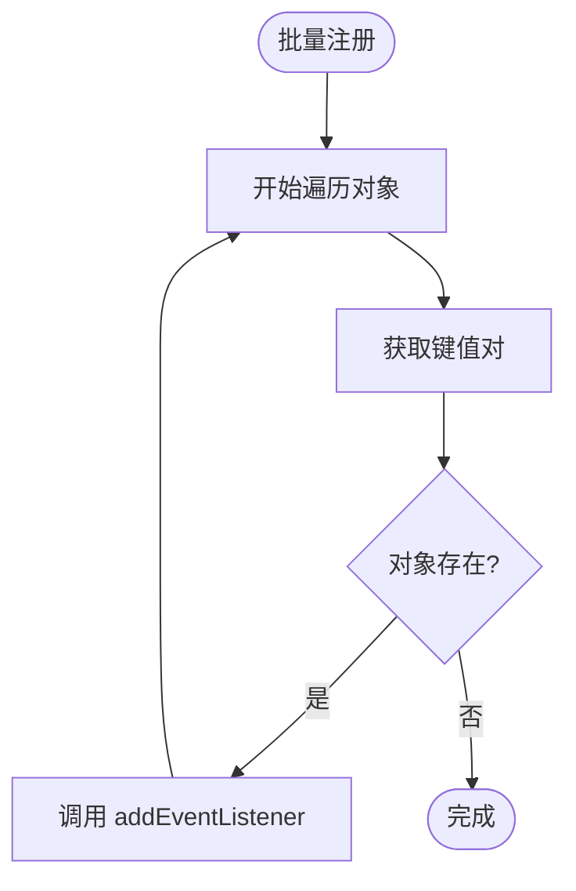
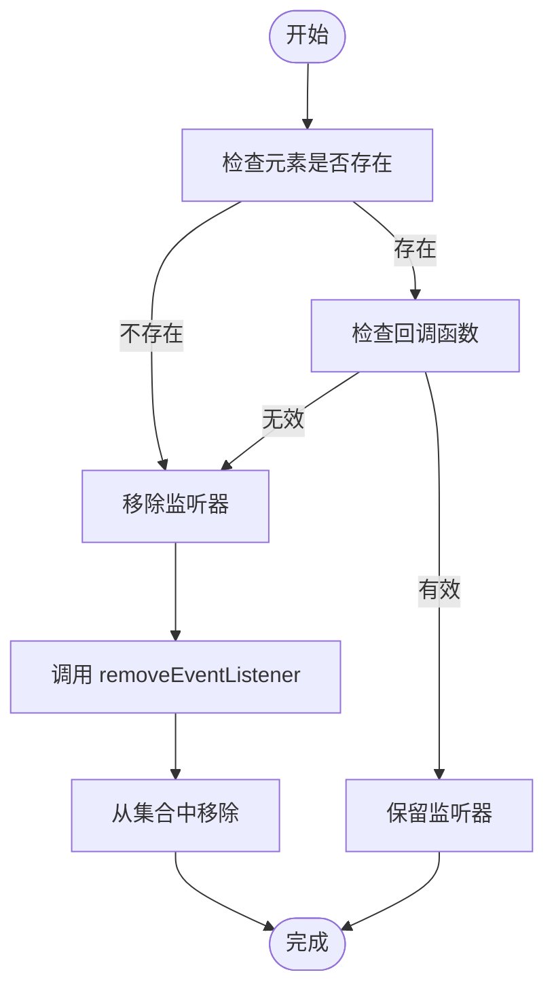
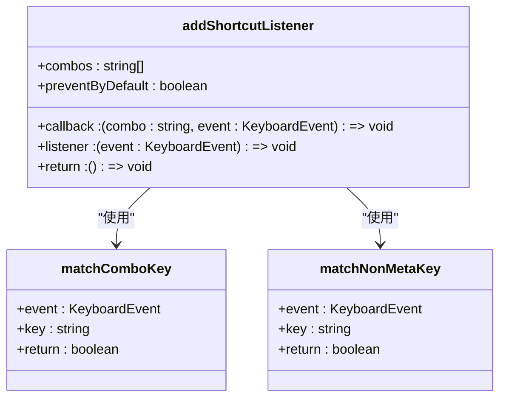
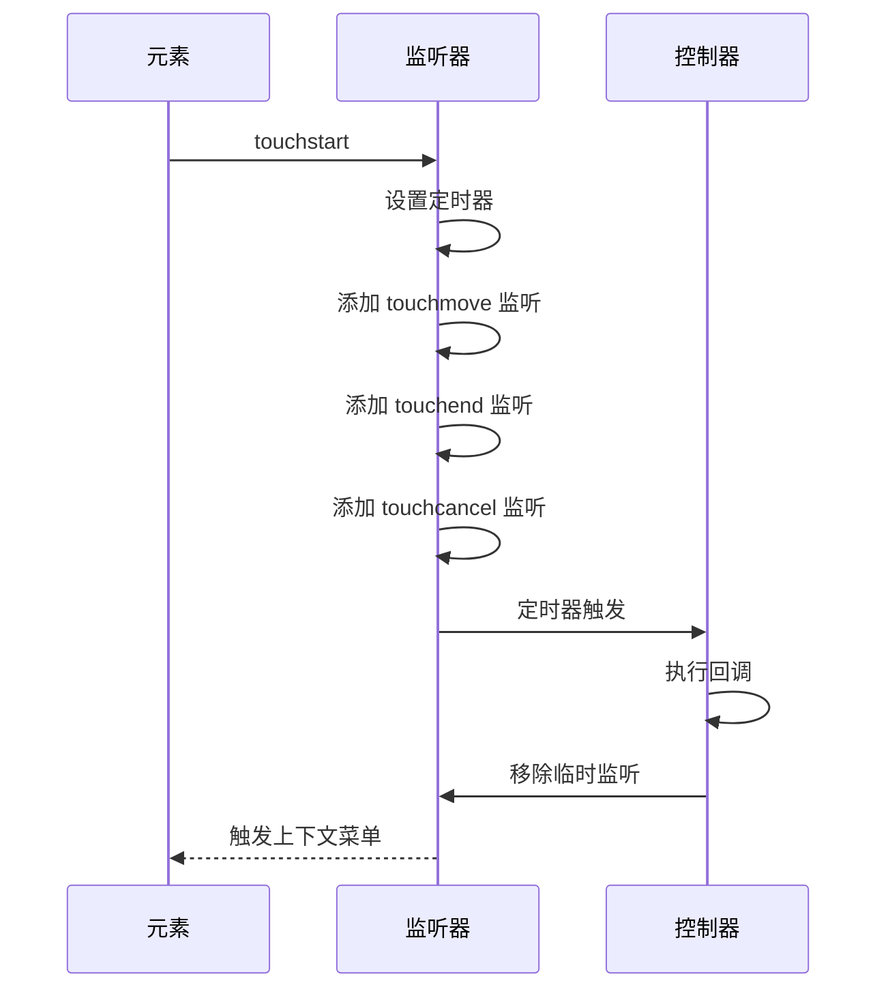

# 监听器处理

<cite>
**本文档中引用的文件**  
- [eventListenerBase.ts](file://src/helpers/eventListenerBase.ts)
- [listenerSetter.ts](file://src/helpers/listenerSetter.ts)
- [shortcutListener.ts](file://src/helpers/shortcutListener.ts)
- [addAnchorListener.ts](file://src/helpers/addAnchorListener.ts)
- [attachContextMenuListener.ts](file://src/helpers/dom/attachContextMenuListener.ts)
- [attachGrabListeners.ts](file://src/helpers/dom/attachGrabListeners.ts)
- [subscribeOn.ts](file://src/helpers/solid/subscribeOn.ts)
- [useGlobalDocumentEvent.ts](file://src/helpers/useGlobalDocumentEvent.ts)
</cite>

## 目录
1. [简介](#简介)
2. [监听器注册与管理](#监听器注册与管理)
3. [存储结构与查找算法](#存储结构与查找算法)
4. [生命周期管理](#生命周期管理)
5. [优先级与执行顺序控制](#优先级与执行顺序控制)
6. [批量操作与条件触发](#批量操作与条件触发)
7. [内存泄漏预防机制](#内存泄漏预防机制)
8. [高级用法示例](#高级用法示例)
9. [总结](#总结)

## 简介

本项目实现了一套完整的监听器处理机制，用于管理事件监听器的注册、管理和销毁流程。该机制基于 `EventListenerBase` 和 `ListenerSetter` 两个核心类构建，提供了灵活的事件处理能力。系统支持多种类型的监听器，包括 DOM 事件、快捷键事件、上下文菜单事件等，并通过统一的接口进行管理。

**Section sources**
- [eventListenerBase.ts](file://src/helpers/eventListenerBase.ts#L1-L194)
- [listenerSetter.ts](file://src/helpers/listenerSetter.ts#L1-L109)

## 监听器注册与管理

### 事件监听器基类

`EventListenerBase` 类是所有事件监听器的基础实现，提供了事件注册、触发和清理的核心功能。该类使用泛型类型 `Listeners` 来定义支持的事件类型，确保类型安全。

```mermaid
classDiagram
class EventListenerBase {
+protected listeners : Partial<{[k in keyof Listeners] : Set<ListenerObject<Listeners[k]>>}>
+protected listenerResults : Partial<{[k in keyof Listeners] : ArgumentTypes<Listeners[k]>}>
-private reuseResults : boolean
+constructor(reuseResults? : boolean)
+addEventListener(name : T, callback : Listeners[T], options? : boolean | AddEventListenerOptions)
+addMultipleEventsListeners(obj : {[name in keyof Listeners]? : Listeners[name]})
+removeEventListener(name : T, callback : Listeners[T], options? : boolean | AddEventListenerOptions)
+dispatchEvent(name : T, ...args : ArgumentTypes<L[T]>)
+dispatchResultableEvent(name : T, ...args : ArgumentTypes<Listeners[T]>)
+cleanup()
}
class ListenerObject {
+callback : T
+options : boolean | AddEventListenerOptions
}
EventListenerBase <|-- ListenerSetter : "继承"
EventListenerBase --> ListenerObject : "包含"
```

**Diagram sources**
- [eventListenerBase.ts](file://src/helpers/eventListenerBase.ts#L65-L194)

### 监听器设置器

`ListenerSetter` 类专门用于管理 DOM 元素的事件监听器，提供了更高级的管理功能。它不仅能够添加和移除监听器，还能跟踪所有已注册的监听器，便于批量清理。



**Diagram sources**
- [listenerSetter.ts](file://src/helpers/listenerSetter.ts#L34-L109)

**Section sources**
- [listenerSetter.ts](file://src/helpers/listenerSetter.ts#L1-L109)

## 存储结构与查找算法

### 存储结构设计

监听器系统采用了分层的存储结构来优化性能和内存使用。`EventListenerBase` 使用两个主要的数据结构：

1. **listeners**: 一个部分映射，键为事件名称，值为 `ListenerObject` 的集合
2. **listenerResults**: 一个部分映射，用于存储最近触发事件的参数，支持结果重用

这种设计使得事件查找的时间复杂度为 O(1)，而遍历所有监听器的时间复杂度为 O(n)，其中 n 是特定事件的监听器数量。

### 查找算法

当触发事件时，系统执行以下查找算法：

1. 检查是否需要重用结果，如果是则更新 `listenerResults`
2. 获取指定事件名称对应的监听器集合
3. 遍历集合中的每个监听器对象
4. 调用 `invokeListenerCallback` 方法执行回调函数
5. 如果需要收集结果，则将返回值添加到结果数组中



**Diagram sources**
- [eventListenerBase.ts](file://src/helpers/eventListenerBase.ts#L149-L175)

**Section sources**
- [eventListenerBase.ts](file://src/helpers/eventListenerBase.ts#L66-L71)

## 生命周期管理

### 自动清理机制

系统实现了完善的自动清理机制，确保监听器在不再需要时能够被正确释放。主要机制包括：

1. **构造函数初始化**: 在构造函数中调用 `_constructor` 方法初始化数据结构
2. **一次性监听器**: 支持 `once` 选项，监听器在触发后自动移除
3. **批量清理**: 提供 `removeAll` 方法一次性移除所有监听器
4. **资源释放**: `cleanup` 方法重置所有内部状态

### 内存泄漏预防

为了防止内存泄漏，系统采用了以下策略：

1. **弱引用管理**: 使用 `Set` 数据结构存储监听器，避免强引用导致的内存泄漏
2. **及时清理**: 在组件销毁时调用 `removeAll` 或 `cleanup` 方法
3. **事件解绑**: 确保在移除监听器时同时调用原生的 `removeEventListener` 方法



**Diagram sources**
- [listenerSetter.ts](file://src/helpers/listenerSetter.ts#L68-L80)
- [eventListenerBase.ts](file://src/helpers/eventListenerBase.ts#L114-L123)

**Section sources**
- [eventListenerBase.ts](file://src/helpers/eventListenerBase.ts#L190-L193)
- [listenerSetter.ts](file://src/helpers/listenerSetter.ts#L104-L108)

## 优先级与执行顺序控制

### 优先级设置

虽然基础的 `EventListenerBase` 类没有直接提供优先级设置功能，但可以通过以下方式实现：

1. **事件名称排序**: 使用特定的命名约定来控制执行顺序
2. **外部排序**: 在触发事件前对监听器进行排序
3. **分层处理**: 将不同优先级的监听器分配到不同的事件类型中

### 执行顺序控制

系统通过以下机制控制执行顺序：

1. **集合遍历顺序**: 使用 `Set` 数据结构保证遍历顺序的一致性
2. **异步处理**: 通过 `setTimeout` 实现异步事件触发
3. **错误处理**: 在发生错误时停止后续监听器的执行



**Diagram sources**
- [eventListenerBase.ts](file://src/helpers/eventListenerBase.ts#L149-L175)

**Section sources**
- [eventListenerBase.ts](file://src/helpers/eventListenerBase.ts#L125-L147)

## 批量操作与条件触发

### 批量注册

系统提供了 `addMultipleEventsListeners` 方法，支持一次性注册多个事件监听器：



**Diagram sources**
- [eventListenerBase.ts](file://src/helpers/eventListenerBase.ts#L101-L107)

### 条件触发

通过 `dispatchResultableEvent` 方法，系统支持条件触发和结果收集：

1. **结果收集**: 当 `collectResults` 为 true 时，收集所有监听器的返回值
2. **异常传播**: 如果任何监听器抛出异常，立即停止执行并传播异常
3. **条件执行**: 可以根据前一个监听器的结果决定是否继续执行后续监听器

**Section sources**
- [eventListenerBase.ts](file://src/helpers/eventListenerBase.ts#L177-L188)

## 内存泄漏预防机制

### 引用管理

系统通过以下方式管理引用，防止内存泄漏：

1. **弱引用**: 使用 `Set` 而不是数组存储监听器，减少引用强度
2. **及时解绑**: 在组件销毁时立即调用清理方法
3. **作用域控制**: 限制监听器的作用域，避免全局污染

### 清理策略



**Diagram sources**
- [listenerSetter.ts](file://src/helpers/listenerSetter.ts#L68-L80)

**Section sources**
- [listenerSetter.ts](file://src/helpers/listenerSetter.ts#L68-L80)

## 高级用法示例

### 快捷键监听器

`shortcutListener.ts` 文件实现了快捷键监听器，支持组合键的识别和处理：



**Diagram sources**
- [shortcutListener.ts](file://src/helpers/shortcutListener.ts#L20-L40)

### 上下文菜单监听器

`attachContextMenuListener.ts` 实现了上下文菜单的监听器，特别处理了触摸设备的长按事件：



**Diagram sources**
- [attachContextMenuListener.ts](file://src/helpers/dom/attachContextMenuListener.ts#L27-L99)

**Section sources**
- [shortcutListener.ts](file://src/helpers/shortcutListener.ts#L1-L40)
- [attachContextMenuListener.ts](file://src/helpers/dom/attachContextMenuListener.ts#L1-L100)

## 总结

本项目实现了一套完整且高效的监听器处理机制，具有以下特点：

1. **类型安全**: 基于泛型的 `EventListenerBase` 类提供了类型安全的事件处理
2. **灵活管理**: `ListenerSetter` 类提供了高级的监听器管理功能
3. **内存友好**: 通过合理的存储结构和清理机制防止内存泄漏
4. **扩展性强**: 支持多种类型的监听器和自定义处理逻辑
5. **性能优化**: 使用集合数据结构和高效的查找算法确保性能

该机制不仅适用于 DOM 事件处理，还可以扩展到各种自定义事件系统，为复杂的应用程序提供了可靠的事件管理基础。

**Section sources**
- [eventListenerBase.ts](file://src/helpers/eventListenerBase.ts#L1-L194)
- [listenerSetter.ts](file://src/helpers/listenerSetter.ts#L1-L109)