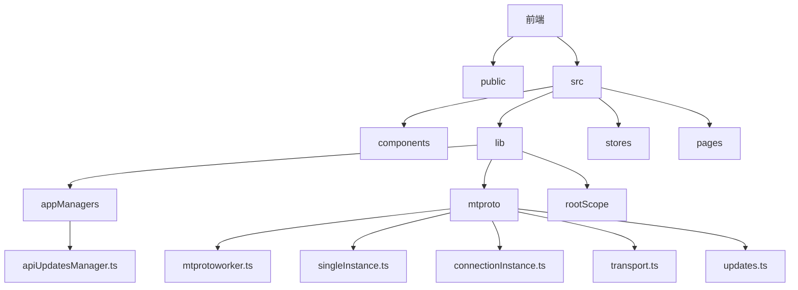
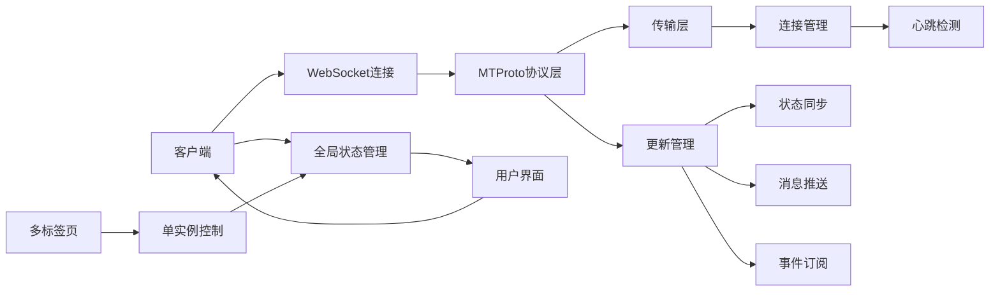
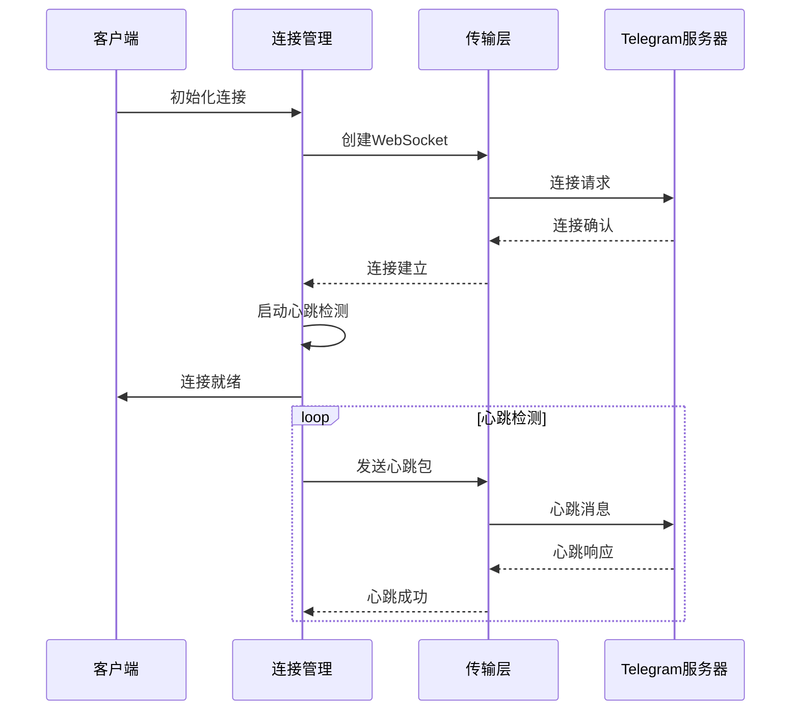
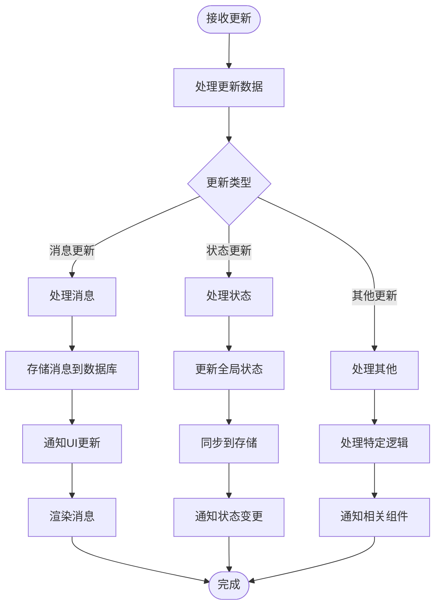
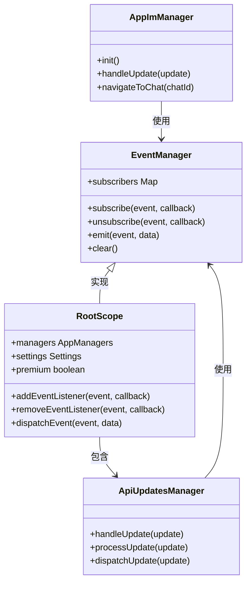
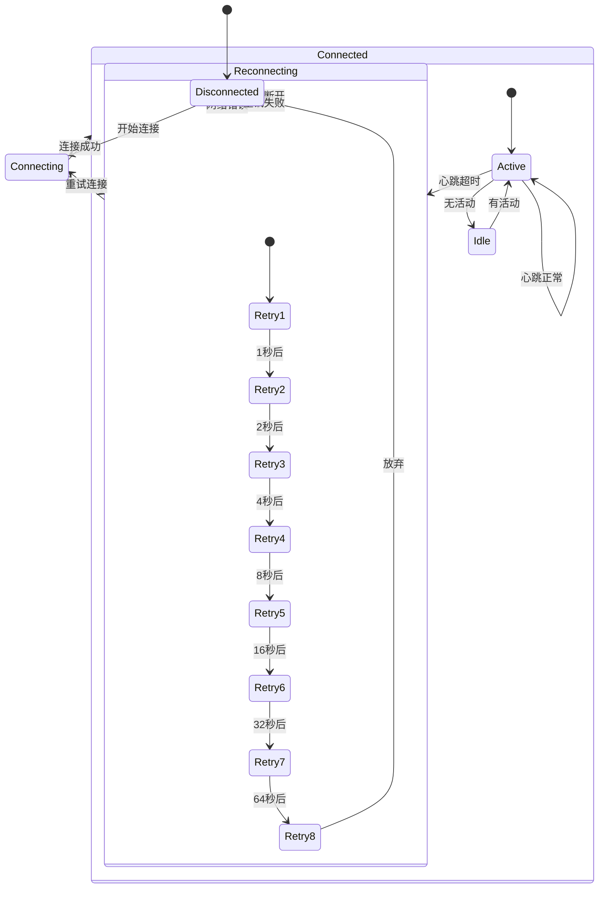
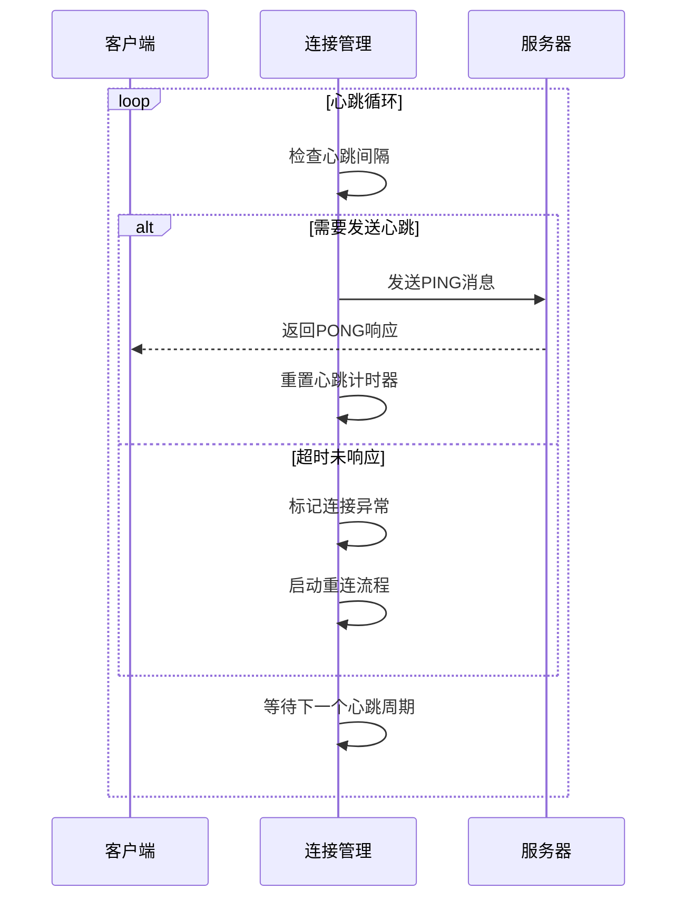
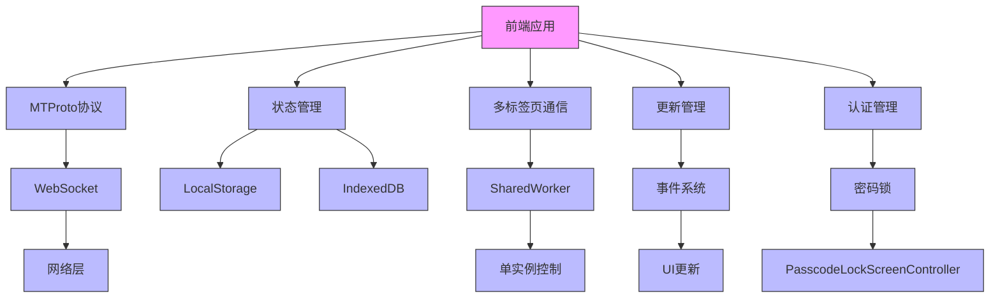
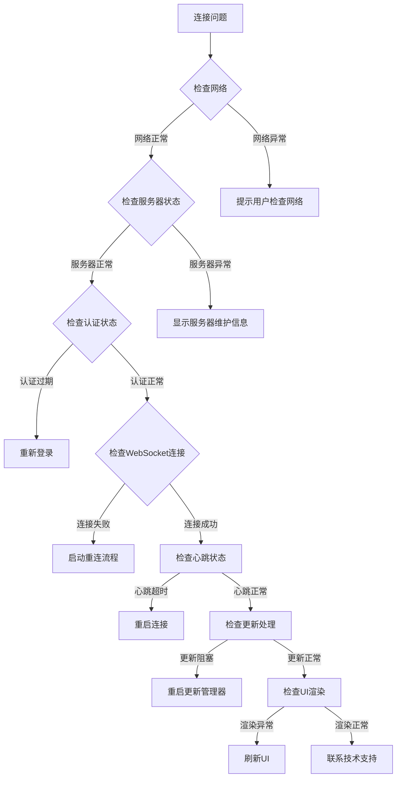

# 实时通信API

<cite>
**本文档中引用的文件**  
- [index.ts](file://src/index.ts)
- [server.js](file://server.js)
- [apiUpdatesManager.ts](file://src/lib/appManagers/apiUpdatesManager.ts)
- [mtprotoworker.ts](file://src/lib/mtproto/mtprotoworker.ts)
- [singleInstance.ts](file://src/lib/mtproto/singleInstance.ts)
- [rootScope.ts](file://src/lib/rootScope.ts)
- [appImManager.ts](file://src/lib/appManagers/appImManager.ts)
- [connectionInstance.ts](file://src/lib/mtproto/connectionInstance.ts)
- [connection.ts](file://src/lib/mtproto/connection.ts)
- [transport.ts](file://src/lib/mtproto/transport.ts)
- [updates.ts](file://src/lib/mtproto/updates.ts)
- [authController.ts](file://src/components/passcodeLock/passcodeLockScreenController.ts)
- [popupInstanceDeactivated.ts](file://src/components/popups/index.ts)
</cite>

## 目录
1. [简介](#简介)
2. [项目结构](#项目结构)
3. [核心组件](#核心组件)
4. [架构概述](#架构概述)
5. [详细组件分析](#详细组件分析)
6. [依赖分析](#依赖分析)
7. [性能考虑](#性能考虑)
8. [故障排除指南](#故障排除指南)
9. [结论](#结论)

## 简介
本项目是一个基于Webogram改进的Telegram Web客户端，实现了完整的实时通信功能。系统通过WebSocket连接与Telegram服务器进行双向通信，支持消息推送、状态同步、事件订阅和广播等核心实时功能。项目采用TypeScript开发，使用Solid.js作为前端框架，实现了高效的UI更新和状态管理。

## 项目结构

**图示来源**  
- [src](file://src)
- [public](file://public)

**本节来源**  
- [README.md](file://README.md)

## 核心组件

项目的核心实时通信功能主要由以下几个组件构成：
- **MTProto协议实现**：处理与Telegram服务器的底层通信
- **更新管理器**：管理消息更新和状态同步
- **连接实例**：维护WebSocket连接和心跳检测
- **根作用域**：全局状态管理和事件分发
- **单实例控制器**：多标签页通信和状态同步

**本节来源**  
- [index.ts](file://src/index.ts#L25-L26)
- [apiUpdatesManager.ts](file://src/lib/appManagers/apiUpdatesManager.ts)
- [mtprotoworker.ts](file://src/lib/mtproto/mtprotoworker.ts)

## 架构概述

**图示来源**  
- [mtprotoworker.ts](file://src/lib/mtproto/mtprotoworker.ts)
- [singleInstance.ts](file://src/lib/mtproto/singleInstance.ts)
- [apiUpdatesManager.ts](file://src/lib/appManagers/apiUpdatesManager.ts)

## 详细组件分析

### WebSocket连接管理

**图示来源**  
- [connectionInstance.ts](file://src/lib/mtproto/connectionInstance.ts)
- [transport.ts](file://src/lib/mtproto/transport.ts)

**本节来源**  
- [connectionInstance.ts](file://src/lib/mtproto/connectionInstance.ts)
- [transport.ts](file://src/lib/mtproto/transport.ts)

### 消息推送和状态同步

**图示来源**  
- [updates.ts](file://src/lib/mtproto/updates.ts)
- [apiUpdatesManager.ts](file://src/lib/appManagers/apiUpdatesManager.ts)
- [rootScope.ts](file://src/lib/rootScope.ts)

**本节来源**  
- [updates.ts](file://src/lib/mtproto/updates.ts)
- [apiUpdatesManager.ts](file://src/lib/appManagers/apiUpdatesManager.ts)

### 事件订阅和广播系统

**图示来源**  
- [rootScope.ts](file://src/lib/rootScope.ts)
- [apiUpdatesManager.ts](file://src/lib/appManagers/apiUpdatesManager.ts)
- [appImManager.ts](file://src/lib/appManagers/appImManager.ts)

**本节来源**  
- [rootScope.ts](file://src/lib/rootScope.ts)
- [apiUpdatesManager.ts](file://src/lib/appManagers/apiUpdatesManager.ts)

### 连接状态监控和故障恢复

**图示来源**  
- [connectionInstance.ts](file://src/lib/mtproto/connectionInstance.ts)
- [transport.ts](file://src/lib/mtproto/transport.ts)
- [singleInstance.ts](file://src/lib/mtproto/singleInstance.ts)

**本节来源**  
- [connectionInstance.ts](file://src/lib/mtproto/connectionInstance.ts)
- [transport.ts](file://src/lib/mtproto/transport.ts)

### 心跳检测和连接保活

**图示来源**  
- [transport.ts](file://src/lib/mtproto/transport.ts)
- [connectionInstance.ts](file://src/lib/mtproto/connectionInstance.ts)

**本节来源**  
- [transport.ts](file://src/lib/mtproto/transport.ts)
- [connectionInstance.ts](file://src/lib/mtproto/connectionInstance.ts)

## 依赖分析

**图示来源**  
- [go.mod](file://package.json)
- [index.ts](file://src/index.ts)
- [singleInstance.ts](file://src/lib/mtproto/singleInstance.ts)
- [authController.ts](file://src/components/passcodeLock/passcodeLockScreenController.ts)

**本节来源**  
- [package.json](file://package.json)
- [index.ts](file://src/index.ts)
- [singleInstance.ts](file://src/lib/mtproto/singleInstance.ts)

## 性能考虑

系统在实时通信方面进行了多项性能优化：
- 采用WebSocket长连接，减少连接建立开销
- 实现指数退避重连策略，避免网络拥塞
- 使用SharedWorker实现多标签页共享连接，减少资源消耗
- 通过MTProto协议的高效序列化，减少数据传输量
- 实现增量更新，只同步变化的数据
- 使用本地存储缓存，减少重复数据加载
- 采用虚拟滚动技术，优化大量消息的渲染性能

## 故障排除指南

**本节来源**  
- [popupInstanceDeactivated.ts](file://src/components/popups/index.ts)
- [singleInstance.ts](file://src/lib/mtproto/singleInstance.ts)
- [connectionInstance.ts](file://src/lib/mtproto/connectionInstance.ts)

## 结论

本实时通信API实现了完整的WebSocket连接管理、消息推送、状态同步等功能。系统通过MTProto协议与Telegram服务器通信，采用单实例控制确保多标签页间的状态一致性。心跳检测和故障恢复机制保证了连接的稳定性，事件订阅和广播系统实现了高效的组件间通信。整体架构设计合理，性能优化到位，能够提供稳定可靠的实时通信服务。