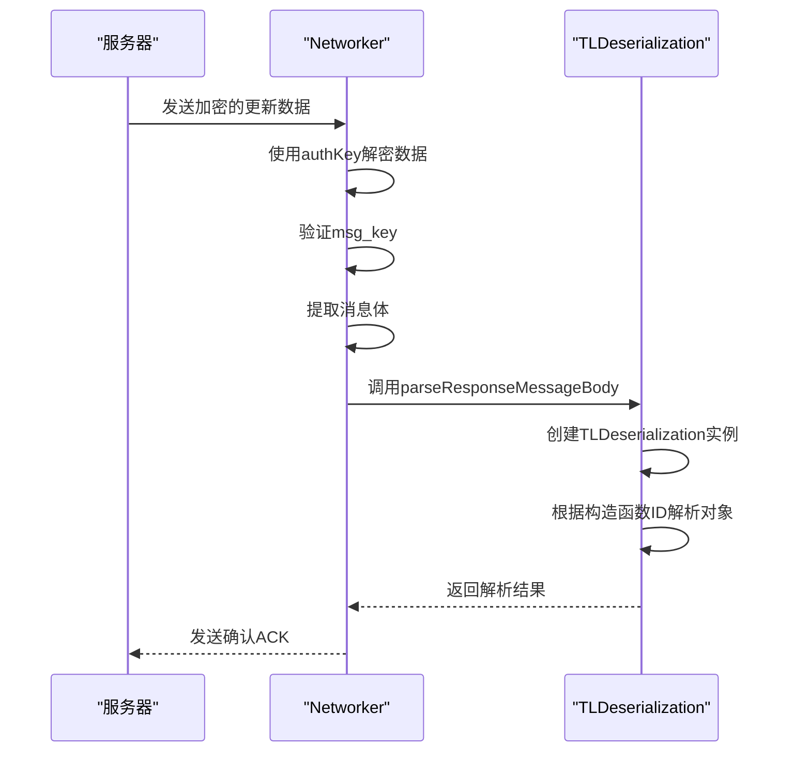
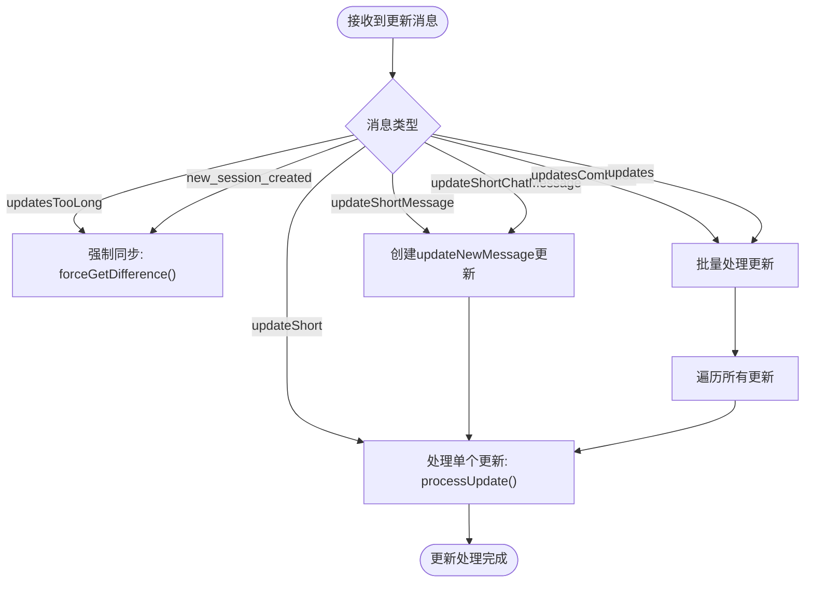
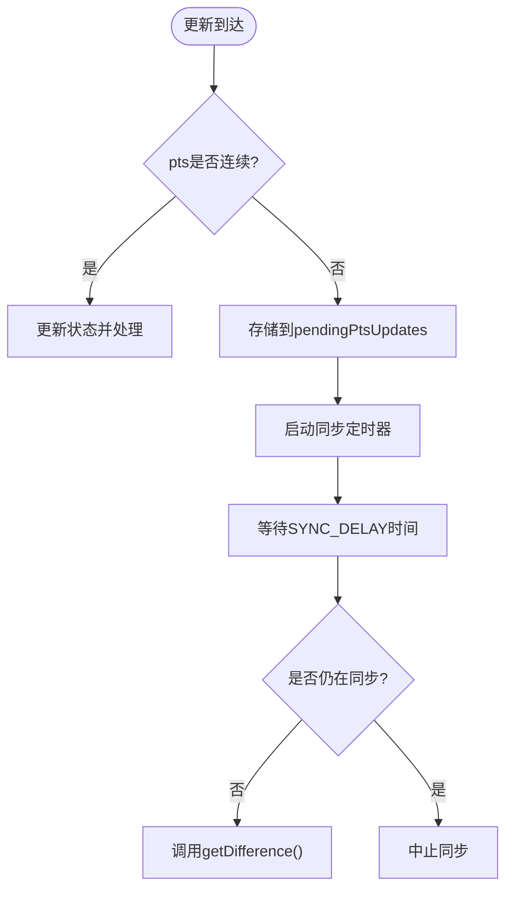
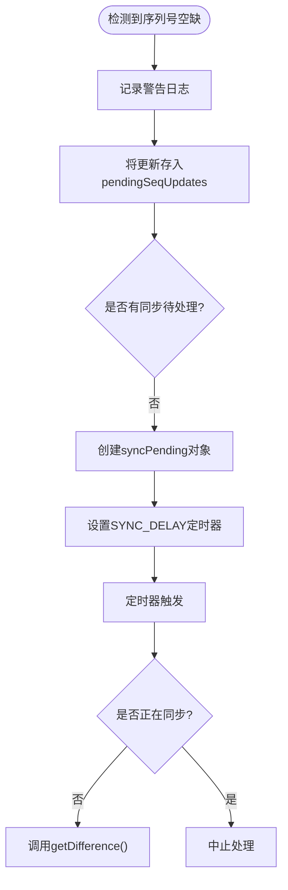

# 更新处理机制

<cite>
**本文档引用的文件**   
- [apiUpdatesManager.ts](file://src/lib/appManagers/apiUpdatesManager.ts)
- [layer.d.ts](file://src/layer.d.ts)
- [networker.ts](file://src/lib/mtproto/networker.ts)
- [tl_utils.ts](file://src/lib/mtproto/tl_utils.ts)
- [appMessagesManager.ts](file://src/lib/appManagers/appMessagesManager.ts)
</cite>

## 目录
1. [引言](#引言)
2. [更新类型与结构](#更新类型与结构)
3. [更新接收与解析](#更新接收与解析)
4. [更新分发机制](#更新分发机制)
5. [错误处理与异常恢复](#错误处理与异常恢复)
6. [原子性与一致性保证](#原子性与一致性保证)
7. [结论](#结论)

## 引言
Telegram MTProto协议中的更新（Updates）机制是客户端与服务器之间实时通信的核心。本文档深入分析了更新处理机制的实现细节，包括更新类型、接收解析、分发处理、错误恢复以及一致性保证等关键方面。通过研究`apiUpdatesManager`等核心组件，揭示了Telegram Web客户端如何高效、可靠地处理来自服务器的实时更新。

**Section sources**
- [apiUpdatesManager.ts](file://src/lib/appManagers/apiUpdatesManager.ts#L1-L818)

## 更新类型与结构
Telegram MTProto协议定义了多种更新类型，用于通知客户端各种状态变化。这些更新通过TL（Telegram Language）序列化格式进行传输，每种更新类型都有其特定的结构和字段。

### 核心更新类型
根据`layer.d.ts`文件中的定义，核心更新类型包括：

```mermaid
erDiagram
updateNewMessage {
string _ PK
Message message
number pts
number pts_count
}
updateDeleteMessages {
string _ PK
Array<number> messages
number pts
number pts_count
}
updateUserTyping {
string _ PK
string user_id
SendMessageAction action
}
updateChatUserTyping {
string _ PK
string chat_id
Peer from_id
SendMessageAction action
}
updateNewChannelMessage {
string _ PK
Message message
number pts
number pts_count
}
updateEditChannelMessage {
string _ PK
Message message
number pts
number pts_count
}
updateChannelTooLong {
string _ PK
string channel_id
number pts
}
updateReadChannelInbox {
string _ PK
string channel_id
number max_id
number pts
}
updateDraftMessage {
string _ PK
Peer peer
DraftMessage draft
}
```

**Diagram sources **
- [layer.d.ts](file://src/layer.d.ts#L2613-L2944)

**Section sources**
- [layer.d.ts](file://src/layer.d.ts#L2613-L2944)

### 更新结构详解
- **updateNewMessage**: 表示收到了新消息，包含消息内容、pts（消息计数器）和pts_count（计数器增量）。
- **updateDeleteMessages**: 表示消息被删除，包含被删除消息的ID列表、pts和pts_count。
- **updateNewChannelMessage**: 表示在频道中收到了新消息，结构与updateNewMessage类似。
- **updateEditChannelMessage**: 表示频道中的消息被编辑，包含更新后的消息内容。
- **updateChannelTooLong**: 表示频道的更新队列过长，需要客户端通过`getChannelDifference`方法获取完整更新。
- **updateDraftMessage**: 表示草稿被更新，包含新的草稿内容。

这些更新类型构成了Telegram客户端实时同步的基础，确保了用户界面能够及时反映服务器端的状态变化。

## 更新接收与解析
更新的接收与解析是更新处理机制的第一步，主要由`networker.ts`和`tl_utils.ts`模块协同完成。

### 数据接收流程
1. 客户端通过MTProto协议与服务器建立连接
2. 服务器将更新数据封装在MTProto消息体中发送
3. `networker.ts`模块负责接收和解密网络数据包
4. 解密后的数据通过`parseResponseMessageBody`方法进行初步解析



**Diagram sources **
- [networker.ts](file://src/lib/mtproto/networker.ts#L1400-L1599)
- [tl_utils.ts](file://src/lib/mtproto/tl_utils.ts#L680-L834)

### TL对象解码
TL（Telegram Language）对象的解码是解析过程的核心，由`TLDeserialization`类实现：

1. **构造函数查找**: 根据消息体中的构造函数ID（constructorCmp）在schema中查找对应的构造函数数据
2. **递归解析**: 对于复杂对象，递归解析其各个字段
3. **条件字段处理**: 处理带有条件标志（flags）的字段，根据标志位决定是否包含该字段
4. **特殊类型处理**: 处理gzip压缩、向量（vector）等特殊类型

解码过程确保了从原始字节流到结构化对象的准确转换，为后续的更新处理提供了可靠的数据基础。

**Section sources**
- [tl_utils.ts](file://src/lib/mtproto/tl_utils.ts#L680-L834)
- [networker.ts](file://src/lib/mtproto/networker.ts#L1456-L1503)

## 更新分发机制
更新分发机制是`apiUpdatesManager`的核心功能，负责将解析后的更新分发给相应的处理模块。

### 更新处理流程
`apiUpdatesManager`通过`processUpdateMessage`方法处理接收到的更新消息：



**Diagram sources **
- [apiUpdatesManager.ts](file://src/lib/appManagers/apiUpdatesManager.ts#L182-L252)

### 状态管理与同步
`apiUpdatesManager`维护了复杂的更新状态，确保更新处理的顺序性和完整性：

- **全局状态**: `updatesState`对象维护全局的seq（序列号）、pts（消息计数器）和date（时间戳）
- **频道状态**: `channelStates`对象为每个频道维护独立的pts状态
- **待处理队列**: `pendingPtsUpdates`和`pendingSeqUpdates`存储因顺序问题暂时无法处理的更新

当检测到更新序列出现空缺（hole）时，系统会启动同步机制：



**Diagram sources **
- [apiUpdatesManager.ts](file://src/lib/appManagers/apiUpdatesManager.ts#L574-L616)

### 更新分发实现
`saveUpdate`方法是更新分发的关键，它通过事件分发机制将更新通知给所有订阅者：

```typescript
public saveUpdate(update: Update) {
  this.log.debug('update', update);
  this.dispatchEvent(update._, update as any);
}
```

这种基于事件的分发模式实现了松耦合的设计，允许不同的模块订阅感兴趣的更新类型，而无需直接依赖更新处理核心。

**Section sources**
- [apiUpdatesManager.ts](file://src/lib/appManagers/apiUpdatesManager.ts#L668-L671)

## 错误处理与异常恢复
更新处理机制包含完善的错误处理和异常恢复策略，确保系统在各种异常情况下仍能保持稳定。

### 序列号不一致处理
当检测到序列号不一致时，系统会采取相应的恢复措施：



**Diagram sources **
- [apiUpdatesManager.ts](file://src/lib/appManagers/apiUpdatesManager.ts#L621-L646)

### 差异过长处理
当`getDifference`返回`updates.differenceTooLong`时，系统会执行以下恢复操作：

```typescript
private onDifferenceTooLong() {
  for(const i in this) {
    const value = this[i];
    if(value instanceof AppManager) {
      value.clear?.();
    }
  }
  this.rootScope.dispatchEvent('state_cleared');
}
```

此方法会清除所有管理器的状态，并触发状态清除事件，促使客户端重新同步所有数据。

**Section sources**
- [apiUpdatesManager.ts](file://src/lib/appManagers/apiUpdatesManager.ts#L451-L460)

### 网络层错误处理
在网络层，`networker.ts`模块处理各种MTProto协议级别的错误：

- **msg_id过期**: 重新生成新的msg_id
- **seqno不匹配**: 触发会话更新（updateSession）
- **msg_key不匹配**: 重新建立会话
- **无效容器**: 重新发送有问题的消息

这些错误处理机制确保了即使在网络不稳定的情况下，客户端也能自动恢复并继续正常工作。

**Section sources**
- [networker.ts](file://src/lib/mtproto/networker.ts#L1797-L1839)

## 原子性与一致性保证
更新处理机制通过多种策略确保操作的原子性和数据的一致性。

### 状态持久化
`apiUpdatesManager`使用代理（Proxy）模式确保状态变更的持久化：

```typescript
private setProxy() {
  const self = this;
  this.updatesState = new Proxy(this.updatesState, {
    set: function(target, key, value) {
      target[key] = value;
      self.saveUpdatesState();
      return true;
    }
  });
}
```

每次状态变更都会自动保存到应用状态管理器中，确保即使在页面刷新后也能恢复正确的更新状态。

**Section sources**
- [apiUpdatesManager.ts](file://src/lib/appManagers/apiUpdatesManager.ts#L63-L73)

### 同步状态管理
系统通过`syncLoading`和`syncPending`标志精确管理同步状态：

- **syncLoading**: 表示正在进行同步操作的Promise
- **syncPending**: 表示有待处理的同步请求，包含超时定时器

这种双重状态管理机制防止了重复的同步操作，同时确保了在适当的时候触发同步。

### 事务性更新处理
更新处理具有类似事务的特性：

1. **预处理**: 检查更新的完整性和顺序
2. **暂存**: 将无法立即处理的更新存入待处理队列
3. **提交**: 当所有前置条件满足时，批量处理待处理队列中的更新
4. **状态更新**: 更新pts、seq等状态变量

这种分阶段的处理方式确保了更新处理的原子性，避免了部分更新导致的状态不一致。

**Section sources**
- [apiUpdatesManager.ts](file://src/lib/appManagers/apiUpdatesManager.ts#L278-L371)

## 结论
Telegram的更新处理机制是一个复杂而精巧的系统，它通过MTProto协议、TL序列化、事件分发和状态管理等多种技术的有机结合，实现了高效、可靠、一致的实时更新处理。该机制不仅能够处理各种类型的更新，还具备强大的错误恢复能力，确保了客户端与服务器之间的数据同步。通过对`apiUpdatesManager`等核心组件的分析，我们可以深入理解现代即时通讯应用背后的技术原理，为类似系统的开发提供有价值的参考。