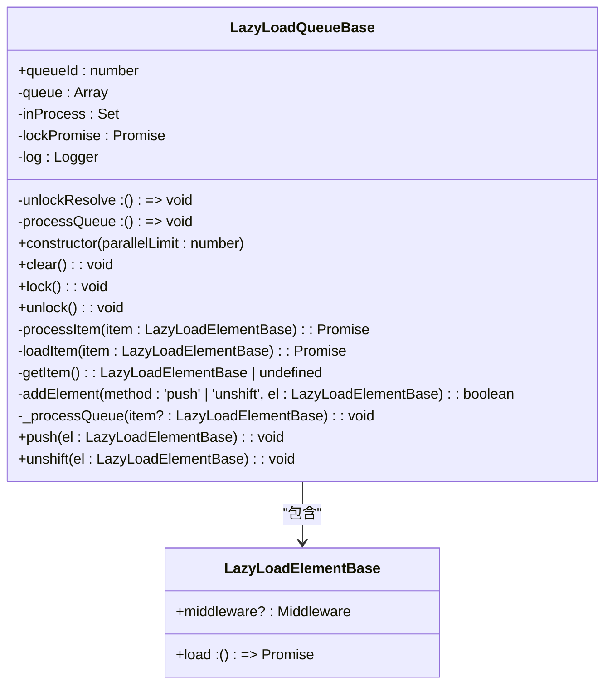
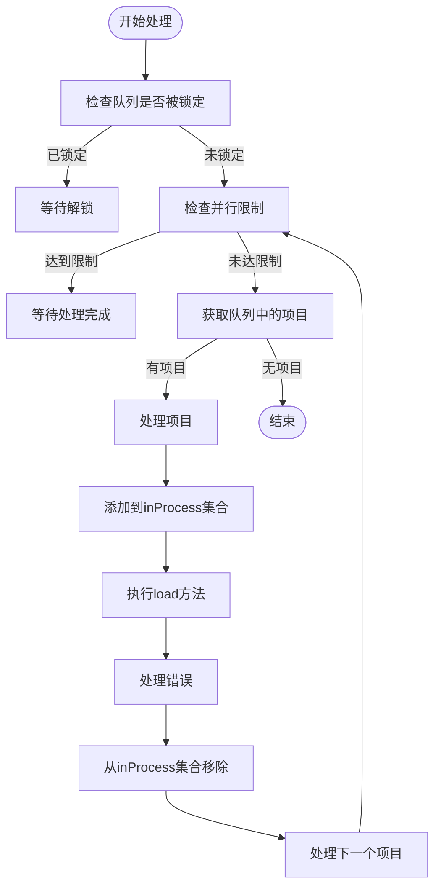
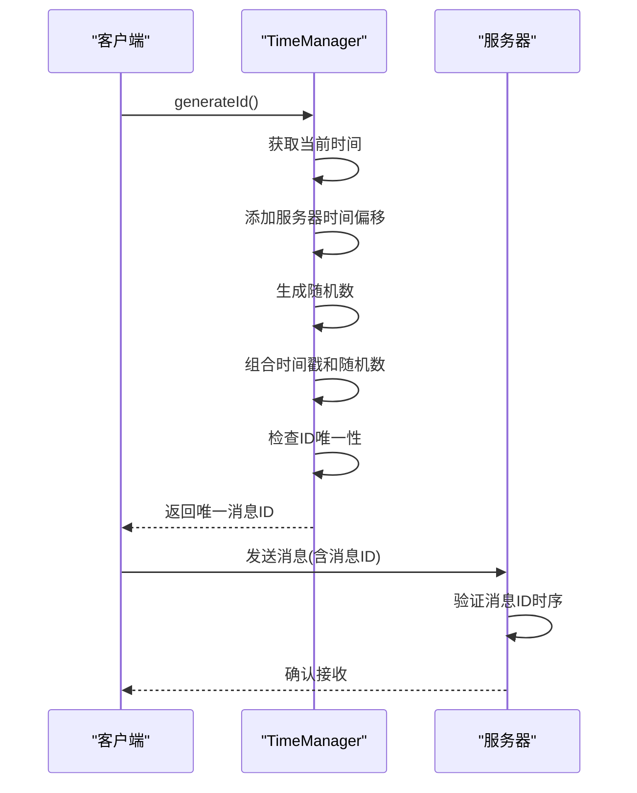
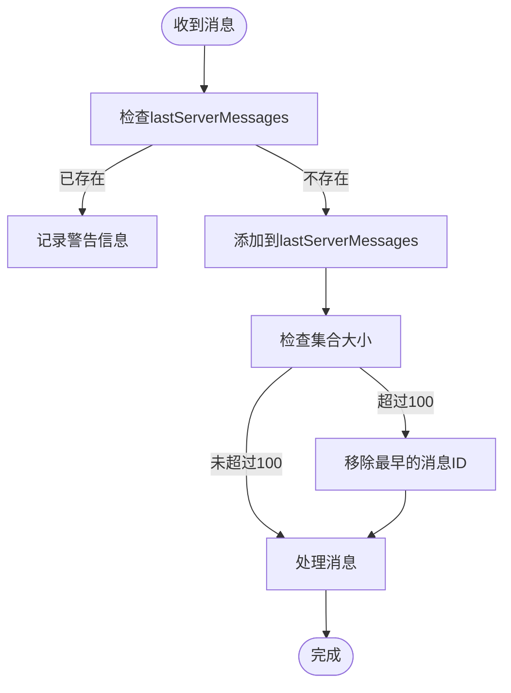
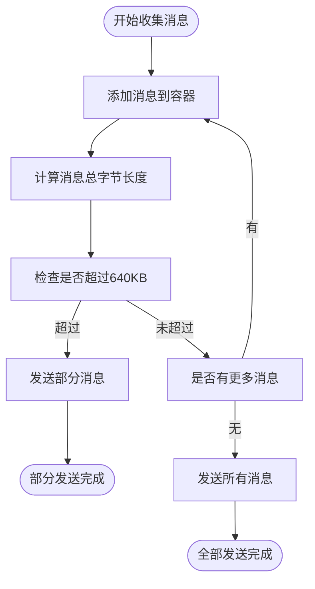
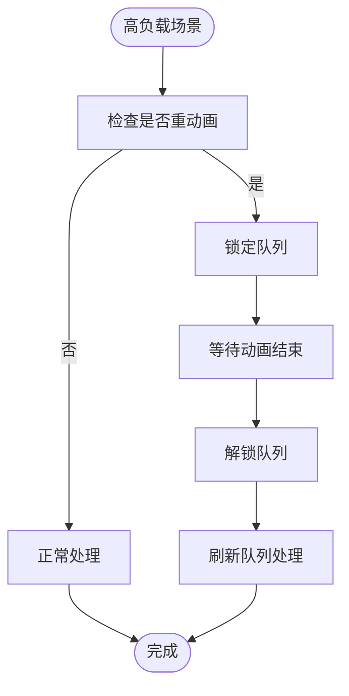

# 更新队列管理

<cite>
**本文档中引用的文件**  
- [lazyLoadQueue.ts](file://src/components/lazyLoadQueue.ts)
- [lazyLoadQueueBase.ts](file://src/components/lazyLoadQueueBase.ts)
- [networker.ts](file://src/lib/mtproto/networker.ts)
- [timeManager.ts](file://src/lib/mtproto/timeManager.ts)
- [apiFileManager.ts](file://src/lib/mtproto/apiFileManager.ts)
</cite>

## 目录
1. [简介](#简介)
2. [队列数据结构设计](#队列数据结构设计)
3. [内存管理策略](#内存管理策略)
4. [更新排序机制](#更新排序机制)
5. [消息去重实现](#消息去重实现)
6. [容量控制与溢出处理](#容量控制与溢出处理)
7. [高负载性能优化](#高负载性能优化)
8. [关键队列操作函数](#关键队列操作函数)
9. [总结](#总结)

## 简介

本文档详细描述了客户端如何管理来自服务器的更新队列。系统通过精心设计的队列机制确保消息按正确的时间顺序处理，同时实现了高效的消息去重、容量控制和性能优化策略。核心组件包括延迟加载队列（LazyLoadQueue）和网络消息处理器（MTPNetworker），它们共同协作以确保消息传递的可靠性和效率。

**Section sources**
- [networker.ts](file://src/lib/mtproto/networker.ts#L1-L200)

## 队列数据结构设计

更新队列的核心数据结构基于 `LazyLoadQueueBase` 类实现，该类提供了基础的队列管理功能。队列使用数组存储待处理的元素，并通过 `Set` 跟踪正在处理的项目以避免重复处理。

队列中的每个元素都包含一个 `load` 方法，该方法返回一个 Promise，用于异步加载数据。此外，元素还可以包含中间件（middleware）用于控制执行流程。队列支持 `push` 和 `unshift` 操作，分别用于在队列末尾和开头添加元素。

**Diagram sources**
- [lazyLoadQueueBase.ts](file://src/components/lazyLoadQueueBase.ts#L15-L145)

**Section sources**
- [lazyLoadQueueBase.ts](file://src/components/lazyLoadQueueBase.ts#L1-L145)

## 内存管理策略

系统采用多种策略来有效管理内存使用。首先，通过 `inProcess` 集合跟踪正在处理的项目，防止同一项目被多次处理。当项目完成处理后，会从 `inProcess` 集合中移除。

队列实现了 `clear` 方法，可以清空所有待处理和正在处理的项目。此外，系统使用 `throttle` 函数限制 `_processQueue` 的调用频率，避免在短时间内处理过多项目导致内存压力。

**Diagram sources**
- [lazyLoadQueueBase.ts](file://src/components/lazyLoadQueueBase.ts#L69-L98)

**Section sources**
- [lazyLoadQueueBase.ts](file://src/components/lazyLoadQueueBase.ts#L35-L43)

## 更新排序机制

消息排序机制基于消息ID的时间戳部分。`TimeManager` 类负责生成唯一的消息ID，其中包含时间戳信息。消息ID的生成遵循以下规则：

1. 时间戳部分基于当前时间加上服务器时间偏移量
2. 毫秒部分与随机数结合，确保在同一毫秒内生成的ID也是唯一的
3. 如果检测到时间回退，系统会递增序列号以确保ID的单调递增

这种设计确保了消息ID能够反映消息的发送顺序，从而保证了消息处理的正确时序。

**Diagram sources**
- [timeManager.ts](file://src/lib/mtproto/timeManager.ts#L73-L97)

**Section sources**
- [timeManager.ts](file://src/lib/mtproto/timeManager.ts#L73-L97)

## 消息去重实现

系统通过多种机制防止重复处理相同的更新。首先，在 `MTPNetworker` 类中维护了一个 `lastServerMessages` 集合，用于存储最近接收到的服务器消息ID。当收到新消息时，系统会检查该消息ID是否已存在于集合中。

此外，系统还通过 `pendingMessages` 对象跟踪待发送的消息，确保不会重复发送相同的消息。对于确认消息（ack），系统使用 `pendingAcks` 数组来管理待确认的消息ID，避免重复确认。

**Diagram sources**
- [networker.ts](file://src/lib/mtproto/networker.ts#L1833-L1844)

**Section sources**
- [networker.ts](file://src/lib/mtproto/networker.ts#L1833-L1844)

## 容量控制与溢出处理

队列的容量控制主要通过并行限制（parallelLimit）实现。`LazyLoadQueueBase` 类的构造函数接受一个 `parallelLimit` 参数，默认值为8，用于限制同时处理的项目数量。

当队列中的消息字节长度超过640KB时，系统会触发长度溢出处理。此时，系统会停止向当前消息容器添加更多消息，并立即发送已收集的消息。这种机制防止了单个消息容器过大导致的网络传输问题。

系统还实现了 `cleanupSent` 方法，用于清理已确认发送的消息。该方法会遍历 `sentMessages` 对象，删除可以清理的消息，从而释放内存。

**Diagram sources**
- [networker.ts](file://src/lib/mtproto/networker.ts#L1132-L1137)

**Section sources**
- [networker.ts](file://src/lib/mtproto/networker.ts#L1132-L1137)

## 高负载性能优化

在高负载情况下，系统采用多种性能优化措施。首先，使用 `throttle` 函数限制 `_processQueue` 的调用频率，避免CPU过度使用。其次，通过 `lock` 和 `unlock` 机制，在重动画期间暂停队列处理，确保UI流畅性。

对于文件下载，系统实现了优先级队列机制。`apiFileManager` 中的 `downloadPulls` 使用 `insertInDescendSortedArray` 按优先级降序排列下载任务，确保高优先级任务优先处理。

**Diagram sources**
- [apiFileManager.ts](file://src/lib/mtproto/apiFileManager.ts#L229-L230)

**Section sources**
- [apiFileManager.ts](file://src/lib/mtproto/apiFileManager.ts#L216-L254)

## 关键队列操作函数

系统提供了多个关键的队列操作函数，包括入队、出队和状态查询。

### 入队操作
`push` 和 `unshift` 方法用于向队列添加新项目。`push` 将项目添加到队列末尾，而 `unshift` 将项目添加到队列开头。

### 出队操作
`_processQueue` 方法负责处理队列中的项目。它会检查并行限制，然后逐个处理队列中的项目。`processItem` 方法负责实际的项目处理，包括执行 `load` 方法和错误处理。

### 状态查询
系统提供了 `clear` 方法用于清空队列，`lock` 和 `unlock` 方法用于控制队列的处理状态。此外，`queueId` 属性可用于标识不同的队列实例。

**Section sources**
- [lazyLoadQueueBase.ts](file://src/components/lazyLoadQueueBase.ts#L137-L143)

## 总结

本文档详细描述了更新队列管理系统的各个方面，包括数据结构设计、内存管理、排序机制、去重实现、容量控制和性能优化。通过这些机制的协同工作，系统能够高效、可靠地处理来自服务器的更新，确保消息按正确顺序处理，同时优化资源使用和性能表现。