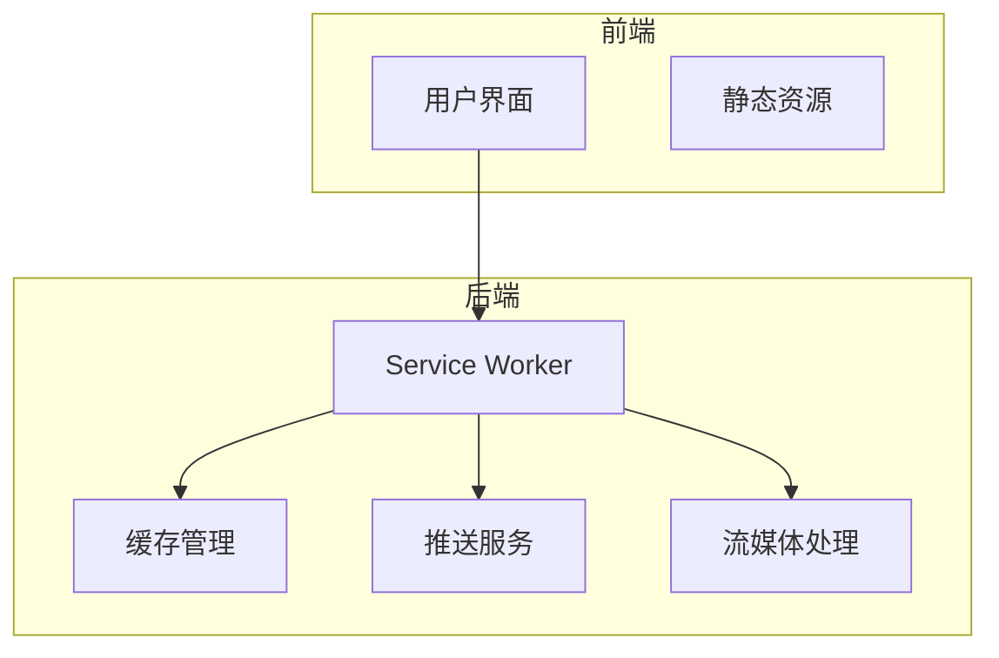
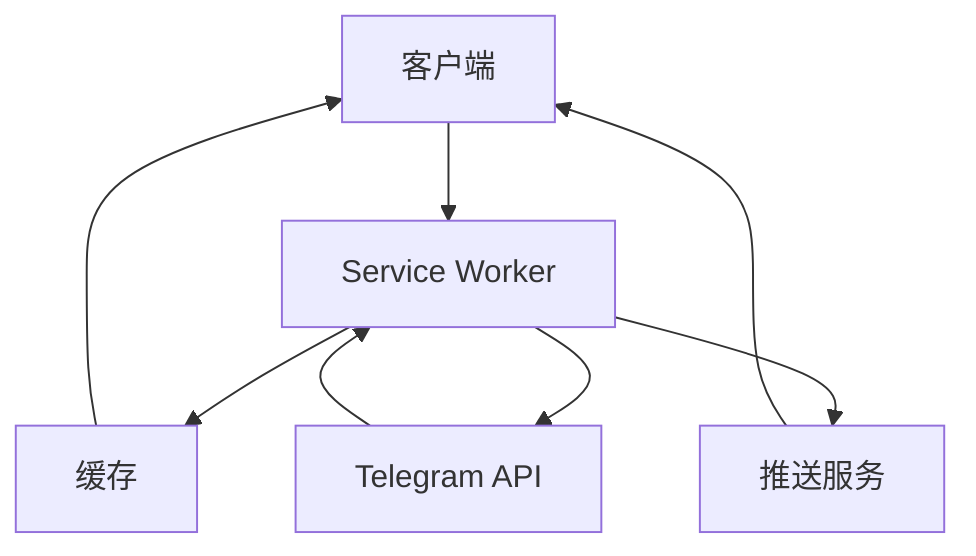
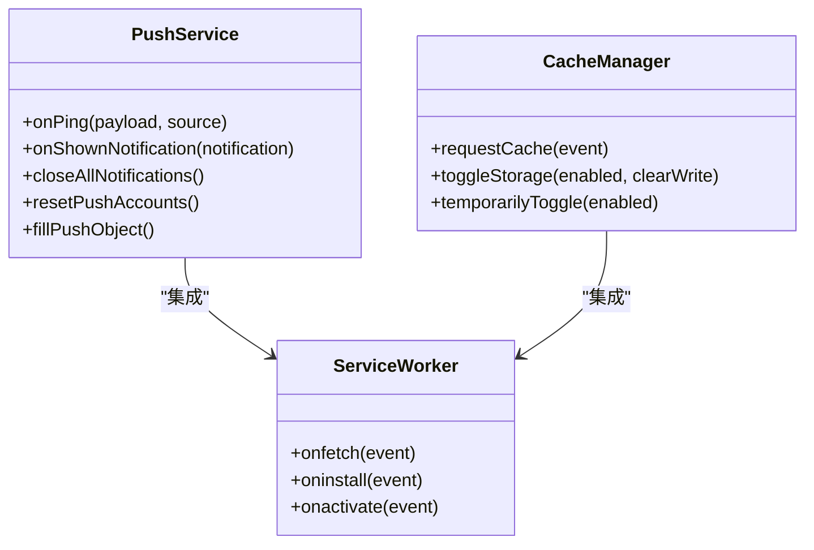
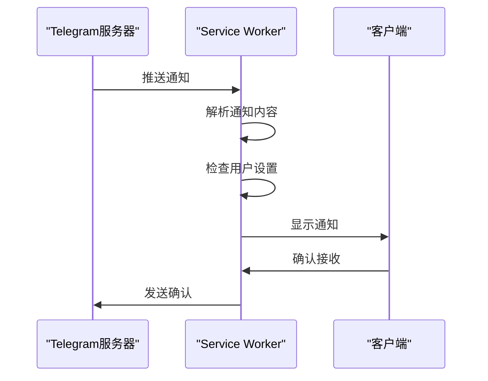
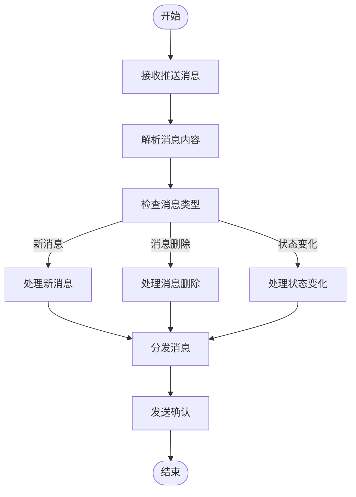
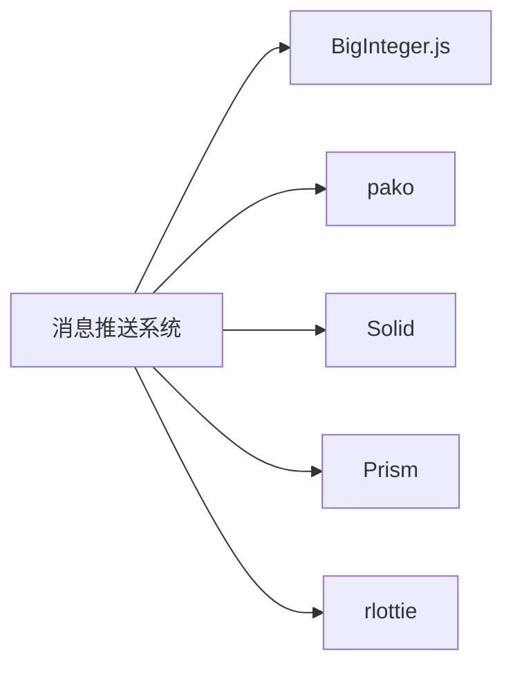

# 消息推送

<cite>
**本文档中引用的文件**  
- [sw.ts](file://sw.ts)
- [index.service.ts](file://src/lib/serviceWorker/index.service.ts)
- [push.ts](file://src/lib/serviceWorker/push.ts)
- [appMessagesManager.ts](file://src/lib/appManagers/appMessagesManager.ts)
- [notifications.ts](file://src/config/notifications.ts)
- [serviceMessagePort.ts](file://src/lib/serviceWorker/serviceMessagePort.ts)
</cite>

## 目录
1. [简介](#简介)
2. [项目结构](#项目结构)
3. [核心组件](#核心组件)
4. [架构概述](#架构概述)
5. [详细组件分析](#详细组件分析)
6. [依赖分析](#依赖分析)
7. [性能考虑](#性能考虑)
8. [故障排除指南](#故障排除指南)
9. [结论](#结论)
10. [附录](#附录)（如有必要）

## 简介
本文档详细描述了基于Telegram Web K的消息推送系统，该系统基于Webogram构建并进行了改进。文档重点阐述了服务端推送更新的处理流程，包括消息接收、解析和分发机制。系统利用Service Worker技术实现后台消息推送，确保即使在应用未打开的情况下也能及时接收通知。文档还解释了不同类型更新（如新消息、消息删除、用户状态变化）的处理方式，记录了更新队列的管理策略和消息去重机制，并提供了客户端如何订阅特定类型更新的指导。此外，文档包含了消息确认机制和可靠性保证的实现细节。

## 项目结构
项目结构清晰地划分了前端资源、源代码和配置文件。`public`目录包含静态资源，`src`目录包含所有源代码，其中`lib/serviceWorker`是消息推送系统的核心。系统通过Service Worker在后台运行，处理推送通知和缓存管理。

**Diagram sources**
- [sw.ts](file://sw.ts#L1-L3)
- [index.service.ts](file://src/lib/serviceWorker/index.service.ts#L1-L321)

**Section sources**
- [sw.ts](file://sw.ts#L1-L3)
- [src](file://src#L1-L100)

## 核心组件
消息推送系统的核心组件包括Service Worker、推送服务、缓存管理和消息分发机制。Service Worker作为后台进程，负责接收和处理推送通知。推送服务处理来自服务器的更新，缓存管理确保资源的高效加载，消息分发机制则负责将更新传递给前端界面。

**Section sources**
- [index.service.ts](file://src/lib/serviceWorker/index.service.ts#L1-L321)
- [push.ts](file://src/lib/serviceWorker/push.ts#L1-L100)

## 架构概述
系统架构采用分层设计，前端通过Service Worker与后端服务通信。Service Worker作为中间层，处理所有网络请求和推送通知，确保应用的离线功能和实时更新。

**Diagram sources**
- [index.service.ts](file://src/lib/serviceWorker/index.service.ts#L1-L321)
- [push.ts](file://src/lib/serviceWorker/push.ts#L1-L100)

## 详细组件分析

### 推送服务分析
推送服务是消息推送系统的核心，负责接收和处理来自服务器的更新。服务通过`push`事件监听器接收推送通知，并根据通知内容进行相应的处理。

#### 推送服务类图

**Diagram sources**
- [push.ts](file://src/lib/serviceWorker/push.ts#L1-L100)
- [index.service.ts](file://src/lib/serviceWorker/index.service.ts#L1-L321)

#### 推送消息处理序列图

**Diagram sources**
- [push.ts](file://src/lib/serviceWorker/push.ts#L1-L100)
- [index.service.ts](file://src/lib/serviceWorker/index.service.ts#L1-L321)

### 消息处理流程分析
消息处理流程包括消息接收、解析、分发和确认。系统通过事件监听器处理不同类型的消息更新，并确保消息的可靠传递。

#### 消息处理流程图

**Diagram sources**
- [appMessagesManager.ts](file://src/lib/appManagers/appMessagesManager.ts#L1-L10133)
- [index.service.ts](file://src/lib/serviceWorker/index.service.ts#L1-L321)

**Section sources**
- [appMessagesManager.ts](file://src/lib/appManagers/appMessagesManager.ts#L1-L10133)
- [push.ts](file://src/lib/serviceWorker/push.ts#L1-L100)

## 依赖分析
系统依赖于多个外部库和内部模块，包括BigInteger.js、pako、Solid等。这些依赖项通过pnpm包管理器进行管理，确保版本一致性和依赖解析的准确性。

**Diagram sources**
- [package.json](file://package.json#L1-L76)
- [README.md](file://README.md#L48-L58)

**Section sources**
- [package.json](file://package.json#L1-L76)
- [README.md](file://README.md#L1-L88)

## 性能考虑
系统通过缓存策略和异步处理优化性能。Service Worker缓存静态资源，减少网络请求。消息处理采用异步机制，避免阻塞主线程，确保应用的响应性。

## 故障排除指南
当遇到推送通知无法接收的问题时，首先检查浏览器的推送权限设置。确保Service Worker已正确注册并激活。可以通过开发者工具的Application面板查看Service Worker状态和缓存内容。

**Section sources**
- [index.service.ts](file://src/lib/serviceWorker/index.service.ts#L1-L321)
- [sw.ts](file://sw.ts#L1-L3)

## 结论
本文档全面介绍了消息推送系统的架构和实现细节。系统通过Service Worker技术实现了高效的后台消息处理和推送通知。核心组件包括推送服务、缓存管理和消息分发机制，确保了消息的可靠传递和应用的离线功能。通过合理的架构设计和性能优化，系统能够提供稳定、高效的消息推送服务。