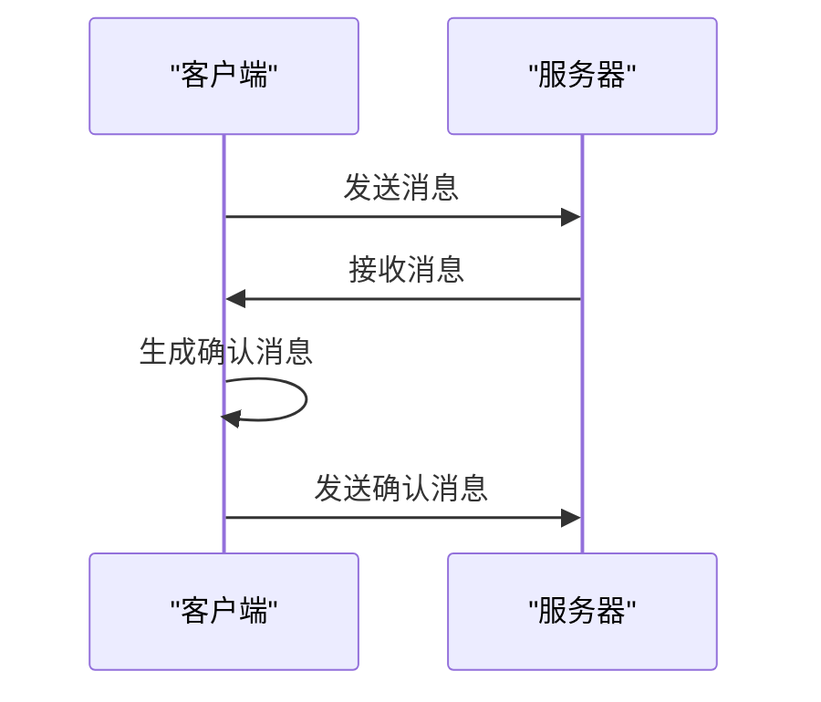
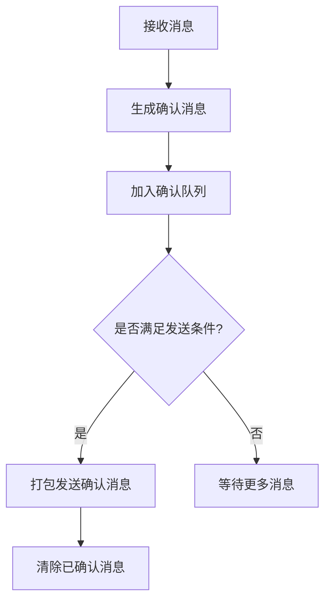

# 消息确认机制

<cite>
**本文档引用的文件**   
- [networker.ts](file://src/lib/mtproto/networker.ts)
- [http.ts](file://src/lib/mtproto/transports/http.ts)
</cite>

## 目录
1. [引言](#引言)
2. [消息确认机制概述](#消息确认机制概述)
3. [确认消息的生成与发送](#确认消息的生成与发送)
4. [超时重试机制](#超时重试机制)
5. [确认队列管理与批量确认](#确认队列管理与批量确认)
6. [网络不稳定情况下的恢复策略](#网络不稳定情况下的恢复策略)
7. [确认消息丢失与重复的处理](#确认消息丢失与重复的处理)
8. [结论](#结论)

## 引言
消息确认机制是确保客户端与服务器之间消息传递可靠性的重要组成部分。在本项目中，该机制通过MTProto协议实现，保证了消息更新的成功处理和防止消息丢失。本文档详细说明了客户端如何向服务器确认已成功处理更新，包括确认消息的生成、发送、超时重试机制以及确认队列的管理方式和批量确认的优化策略。

## 消息确认机制概述
消息确认机制的核心在于确保每条消息都能被正确接收并处理。当客户端接收到服务器的消息后，会立即生成一个确认消息（ack），并将此确认消息加入到待发送队列中。服务器在接收到确认消息后，可以安全地认为该消息已被成功处理，并从其发送队列中移除。这一过程不仅保证了消息传递的可靠性，还有效防止了消息的重复处理。

**Section sources**
- [networker.ts](file://src/lib/mtproto/networker.ts#L1594-L1612)

## 确认消息的生成与发送
确认消息的生成主要通过`ackMessage`方法完成。每当客户端接收到一条新的消息时，系统会调用`ackMessage`方法，将消息ID添加到`pendingAcks`数组中。随后，通过调用`scheduleRequest`方法安排一个延迟任务来发送这些确认消息。如果使用HTTP传输，则确认消息的发送延迟为30秒；否则，立即安排发送。

**Diagram sources **
- [networker.ts](file://src/lib/mtproto/networker.ts#L1594-L1612)

**Section sources**
- [networker.ts](file://src/lib/mtproto/networker.ts#L1594-L1612)

## 超时重试机制
为了应对网络不稳定或服务器故障导致的消息丢失，系统实现了超时重试机制。当客户端发送消息后，在预设的时间内未收到服务器的响应，将触发超时事件。此时，客户端会重新发送该消息，直到收到确认或达到最大重试次数为止。此外，对于长时间未响应的连接，系统还会自动断开并尝试重新建立连接，以确保通信的连续性。

**Section sources**
- [networker.ts](file://src/lib/mtproto/networker.ts#L910-L925)

## 确认队列管理与批量确认
为了提高效率，系统采用了批量确认的方式处理确认消息。所有待确认的消息ID会被收集到`pendingAcks`数组中，当满足一定条件（如达到最大数量或经过特定时间）时，一次性打包成一个`msgs_ack`消息发送给服务器。这种方式减少了网络往返次数，提高了整体性能。同时，系统还维护了一个`sentMessages`对象，用于跟踪已发送但尚未确认的消息，确保每个消息都能得到适当的处理。

**Diagram sources **
- [networker.ts](file://src/lib/mtproto/networker.ts#L1052-L1063)

**Section sources**
- [networker.ts](file://src/lib/mtproto/networker.ts#L1052-L1063)

## 网络不稳定情况下的恢复策略
在网络不稳定的情况下，系统采取了一系列措施来保证消息的可靠传递。首先，通过定期发送心跳包（ping）检测连接状态，一旦发现连接异常，立即启动重连流程。其次，利用`checkConnection`方法周期性检查网络状况，及时发现并处理潜在的问题。最后，对于关键操作，系统会采用更长的超时时间和更多的重试机会，确保即使在网络条件较差的情况下也能顺利完成任务。

**Section sources**
- [networker.ts](file://src/lib/mtproto/networker.ts#L744-L783)

## 确认消息丢失与重复的处理
尽管有完善的确认机制，但在极端情况下仍可能出现确认消息丢失或重复的问题。为此，系统设计了相应的处理策略。对于丢失的确认消息，服务器会在一定时间内保留原始消息副本，等待后续的确认。而对于重复的确认消息，服务器会通过检查消息ID来识别并忽略重复项，避免不必要的处理开销。此外，客户端也会记录已发送的确认消息，防止因网络延迟等原因造成重复发送。

**Section sources**
- [networker.ts](file://src/lib/mtproto/networker.ts#L1867-L1873)

## 结论
综上所述，本项目中的消息确认机制通过一系列精心设计的技术手段，有效地保障了消息传递的可靠性与完整性。无论是正常情况下的高效运行，还是面对网络波动时的稳健恢复，都展现了其强大的适应能力和稳定性。未来，随着技术的发展和需求的变化，我们还将持续优化和完善这一机制，为用户提供更加优质的服务体验。