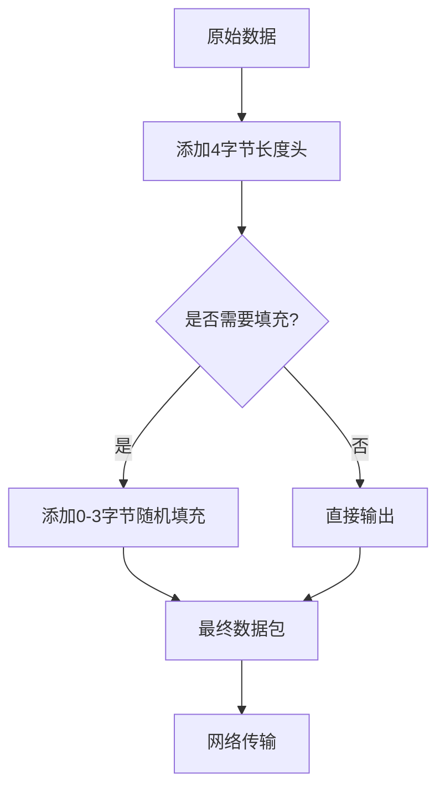
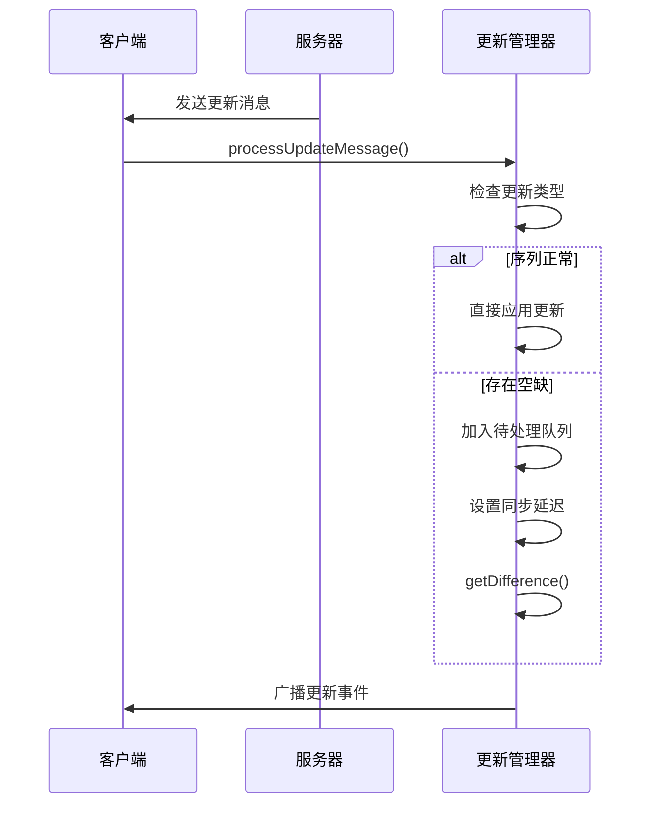
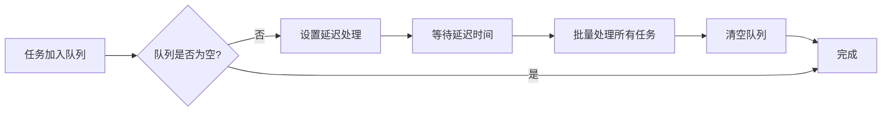

# 增量更新机制

<cite>
**本文档中引用的文件**
- [apiUpdatesManager.ts](file://src/lib/appManagers/apiUpdatesManager.ts)
- [storage.ts](file://src/lib/storage.ts)
- [cacheStorage.ts](file://src/lib/files/cacheStorage.ts)
- [debounce.ts](file://src/helpers/schedulers/debounce.ts)
- [heavyQueue.ts](file://src/helpers/heavyQueue.ts)
- [lazyLoadQueueBase.ts](file://src/components/lazyLoadQueueBase.ts)
</cite>

## 目录
1. [增量更新机制](#增量更新机制)
2. [增量更新的触发条件和数据差异计算算法](#增量更新的触发条件和数据差异计算算法)
3. [增量数据包的结构和压缩策略](#增量数据包的结构和压缩策略)
4. [增量更新的处理流程、应用顺序和依赖关系管理](#增量更新的处理流程应用顺序和依赖关系管理)
5. [断点续传、数据校验和错误恢复机制](#断点续传数据校验和错误恢复机制)
6. [增量更新性能优化技巧](#增量更新性能优化技巧)

## 增量更新的触发条件和数据差异计算算法

增量更新机制主要通过 `apiUpdatesManager.ts` 文件中的 `ApiUpdatesManager` 类实现。该类负责管理应用的更新状态，包括处理来自服务器的更新消息和同步本地状态。

增量更新的触发条件包括：
- 应用启动时首次加载状态
- 检测到序列号（seq）或消息点（pts）出现空缺
- 收到 `updatesTooLong` 或 `new_session_created` 类型的更新消息
- 通道状态过期需要重新获取差异

数据差异计算算法的核心是通过 `getDifference` 方法从服务器获取状态差异。该方法会：
1. 检查当前同步状态，初始化待处理的更新队列
2. 调用 `updates.getDifference` API 获取差异结果
3. 处理不同类型的差异结果：
   - `updates.differenceEmpty`：应用空差异，更新序列号和时间戳
   - `updates.difference`：应用完整差异，更新用户、聊天信息和消息
   - `updates.differenceSlice`：继续获取更多差异片段
   - `updates.differenceTooLong`：重置状态并重新同步

对于通道更新，使用 `getChannelDifference` 方法获取特定通道的差异，处理逻辑类似但针对特定通道的 pts 值。

**Section sources**
- [apiUpdatesManager.ts](file://src/lib/appManagers/apiUpdatesManager.ts#L279-L365)
- [apiUpdatesManager.ts](file://src/lib/appManagers/apiUpdatesManager.ts#L381-L449)

## 增量数据包的结构和压缩策略

增量数据包的结构主要由 Telegram MTProto 协议定义，通过不同的传输编解码器实现。在代码库中，主要有两种传输编解码器：

1. **IntermediatePacketCodec**：基础的中间包编解码器
   - 使用 4 字节头部表示数据包长度
   - 数据对齐到 4 字节边界
   - 适用于常规数据传输

2. **PaddedIntermediatePacketCodec**：带填充的中间包编解码器
   - 在基础编解码器上添加随机填充字节（0-3 字节）
   - 填充字节在解码时被忽略
   - 用于 obfuscation（混淆）目的

压缩策略主要体现在：
- 数据包头部使用紧凑的二进制格式
- 仅传输变化的数据，而非完整状态
- 使用增量更新（pts）而非全量同步
- 对于大文件传输，可能使用分块传输编码

数据包的编码和解码过程确保了传输效率和安全性，同时通过填充机制增加了协议的抗分析能力。

**Diagram sources**
- [intermediate.ts](file://src/lib/mtproto/transports/intermediate.ts#L15-L24)
- [padded.ts](file://src/lib/mtproto/transports/padded.ts#L15-L22)

## 增量更新的处理流程、应用顺序和依赖关系管理

增量更新的处理流程是一个复杂的异步过程，涉及多个状态管理和错误处理机制。主要流程如下：

1. **更新接收**：通过 `processUpdateMessage` 方法接收更新消息
2. **类型分发**：根据更新类型（updateShort, updatesCombined 等）进行分发处理
3. **状态检查**：检查当前同步状态，决定是否立即处理或延迟处理
4. **差异处理**：对于序列号或消息点空缺，将更新加入待处理队列
5. **批量应用**：当满足条件时，批量应用待处理的更新

应用顺序遵循严格的规则：
- 按序列号（seq）和消息点（pts）的顺序应用更新
- 先处理 `other_updates`，再处理新消息
- 通道更新与全局更新分开处理，避免冲突

依赖关系管理通过以下机制实现：
- 使用 `pendingSeqUpdates` 和 `pendingPtsUpdates` 队列管理未按序到达的更新
- 通过 `syncPending` 标记同步状态，防止并发同步操作
- 使用代理（Proxy）拦截状态变更，确保状态持久化

错误处理机制包括：
- 检测到 `pts hole` 或 `seq hole` 时触发重新同步
- 处理 `updates.differenceTooLong` 情况，重置所有管理器状态
- 超时机制防止同步操作无限期挂起

**Diagram sources**
- [apiUpdatesManager.ts](file://src/lib/appManagers/apiUpdatesManager.ts#L182-L253)
- [apiUpdatesManager.ts](file://src/lib/appManagers/apiUpdatesManager.ts#L496-L667)

## 断点续传、数据校验和错误恢复机制

断点续传机制通过持久化存储更新状态实现。`updatesState` 对象包含关键的同步信息：
- `pts`：消息点，标识消息序列
- `seq`：序列号，标识全局更新序列
- `date`：时间戳，用于时间同步

这些状态通过 `appStateManager` 持久化存储，在应用重启后可以恢复同步位置，实现断点续传。

数据校验机制包括：
- 序列号和消息点的连续性检查
- 更新消息的完整性验证
- 状态同步后的数据一致性检查

错误恢复机制主要体现在：
1. **空缺检测与恢复**：
   - 当检测到 `pts hole` 或 `seq hole` 时，设置 `syncPending` 标记
   - 延迟一段时间后自动触发 `getDifference` 重新获取差异
   - 避免频繁的同步请求，使用 `SYNC_DELAY` 常量控制重试间隔

2. **严重错误处理**：
   - 遇到 `updates.differenceTooLong` 时，调用 `onDifferenceTooLong`
   - 清除所有管理器状态，强制全量同步
   - 触发 `state_cleared` 事件通知系统重置

3. **超时与重试**：
   - 使用 `setTimeout` 实现同步操作的超时控制
   - 网络错误时自动重试，但避免无限循环
   - 通过 `ignoreSyncLoading` 选项控制是否忽略当前同步状态

4. **状态持久化与恢复**：
   - 使用代理（Proxy）拦截状态变更，自动保存到持久化存储
   - 应用启动时优先从持久化存储恢复状态
   - 版本升级时处理状态迁移

这些机制共同确保了增量更新系统的可靠性和鲁棒性，即使在网络不稳定或应用异常退出的情况下也能正确恢复。

**Section sources**
- [apiUpdatesManager.ts](file://src/lib/appManagers/apiUpdatesManager.ts#L577-L593)
- [apiUpdatesManager.ts](file://src/lib/appManagers/apiUpdatesManager.ts#L621-L647)
- [apiUpdatesManager.ts](file://src/lib/appManagers/apiUpdatesManager.ts#L452-L461)
- [apiUpdatesManager.ts](file://src/lib/appManagers/apiUpdatesManager.ts#L74-L73)

## 增量更新性能优化技巧

增量更新系统采用了多种性能优化技巧，包括批量处理和优先级调度机制。

### 批量处理优化

1. **延迟执行（Debounce）**：
   - 使用 `debounce` 工具函数实现函数调用的去抖动
   - 将短时间内多次调用合并为一次执行
   - 例如 `debouncedUpdateStarsBalance` 用于延迟更新星币余额

2. **队列批处理**：
   - `BatchProcessor` 类实现批量处理逻辑
   - 将多个操作加入队列，延迟一段时间后批量执行
   - 减少频繁的状态更新和事件广播

3. **重负载任务分片**：
   - `heavyQueue` 机制将重负载任务分片执行
   - 每个时间片处理有限数量的任务（约6ms内）
   - 使用 `fastRaf` 在动画帧间隙执行，避免阻塞UI

**Diagram sources**
- [debounce.ts](file://src/helpers/schedulers/debounce.ts#L13-L79)
- [heavyQueue.ts](file://src/helpers/heavyQueue.ts#L54-L83)

### 优先级调度优化

1. **懒加载队列**：
   - `LazyLoadQueueBase` 实现优先级调度
   - 支持并行处理限制（parallelLimit）
   - 通过 `throttle` 控制处理频率

2. **可见性感知加载**：
   - `LazyLoadQueueIntersector` 结合 Intersection Observer
   - 优先加载可见区域的内容
   - 隐藏元素的加载可以被中断或延迟

3. **任务优先级管理**：
   - 使用 `push` 和 `unshift` 控制任务优先级
   - 高优先级任务插入队列头部
   - 支持动态调整任务优先级

4. **资源使用控制**：
   - 限制同时处理的任务数量
   - 支持队列锁定和解锁
   - 避免在后台或节电模式下执行重负载任务

这些优化技巧确保了增量更新系统在保持高效同步的同时，不会对用户体验造成负面影响，特别是在低性能设备或弱网络环境下。

**Section sources**
- [debounce.ts](file://src/helpers/schedulers/debounce.ts#L13-L79)
- [heavyQueue.ts](file://src/helpers/heavyQueue.ts#L45-L88)
- [lazyLoadQueueBase.ts](file://src/components/lazyLoadQueueBase.ts#L31-L32)
- [lazyLoadQueueIntersector.ts](file://src/components/lazyLoadQueueIntersector.ts#L18-L53)