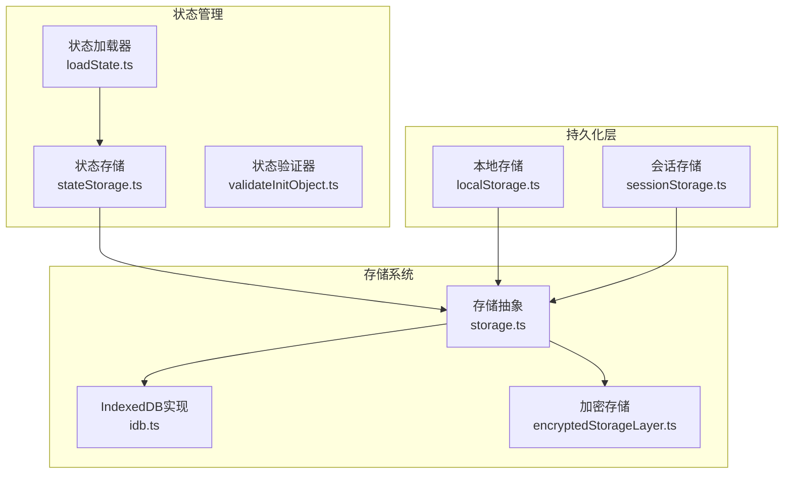
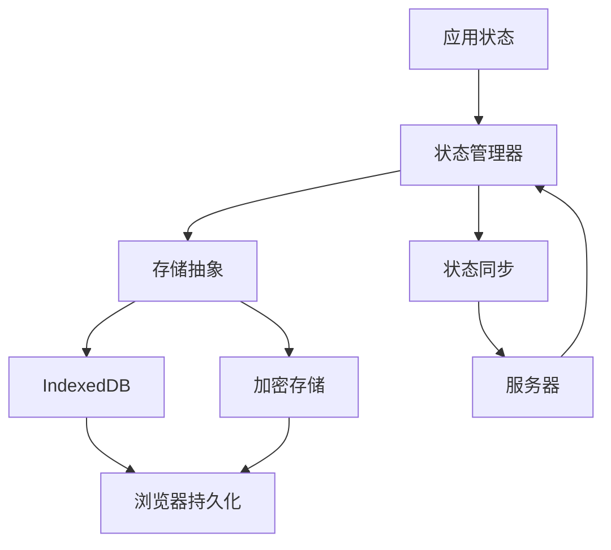
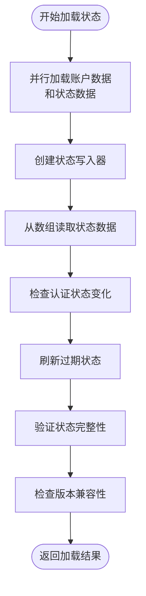
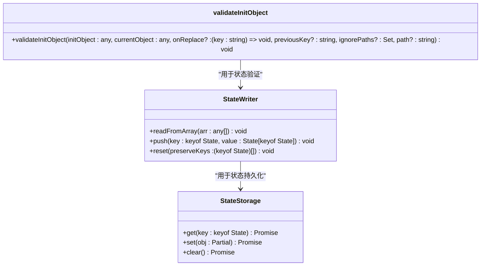
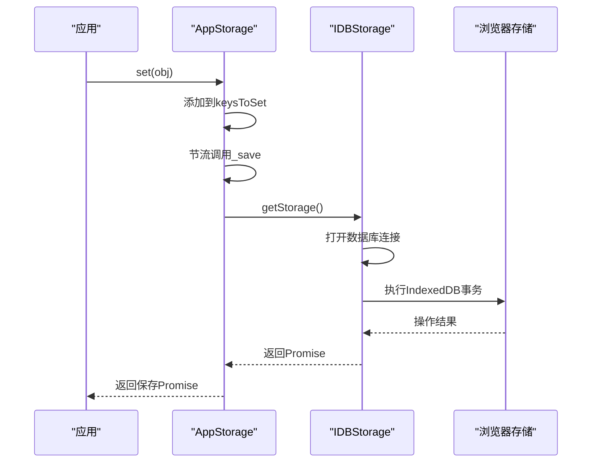
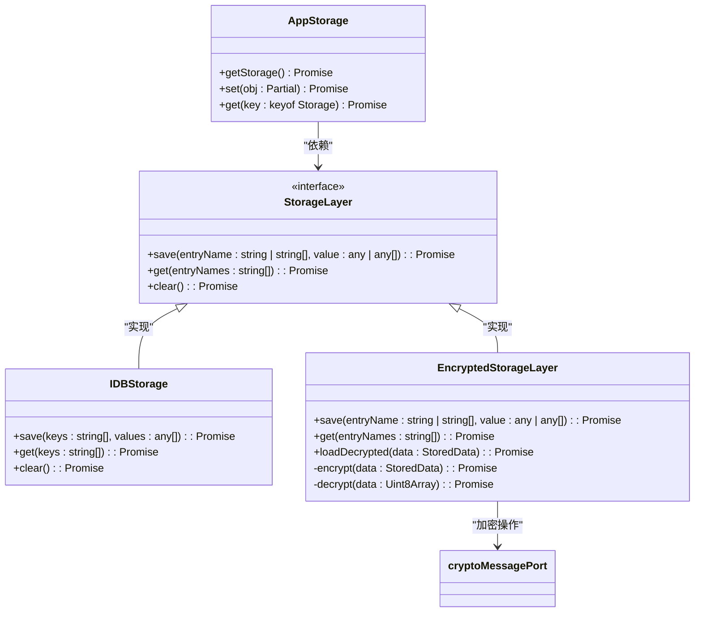
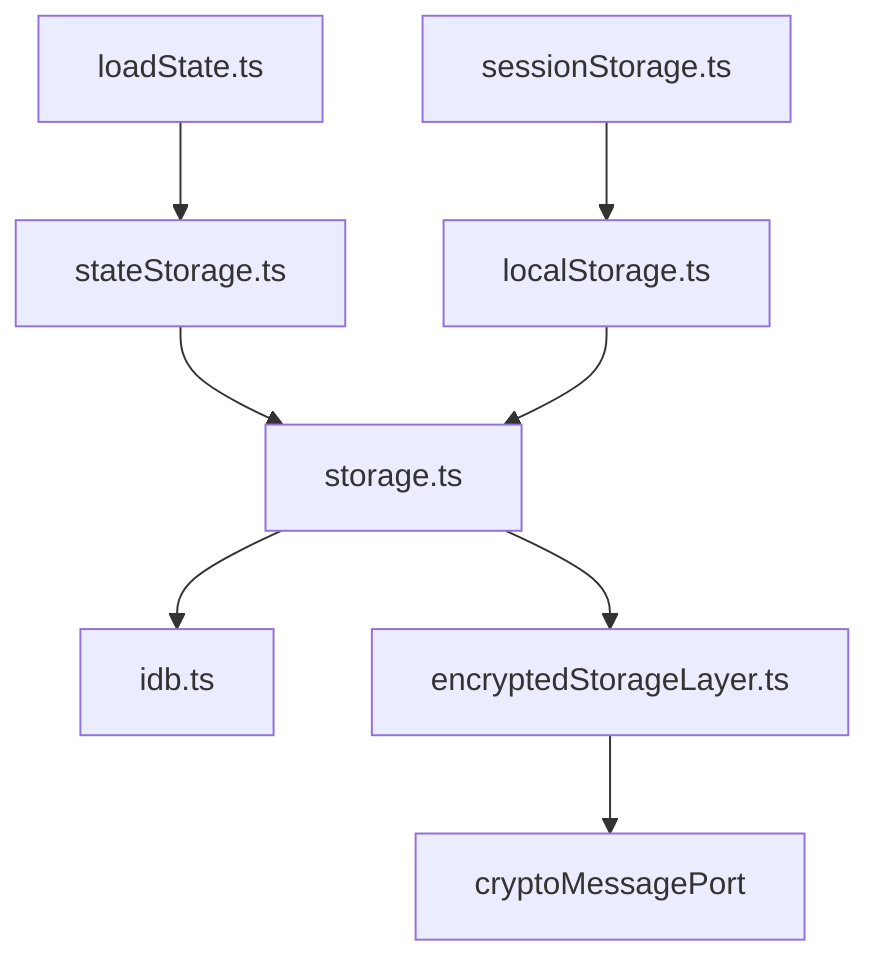

# 数据一致性保证

<cite>
**本文档引用的文件**   
- [loadState.ts](file://src/lib/appManagers/utils/state/loadState.ts)
- [stateStorage.ts](file://src/lib/stateStorage.ts)
- [localStorage.ts](file://src/lib/localStorage.ts)
- [sessionStorage.ts](file://src/lib/sessionStorage.ts)
- [storage.ts](file://src/lib/storage.ts)
- [idb.ts](file://src/lib/files/idb.ts)
- [encryptedStorageLayer.ts](file://src/lib/encryptedStorageLayer.ts)
- [validateInitObject.ts](file://src/helpers/object/validateInitObject.ts)
</cite>

## 目录
1. [简介](#简介)
2. [项目结构](#项目结构)
3. [核心组件](#核心组件)
4. [架构概述](#架构概述)
5. [详细组件分析](#详细组件分析)
6. [依赖分析](#依赖分析)
7. [性能考虑](#性能考虑)
8. [故障排除指南](#故障排除指南)
9. [结论](#结论)
10. [附录](#附录) (如有必要)

## 简介
本文档详细阐述了tweb项目中数据一致性保证机制的设计与实现。该系统通过多层次的状态管理、本地存储和服务器同步策略，确保了客户端本地状态与服务器状态的一致性。文档将深入分析状态加载、数据验证、冲突解决、事务性操作和异常恢复等关键机制，为理解系统的数据完整性保障提供全面的技术参考。

## 项目结构
tweb项目采用模块化的前端架构，其数据一致性机制主要分布在`src/lib`目录下的多个子模块中。核心的状态管理和持久化逻辑位于`appManagers/utils/state`、`storages`和`files`等目录。系统使用IndexedDB作为主要的本地存储后端，并通过`storage.ts`和`idb.ts`文件提供了抽象层来管理数据库操作。状态初始化和迁移逻辑在`loadState.ts`中实现，而加密存储功能则由`encryptedStorageLayer.ts`提供。

**图表来源**
- [loadState.ts](file://src/lib/appManagers/utils/state/loadState.ts#L1-L505)
- [storage.ts](file://src/lib/storage.ts#L1-L490)
- [idb.ts](file://src/lib/files/idb.ts#L1-L501)

**本节来源**
- [src/lib/appManagers/utils/state/loadState.ts](file://src/lib/appManagers/utils/state/loadState.ts#L1-L505)
- [src/lib/storage.ts](file://src/lib/storage.ts#L1-L490)

## 核心组件
数据一致性保证机制的核心在于状态的加载、验证和持久化。系统通过`loadStateForAccount`函数在应用启动时加载用户状态，该函数会从`StateStorage`中读取序列化的状态数据，并通过`StateWriter`进行反序列化和验证。状态验证过程确保了本地状态与当前应用版本的兼容性，当检测到版本不匹配时，系统会执行相应的迁移策略。`StateStorage`类封装了对IndexedDB的访问，提供了类型安全的存储接口。

**本节来源**
- [loadState.ts](file://src/lib/appManagers/utils/state/loadState.ts#L243-L279)
- [stateStorage.ts](file://src/lib/stateStorage.ts#L1-L28)

## 架构概述
系统的数据一致性架构采用分层设计，从上至下分为状态管理层、存储抽象层和持久化层。状态管理层负责业务逻辑状态的维护和验证；存储抽象层提供统一的API来访问不同类型的存储；持久化层则直接与浏览器的存储API（如IndexedDB）交互。这种分层架构使得状态管理逻辑与底层存储实现解耦，提高了系统的可维护性和可扩展性。

**图表来源**
- [storage.ts](file://src/lib/storage.ts#L46-L490)
- [encryptedStorageLayer.ts](file://src/lib/encryptedStorageLayer.ts#L29-L230)

## 详细组件分析

### 状态加载与验证组件分析
状态加载与验证是确保数据一致性的第一步。系统在启动时会执行一系列步骤来加载和验证用户状态。

#### 状态加载流程

**图表来源**
- [loadState.ts](file://src/lib/appManagers/utils/state/loadState.ts#L243-L279)

#### 状态验证机制
系统通过`validateInitObject`函数实现状态验证，该函数递归地检查当前状态对象与初始状态对象的结构一致性。

**图表来源**
- [validateInitObject.ts](file://src/helpers/object/validateInitObject.ts#L1-L26)
- [loadState.ts](file://src/lib/appManagers/utils/state/loadState.ts#L111-L153)

**本节来源**
- [loadState.ts](file://src/lib/appManagers/utils/state/loadState.ts#L160-L205)
- [validateInitObject.ts](file://src/helpers/object/validateInitObject.ts#L1-L26)

### 存储抽象组件分析
存储抽象层是连接上层应用逻辑与底层持久化机制的桥梁。

#### 存储操作流程

**图表来源**
- [storage.ts](file://src/lib/storage.ts#L121-L161)
- [idb.ts](file://src/lib/files/idb.ts#L417-L501)

#### 加密存储实现
对于敏感数据，系统提供了加密存储功能，确保数据在磁盘上的安全性。

**图表来源**
- [storage.ts](file://src/lib/storage.ts#L46-L490)
- [encryptedStorageLayer.ts](file://src/lib/encryptedStorageLayer.ts#L29-L230)

**本节来源**
- [storage.ts](file://src/lib/storage.ts#L46-L490)
- [encryptedStorageLayer.ts](file://src/lib/encryptedStorageLayer.ts#L29-L230)

## 依赖分析
数据一致性系统依赖于多个核心模块的协同工作。`AppStorage`作为存储抽象层，依赖于`IDBStorage`和`EncryptedStorageLayer`来实现具体的持久化操作。状态管理模块依赖于`StateStorage`来持久化应用状态，而`StateStorage`又依赖于`AppStorage`。这种依赖关系形成了一个清晰的层次结构，确保了各组件职责的单一性。

**图表来源**
- [loadState.ts](file://src/lib/appManagers/utils/state/loadState.ts#L7-L27)
- [storage.ts](file://src/lib/storage.ts#L12-L23)
- [encryptedStorageLayer.ts](file://src/lib/encryptedStorageLayer.ts#L9-L14)

**本节来源**
- [loadState.ts](file://src/lib/appManagers/utils/state/loadState.ts#L7-L27)
- [storage.ts](file://src/lib/storage.ts#L12-L23)

## 性能考虑
系统在设计数据一致性机制时充分考虑了性能因素。通过节流（throttle）机制，`AppStorage`将频繁的存储操作合并为批次执行，减少了IndexedDB事务的开销。`getObjectStore`方法中的`durability: 'relaxed'`配置牺牲了一定的持久性保证来换取更高的写入性能。此外，系统使用内存缓存来减少对底层存储的访问频率，只有在必要时才将变更持久化到磁盘。

## 故障排除指南
当遇到数据一致性问题时，可以按照以下步骤进行排查：
1. 检查浏览器控制台是否有存储相关的错误信息
2. 验证IndexedDB数据库是否被正确创建和访问
3. 检查状态版本是否与当前应用版本兼容
4. 确认加密密钥是否正确加载（对于加密存储）
5. 查看网络请求，确认服务器同步是否正常完成

**本节来源**
- [idb.ts](file://src/lib/files/idb.ts#L430-L435)
- [loadState.ts](file://src/lib/appManagers/utils/state/loadState.ts#L206-L228)

## 结论
tweb项目的数据一致性保证机制通过精心设计的分层架构和严谨的状态管理策略，有效地维护了本地状态与服务器状态的一致性。系统通过版本控制、状态验证和自动迁移机制，确保了应用在不同版本间的平滑过渡。存储抽象层的设计使得系统能够灵活应对不同的存储需求，包括对敏感数据的加密存储。整体而言，该机制为应用的稳定运行提供了坚实的基础。