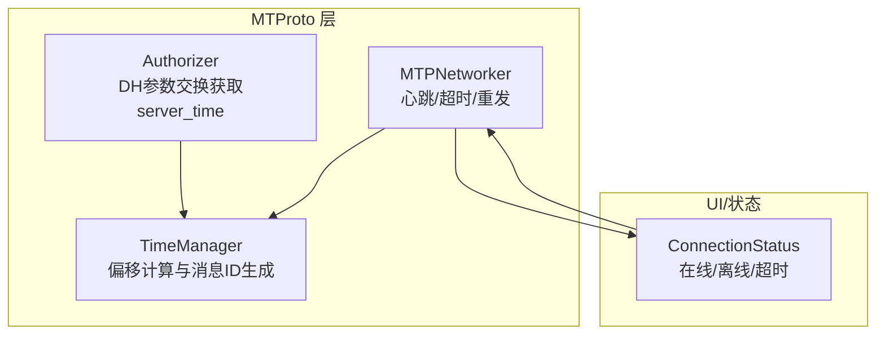
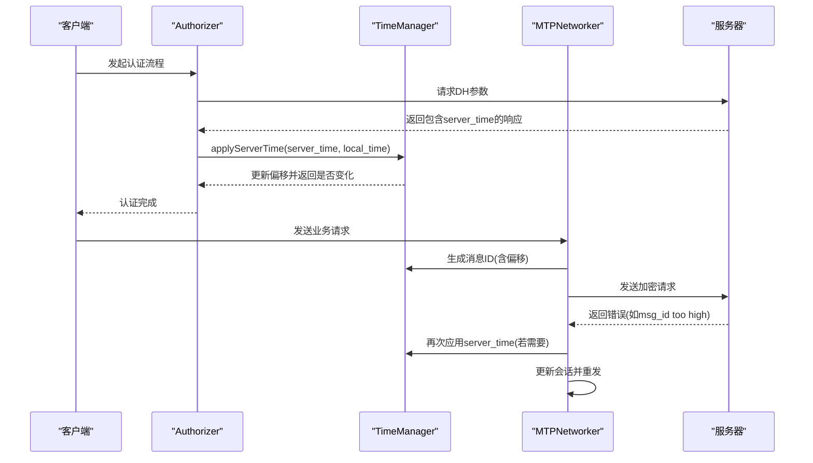
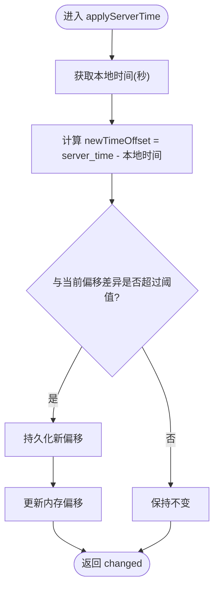
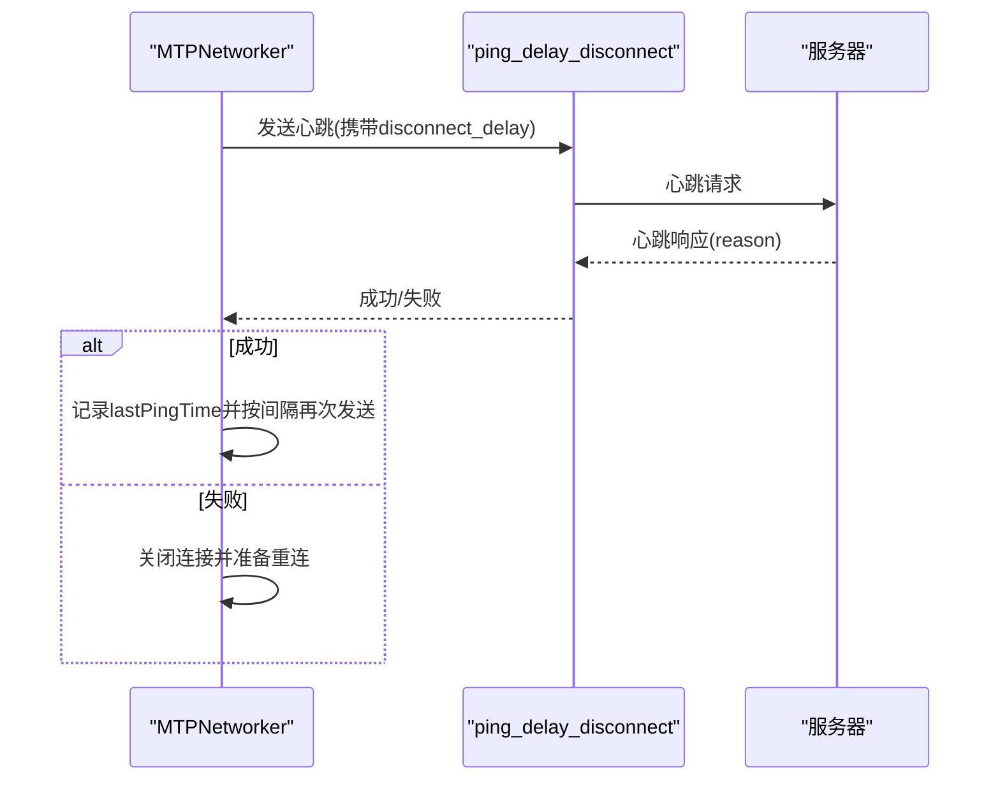
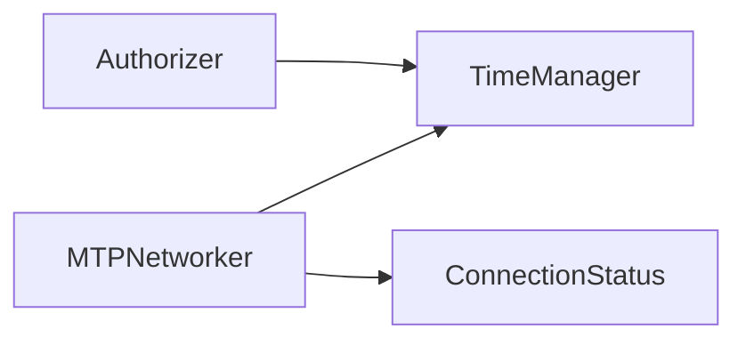

# 时间同步机制

<cite>
**本文引用的文件**
- [timeManager.ts](file://src/lib/mtproto/timeManager.ts)
- [authorizer.ts](file://src/lib/mtproto/authorizer.ts)
- [networker.ts](file://src/lib/mtproto/networker.ts)
- [connectionStatus.ts](file://src/components/connectionStatus.ts)
</cite>

## 目录
1. [引言](#引言)
2. [项目结构](#项目结构)
3. [核心组件](#核心组件)
4. [架构总览](#架构总览)
5. [详细组件分析](#详细组件分析)
6. [依赖关系分析](#依赖关系分析)
7. [性能考量](#性能考量)
8. [故障排查指南](#故障排查指南)
9. [结论](#结论)

## 引言
本文件系统性梳理客户端侧的时间同步机制，重点覆盖以下方面：
- 客户端如何接收并应用服务器时间，实现本地时钟偏移的计算与校准
- 消息时间戳生成、会话超时与安全验证中的时间影响
- 触发条件、频率控制与异常处理策略
- 精度测试方法与性能优化建议（含网络延迟补偿与时钟漂移预测思路）

说明：该仓库未实现标准 NTP 协议客户端；时间同步基于 MTProto 认证流程中服务器返回的“服务器时间”字段进行偏移校准，并通过心跳与重连策略维持连接健康。

## 项目结构
围绕时间同步的关键模块与交互如下：
- TimeManager：负责读取持久化的时钟偏移、生成带偏移的消息 ID、应用服务器时间并更新偏移
- Authorizer：在 DH 参数交换阶段从响应中提取服务器时间，调用 TimeManager 应用偏移
- MTPNetworker：在错误码指示时间相关问题或连接状态变化时，重新计算会话并触发重发
- 连接状态组件：在网络波动或超时时调整重连策略，间接影响时间同步的稳定性

图表来源
- [timeManager.ts](file://src/lib/mtproto/timeManager.ts#L1-L117)
- [authorizer.ts](file://src/lib/mtproto/authorizer.ts#L400-L460)
- [networker.ts](file://src/lib/mtproto/networker.ts#L602-L742)
- [connectionStatus.ts](file://src/components/connectionStatus.ts#L119-L196)

章节来源
- [timeManager.ts](file://src/lib/mtproto/timeManager.ts#L1-L117)
- [authorizer.ts](file://src/lib/mtproto/authorizer.ts#L400-L460)
- [networker.ts](file://src/lib/mtproto/networker.ts#L602-L742)
- [connectionStatus.ts](file://src/components/connectionStatus.ts#L119-L196)

## 核心组件
- TimeManager
  - 负责加载持久化偏移、生成带偏移的时间戳消息 ID、应用服务器时间并更新偏移
  - 关键接口路径：[applyServerTime](file://src/lib/mtproto/timeManager.ts#L99-L116)、[generateId](file://src/lib/mtproto/timeManager.ts#L73-L97)
- Authorizer
  - 在解密服务器 DH 响应时提取 server_time 与本地时间，调用 TimeManager.applyServerTime
  - 关键路径：[decryptServerDhDataAnswer](file://src/lib/mtproto/authorizer.ts#L404-L452)
- MTPNetworker
  - 心跳 ping_delay_disconnect 维持连接健康；当收到“消息ID过高/过低”等错误时，可能触发会话更新与重发
  - 关键路径：[sendPingDelayDisconnect](file://src/lib/mtproto/networker.ts#L602-L671)、[performScheduledRequest](file://src/lib/mtproto/networker.ts#L1039-L1213)
- 连接状态组件
  - 在超时/离线/重连场景下驱动网络器行为，间接影响时间同步稳定性
  - 关键路径：[setState](file://src/components/connectionStatus.ts#L154-L196)

章节来源
- [timeManager.ts](file://src/lib/mtproto/timeManager.ts#L1-L117)
- [authorizer.ts](file://src/lib/mtproto/authorizer.ts#L400-L460)
- [networker.ts](file://src/lib/mtproto/networker.ts#L602-L742)
- [connectionStatus.ts](file://src/components/connectionStatus.ts#L119-L196)

## 架构总览
下图展示时间同步在认证与网络层的流转：

图表来源
- [authorizer.ts](file://src/lib/mtproto/authorizer.ts#L404-L452)
- [timeManager.ts](file://src/lib/mtproto/timeManager.ts#L99-L116)
- [networker.ts](file://src/lib/mtproto/networker.ts#L602-L742)

## 详细组件分析

### TimeManager：偏移计算与消息ID生成
- 偏移加载
  - 启动时从持久化存储读取 server_time_offset，作为初始偏移
  - 参考路径：[after 初始化](file://src/lib/mtproto/timeManager.ts#L44-L53)
- 偏移应用
  - 接收 server_time 与 local_time，计算 newTimeOffset = server_time - floor(local_time/1000)
  - 当新旧偏移绝对差超过阈值时，更新偏移并持久化
  - 参考路径：[applyServerTime](file://src/lib/mtproto/timeManager.ts#L99-L116)
- 消息ID生成
  - 使用当前毫秒时间戳，加上 server_time_offset 得到秒级时间戳
  - 结合随机数与序列位生成唯一消息ID，保证单调递增
  - 参考路径：[generateId](file://src/lib/mtproto/timeManager.ts#L73-L97)

图表来源
- [timeManager.ts](file://src/lib/mtproto/timeManager.ts#L99-L116)

章节来源
- [timeManager.ts](file://src/lib/mtproto/timeManager.ts#L44-L116)

### Authorizer：从服务器时间获取并应用偏移
- 在解密服务器 DH 响应后，提取 server_time 与 local_time 并调用 TimeManager.applyServerTime
- 参考路径：[decryptServerDhDataAnswer](file://src/lib/mtproto/authorizer.ts#L404-L452)

章节来源
- [authorizer.ts](file://src/lib/mtproto/authorizer.ts#L404-L452)

### MTPNetworker：心跳、超时与重发
- 心跳策略
  - 定期发送 ping_delay_disconnect，根据上次 ping 耗时动态计算断开等待时间
  - 若超时则关闭连接，触发重连
  - 参考路径：[sendPingDelayDisconnect](file://src/lib/mtproto/networker.ts#L602-L671)
- 错误处理与重发
  - 收到“消息ID过高/过低”等错误时，可能触发会话更新与重发
  - 参考路径：[performScheduledRequest 中的重发逻辑](file://src/lib/mtproto/networker.ts#L1039-L1213)
- 连接状态切换
  - 超时/离线时设置状态并延时重试，恢复后继续发送
  - 参考路径：[setConnectionStatus](file://src/lib/mtproto/networker.ts#L956-L986)、[toggleOffline](file://src/lib/mtproto/networker.ts#L797-L838)

图表来源
- [networker.ts](file://src/lib/mtproto/networker.ts#L602-L671)

章节来源
- [networker.ts](file://src/lib/mtproto/networker.ts#L602-L742)
- [networker.ts](file://src/lib/mtproto/networker.ts#L956-L986)
- [networker.ts](file://src/lib/mtproto/networker.ts#L1039-L1213)

### 连接状态组件：超时与重连
- 在超时/离线状态下，显示重连倒计时与按钮，驱动网络器重连
- 参考路径：[setState](file://src/components/connectionStatus.ts#L154-L196)

章节来源
- [connectionStatus.ts](file://src/components/connectionStatus.ts#L119-L196)

## 依赖关系分析
- TimeManager 为 MTProto 层提供统一的时间偏移与消息ID生成能力
- Authorizer 在认证阶段将服务器时间注入 TimeManager
- MTPNetworker 在运行期使用 TimeManager 的偏移生成消息ID，并在错误与超时场景下维护会话一致性
- 连接状态组件通过 UI 与网络器联动，保障时间同步的连续性

图表来源
- [authorizer.ts](file://src/lib/mtproto/authorizer.ts#L404-L452)
- [timeManager.ts](file://src/lib/mtproto/timeManager.ts#L73-L116)
- [networker.ts](file://src/lib/mtproto/networker.ts#L602-L742)
- [connectionStatus.ts](file://src/components/connectionStatus.ts#L119-L196)

章节来源
- [authorizer.ts](file://src/lib/mtproto/authorizer.ts#L404-L452)
- [timeManager.ts](file://src/lib/mtproto/timeManager.ts#L73-L116)
- [networker.ts](file://src/lib/mtproto/networker.ts#L602-L742)
- [connectionStatus.ts](file://src/components/connectionStatus.ts#L119-L196)

## 性能考量
- 心跳频率与断开等待
  - 心跳间隔与最大耗时决定断开等待时间，避免频繁断开造成抖动
  - 参考路径：[心跳配置与计算](file://src/lib/mtproto/networker.ts#L602-L671)
- 消息ID生成
  - 偏移参与消息ID生成，确保跨设备/多账户时间偏差下的唯一性与顺序性
  - 参考路径：[generateId](file://src/lib/mtproto/timeManager.ts#L73-L97)
- 重发与会话更新
  - 在错误码触发时更新会话并重发，减少因时间偏差导致的重复消息与丢包
  - 参考路径：[performScheduledRequest](file://src/lib/mtproto/networker.ts#L1039-L1213)

[本节为通用指导，不直接分析具体文件]

## 故障排查指南
- 服务器时间与本地时间偏差过大
  - 现象：持续触发“消息ID过高/过低”等错误，频繁重发
  - 处理：确认 TimeManager.applyServerTime 是否被正确调用；检查 Authorizer 流程是否成功提取 server_time
  - 参考路径：[applyServerTime](file://src/lib/mtproto/timeManager.ts#L99-L116)、[decryptServerDhDataAnswer](file://src/lib/mtproto/authorizer.ts#L404-L452)
- 心跳超时导致频繁断开
  - 现象：连接不稳定，反复超时
  - 处理：观察 lastPingTime 与断开等待时间；适当增大 pingInterval 或降低 pingMaxTime
  - 参考路径：[sendPingDelayDisconnect](file://src/lib/mtproto/networker.ts#L602-L671)
- UI 显示超时/重连
  - 现象：界面提示超时并显示重连倒计时
  - 处理：关注 ConnectionStatus 的状态切换与重连逻辑
  - 参考路径：[setState](file://src/components/connectionStatus.ts#L154-L196)

章节来源
- [timeManager.ts](file://src/lib/mtproto/timeManager.ts#L99-L116)
- [authorizer.ts](file://src/lib/mtproto/authorizer.ts#L404-L452)
- [networker.ts](file://src/lib/mtproto/networker.ts#L602-L671)
- [connectionStatus.ts](file://src/components/connectionStatus.ts#L154-L196)

## 结论
- 该客户端采用“服务器时间 + 本地时间”的偏移校准方式，而非标准 NTP 客户端实现
- TimeManager 提供偏移加载、应用与消息ID生成；Authorizer 在认证阶段注入服务器时间；MTPNetworker 通过心跳与错误处理维持连接健康
- 建议在现有基础上引入网络延迟补偿与漂移预测（如指数平滑）以进一步提升精度与稳定性，但需评估对现有消息ID与会话一致性的兼容性

[本节为总结性内容，不直接分析具体文件]