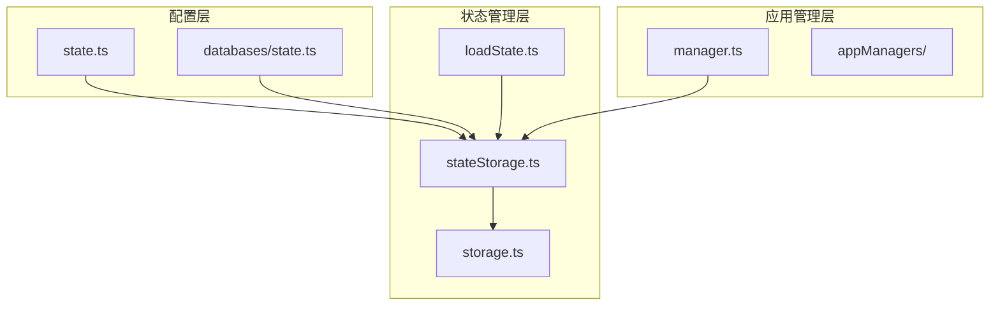
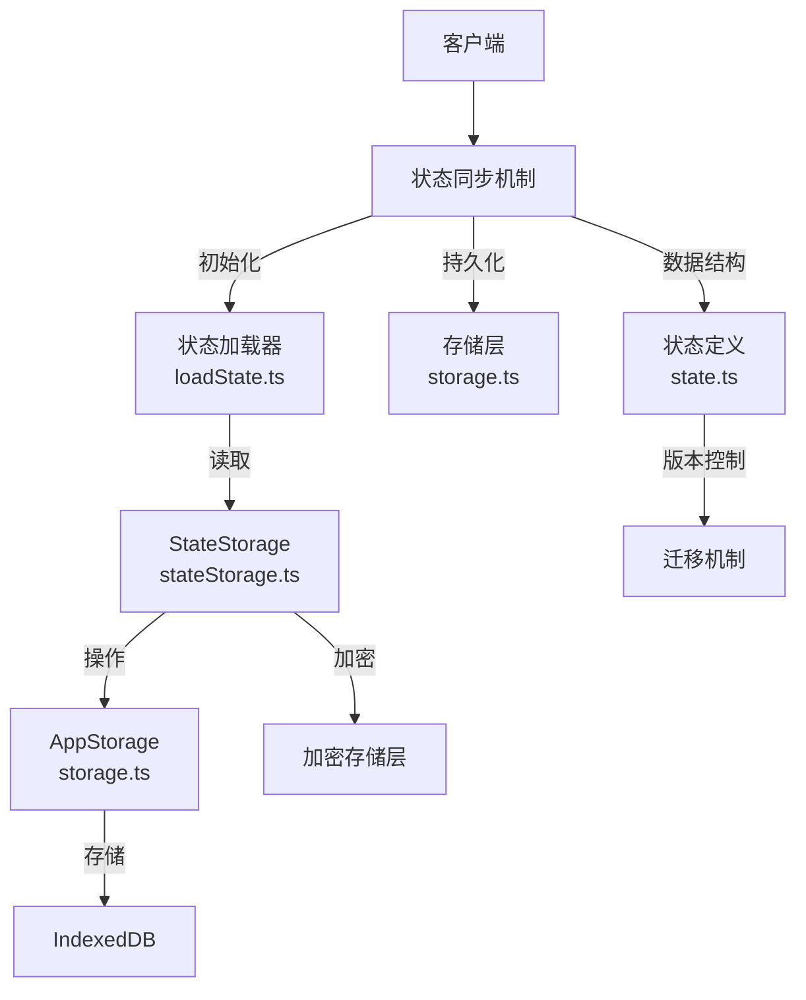
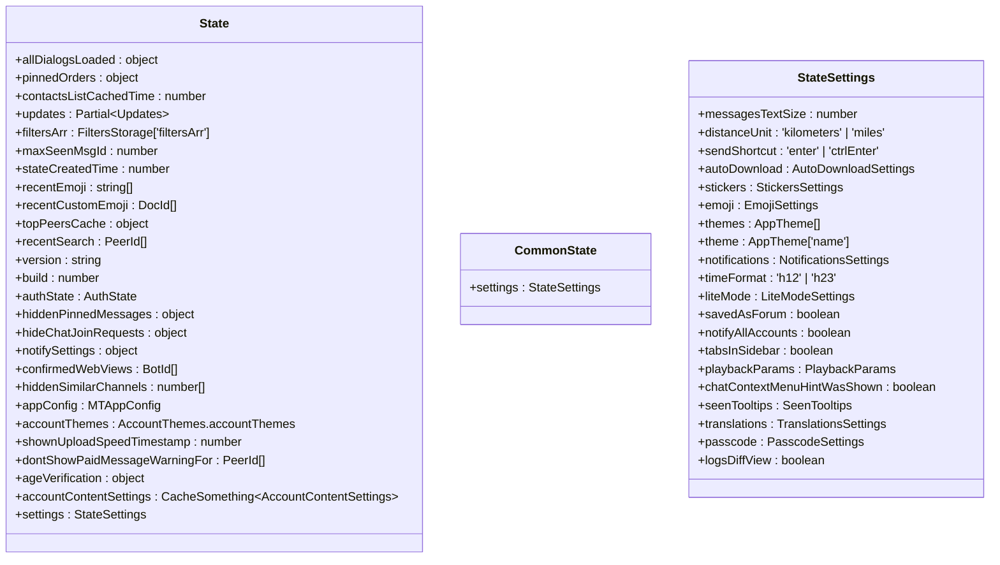
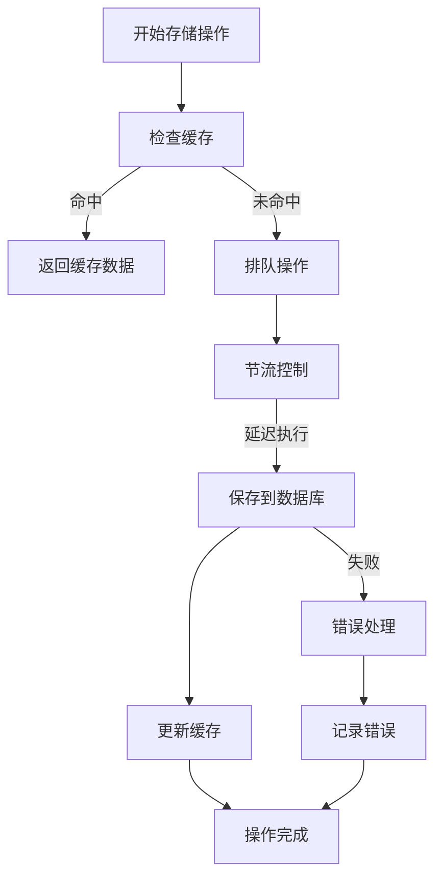
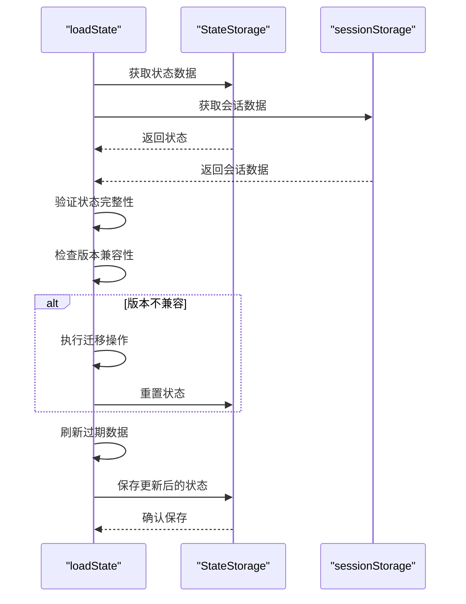
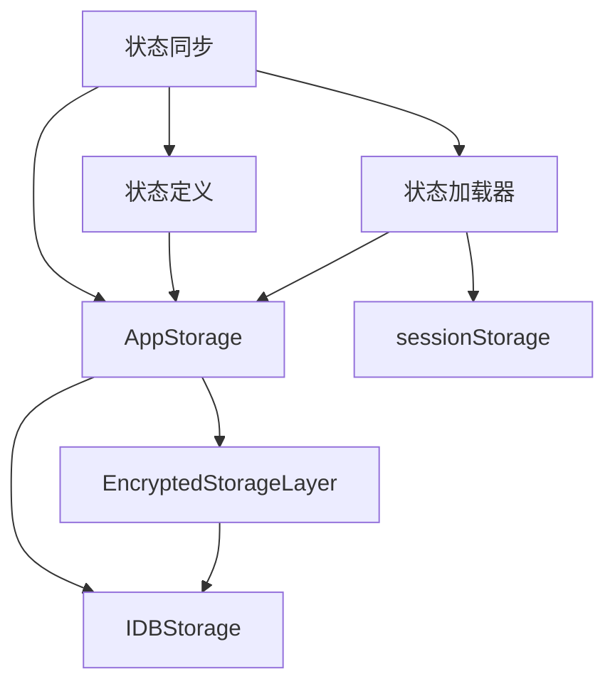

# 状态同步

<cite>
**本文档中引用的文件**
- [state.ts](file://src/config/state.ts)
- [stateStorage.ts](file://src/lib/stateStorage.ts)
- [loadState.ts](file://src/lib/appManagers/utils/state/loadState.ts)
- [storage.ts](file://src/lib/storage.ts)
- [manager.ts](file://src/lib/appManagers/manager.ts)
</cite>

## 目录
1. [简介](#简介)
2. [项目结构](#项目结构)
3. [核心组件](#核心组件)
4. [架构概述](#架构概述)
5. [详细组件分析](#详细组件分析)
6. [依赖分析](#依赖分析)
7. [性能考虑](#性能考虑)
8. [故障排除指南](#故障排除指南)
9. [结论](#结论)
10. [附录](#附录)（如有必要）

## 简介
本文档详细描述了客户端与服务器之间的状态同步机制，包括本地状态存储的结构、持久化策略、时间同步机制、增量更新与全量同步的触发条件、状态冲突解决策略以及性能优化技巧。系统通过IndexedDB实现本地数据持久化，结合加密存储层保护敏感信息，并通过版本控制和迁移机制确保数据一致性。

## 项目结构
项目采用分层架构设计，将状态管理、存储、网络通信等核心功能模块化。状态同步相关代码主要分布在`src/lib`目录下的`appManagers`、`storages`和`state`相关模块中，配置文件位于`src/config`目录。

**Diagram sources**
- [state.ts](file://src/config/state.ts)
- [stateStorage.ts](file://src/lib/stateStorage.ts)
- [storage.ts](file://src/lib/storage.ts)
- [manager.ts](file://src/lib/appManagers/manager.ts)

**Section sources**
- [state.ts](file://src/config/state.ts)
- [stateStorage.ts](file://src/lib/stateStorage.ts)

## 核心组件
系统的核心状态同步组件包括状态定义、存储管理器、状态加载器和数据库配置。这些组件协同工作，确保客户端状态与服务器保持一致，同时提供高效的数据持久化和恢复机制。

**Section sources**
- [state.ts](file://src/config/state.ts)
- [stateStorage.ts](file://src/lib/stateStorage.ts)
- [loadState.ts](file://src/lib/appManagers/utils/state/loadState.ts)

## 架构概述
系统采用分层状态管理架构，通过`StateStorage`类封装IndexedDB操作，`AppStorage`提供通用存储接口，`loadState`模块负责状态初始化和迁移。状态数据分为账户特定数据和公共数据，分别存储在不同的数据库实例中。

**Diagram sources**
- [state.ts](file://src/config/state.ts)
- [stateStorage.ts](file://src/lib/stateStorage.ts)
- [loadState.ts](file://src/lib/appManagers/utils/state/loadState.ts)
- [storage.ts](file://src/lib/storage.ts)

## 详细组件分析
### 状态定义与初始化
系统定义了`State`和`CommonState`两种状态类型，分别用于存储账户特定数据和公共数据。状态初始化通过`STATE_INIT`和`COMMON_STATE_INIT`常量提供默认值，确保新用户获得一致的初始配置。

**Diagram sources**
- [state.ts](file://src/config/state.ts#L122-L170)

### 存储管理机制
`AppStorage`类提供通用的存储接口，支持缓存、批量操作和异步持久化。通过`throttleWith`实现操作节流，避免频繁的数据库写入，提高性能。

**Diagram sources**
- [storage.ts](file://src/lib/storage.ts#L46-L487)

### 状态加载与迁移
`loadState`模块负责状态的加载、验证和迁移。通过版本控制机制，当应用版本升级时自动执行相应的迁移操作，确保数据兼容性。

**Diagram sources**
- [loadState.ts](file://src/lib/appManagers/utils/state/loadState.ts#L28-L505)

## 依赖分析
系统依赖于IndexedDB进行数据持久化，通过`IDBStorage`和`EncryptedStorageLayer`提供存储支持。状态管理依赖于`AppStorage`通用接口，与具体的存储实现解耦。

**Diagram sources**
- [storage.ts](file://src/lib/storage.ts)
- [stateStorage.ts](file://src/lib/stateStorage.ts)
- [loadState.ts](file://src/lib/appManagers/utils/state/loadState.ts)

**Section sources**
- [storage.ts](file://src/lib/storage.ts)
- [stateStorage.ts](file://src/lib/stateStorage.ts)
- [loadState.ts](file://src/lib/appManagers/utils/state/loadState.ts)

## 性能考虑
系统通过多种机制优化状态同步性能：
- 使用节流（throttle）减少数据库写入频率
- 实现缓存机制避免重复读取
- 批量操作减少数据库事务开销
- 异步操作避免阻塞主线程

## 故障排除指南
常见状态同步问题及解决方案：
- **数据丢失**：检查IndexedDB权限和存储空间
- **版本兼容性问题**：确保迁移脚本正确执行
- **加密存储问题**：验证加密密钥的正确性
- **性能问题**：检查节流设置和缓存命中率

**Section sources**
- [storage.ts](file://src/lib/storage.ts)
- [loadState.ts](file://src/lib/appManagers/utils/state/loadState.ts)

## 结论
本文档详细描述了状态同步机制的实现原理和关键技术。系统通过分层架构设计，实现了高效、安全的状态管理。未来可进一步优化数据压缩和增量传输策略，提升同步性能。