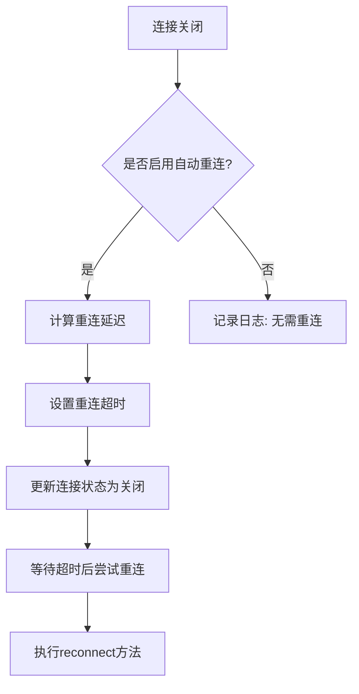
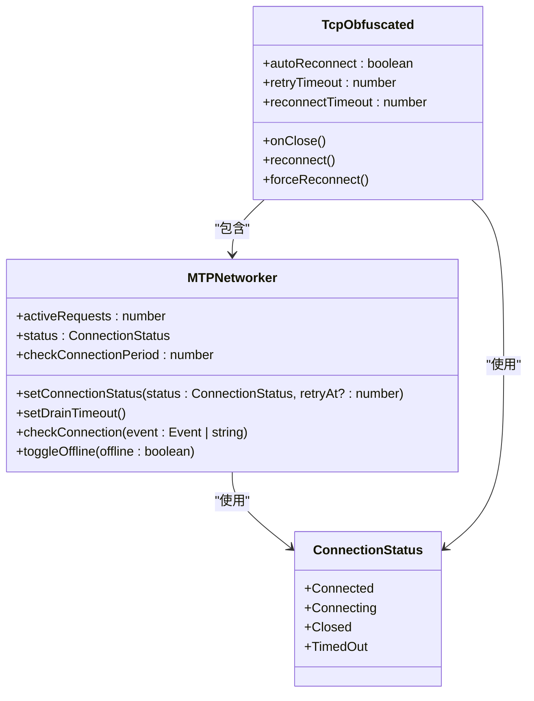
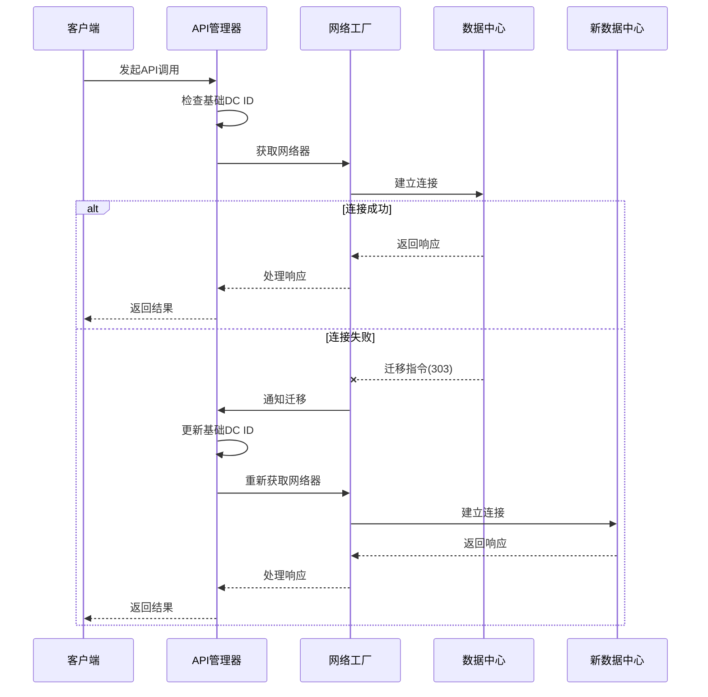
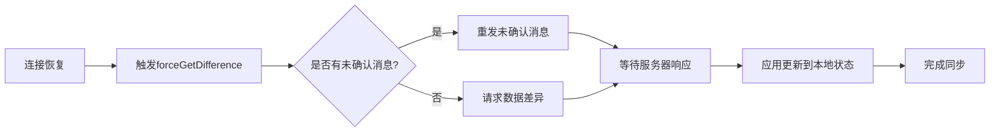
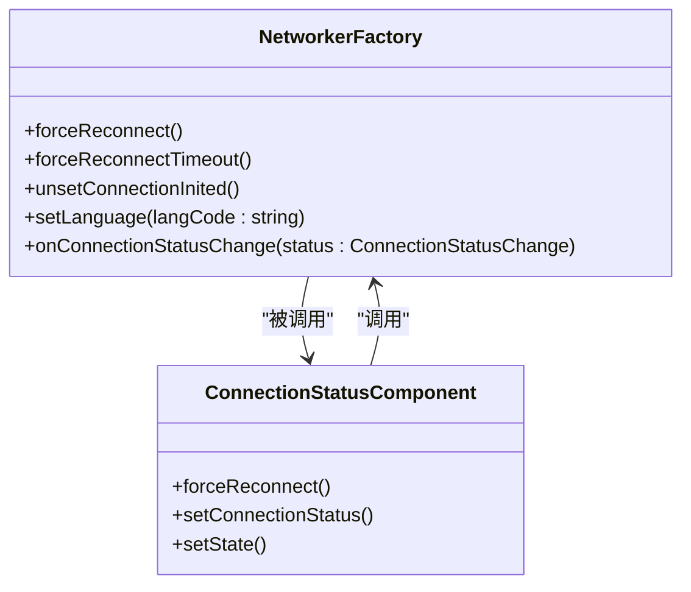

# 故障恢复

<cite>
**本文档中引用的文件**  
- [tcpObfuscated.ts](file://src/lib/mtproto/transports/tcpObfuscated.ts)
- [networker.ts](file://src/lib/mtproto/networker.ts)
- [apiManager.ts](file://src/lib/mtproto/apiManager.ts)
- [networkerFactory.ts](file://src/lib/mtproto/networkerFactory.ts)
- [connectionStatus.ts](file://src/lib/mtproto/connectionStatus.ts)
- [connectionStatus.tsx](file://src/components/connectionStatus.ts)
- [dcConfigurator.ts](file://src/lib/mtproto/dcConfigurator.ts)
</cite>

## 目录
1. [引言](#引言)
2. [自动重连策略](#自动重连策略)
3. [退避算法与重试机制](#退避算法与重试机制)
4. [多数据中心故障转移](#多数据中心故障转移)
5. [数据同步机制](#数据同步机制)
6. [手动重连与强制切换](#手动重连与强制切换)
7. [实际场景示例](#实际场景示例)
8. [总结](#总结)

## 引言

本系统实现了完整的连接故障恢复机制，能够在网络中断、服务器故障等异常情况下自动恢复连接。系统采用分层设计，包含传输层、网络管理层和用户界面层，各层协同工作以确保连接的高可用性。故障恢复机制不仅包括自动重连和退避算法，还支持多数据中心故障转移和手动干预功能，为用户提供稳定可靠的服务体验。

## 自动重连策略

系统在检测到连接中断时会自动触发重连机制。当WebSocket或TCP连接关闭时，`TcpObfuscated`类的`onClose`事件处理器会被调用，该处理器会根据配置决定是否自动重连。



**图源**  
- [tcpObfuscated.ts](file://src/lib/mtproto/transports/tcpObfuscated.ts#L117-L139)

**本节源码**  
- [tcpObfuscated.ts](file://src/lib/mtproto/transports/tcpObfuscated.ts#L117-L139)

## 退避算法与重试机制

系统实现了指数退避算法来优化重连间隔，避免在网络不稳定时频繁重试。重试间隔从基础超时值开始，每次失败后按比例增加，但不会超过最大限制。



**图源**  
- [networker.ts](file://src/lib/mtproto/networker.ts#L101-L124)
- [tcpObfuscated.ts](file://src/lib/mtproto/transports/tcpObfuscated.ts#L40-L52)

**本节源码**  
- [networker.ts](file://src/lib/mtproto/networker.ts#L101-L124)
- [tcpObfuscated.ts](file://src/lib/mtproto/transports/tcpObfuscated.ts#L40-L52)

## 多数据中心故障转移

系统支持多数据中心架构，能够在主数据中心故障时自动切换到备用数据中心。故障转移决策基于服务器返回的迁移指令和网络状况评估。



**图源**  
- [apiManager.ts](file://src/lib/mtproto/apiManager.ts#L690-L722)
- [dcConfigurator.ts](file://src/lib/mtproto/dcConfigurator.ts)

**本节源码**  
- [apiManager.ts](file://src/lib/mtproto/apiManager.ts#L690-L722)

## 数据同步机制

在连接恢复后，系统会自动同步丢失的数据，确保客户端状态与服务器保持一致。数据同步通过差异获取机制实现，只传输变化的部分，提高效率。



**图源**  
- [connectionStatus.ts](file://src/components/connectionStatus.ts#L120-L122)
- [networker.ts](file://src/lib/mtproto/networker.ts#L995-L996)

**本节源码**  
- [connectionStatus.ts](file://src/components/connectionStatus.ts#L120-L122)

## 手动重连与强制切换

系统提供了手动触发重连和强制切换数据中心的功能，允许用户在自动机制失效时进行干预。这些功能通过网络工厂的公共方法暴露给用户界面。



**图源**  
- [networkerFactory.ts](file://src/lib/mtproto/networkerFactory.ts#L96-L103)
- [connectionStatus.ts](file://src/components/connectionStatus.ts#L142-L149)

**本节源码**  
- [networkerFactory.ts](file://src/lib/mtproto/networkerFactory.ts#L96-L103)

## 实际场景示例

以下是一个完整的故障恢复过程示例，展示了从网络中断到完全恢复的各个阶段。

```mermaid
sequenceDiagram
participant 用户
participant UI
participant 网络层
participant 服务器
用户->>UI : 正常使用应用
UI->>网络层 : 发送消息
网络层->>服务器 : 传输数据
服务器-->>网络层 : 确认接收
网络层-->>UI : 显示发送成功
Note over 用户,服务器 : 网络连接正常
用户->>UI : 继续使用
虚线网络层-服务器 : 网络中断
UI->>网络层 : 发送消息
网络层->>网络层 : 连接超时
网络层->>UI : 通知连接中断
UI->>用户 : 显示"正在重新连接"
网络层->>网络层 : 启动重连定时器(1秒)
网络层->>服务器 : 尝试重连
服务器--x网络层 : 连接失败
网络层->>网络层 : 延迟增加至1.5秒
网络层->>网络层 : 启动重连定时器(1.5秒)
网络层->>服务器 : 尝试重连
服务器-->>网络层 : 连接成功
网络层->>服务器 : 同步未确认消息
服务器-->>网络层 : 返回同步数据
网络层->>UI : 通知连接恢复
UI->>用户 : 显示"已重新连接"
用户->>UI : 继续发送消息
UI->>网络层 : 发送消息
网络层->>服务器 : 传输数据
服务器-->>网络层 : 确认接收
网络层-->>UI : 显示发送成功
Note over 用户,服务器 : 连接完全恢复
```

**图源**  
- [tcpObfuscated.ts](file://src/lib/mtproto/transports/tcpObfuscated.ts#L121-L136)
- [networker.ts](file://src/lib/mtproto/networker.ts#L956-L964)

**本节源码**  
- [tcpObfuscated.ts](file://src/lib/mtproto/transports/tcpObfuscated.ts#L121-L136)

## 总结

本系统的故障恢复机制通过自动重连、指数退避、多数据中心故障转移和数据同步等技术，实现了高可用的连接管理。系统能够在各种网络异常情况下自动恢复服务，同时提供手动干预接口以应对特殊情况。这种分层、模块化的设计确保了系统的稳定性和可维护性，为用户提供无缝的使用体验。