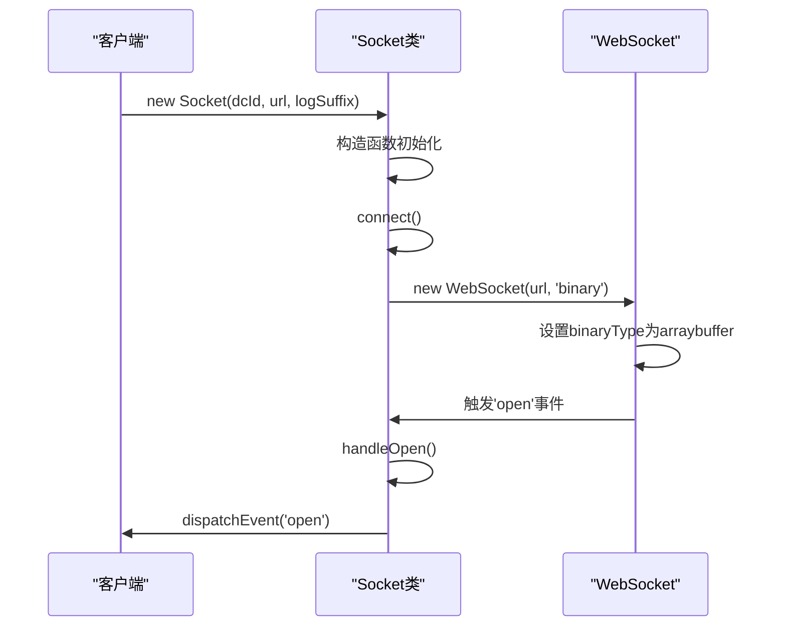
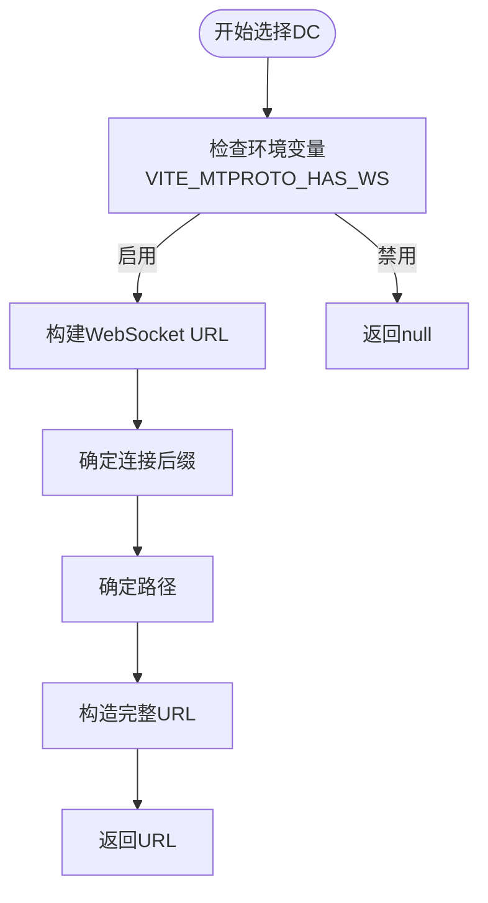
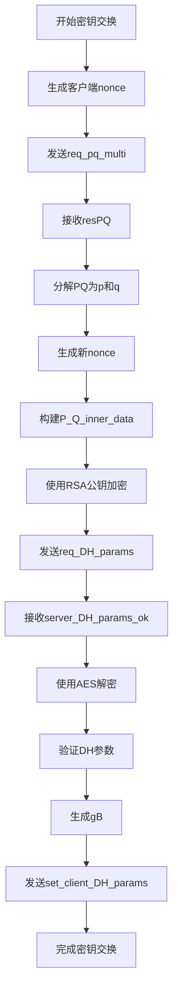
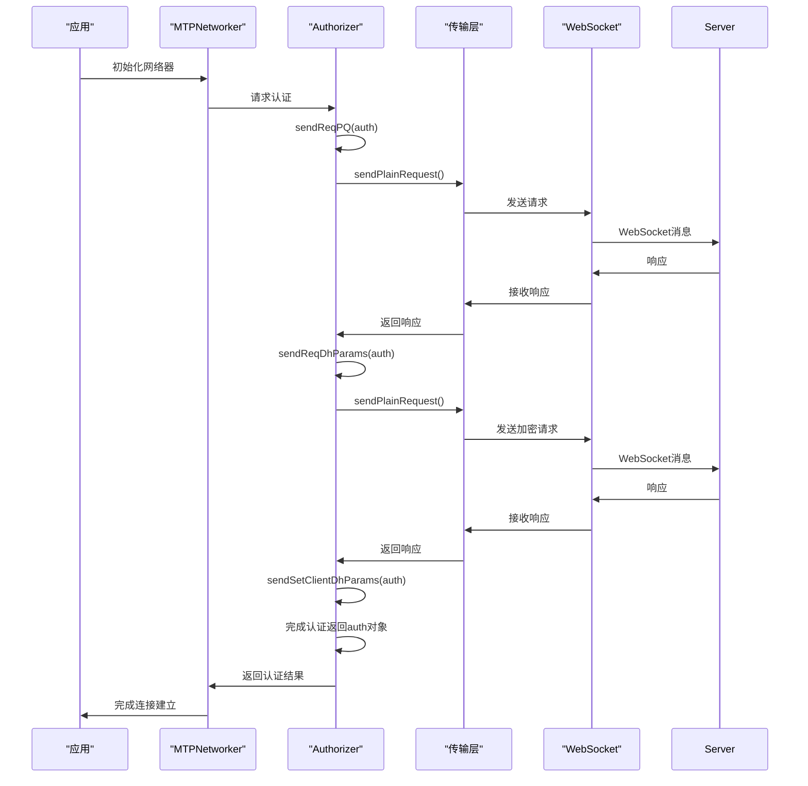

# 连接建立

<cite>
**本文档中引用的文件**  
- [websocket.ts](file://src/lib/mtproto/transports/websocket.ts)
- [authorizer.ts](file://src/lib/mtproto/authorizer.ts)
- [tcpObfuscated.ts](file://src/lib/mtproto/transports/tcpObfuscated.ts)
- [dcConfigurator.ts](file://src/lib/mtproto/dcConfigurator.ts)
- [controller.ts](file://src/lib/mtproto/transports/controller.ts)
- [networker.ts](file://src/lib/mtproto/networker.ts)
- [connectionStatus.ts](file://src/lib/mtproto/connectionStatus.ts)
</cite>

## 目录
1. [引言](#引言)
2. [WebSocket连接初始化](#websocket连接初始化)
3. [数据中心选择](#数据中心选择)
4. [MTProto协议握手过程](#mtproto协议握手过程)
5. [认证机制与密钥交换](#认证机制与密钥交换)
6. [连接失败原因与排查](#连接失败原因与排查)
7. [关键代码流程](#关键代码流程)
8. [总结](#总结)

## 引言
本文档详细描述了Telegram Web客户端中WebSocket连接的建立过程。从网络器初始化开始，逐步解释如何选择合适的数据中心（DC），建立安全的WebSocket连接，并完成MTProto协议的完整握手流程。文档涵盖了连接建立过程中的认证机制、密钥交换流程、常见失败原因及排查方法，并通过代码流程展示关键步骤和时间序列。

## WebSocket连接初始化

WebSocket连接的初始化始于`Socket`类的构造函数，该类实现了`MTConnection`接口。当创建新的`Socket`实例时，会立即调用`connect()`方法建立连接。

连接建立过程包括：
- 创建WebSocket实例并设置二进制传输模式
- 添加事件监听器处理打开、关闭、错误和消息事件
- 在连接成功后触发`open`事件



**图示来源**
- [websocket.ts](file://src/lib/mtproto/transports/websocket.ts#L26-L37)

**本节来源**
- [websocket.ts](file://src/lib/mtproto/transports/websocket.ts#L26-L37)

## 数据中心选择

数据中心（DC）的选择由`DcConfigurator`类负责管理。系统会根据配置和环境变量选择最合适的数据中心服务器。

选择过程包括：
1. 根据DC ID和连接类型确定服务器地址
2. 支持测试模式和生产模式的不同配置
3. 为WebSocket连接构建特定的URL格式

对于WebSocket连接，URL格式为：`wss://${App.suffix.toLowerCase()}ws${dcId}${suffix}.web.telegram.org/${path}`



**图示来源**
- [dcConfigurator.ts](file://src/lib/mtproto/dcConfigurator.ts#L43-L52)

**本节来源**
- [dcConfigurator.ts](file://src/lib/mtproto/dcConfigurator.ts#L43-L52)

## MTProto协议握手过程

MTProto协议的握手过程是一个多步骤的安全认证流程，确保客户端与服务器之间的通信安全。整个过程由`Authorizer`类管理。

握手流程包括三个主要阶段：
1. **PQ分解阶段**：客户端发送`req_pq_multi`请求，服务器返回质数分解结果
2. **DH参数交换阶段**：客户端发送加密的DH参数，服务器验证并返回响应
3. **密钥确认阶段**：客户端确认密钥，完成握手

```mermaid
sequenceDiagram
participant Client as "客户端"
participant Server as "服务器"
Client->>Server : req_pq_multi(nonce)
Server->>Client : resPQ(nonce, pq, server_nonce, fingerprints)
Client->>Client : 分解PQ为p和q
Client->>Server : req_DH_params(加密数据)
Server->>Client : server_DH_params_ok(加密响应)
Client->>Client : 解密并验证DH参数
Client->>Server : set_client_DH_params(加密gB)
Server->>Client : dh_gen_ok(确认)
Client->>Client : 计算authKey和serverSalt
```



**图示来源**
- [authorizer.ts](file://src/lib/mtproto/authorizer.ts#L215-L608)

**本节来源**
- [authorizer.ts](file://src/lib/mtproto/authorizer.ts#L215-L608)

## 认证机制与密钥交换

认证机制基于Diffie-Hellman密钥交换协议，确保通信双方能够在不安全的通道上建立共享密钥。

密钥交换流程：
1. 客户端生成随机nonce并发送`req_pq_multi`请求
2. 服务器返回PQ值和服务器nonce
3. 客户端将PQ分解为质数p和q
4. 客户端使用RSA公钥加密DH参数并发送
5. 服务器返回加密的DH内层数据
6. 客户端解密并验证参数，生成共享密钥

关键安全验证包括：
- 验证dh_prime值是否符合Telegram安全指南
- 确保gA在安全范围内（1 < gA < dhPrime-1）
- 验证SHA1哈希匹配



**图示来源**
- [authorizer.ts](file://src/lib/mtproto/authorizer.ts#L454-L498)
- [authorizer.ts](file://src/lib/mtproto/authorizer.ts#L500-L588)

**本节来源**
- [authorizer.ts](file://src/lib/mtproto/authorizer.ts#L454-L498)
- [authorizer.ts](file://src/lib/mtproto/authorizer.ts#L500-L588)

## 连接失败原因与排查

连接建立可能因多种原因失败，系统实现了相应的错误处理和重连机制。

### 常见失败原因
1. **网络问题**：无法连接到服务器或网络中断
2. **认证失败**：nonce不匹配、SHA1哈希不匹配
3. **参数验证失败**：dh_prime值不符合安全标准
4. **服务器拒绝**：服务器返回`dh_gen_fail`响应

### 错误处理机制
- WebSocket连接错误会触发`handleError`方法，自动关闭连接
- 连接关闭后，系统根据`autoReconnect`标志决定是否重连
- 重连有退避策略，避免频繁重试

```mermaid
flowchart TD
A[连接失败] --> B{错误类型}
B --> |网络错误| C[触发handleError]
B --> |认证错误| D[抛出认证异常]
B --> |参数错误| E[抛出参数验证异常]
C --> F[调用close()]
F --> G[触发handleClose]
G --> H{autoReconnect?}
H --> |是| I[设置reconnectTimeout]
H --> |否| J[记录日志]
I --> K[等待超时后重连]
K --> L[调用reconnect()]
```

**图示来源**
- [websocket.ts](file://src/lib/mtproto/transports/websocket.ts#L90-L93)
- [tcpObfuscated.ts](file://src/lib/mtproto/transports/tcpObfuscated.ts#L124-L138)

**本节来源**
- [websocket.ts](file://src/lib/mtproto/transports/websocket.ts#L90-L93)
- [tcpObfuscated.ts](file://src/lib/mtproto/transports/tcpObfuscated.ts#L124-L138)

## 关键代码流程

以下是连接建立的关键代码执行流程，展示了从初始化到完成握手的主要步骤。



**图示来源**
- [networker.ts](file://src/lib/mtproto/networker.ts#L215-L248)
- [authorizer.ts](file://src/lib/mtproto/authorizer.ts#L622-L661)

**本节来源**
- [networker.ts](file://src/lib/mtproto/networker.ts#L215-L248)
- [authorizer.ts](file://src/lib/mtproto/authorizer.ts#L622-L661)

## 总结
WebSocket连接的建立是一个复杂但严谨的过程，涉及网络连接、数据中心选择、安全协议握手和密钥交换等多个环节。通过`DcConfigurator`选择合适的数据中心，使用`Socket`类建立WebSocket连接，并通过`Authorizer`完成MTProto协议的三步握手过程。整个流程注重安全性，包含多重验证机制确保通信安全。当连接失败时，系统具备完善的错误处理和自动重连能力，保证了连接的稳定性和可靠性。