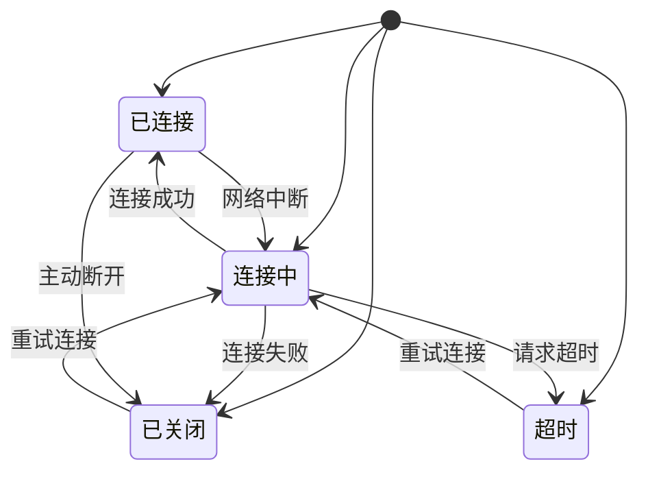
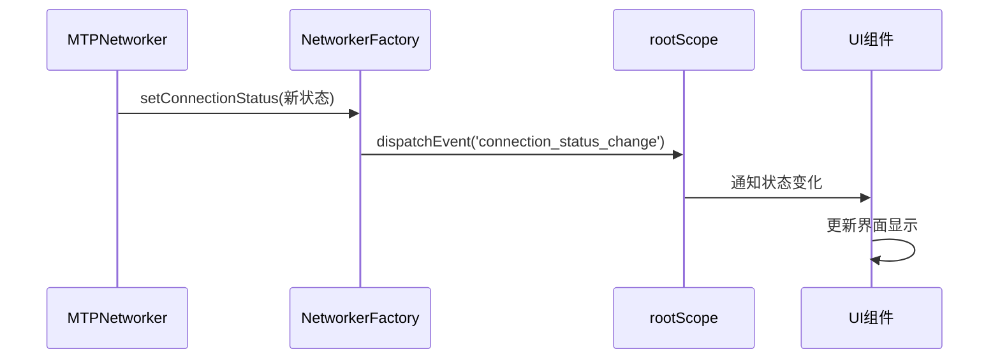
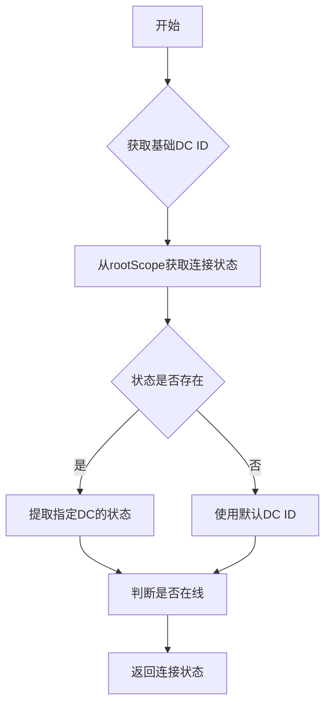

# 连接状态管理

<cite>
**本文档中引用的文件**  
- [connectionStatus.ts](file://src/lib/mtproto/connectionStatus.ts)
- [networker.ts](file://src/lib/mtproto/networker.ts)
- [connectionStatus.ts](file://src/components/connectionStatus.ts)
- [networkerFactory.ts](file://src/lib/mtproto/networkerFactory.ts)
- [rootScope.ts](file://src/lib/rootScope.ts)
- [stateStorage.ts](file://src/lib/stateStorage.ts)
</cite>

## 目录
1. [引言](#引言)
2. [连接状态定义](#连接状态定义)
3. [状态转换机制](#状态转换机制)
4. [状态变化事件监听](#状态变化事件监听)
5. [状态持久化与恢复](#状态持久化与恢复)
6. [状态监控最佳实践](#状态监控最佳实践)
7. [连接状态机图示](#连接状态机图示)
8. [结论](#结论)

## 引言

本文档深入解析Telegram Web客户端中的连接状态机实现。该状态机负责管理客户端与服务器之间的网络连接状态，确保在各种网络条件下提供稳定可靠的服务。通过分析核心组件和状态转换逻辑，本文档将详细描述连接状态的含义、转换条件、事件触发机制以及状态持久化策略。

**Section sources**
- [connectionStatus.ts](file://src/lib/mtproto/connectionStatus.ts#L7-L12)
- [networker.ts](file://src/lib/mtproto/networker.ts#L956-L990)

## 连接状态定义

连接状态机定义了四种主要的连接状态，每种状态代表了客户端与服务器之间不同的连接情况：

- **已连接 (Connected)**：客户端与服务器建立稳定连接，可以正常收发数据
- **连接中 (Connecting)**：客户端正在尝试建立与服务器的连接
- **已关闭 (Closed)**：连接已断开，客户端将尝试重新连接
- **超时 (TimedOut)**：连接请求超时，需要重新建立连接

这些状态通过枚举类型 `ConnectionStatus` 进行定义，为整个应用提供了统一的状态管理基础。



**Diagram sources**
- [connectionStatus.ts](file://src/lib/mtproto/connectionStatus.ts#L7-L12)

**Section sources**
- [connectionStatus.ts](file://src/lib/mtproto/connectionStatus.ts#L7-L12)

## 状态转换机制

连接状态的转换由网络层组件 `MTPNetworker` 和 `NetworkerFactory` 协同管理。状态转换主要通过 `setConnectionStatus` 方法触发，该方法在连接建立、断开或超时时被调用。

状态转换的关键触发条件包括：
- 网络连接成功时，状态从"连接中"转换为"已连接"
- 网络中断时，状态从"已连接"转换为"已关闭"
- 连接请求超时时，状态转换为"超时"
- 客户端检测到网络恢复时，触发重新连接流程

状态转换过程中，系统会根据当前状态执行相应的操作，如重发未完成的请求、清理已发送的消息队列等。

**Section sources**
- [networker.ts](file://src/lib/mtproto/networker.ts#L956-L990)
- [networkerFactory.ts](file://src/lib/mtproto/networkerFactory.ts#L30-L33)

## 状态变化事件监听

系统通过事件总线机制实现连接状态变化的监听和通知。`rootScope` 作为全局事件中心，负责分发连接状态变化事件。

主要的事件监听机制包括：
- `connection_status_change` 事件：当连接状态发生变化时触发，通知所有监听者
- `state_synchronizing` 事件：当客户端开始同步服务器状态时触发
- `state_synchronized` 事件：当客户端完成状态同步时触发

组件可以通过订阅这些事件来响应连接状态的变化，例如更新UI显示、调整数据同步策略等。



**Diagram sources**
- [networker.ts](file://src/lib/mtproto/networker.ts#L963-L973)
- [networkerFactory.ts](file://src/lib/mtproto/networkerFactory.ts#L30-L33)
- [rootScope.ts](file://src/lib/rootScope.ts#L275-L277)

**Section sources**
- [networker.ts](file://src/lib/mtproto/networker.ts#L956-L990)
- [networkerFactory.ts](file://src/lib/mtproto/networkerFactory.ts#L30-L33)
- [rootScope.ts](file://src/lib/rootScope.ts#L275-L277)

## 状态持久化与恢复

连接状态的持久化通过本地存储机制实现，确保在页面刷新或应用重启后能够恢复之前的连接状态。

持久化策略包括：
- 使用 `sessionStorage` 存储临时的连接状态信息
- 通过 `stateStorage` 管理更持久的状态数据
- 在状态变化时及时更新存储，确保数据一致性

状态恢复流程：
1. 应用启动时从存储中读取上次的连接状态
2. 根据存储的状态初始化连接状态机
3. 如果状态为"已连接"，尝试恢复会话
4. 如果状态为"已关闭"或"超时"，启动重连机制

**Section sources**
- [stateStorage.ts](file://src/lib/stateStorage.ts#L1-L28)
- [rootScope.ts](file://src/lib/rootScope.ts#L292-L294)

## 状态监控最佳实践

### 实时获取连接状态

获取当前连接状态的最佳方式是通过 `rootScope.getConnectionStatus()` 方法，该方法返回所有网络连接的状态信息。



**Diagram sources**
- [connectionStatus.ts](file://src/components/connectionStatus.ts#L103-L133)

### 处理状态变化事件

处理状态变化事件的最佳实践包括：
- 在组件初始化时订阅状态变化事件
- 在组件销毁时取消订阅，避免内存泄漏
- 根据不同的状态变化采取相应的UI更新策略
- 对于"已连接"状态，触发数据同步操作
- 对于"连接中"状态，显示加载指示器

**Section sources**
- [connectionStatus.ts](file://src/components/connectionStatus.ts#L63-L80)

## 连接状态机图示

```mermaid
stateDiagram-v2
[*] --> 初始化
初始化 --> 连接中 : 启动连接
state 连接中 {
[*] --> 等待
等待 --> 重试 : 定时重试
重试 --> 检查传输 : 选择传输方式
检查传输 --> 建立连接 : 创建WebSocket/HTTP连接
建立连接 --> 发送初始化包 : 发送init_connection
发送初始化包 --> 等待响应 : 等待服务器响应
等待响应 --> 已连接 : 收到响应
等待响应 --> 超时 : 超时未响应
超时 --> 已关闭 : 标记为关闭
}
state 已连接 {
[*] --> 正常通信
正常通信 --> 检查连接 : 定期检查
检查连接 --> 连接中断 : 检测到中断
检查连接 --> 正常通信 : 连接正常
}
state 已关闭 {
[*] --> 延迟重试 : 设置重试时间
延迟重试 --> 连接中 : 到达重试时间
}
已连接 --> 已关闭 : 主动断开
已关闭 --> 连接中 : 强制重连
连接中 --> 已连接 : 连接成功
连接中 --> 已关闭 : 连接失败
```

**Diagram sources**
- [networker.ts](file://src/lib/mtproto/networker.ts#L773-L783)
- [connectionStatus.ts](file://src/components/connectionStatus.ts#L154-L195)

## 结论

Telegram Web客户端的连接状态机实现了一个健壮的网络连接管理系统。通过明确定义的状态、清晰的转换规则和完善的事件通知机制，系统能够在各种网络条件下提供稳定的服务。状态持久化机制确保了用户体验的连续性，而灵活的监控接口则为开发者提供了强大的调试和优化能力。这一设计模式为构建高可用的Web应用提供了有价值的参考。