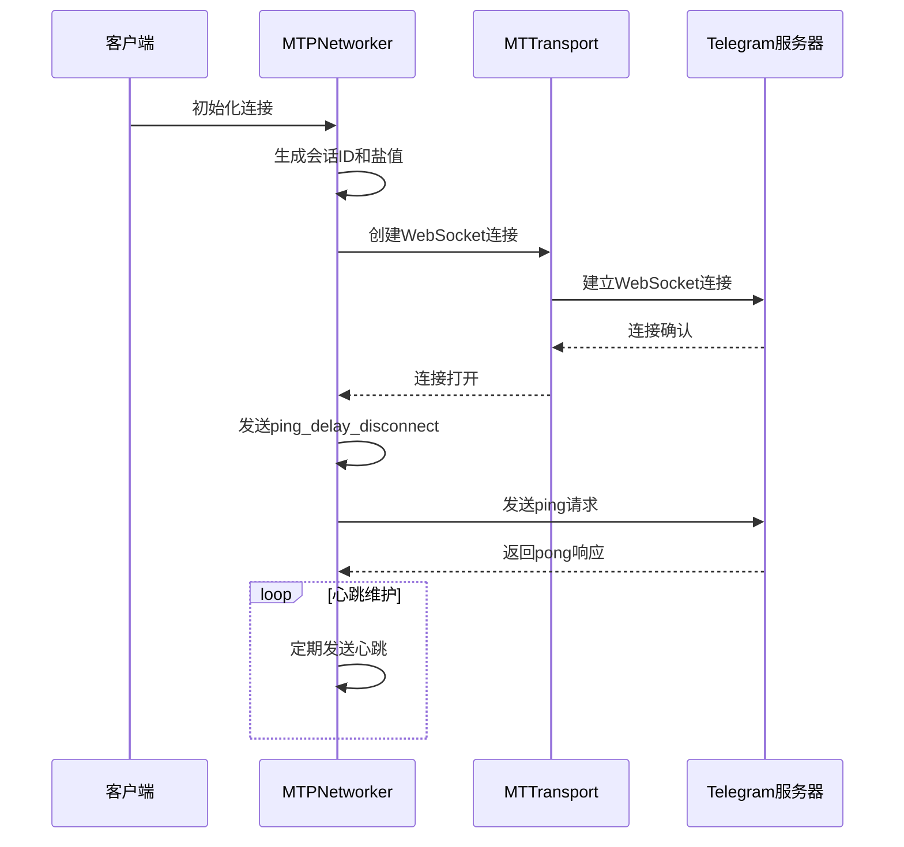
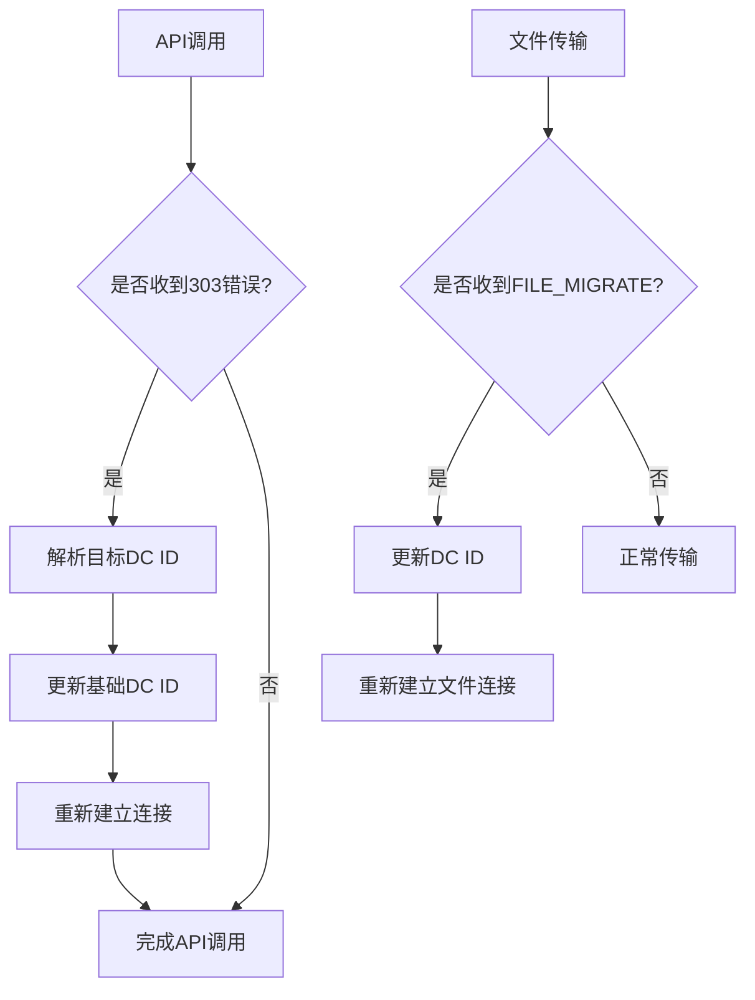
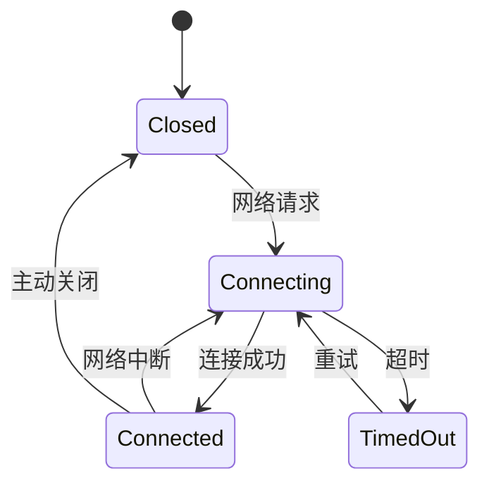
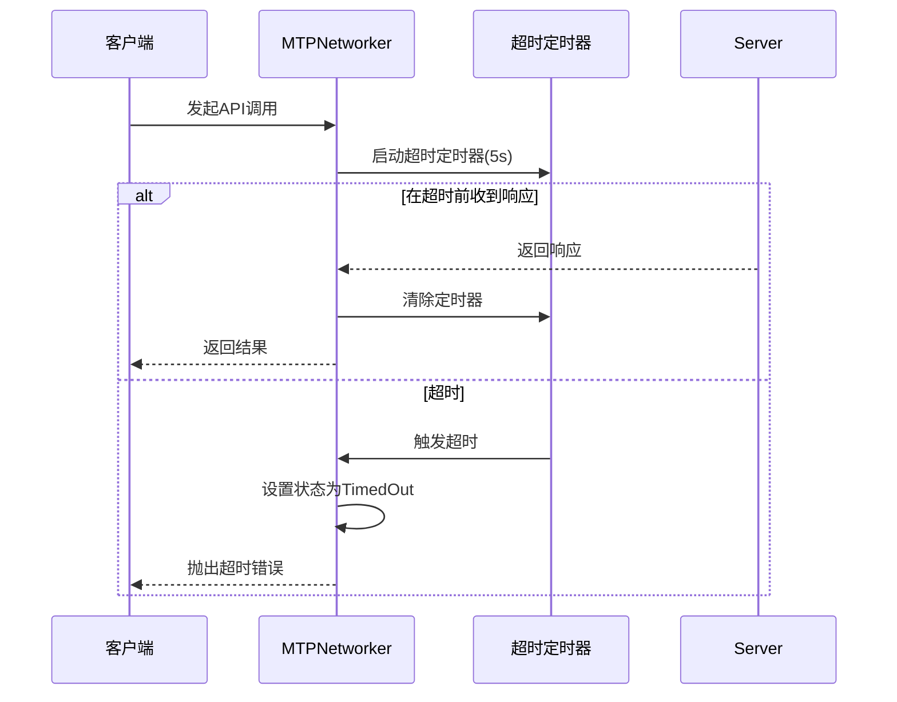
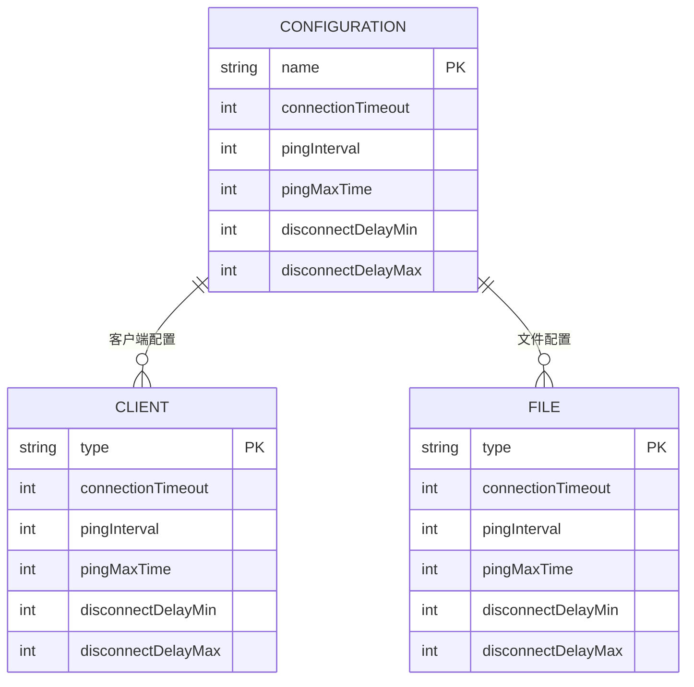
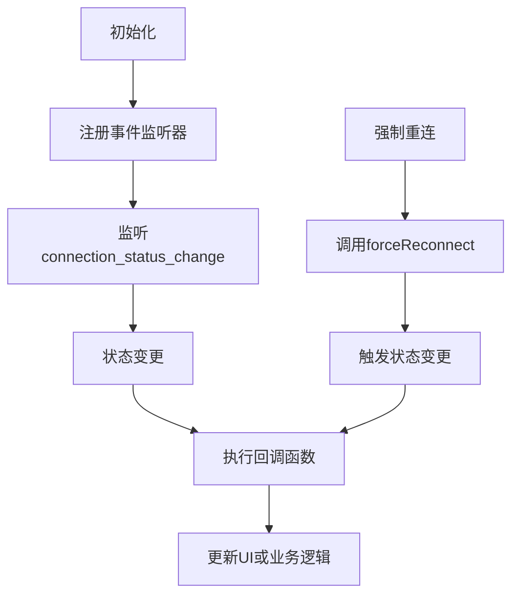

# 连接管理

<cite>
**本文档中引用的文件**  
- [connectionStatus.ts](file://src/components/connectionStatus.ts)
- [networkerFactory.ts](file://src/lib/mtproto/networkerFactory.ts)
- [networker.ts](file://src/lib/mtproto/networker.ts)
- [connectionStatus.ts](file://src/lib/mtproto/connectionStatus.ts)
- [rootScope.ts](file://src/lib/rootScope.ts)
- [apiManager.ts](file://src/lib/mtproto/apiManager.ts)
</cite>

## 目录
1. [简介](#简介)
2. [WebSocket连接管理](#websocket连接管理)
3. [多数据中心（DC）切换机制](#多数据中心dc切换机制)
4. [连接状态机](#连接状态机)
5. [连接重试逻辑与退避算法](#连接重试逻辑与退避算法)
6. [连接超时与网络中断处理](#连接超时与网络中断处理)
7. [连接配置选项](#连接配置选项)
8. [连接状态监听示例](#连接状态监听示例)

## 简介

本文档详细描述了Telegram Web客户端中的连接管理机制。系统通过WebSocket与HTTP长轮询实现与Telegram服务器的通信，支持多数据中心（DC）架构和故障转移策略。连接状态通过事件系统进行广播，允许UI组件实时响应网络变化。核心组件包括网络器（Networker）、连接状态管理器和多数据中心配置器，共同确保连接的稳定性和可靠性。

**Section sources**
- [connectionStatus.ts](file://src/components/connectionStatus.ts#L1-L224)
- [networkerFactory.ts](file://src/lib/mtproto/networkerFactory.ts#L1-L105)

## WebSocket连接管理

WebSocket连接由`MTPNetworker`类管理，负责建立、维护和关闭与Telegram服务器的连接。连接建立时，系统会进行身份验证并初始化会话。连接维护通过定期发送`ping_delay_disconnect`消息实现，服务器在超时后会主动关闭连接以保持连接健康。连接关闭可能由客户端主动触发、网络中断或服务器超时引起。系统使用`TcpObfuscated`传输层对WebSocket连接进行混淆加密，确保通信安全。



**Diagram sources**
- [networker.ts](file://src/lib/mtproto/networker.ts#L1-L1998)
- [networkerFactory.ts](file://src/lib/mtproto/networkerFactory.ts#L1-L105)

**Section sources**
- [networker.ts](file://src/lib/mtproto/networker.ts#L1-L800)

## 多数据中心（DC）切换机制

系统支持多数据中心架构，允许在不同DC之间进行故障转移。当收到`303`错误码（如`PHONE_MIGRATE_2`）时，系统会自动迁移到指定的DC。`ApiManager`负责管理DC切换逻辑，通过`setBaseDcId`方法更新基础DC ID，并重新建立连接。文件上传下载使用独立的网络器，支持在多个DC之间负载均衡。对于付费用户，系统会使用更多文件网络器实例以提高传输速度。



**Diagram sources**
- [apiManager.ts](file://src/lib/mtproto/apiManager.ts#L1-L818)
- [networker.ts](file://src/lib/mtproto/networker.ts#L1-L1998)

**Section sources**
- [apiManager.ts](file://src/lib/mtproto/apiManager.ts#L1-L800)

## 连接状态机

连接状态机定义了连接的生命周期，包含四种主要状态：已连接、连接中、已关闭和超时。状态转换由网络事件触发，如连接打开、关闭或错误。`ConnectionStatus`枚举定义了这些状态，`ConnectionStatusChange`类型包含状态变更的详细信息，包括DC ID、重试时间等。状态变更通过`rootScope`事件系统广播，允许所有监听器响应连接变化。



**Diagram sources**
- [connectionStatus.ts](file://src/lib/mtproto/connectionStatus.ts#L7-L24)
- [networker.ts](file://src/lib/mtproto/networker.ts#L181-L184)

**Section sources**
- [connectionStatus.ts](file://src/lib/mtproto/connectionStatus.ts#L7-L24)

## 连接重试逻辑与退避算法

连接重试逻辑在`MTPNetworker`中实现，使用指数退避算法避免频繁重试。初始重试延迟为7-20秒（客户端）或10-24秒（文件传输），每次失败后延迟增加1.5倍，最大不超过15秒。`checkConnectionPeriod`变量跟踪重试周期，`toggleOffline`方法处理离线状态转换。系统在`online`和`focus`事件上注册监听器，网络恢复时自动尝试重新连接。

```mermaid
flowchart TD
A[连接失败] --> B{是否离线?}
B --> |是| C[设置离线状态]
C --> D[计算重试延迟]
D --> E[设置重试定时器]
E --> F[延迟 = min(15, 周期 * 1.5)]
F --> G[等待重试]
G --> H[尝试重新连接]
H --> I{成功?}
I --> |是| J[恢复在线]
I --> |否| K[增加重试周期]
K --> D
```

**Diagram sources**
- [networker.ts](file://src/lib/mtproto/networker.ts#L744-L838)
- [networker.ts](file://src/lib/mtproto/networker.ts#L995-L1033)

**Section sources**
- [networker.ts](file://src/lib/mtproto/networker.ts#L744-L838)

## 连接超时与网络中断处理

连接超时处理通过`attachPromise`方法实现，为每个API调用设置超时定时器。如果在`connectionTimeout`（5秒客户端，7.5秒文件）内未收到响应，则触发超时状态。`setConnectionStatus`方法更新连接状态为`TimedOut`，UI组件会显示相应提示。网络中断由浏览器`online/offline`事件检测，系统在离线时暂停请求，在恢复时自动重试挂起的请求。



**Diagram sources**
- [networker.ts](file://src/lib/mtproto/networker.ts#L910-L935)
- [networker.ts](file://src/lib/mtproto/networker.ts#L956-L980)

**Section sources**
- [networker.ts](file://src/lib/mtproto/networker.ts#L910-L935)

## 连接配置选项

连接配置包括心跳间隔、重连次数、超时时间等参数。这些参数在`delays`常量中定义，根据连接类型（客户端或文件）使用不同值。客户端连接的`pingInterval`为2秒，文件连接为3秒。`disconnectDelayMin/Max`定义了`ping_delay_disconnect`的延迟范围。系统还支持HTTP长轮询配置，`http_wait`的最大等待时间为25秒。



**Diagram sources**
- [networker.ts](file://src/lib/mtproto/networker.ts#L98-L124)
- [networker.ts](file://src/lib/mtproto/networker.ts#L721-L730)

**Section sources**
- [networker.ts](file://src/lib/mtproto/networker.ts#L98-L124)

## 连接状态监听示例

通过监听`connection_status_change`事件，可以实时获取连接状态变化。`ConnectionStatusComponent`展示了如何监听状态变更并更新UI。系统使用`rootScope.addEventListener`注册事件监听器，当连接状态改变时，回调函数会被调用。开发者可以基于此实现自定义的连接状态指示器或重连逻辑。



**Diagram sources**
- [connectionStatus.ts](file://src/components/connectionStatus.ts#L62-L67)
- [networkerFactory.ts](file://src/lib/mtproto/networkerFactory.ts#L30-L32)

**Section sources**
- [connectionStatus.ts](file://src/components/connectionStatus.ts#L62-L67)