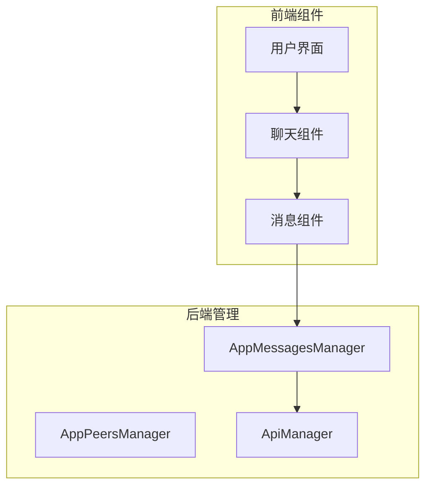
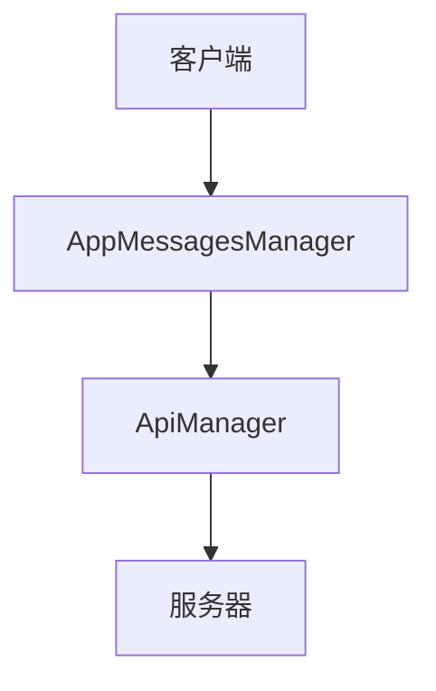
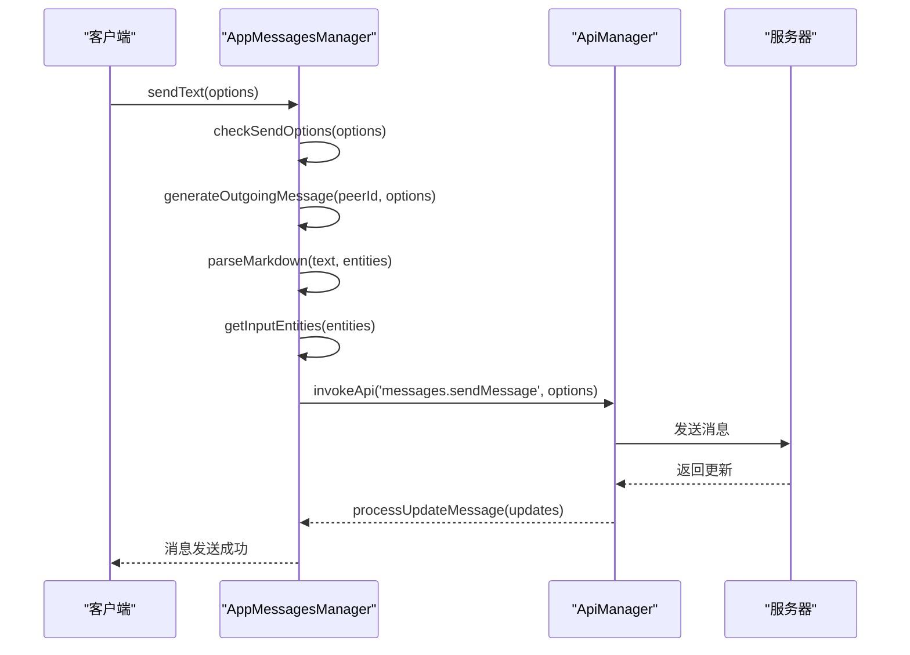
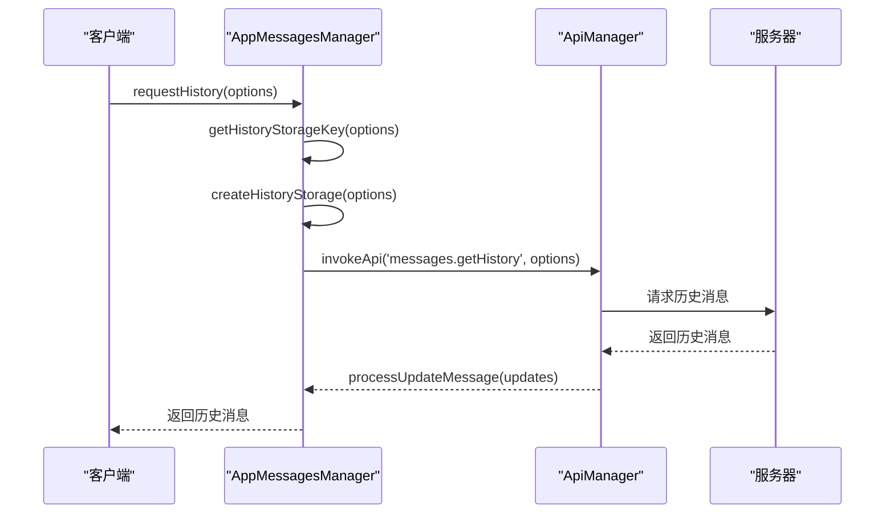
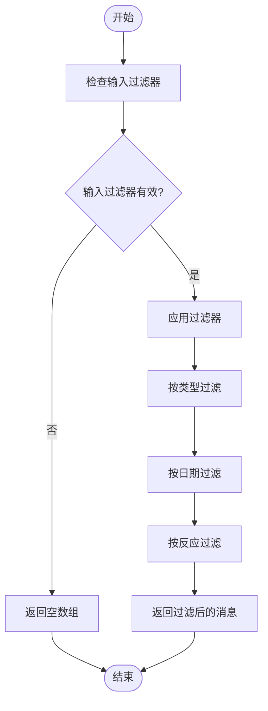
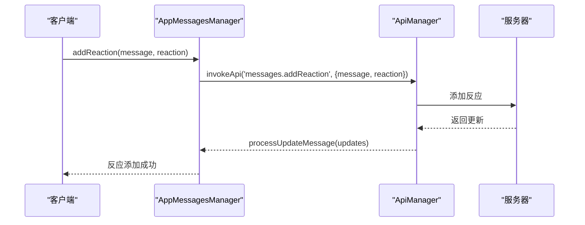
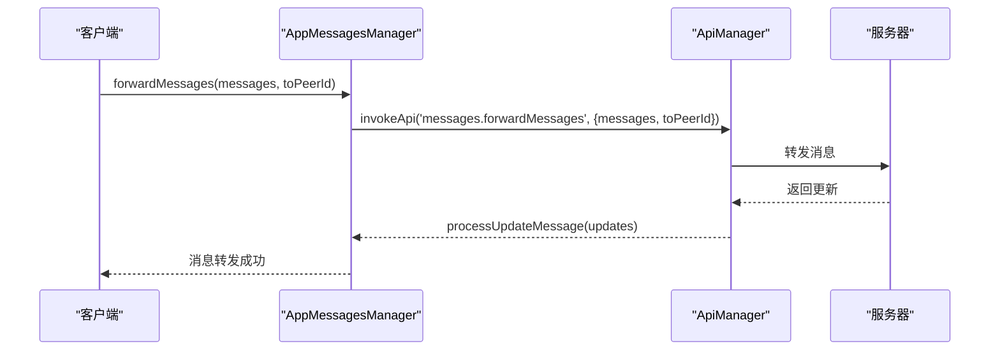
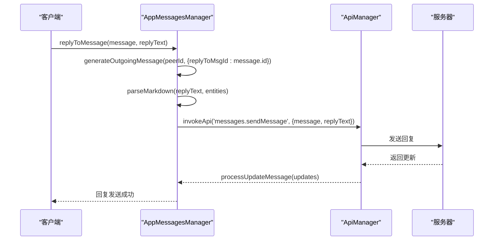

# 消息API

<cite>
**本文档中引用的文件**  
- [appMessagesManager.ts](file://src/lib/appManagers/appMessagesManager.ts)
- [historyStorages.ts](file://src/stores/historyStorages.ts)
- [createHistoryStorage.ts](file://src/lib/appManagers/utils/messages/createHistoryStorage.ts)
- [filterMessagesByInputFilter.ts](file://src/lib/appManagers/utils/messages/filterMessagesByInputFilter.ts)
- [getHistoryStorageKey.ts](file://src/lib/appManagers/utils/messages/getHistoryStorageKey.ts)
</cite>

## 目录
1. [介绍](#介绍)
2. [项目结构](#项目结构)
3. [核心组件](#核心组件)
4. [架构概述](#架构概述)
5. [详细组件分析](#详细组件分析)
6. [依赖分析](#依赖分析)
7. [性能考虑](#性能考虑)
8. [故障排除指南](#故障排除指南)
9. [结论](#结论)

## 介绍
本文档详细描述了消息API的实现，涵盖消息的发送、接收、编辑、删除等操作。文档还详细说明了消息实体的数据结构、消息状态管理机制、同步策略以及搜索、过滤和分页功能。此外，文档还解释了消息反应、转发和引用功能的实现细节，并提供了性能优化建议和最佳实践。

## 项目结构
项目结构清晰地组织了各个组件和模块，确保了代码的可维护性和可扩展性。核心消息功能主要位于`src/lib/appManagers`目录下，特别是`appMessagesManager.ts`文件，它负责管理所有消息相关的操作。



**图表来源**  
- [appMessagesManager.ts](file://src/lib/appManagers/appMessagesManager.ts#L398-L10133)

**章节来源**  
- [appMessagesManager.ts](file://src/lib/appManagers/appMessagesManager.ts#L1-L10133)
- [project_structure](file://project_structure#L1-L100)

## 核心组件
核心组件包括`AppMessagesManager`，它负责处理所有消息相关的操作，如发送、接收、编辑和删除消息。此外，`historyStorages.ts`文件提供了历史消息存储的管理功能。

**章节来源**  
- [appMessagesManager.ts](file://src/lib/appManagers/appMessagesManager.ts#L398-L10133)
- [historyStorages.ts](file://src/stores/historyStorages.ts#L1-L29)

## 架构概述
系统架构采用分层设计，前端组件通过`AppMessagesManager`与后端API进行交互。`AppMessagesManager`负责处理所有消息相关的逻辑，并通过`ApiManager`与服务器通信。



**图表来源**  
- [appMessagesManager.ts](file://src/lib/appManagers/appMessagesManager.ts#L398-L10133)

## 详细组件分析

### 消息管理组件分析
`AppMessagesManager`是消息管理的核心组件，负责处理所有消息相关的操作。

#### 类图
```mermaid
classDiagram
class AppMessagesManager {
+messagesStorageByPeerId : {[peerId : string] : MessagesStorage}
+groupedMessagesStorage : {[groupId : string] : MessagesStorage}
+scheduledMessagesStorage : {[peerId : PeerId] : MessagesStorage}
+logsMessagesStorage : {[peerId : PeerId] : MessagesStorage}
+historiesStorage : {[peerId : PeerId] : HistoryStorage}
+threadsStorage : {[peerId : PeerId] : { [threadId : string] : HistoryStorage }}
+searchesStorage : {[peerId : PeerId] : { [threadId : string] : { [inputFilter in SearchStorageFilterKey]? : HistoryStorage }}}
+pinnedMessages : {[key : string] : PinnedStorage}
+references : {[key : string] : MessageContext}
+threadsServiceMessagesIdsStorage : {[peerId_threadId : string] : number}
+threadsToReplies : {[peerId_threadId : string] : string}
+pendingByRandomId : {[randomId : string] : PendingMessageDetails}
+pendingByMessageId : {[mid : string] : Long}
+pendingAfterMsgs : {[peerId : PeerId] : PendingAfterMsg}
+pendingTopMsgs : {[peerId in PeerId | `${PeerId}_${number}`] : number}
+tempFinalizeCallbacks : {[tempId : string] : { [callbackName : string] : Partial<{ deferred : CancellablePromise<void>, callback : (message : MyMessage) => Promise<any> }> }}
+pendingNewBotforumTopics : Record<PeerId, { newId? : number, tempId : number, beforeMessageSendCallbacks : Array<() => void>, messageSendCallbacks : Array<() => void> }>
+sendSmthLazyLoadQueue : LazyLoadQueueBase
+needSingleMessages : Map<PeerId, Map<number, CancellablePromise<Message.message | Message.messageService>>>
+fetchSingleMessagesPromise : Promise<void>
+extendedMedia : Map<PeerId, Map<number, CancellablePromise<void>>>
+deletedMessages : Set<string>
+maxSeenId : number
+migratedFromTo : {[peerId : PeerId] : PeerId}
+migratedToFrom : {[peerId : PeerId] : PeerId}
+newDialogsHandlePromise : Promise<any>
+newDialogsToHandle : Map<PeerId, {dialog? : Dialog, topics? : Map<number, ForumTopic>, saved? : Map<number, SavedDialog>}>
+newUpdatesAfterReloadToHandle : {[key : string] : Set<Update>}
+notificationsHandlePromise : number
+notificationsToHandle : {[key : string] : { fwdCount : number, fromId : PeerId, topMessage? : MyMessage }}
+reloadConversationsPromise : Promise<void>
+reloadConversationsPeers : Map<PeerId, {inputDialogPeer : InputDialogPeer, promise : CancellablePromise<Dialog>, sentRequest? : boolean}>
+groupedTempId : number
+mediaTempId : number
+mediaTempMap : {[tempId : number] : number}
+typings : {[key : string] : {action : SendMessageAction, timeout? : number}}
+middleware : ReturnType<typeof getMiddleware>
+unreadMentions : {[key : string] : SlicedArray<number>}
+goToNextMentionPromises : {[key : string] : Promise<number>}
+batchUpdates : {[k in keyof BatchUpdates]? : { callback : BatchUpdates[k], batch : ArgumentTypes<BatchUpdates[k]>[0] }}
+batchUpdatesDebounced : () => Promise<void>
+uploadFilePromises : {[fileName : string] : CancellablePromise<any>}
+tempMids : {[peerId : PeerId] : number}
+historyMaxIdSubscribed : Map<HistoryStorageKey, number>
+factCheckBatcher : Batcher<PeerId, number, FactCheck>
+checklistBatcher : Batcher<string, { taskId : number, oldItem? : TodoCompletion, action : 'complete' | 'uncomplete' }, void>
+waitingTranscriptions : Map<string, CancellablePromise<MessagesTranscribedAudio>>
+paidMessagesQueue : PaidMessagesQueue
+repayRequestHandler : RepayRequestHandler
+typingBotforumMessages : Map<PeerId, Set<string>>
+constructor()
+after()
+clear(init? : boolean)
+getInputEntities(entities : MessageEntity[]) : MessageEntity[]
+invokeAfterMessageIsSent(tempId : number, callbackName : string, callback : (message : MyMessage) => Promise<any>) : Promise<void>
+editMessage(message : MyMessage, text : string, options : Partial<{ newMedia : InputMedia, scheduleDate : number, entities : MessageEntity[] }> & Partial<Pick<Parameters<AppMessagesManager['sendText']>[0], 'webPage' | 'webPageOptions' | 'noWebPage' | 'invertMedia'>>) : Promise<void>
+transcribeAudio(message : Message.message, noPending? : boolean) : Promise<MessagesTranscribedAudio>
+sendText(options : MessageSendingParams & Partial<{ text : string, entities : MessageEntity[], viaBotId : BotId, queryId : string, resultId : string, noWebPage : true, replyMarkup : ReplyMarkup, clearDraft : true, invertMedia : boolean, webPage : WebPage, webPageOptions : Partial<{ largeMedia : boolean, smallMedia : boolean, optional : boolean }>}>) : Promise<void>
+sendFile(options : MessageSendingParams & SendFileDetails & Partial<{ isRoundMessage : boolean, isVoiceMessage : boolean, isGroupedItem : boolean, isMedia : boolean, groupId : string, caption : string, entities : MessageEntity[], background : boolean, clearDraft : boolean, noSound : boolean, waveform : Uint8Array, stars : number, groupedMessage : Message.message, useTempMediaId : boolean, processAfter? : typeof processAfter}>) : Promise<InputMedia>
}
```

**图表来源**  
- [appMessagesManager.ts](file://src/lib/appManagers/appMessagesManager.ts#L398-L10133)

#### 消息发送流程


**图表来源**  
- [appMessagesManager.ts](file://src/lib/appManagers/appMessagesManager.ts#L890-L1108)

**章节来源**  
- [appMessagesManager.ts](file://src/lib/appManagers/appMessagesManager.ts#L890-L1108)

### 消息状态管理
消息状态管理通过`HistoryStorage`对象实现，每个对话或线程都有一个独立的`HistoryStorage`实例，用于存储消息历史记录。

#### 历史存储类图
```mermaid
classDiagram
class HistoryStorage {
+_maxId : number
+count : number | null
+history : SlicedArray<number>
+searchHistory : SlicedArray<`${PeerId}_${number}`>
+maxId : number
+readPromise : Promise<void>
+readMaxId : number
+readOutboxMaxId : number
+triedToReadMaxId : number
+maxOutId : number
+replyMarkup : Exclude<ReplyMarkup, ReplyMarkup.replyInlineMarkup>
+type : 'history' | 'replies' | 'search'
+key : HistoryStorageKey
+wasFetched : boolean
+channelJoinedMid : number
+originalInsertSlice : SlicedArray<number>['insertSlice']
+filterMessages : (messages : MyMessage[]) => MyMessage[]
+filterMessage : (message : MyMessage) => boolean
+onMidInsertion : (mid : number) => void
+nextRate : number
}
```

**图表来源**  
- [appMessagesManager.ts](file://src/lib/appManagers/appMessagesManager.ts#L138-L165)

#### 消息状态同步流程


**图表来源**  
- [appMessagesManager.ts](file://src/lib/appManagers/appMessagesManager.ts#L279-L307)

**章节来源**  
- [appMessagesManager.ts](file://src/lib/appManagers/appMessagesManager.ts#L279-L307)
- [createHistoryStorage.ts](file://src/lib/appManagers/utils/messages/createHistoryStorage.ts#L1-L50)

### 消息搜索与过滤
消息搜索和过滤功能通过`filterMessagesByInputFilter`函数实现，支持多种过滤条件，如按类型、日期、反应等。

#### 消息过滤流程


**图表来源**  
- [filterMessagesByInputFilter.ts](file://src/lib/appManagers/utils/messages/filterMessagesByInputFilter.ts#L1-L171)

**章节来源**  
- [filterMessagesByInputFilter.ts](file://src/lib/appManagers/utils/messages/filterMessagesByInputFilter.ts#L1-L171)

### 消息反应、转发和引用
消息反应、转发和引用功能通过`AppMessagesManager`中的相应方法实现，支持用户对消息进行反应、转发和引用。

#### 消息反应流程


**图表来源**  
- [appMessagesManager.ts](file://src/lib/appManagers/appMessagesManager.ts#L536-L537)

#### 消息转发流程


**图表来源**  
- [appMessagesManager.ts](file://src/lib/appManagers/appMessagesManager.ts#L270-L277)

#### 消息引用流程


**图表来源**  
- [appMessagesManager.ts](file://src/lib/appManagers/appMessagesManager.ts#L253-L258)

**章节来源**  
- [appMessagesManager.ts](file://src/lib/appManagers/appMessagesManager.ts#L253-L258)

## 依赖分析
`AppMessagesManager`依赖于多个其他组件，如`ApiManager`、`AppPeersManager`和`AppDocsManager`，这些组件共同协作以实现消息管理功能。


**图表来源**  
- [appMessagesManager.ts](file://src/lib/appManagers/appMessagesManager.ts#L398-L10133)

**章节来源**  
- [appMessagesManager.ts](file://src/lib/appManagers/appMessagesManager.ts#L398-L10133)

## 性能考虑
为了提高性能，`AppMessagesManager`采用了多种优化策略，如懒加载队列、批量更新和缓存机制。这些策略有助于减少网络请求和提高响应速度。

**章节来源**  
- [appMessagesManager.ts](file://src/lib/appManagers/appMessagesManager.ts#L449-L454)

## 故障排除指南
在使用消息API时，可能会遇到一些常见问题，如消息发送失败、消息同步延迟等。以下是一些常见的故障排除步骤：

1. **检查网络连接**：确保客户端与服务器之间的网络连接正常。
2. **检查API调用参数**：确保所有API调用参数正确无误。
3. **查看日志**：检查客户端和服务器的日志，查找错误信息。
4. **重启应用**：尝试重启应用，清除缓存和临时数据。

**章节来源**  
- [appMessagesManager.ts](file://src/lib/appManagers/appMessagesManager.ts#L822-L835)

## 结论
本文档详细描述了消息API的实现，涵盖了消息的发送、接收、编辑、删除等操作，以及消息状态管理、同步策略、搜索、过滤和分页功能。通过详细的类图和序列图，展示了各个组件之间的关系和交互流程。此外，文档还提供了性能优化建议和故障排除指南，帮助开发者更好地理解和使用消息API。