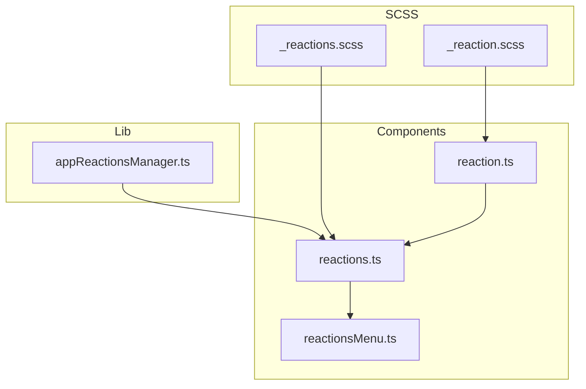
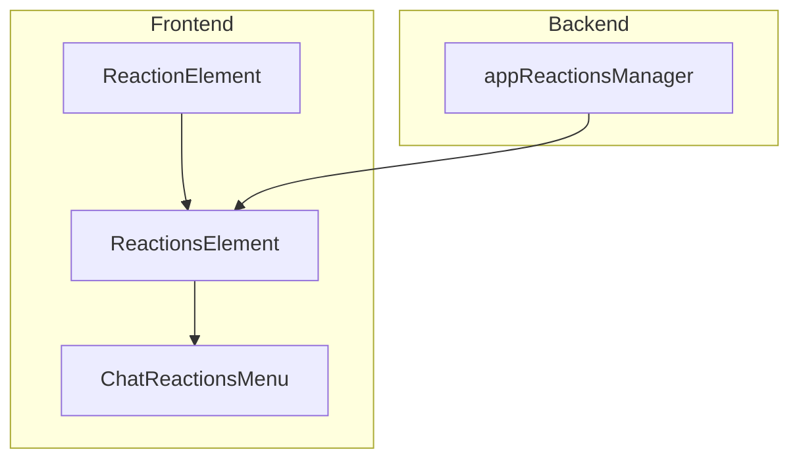
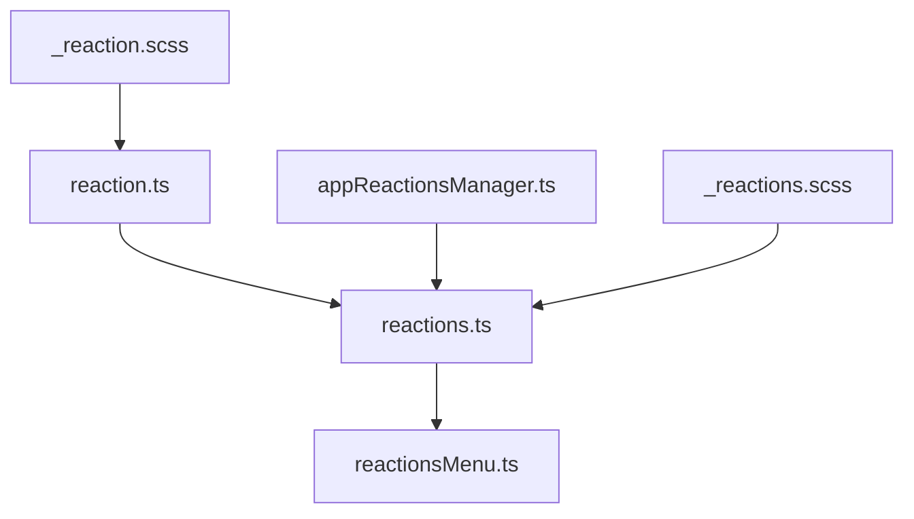

# 消息反应

<cite>
**本文档中引用的文件**  
- [reaction.ts](file://src/components/chat/reaction.ts)
- [reactions.ts](file://src/components/chat/reactions.ts)
- [reactionsMenu.ts](file://src/components/chat/reactionsMenu.ts)
- [appReactionsManager.ts](file://src/lib/appManagers/appReactionsManager.ts)
- [_reactions.scss](file://src/scss/partials/_reactions.scss)
- [_reaction.scss](file://src/scss/partials/_reaction.scss)
</cite>

## 目录
1. [简介](#简介)
2. [项目结构](#项目结构)
3. [核心组件](#核心组件)
4. [架构概述](#架构概述)
5. [详细组件分析](#详细组件分析)
6. [依赖分析](#依赖分析)
7. [性能考虑](#性能考虑)
8. [故障排除指南](#故障排除指南)
9. [结论](#结论)

## 简介
本项目实现了消息反应功能，允许用户在聊天消息上添加、移除和查看反应。该功能包括反应表情的加载、缓存和动画播放机制，以及反应聚合显示和详细列表的实现方式。此外，还包含了反应权限控制和频率限制的实现。通过优化反应数据的批量加载和内存管理策略，确保了高性能和流畅的用户体验。

## 项目结构
项目结构清晰地组织了各个组件和模块，确保了代码的可维护性和扩展性。主要目录包括 `components`、`lib`、`scss` 等，分别存放了组件、库和样式文件。



**Diagram sources**
- [reaction.ts](file://src/components/chat/reaction.ts)
- [reactions.ts](file://src/components/chat/reactions.ts)
- [reactionsMenu.ts](file://src/components/chat/reactionsMenu.ts)
- [appReactionsManager.ts](file://src/lib/appManagers/appReactionsManager.ts)
- [_reactions.scss](file://src/scss/partials/_reactions.scss)
- [_reaction.scss](file://src/scss/partials/_reaction.scss)

**Section sources**
- [reaction.ts](file://src/components/chat/reaction.ts)
- [reactions.ts](file://src/components/chat/reactions.ts)
- [reactionsMenu.ts](file://src/components/chat/reactionsMenu.ts)
- [appReactionsManager.ts](file://src/lib/appManagers/appReactionsManager.ts)
- [_reactions.scss](file://src/scss/partials/_reactions.scss)
- [_reaction.scss](file://src/scss/partials/_reaction.scss)

## 核心组件
### ReactionElement
`ReactionElement` 类负责渲染单个反应，支持不同布局类型（内联、块、标签）。它处理反应的显示、计数、头像堆叠和动画播放。

**Section sources**
- [reaction.ts](file://src/components/chat/reaction.ts)

### ReactionsElement
`ReactionsElement` 类管理一组反应，支持排序、更新和渲染。它还处理待处理的付费反应和最近的反应列表。

**Section sources**
- [reactions.ts](file://src/components/chat/reactions.ts)

### ChatReactionsMenu
`ChatReactionsMenu` 类提供了一个菜单，用户可以通过它选择和添加反应。它支持水平和垂直布局，并且可以显示更多反应选项。

**Section sources**
- [reactionsMenu.ts](file://src/components/chat/reactionsMenu.ts)

## 架构概述
系统架构分为前端组件和后端管理器两部分。前端组件负责用户界面的渲染和交互，而后端管理器负责数据的获取和处理。



**Diagram sources**
- [reaction.ts](file://src/components/chat/reaction.ts)
- [reactions.ts](file://src/components/chat/reactions.ts)
- [reactionsMenu.ts](file://src/components/chat/reactionsMenu.ts)
- [appReactionsManager.ts](file://src/lib/appManagers/appReactionsManager.ts)

## 详细组件分析
### ReactionElement 分析
`ReactionElement` 类通过 `init` 方法初始化，设置反应的布局类型和中间件。`render` 方法负责渲染反应的贴纸容器、计数器和头像堆叠。

#### 对象导向组件
```mermaid
classDiagram
class ReactionElement {
+type : ReactionLayoutType
+counter : HTMLElement
+stickerContainer : HTMLElement
+stackedAvatars : StackedAvatars
+canRenderAvatars : boolean
+_reactionCount : ReactionCount
+wrapStickerPromise : Awaited<ReturnType<typeof wrapSticker>>['render']
+managers : AppManagers
+middleware : Middleware
+customEmojiElement : CustomEmojiElement
+hasAroundAnimation : Promise<void>
+isUnread : boolean
+hasTitle : boolean
+paidReactionCounter : AnimatedCounter
+init(type : ReactionLayoutType, middleware : Middleware)
+render(doNotRenderSticker? : boolean)
+setPaidReactionCounter(count : number)
+destroyPaidReactionCounter()
+renderDoc(doc : Document.document)
+findTitle()
+renderCounter(force? : boolean, title : string | HTMLElement)
+renderAvatars(recentReactions : MessagePeerReaction[])
+setIsChosen(isChosen = this.reactionCount.chosen_order !== undefined)
+fireAroundAnimation(waitPromise? : Promise<any>)
+static fireAroundAnimation(options : { waitPromise? : Promise<any>, cache? : { hasAroundAnimation : ReactionElement['hasAroundAnimation'], wrapStickerPromise? : ReactionElement['wrapStickerPromise'] }, reaction : Reaction, managers? : AppManagers, middleware : Middleware, stickerContainer : HTMLElement, sizes : { genericEffect : number, genericEffectSize : number, size : number, effectSize : number }, textColor? : string, scrollable? : Scrollable })
}
ReactionElement --> StackedAvatars : "uses"
ReactionElement --> CustomEmojiElement : "uses"
ReactionElement --> RLottiePlayer : "uses"
```

**Diagram sources**
- [reaction.ts](file://src/components/chat/reaction.ts)

### ReactionsElement 分析
`ReactionsElement` 类通过 `init` 方法初始化，设置上下文、类型、中间件等。`render` 方法负责渲染所有反应，并处理待处理的付费反应和最近的反应列表。

#### 对象导向组件
```mermaid
classDiagram
class ReactionsElement {
+context : ReactionsContext
+key : string
+isPlaceholder : boolean
+type : ReactionLayoutType
+sorted : ReactionElement[]
+onConnectCallback : () => void
+managers : AppManagers
+middleware : Middleware
+middlewareHelpers : Map<ReactionElement, MiddlewareHelper>
+customEmojiRenderer : CustomEmojiRendererElement
+customEmojiRendererMiddlewareHelper : MiddlewareHelper
+animationGroup : AnimationItemGroup
+lazyLoadQueue : LazyLoadQueue
+forceCounter : boolean
+getType()
+getReactionCount(reactionElement : ReactionElement)
+getContext()
+getSorted()
+shouldUseTagsForContext(context : ReactionsElement['context'])
+init(options : { context : ReactionsContext, type : ReactionLayoutType, middleware : Middleware, isPlaceholder? : boolean, animationGroup? : AnimationItemGroup, lazyLoadQueue? : LazyLoadQueue, forceCounter? : boolean })
+setType(type : ReactionLayoutType)
+changeContext(context : ReactionsContext)
+update(context : ReactionsContext, changedResults? : ReactionCount[], waitPromise? : Promise<any>)
+render(changedResults? : ReactionCount[], waitPromise? : Promise<any>)
+handleChangedResults(changedResults : ReactionCount[], waitPromise? : Promise<any>, withDelay? : boolean)
}
ReactionsElement --> ReactionElement : "contains"
ReactionsElement --> CustomEmojiRendererElement : "uses"
ReactionsElement --> LazyLoadQueue : "uses"
```

**Diagram sources**
- [reactions.ts](file://src/components/chat/reactions.ts)

### ChatReactionsMenu 分析
`ChatReactionsMenu` 类通过构造函数初始化，设置管理器、类型、中间件等。`init` 方法负责准备和渲染反应菜单，`onMoreClick` 方法处理更多反应的点击事件。

#### 对象导向组件
```mermaid
classDiagram
class ChatReactionsMenu {
+widthContainer : HTMLElement
+container : HTMLElement
+reactionsMap : Map<HTMLElement, ChatReactionsMenuPlayers>
+animationGroup : AnimationItemGroup
+middlewareHelper : ReturnType<typeof getMiddleware>
+managers : AppManagers
+onFinish : (reaction? : Reaction | Promise<Reaction>) => void
+listenerSetter : ListenerSetter
+size : number
+openSide : 'top' | 'bottom'
+getOpenPosition : (hasMenu : boolean) => DOMRectEditable
+noMoreButton : boolean
+isTags : boolean
+isEffects : boolean
+reactions : Reaction[]
+availableReactions : AvailableReaction[]
+noPacks : boolean
+noSearch : boolean
+freeCustomEmoji : Set<DocId>
+inited : boolean
+constructor(options : { managers : AppManagers, type : 'horizontal' | 'vertical', middleware : Middleware, onFinish : ChatReactionsMenu['onFinish'], size? : ChatReactionsMenu['size'], openSide? : ChatReactionsMenu['openSide'], getOpenPosition : ChatReactionsMenu['getOpenPosition'], noMoreButton? : boolean, isTags? : boolean, isEffects? : boolean })
+render(renderPromises : Promise<any>[], hasMore : boolean)
+renderReactions(peerAvailableReactions : PeerAvailableReactions, availableReactions : AvailableReaction[])
+renderEffects(availableEffects : AvailableEffect[])
+prepareReactions(message? : Message.message | Message.messageService)
+prepareEffects()
+init(message? : Message.message | Message.messageService)
+cleanup()
+reactionToDocId(reaction : Reaction)
+reactionsToDocIds(reactions : Reaction[])
+loadTags()
+loadEffects()
+loadReactions()
+onMoreClick(e : MouseEvent)
+splitAvailableEffects(availableEffects : AvailableEffect[])
+canUseAnimations()
+renderReaction(reaction : Reaction, availableReaction? : AvailableReaction)
+onMouseMove(e : MouseEvent)
}
ChatReactionsMenu --> EmoticonsDropdown : "uses"
ChatReactionsMenu --> EmojiTab : "uses"
ChatReactionsMenu --> RLottiePlayer : "uses"
```

**Diagram sources**
- [reactionsMenu.ts](file://src/components/chat/reactionsMenu.ts)

## 依赖分析
### 组件依赖关系


**Diagram sources**
- [reaction.ts](file://src/components/chat/reaction.ts)
- [reactions.ts](file://src/components/chat/reactions.ts)
- [reactionsMenu.ts](file://src/components/chat/reactionsMenu.ts)
- [appReactionsManager.ts](file://src/lib/appManagers/appReactionsManager.ts)
- [_reactions.scss](file://src/scss/partials/_reactions.scss)
- [_reaction.scss](file://src/scss/partials/_reaction.scss)

### 外部依赖
- `lottieLoader`：用于加载和播放 Lottie 动画。
- `apiManagerProxy`：用于与后端 API 通信。
- `rootScope`：全局状态管理。
- `liteMode`：轻量模式控制。

**Section sources**
- [reaction.ts](file://src/components/chat/reaction.ts)
- [reactions.ts](file://src/components/chat/reactions.ts)
- [reactionsMenu.ts](file://src/components/chat/reactionsMenu.ts)
- [appReactionsManager.ts](file://src/lib/appManagers/appReactionsManager.ts)

## 性能考虑
### 反应数据的批量加载
为了提高性能，反应数据采用批量加载的方式。`ReactionsElement` 类中的 `render` 方法会一次性加载所有反应，避免多次请求。

### 内存管理策略
- **懒加载队列**：使用 `LazyLoadQueue` 类来管理反应的懒加载，减少初始加载时间。
- **中间件销毁**：在组件销毁时，及时清理中间件和监听器，防止内存泄漏。
- **动画优化**：通过 `liteMode` 控制动画的启用和禁用，确保在低性能设备上也能流畅运行。

**Section sources**
- [reactions.ts](file://src/components/chat/reactions.ts)
- [reactionsMenu.ts](file://src/components/chat/reactionsMenu.ts)

## 故障排除指南
### 常见问题
1. **反应不显示**：检查 `reaction.ts` 和 `reactions.ts` 文件中的 `render` 方法是否正确调用。
2. **动画不播放**：确保 `lottieLoader` 正确加载了动画资源，并且 `liteMode` 设置为允许动画。
3. **反应计数不更新**：检查 `ReactionsElement` 类中的 `update` 方法是否正确处理了反应计数的更新。

### 调试工具
- **浏览器开发者工具**：使用浏览器的开发者工具检查网络请求和DOM元素。
- **日志输出**：在关键方法中添加日志输出，帮助定位问题。

**Section sources**
- [reaction.ts](file://src/components/chat/reaction.ts)
- [reactions.ts](file://src/components/chat/reactions.ts)
- [reactionsMenu.ts](file://src/components/chat/reactionsMenu.ts)

## 结论
本项目通过 `ReactionElement`、`ReactionsElement` 和 `ChatReactionsMenu` 三个核心组件实现了消息反应功能。这些组件协同工作，提供了丰富的用户交互体验。通过合理的架构设计和性能优化，确保了系统的高效和稳定。未来可以进一步优化动画效果和用户体验，提升整体质量。