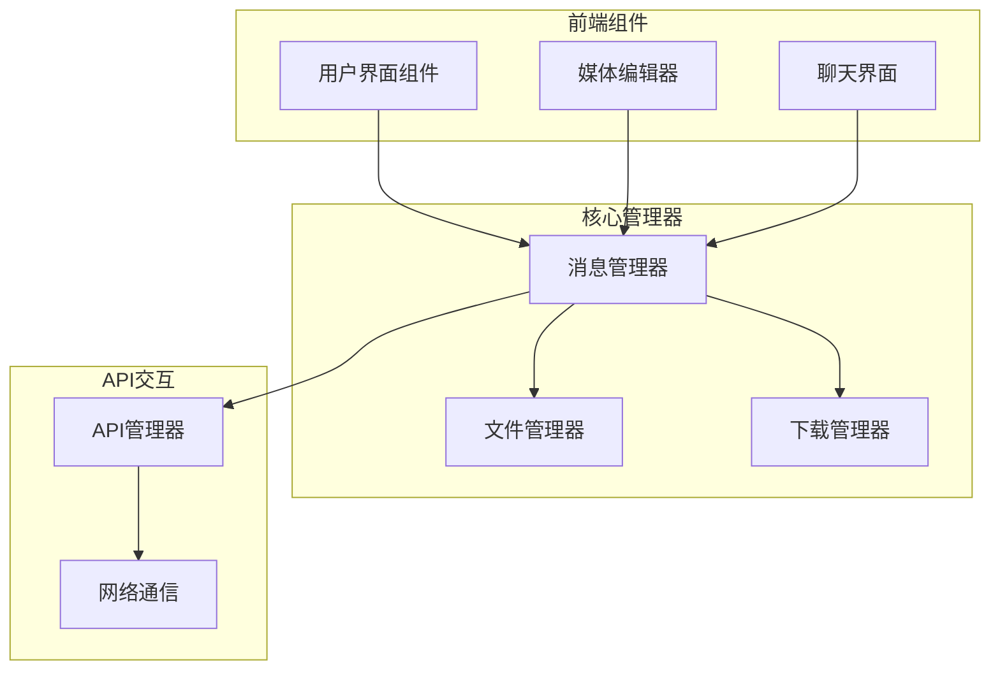
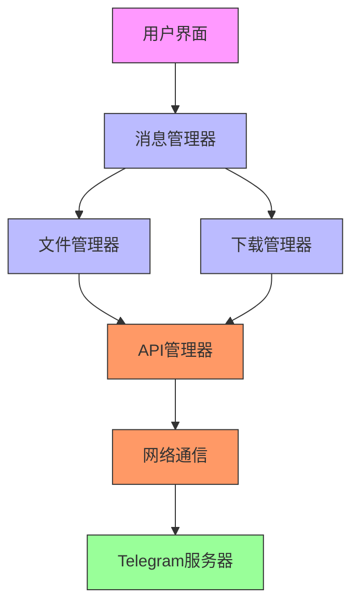
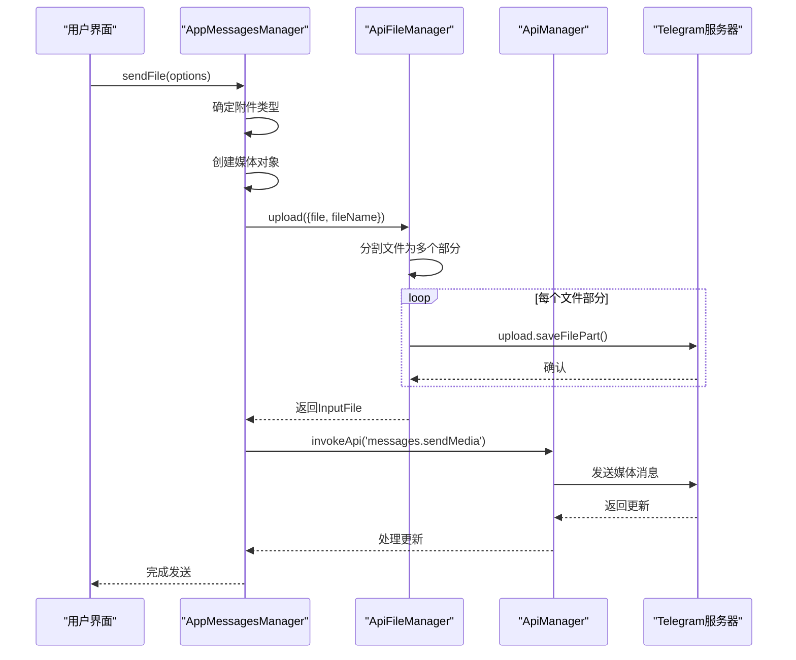
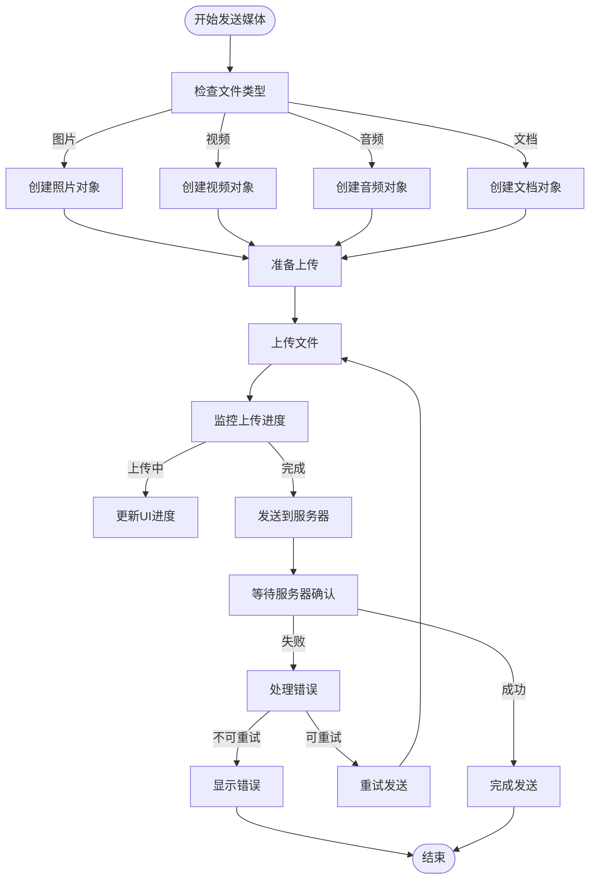
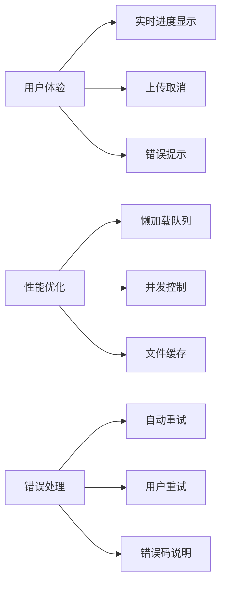
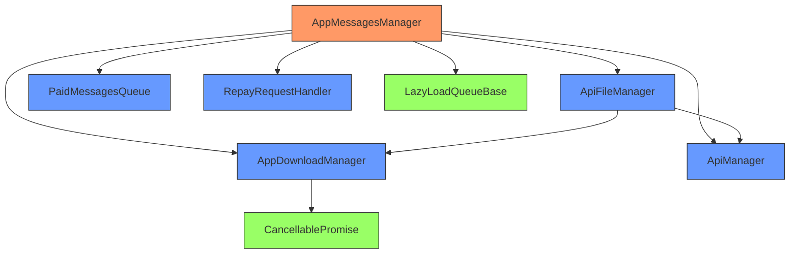

# 媒体消息发送

<cite>
**本文档引用的文件**   
- [appMessagesManager.ts](file://src/lib/appManagers/appMessagesManager.ts)
- [apiFileManager.ts](file://src/lib/mtproto/apiFileManager.ts)
- [appDownloadManager.ts](file://src/lib/appManagers/appDownloadManager.ts)
- [paidMessagesQueue.ts](file://src/lib/appManagers/utils/messages/paidMessagesQueue.ts)
- [repayRequestHandler.ts](file://src/lib/mtproto/repayRequestHandler.ts)
- [cancellablePromise.ts](file://src/helpers/cancellablePromise.ts)
- [lazyLoadQueueBase.ts](file://src/components/lazyLoadQueueBase.ts)
</cite>

## 目录
1. [介绍](#介绍)
2. [项目结构](#项目结构)
3. [核心组件](#核心组件)
4. [架构概述](#架构概述)
5. [详细组件分析](#详细组件分析)
6. [依赖分析](#依赖分析)
7. [性能考虑](#性能考虑)
8. [故障排除指南](#故障排除指南)
9. [结论](#结论)

## 介绍
本文档详细介绍了Telegram Web客户端中媒体消息发送功能的实现。重点分析了`sendMediaMessage` API方法的实现细节，包括媒体文件处理、上传流程、进度跟踪、消息队列管理和服务器确认机制。文档详细描述了图片、视频、音频等不同类型媒体消息的发送流程，包括媒体元数据提取和格式转换。同时说明了媒体消息发送失败处理、重试机制和错误码说明，并提供了实际代码示例，展示如何正确调用sendMediaMessage API并处理响应，包括上传进度监控和完成后的处理。

## 项目结构
该项目是一个Telegram Web客户端的实现，包含完整的前端界面和与Telegram API的交互逻辑。项目结构清晰，主要分为组件、配置、环境、帮助函数、钩子、库、页面、脚本、样式表、存储等目录。媒体消息发送功能主要集中在`src/lib/appManagers`目录下的`appMessagesManager.ts`文件中，该文件负责管理所有消息的发送和接收。



**Diagram sources**
- [appMessagesManager.ts](file://src/lib/appManagers/appMessagesManager.ts)
- [apiFileManager.ts](file://src/lib/mtproto/apiFileManager.ts)
- [appDownloadManager.ts](file://src/lib/appManagers/appDownloadManager.ts)

**Section sources**
- [appMessagesManager.ts](file://src/lib/appManagers/appMessagesManager.ts)
- [apiFileManager.ts](file://src/lib/mtproto/apiFileManager.ts)
- [appDownloadManager.ts](file://src/lib/appManagers/appDownloadManager.ts)

## 核心组件
媒体消息发送功能的核心组件包括消息管理器、文件管理器和下载管理器。`appMessagesManager.ts`文件中的`sendFile`方法是发送媒体消息的主要入口，它处理各种类型的媒体文件（图片、视频、音频、文档）的发送逻辑。文件管理器负责实际的文件上传操作，而下载管理器则管理文件的下载和缓存。

**Section sources**
- [appMessagesManager.ts](file://src/lib/appManagers/appMessagesManager.ts#L1110-L1655)
- [apiFileManager.ts](file://src/lib/mtproto/apiFileManager.ts#L1038-L1109)
- [appDownloadManager.ts](file://src/lib/appManagers/appDownloadManager.ts#L212-L222)

## 架构概述
媒体消息发送功能的架构分为几个主要层次：用户界面层、业务逻辑层、API交互层和网络通信层。用户界面层负责收集用户输入和显示上传进度；业务逻辑层（主要是`appMessagesManager`）处理消息的生成、媒体文件的准备和上传队列的管理；API交互层（`apiManager`）负责与Telegram服务器通信；网络通信层（`networker`）处理底层的网络请求和响应。



**Diagram sources**
- [appMessagesManager.ts](file://src/lib/appManagers/appMessagesManager.ts)
- [apiFileManager.ts](file://src/lib/mtproto/apiFileManager.ts)
- [appDownloadManager.ts](file://src/lib/appManagers/appDownloadManager.ts)

## 详细组件分析

### 媒体消息发送流程分析
媒体消息发送流程从用户选择文件开始，经过文件类型识别、元数据提取、上传准备、实际上传、服务器确认等步骤。`sendFile`方法首先根据文件类型确定附件类型（attachType），然后创建相应的媒体对象（photo或document），最后通过`apiFileManager.upload`方法上传文件。

#### 媒体消息发送类图
```mermaid
classDiagram
class AppMessagesManager {
+sendFile(options) Promise~InputMedia~
+sendGrouped(options) Promise~void~
+uploadThumbAndCover(args) Promise~{file, coverPhoto}~
+uploadVideoCover(args) Promise~InputPhoto~
}
class ApiFileManager {
+upload(options) Promise~InputFile~
+download(options) Promise~Blob~
+requestFilePart(options) Promise~UploadFile~
}
class AppDownloadManager {
+downloadMedia(options) Promise~Blob | string~
+upload(file, fileName, promise) Promise~InputFile~
+getNewDeferredForUpload(fileName, promise) CancellablePromise~InputFile~
}
class PaidMessagesQueue {
+add(peerId, item) void
+sendFor(peerId) void
+cancelFor(peerId) void
+remove(peerId) void
}
class RepayRequestHandler {
+tryRegisterRequest(args) RepayRequest | undefined
+confirmRepayRequest(requestId, result) void
+cancelRepayRequest(requestId) void
}
AppMessagesManager --> ApiFileManager : "使用"
AppMessagesManager --> AppDownloadManager : "使用"
AppMessagesManager --> PaidMessagesQueue : "使用"
AppMessagesManager --> RepayRequestHandler : "使用"
ApiFileManager --> AppDownloadManager : "使用"
```

**Diagram sources**
- [appMessagesManager.ts](file://src/lib/appManagers/appMessagesManager.ts#L1110-L1655)
- [apiFileManager.ts](file://src/lib/mtproto/apiFileManager.ts#L1038-L1109)
- [appDownloadManager.ts](file://src/lib/appManagers/appDownloadManager.ts#L212-L222)
- [paidMessagesQueue.ts](file://src/lib/appManagers/utils/messages/paidMessagesQueue.ts#L1-L62)
- [repayRequestHandler.ts](file://src/lib/mtproto/repayRequestHandler.ts#L1-L101)

#### 媒体消息发送序列图


**Diagram sources**
- [appMessagesManager.ts](file://src/lib/appManagers/appMessagesManager.ts#L1410-L1532)
- [apiFileManager.ts](file://src/lib/mtproto/apiFileManager.ts#L1076-L1109)

#### 媒体上传流程图


**Diagram sources**
- [appMessagesManager.ts](file://src/lib/appManagers/appMessagesManager.ts#L1410-L1532)
- [apiFileManager.ts](file://src/lib/mtproto/apiFileManager.ts#L1038-L1109)

### 概念概述
媒体消息发送功能的设计考虑了用户体验、性能优化和错误处理。系统采用了懒加载队列来管理并发上传，确保不会同时进行过多的上传操作影响性能。对于大文件，系统会自动分割为多个部分进行上传，并在上传过程中实时更新进度。此外，系统还实现了完善的错误处理机制，包括自动重试、用户重试和错误码说明。



## 依赖分析
媒体消息发送功能依赖于多个核心组件和外部库。主要依赖包括消息管理器、文件管理器、下载管理器、API管理器和网络通信层。此外，系统还依赖于一些帮助函数库，如`cancellablePromise`用于管理异步操作，`lazyLoadQueueBase`用于管理上传队列。



**Diagram sources**
- [appMessagesManager.ts](file://src/lib/appManagers/appMessagesManager.ts)
- [apiFileManager.ts](file://src/lib/mtproto/apiFileManager.ts)
- [appDownloadManager.ts](file://src/lib/appManagers/appDownloadManager.ts)
- [cancellablePromise.ts](file://src/helpers/cancellablePromise.ts)
- [lazyLoadQueueBase.ts](file://src/components/lazyLoadQueueBase.ts)

**Section sources**
- [appMessagesManager.ts](file://src/lib/appManagers/appMessagesManager.ts)
- [apiFileManager.ts](file://src/lib/mtproto/apiFileManager.ts)
- [appDownloadManager.ts](file://src/lib/appManagers/appDownloadManager.ts)
- [cancellablePromise.ts](file://src/helpers/cancellablePromise.ts)
- [lazyLoadQueueBase.ts](file://src/components/lazyLoadQueueBase.ts)

## 性能考虑
媒体消息发送功能在设计时充分考虑了性能因素。系统通过懒加载队列限制并发上传数量，默认限制为8个并发上传。对于大文件，系统会根据文件大小动态调整每个部分的大小，以优化上传效率。此外，系统还实现了文件缓存机制，避免重复上传相同的文件。

**Section sources**
- [apiFileManager.ts](file://src/lib/mtproto/apiFileManager.ts#L146-L150)
- [lazyLoadQueueBase.ts](file://src/components/lazyLoadQueueBase.ts#L12-L13)

## 故障排除指南
媒体消息发送功能实现了完善的错误处理机制。当上传失败时，系统会根据错误类型采取不同的处理策略。对于可恢复的错误（如网络中断），系统会自动重试；对于需要用户干预的错误（如文件太大），系统会提示用户并提供解决方案。错误码通过`repayRequestHandler`进行处理，确保用户能够理解错误原因并采取相应措施。

**Section sources**
- [appMessagesManager.ts](file://src/lib/appManagers/appMessagesManager.ts#L1590-L1613)
- [repayRequestHandler.ts](file://src/lib/mtproto/repayRequestHandler.ts#L51-L84)

## 结论
Telegram Web客户端的媒体消息发送功能实现了完整的媒体处理流程，从文件选择到服务器确认，涵盖了上传、进度跟踪、错误处理等各个方面。系统设计考虑了用户体验、性能优化和可靠性，通过合理的架构设计和组件划分，实现了高效、稳定的媒体消息发送功能。未来可以进一步优化大文件上传的性能，增加更多媒体格式的支持，并改进错误处理的用户体验。