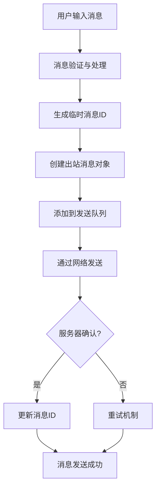
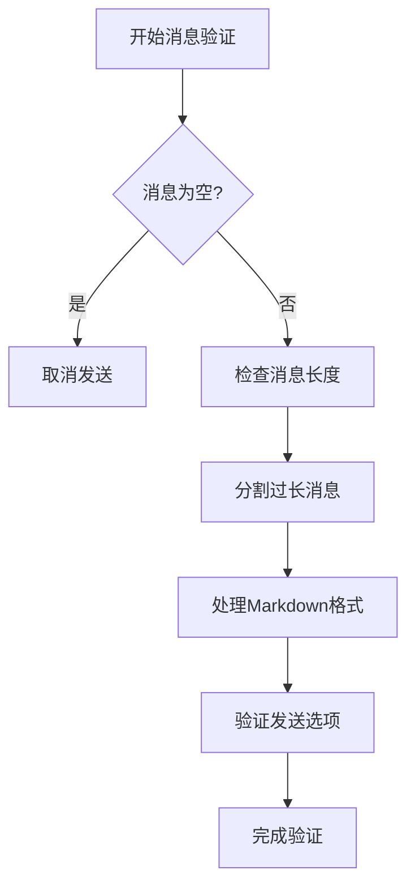
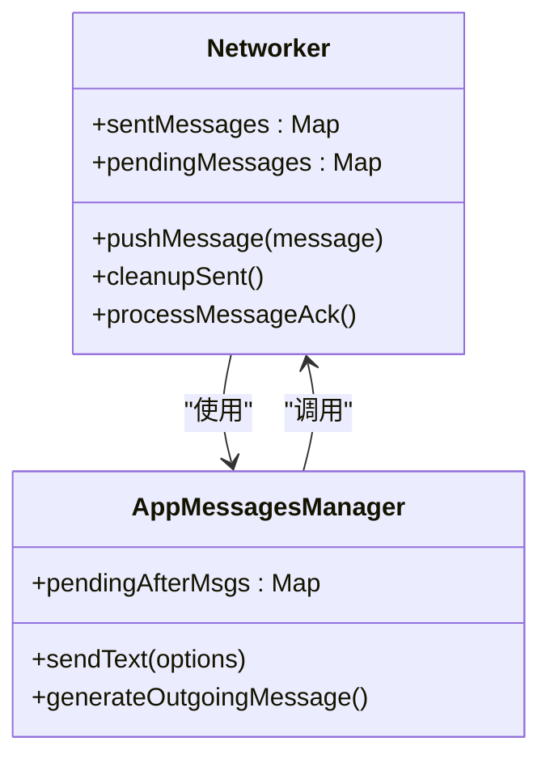
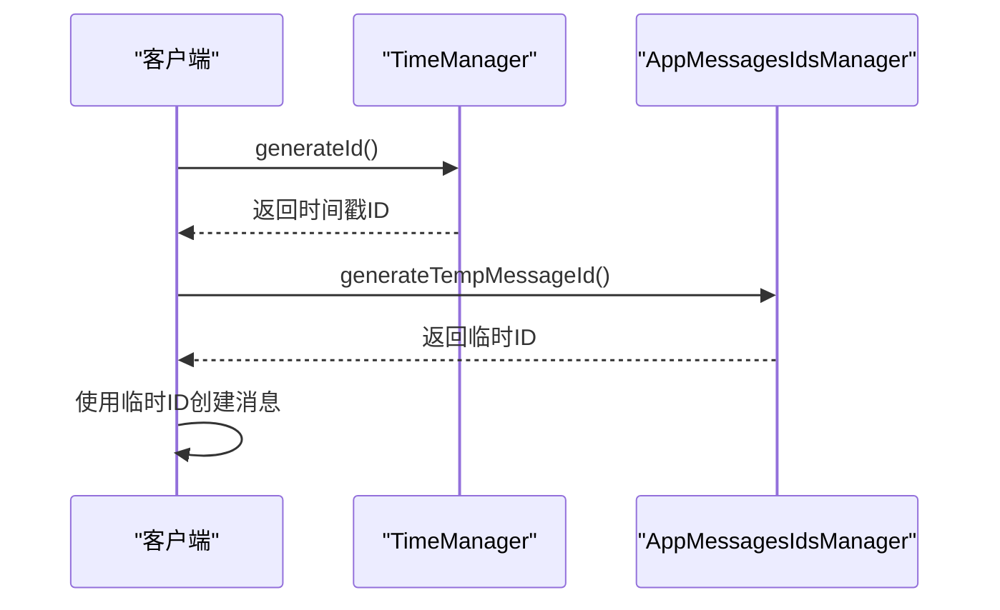
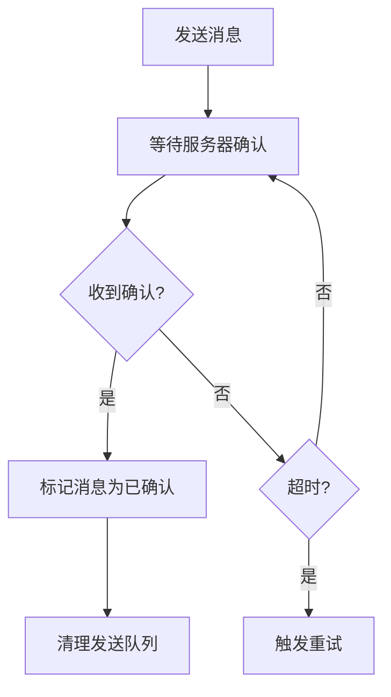
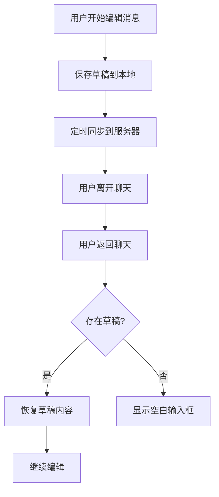
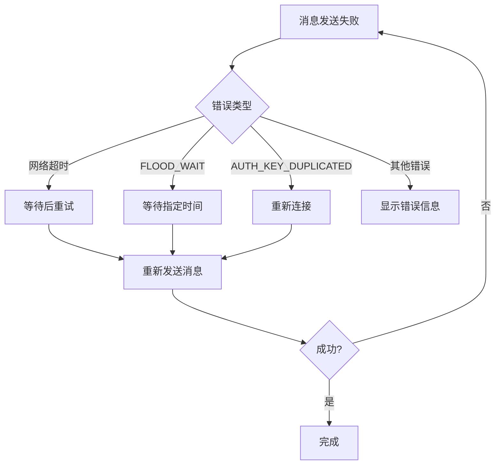
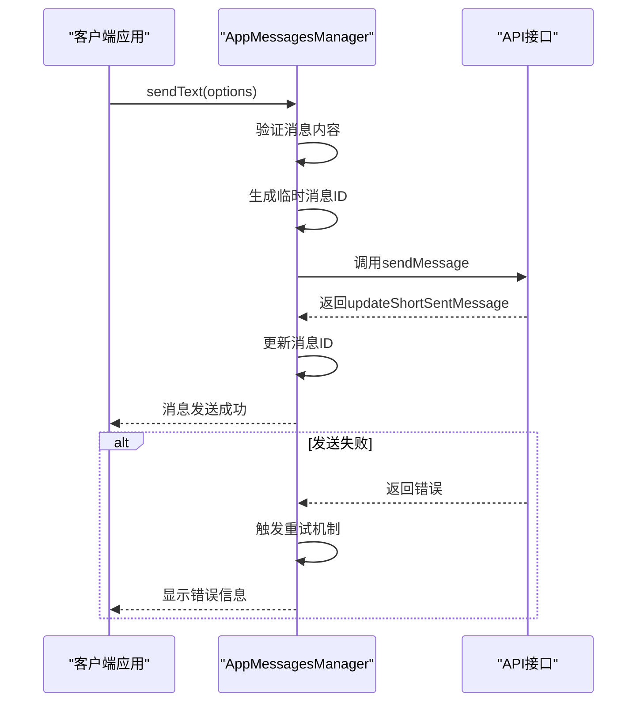

# 文本消息发送

<cite>
**本文档中引用的文件**   
- [appMessagesManager.ts](file://src/lib/appManagers/appMessagesManager.ts)
- [appMessagesIdsManager.ts](file://src/lib/appManagers/appMessagesIdsManager.ts)
- [timeManager.ts](file://src/lib/mtproto/timeManager.ts)
- [networker.ts](file://src/lib/mtproto/networker.ts)
- [appDraftsManager.ts](file://src/lib/appManagers/appDraftsManager.ts)
</cite>

## 目录
1. [简介](#简介)
2. [核心组件](#核心组件)
3. [消息发送流程](#消息发送流程)
4. [消息验证与输入处理](#消息验证与输入处理)
5. [消息队列管理](#消息队列管理)
6. [临时消息ID生成](#临时消息id生成)
7. [服务器确认机制](#服务器确认机制)
8. [消息草稿保存与恢复](#消息草稿保存与恢复)
9. [错误处理与重试机制](#错误处理与重试机制)
10. [API调用示例](#api调用示例)

## 简介
本文档详细介绍了Telegram Web客户端中文本消息发送功能的实现细节。文档深入分析了sendMessage API方法的实现，包括消息内容验证、输入处理、消息队列管理、临时消息ID生成和服务器确认机制。同时，文档还详细描述了文本消息的发送流程，包括消息草稿保存和恢复功能的实现，以及消息发送失败处理、重试机制和错误码说明。

**Section sources**
- [appMessagesManager.ts](file://src/lib/appManagers/appMessagesManager.ts#L890-L1108)

## 核心组件
文本消息发送功能主要由以下几个核心组件构成：AppMessagesManager负责消息的生成、发送和管理；AppMessagesIdsManager负责消息ID的生成和管理；TimeManager负责时间戳和消息ID的生成；Networker负责网络通信和消息确认；AppDraftsManager负责草稿的保存和同步。

**Section sources**
- [appMessagesManager.ts](file://src/lib/appManagers/appMessagesManager.ts#L890-L1108)
- [appMessagesIdsManager.ts](file://src/lib/appManagers/appMessagesIdsManager.ts#L1-L73)
- [timeManager.ts](file://src/lib/mtproto/timeManager.ts#L1-L118)
- [networker.ts](file://src/lib/mtproto/networker.ts#L880-L1839)
- [appDraftsManager.ts](file://src/lib/appManagers/appDraftsManager.ts#L76-L389)

## 消息发送流程
文本消息的发送流程始于用户在聊天界面输入消息内容并点击发送按钮。系统首先对消息内容进行验证和处理，然后生成一个带有临时ID的出站消息对象。该消息被添加到发送队列中，并通过网络层发送到服务器。服务器确认接收后，会返回一个包含正式消息ID的更新，客户端使用此ID更新本地消息状态。

**Diagram sources **
- [appMessagesManager.ts](file://src/lib/appManagers/appMessagesManager.ts#L890-L1108)
- [networker.ts](file://src/lib/mtproto/networker.ts#L880-L1839)

**Section sources**
- [appMessagesManager.ts](file://src/lib/appManagers/appMessagesManager.ts#L890-L1108)

## 消息验证与输入处理
在消息发送前，系统会对消息内容进行严格的验证和处理。这包括检查消息长度是否超过最大限制、处理Markdown格式、验证发送选项的有效性等。消息长度验证基于服务器配置的message_length_max参数，过长的消息会被自动分割成多个部分发送。

**Diagram sources **
- [appMessagesManager.ts](file://src/lib/appManagers/appMessagesManager.ts#L910-L934)
- [appMessagesManager.ts](file://src/lib/appManagers/appMessagesManager.ts#L2224-L2254)

**Section sources**
- [appMessagesManager.ts](file://src/lib/appManagers/appMessagesManager.ts#L910-L934)
- [appMessagesManager.ts](file://src/lib/appManagers/appMessagesManager.ts#L2224-L2254)

## 消息队列管理
系统使用消息队列来管理待发送的消息，确保消息按正确的顺序发送并处理网络延迟或失败的情况。每条消息在发送前都会被分配一个唯一的随机ID，并添加到pendingMessages队列中。Networker组件负责监控队列状态并调度消息发送。

**Diagram sources **
- [networker.ts](file://src/lib/mtproto/networker.ts#L880-L1839)
- [appMessagesManager.ts](file://src/lib/appManagers/appMessagesManager.ts#L890-L1108)

**Section sources**
- [networker.ts](file://src/lib/mtproto/networker.ts#L880-L1839)
- [appMessagesManager.ts](file://src/lib/appManagers/appMessagesManager.ts#L890-L1108)

## 临时消息ID生成
临时消息ID的生成是一个关键过程，确保每条消息在发送前都有一个唯一的标识符。系统使用TimeManager生成基于时间戳的消息ID，并通过AppMessagesIdsManager进行通道特定的ID转换。临时ID采用浮点数格式，小数部分用于区分同一时间生成的多个消息。

**Diagram sources **
- [timeManager.ts](file://src/lib/mtproto/timeManager.ts#L73-L97)
- [appMessagesIdsManager.ts](file://src/lib/appManagers/appMessagesIdsManager.ts#L16-L18)

**Section sources**
- [timeManager.ts](file://src/lib/mtproto/timeManager.ts#L73-L97)
- [appMessagesIdsManager.ts](file://src/lib/appManagers/appMessagesIdsManager.ts#L16-L18)

## 服务器确认机制
服务器确认机制确保消息成功送达。当消息发送到服务器后，客户端会等待服务器的确认响应。Networker组件通过processMessageAck方法处理确认消息，标记已确认的消息并从待确认队列中移除。如果在指定时间内未收到确认，系统会触发重试机制。

**Diagram sources **
- [networker.ts](file://src/lib/mtproto/networker.ts#L1671-L1676)
- [networker.ts](file://src/lib/mtproto/networker.ts#L880-L903)

**Section sources**
- [networker.ts](file://src/lib/mtproto/networker.ts#L1671-L1676)

## 消息草稿保存与恢复
系统提供消息草稿保存和恢复功能，确保用户在编辑消息时不会丢失内容。AppDraftsManager负责管理草稿的存储和同步，将草稿信息保存在本地存储中，并在需要时同步到服务器。当用户返回聊天界面时，系统会自动恢复之前的草稿内容。

**Diagram sources **
- [appDraftsManager.ts](file://src/lib/appManagers/appDraftsManager.ts#L76-L389)
- [appDraftsManager.ts](file://src/lib/appManagers/appDraftsManager.ts#L161-L181)

**Section sources**
- [appDraftsManager.ts](file://src/lib/appManagers/appDraftsManager.ts#L76-L389)

## 错误处理与重试机制
系统实现了完善的错误处理和重试机制，确保在网络不稳定或服务器错误时能够恢复消息发送。当消息发送失败时，系统会根据错误类型决定是否重试。对于可恢复的错误（如网络超时），系统会自动重试；对于不可恢复的错误（如权限不足），则向用户显示错误信息。

**Diagram sources **
- [networker.ts](file://src/lib/mtproto/networker.ts#L1692-L1814)
- [appMessagesManager.ts](file://src/lib/appManagers/appMessagesManager.ts#L1069-L1082)
- [apiManager.ts](file://src/lib/mtproto/apiManager.ts#L736-L768)

**Section sources**
- [networker.ts](file://src/lib/mtproto/networker.ts#L1692-L1814)
- [appMessagesManager.ts](file://src/lib/appManagers/appMessagesManager.ts#L1069-L1082)
- [apiManager.ts](file://src/lib/mtproto/apiManager.ts#L736-L768)

## API调用示例
以下示例展示了如何正确调用sendMessage API并处理响应，包括成功发送和失败情况的处理。

**Diagram sources **
- [appMessagesManager.ts](file://src/lib/appManagers/appMessagesManager.ts#L890-L1108)
- [appMessagesManager.ts](file://src/lib/appManagers/appMessagesManager.ts#L1015-L1068)

**Section sources**
- [appMessagesManager.ts](file://src/lib/appManagers/appMessagesManager.ts#L890-L1108)