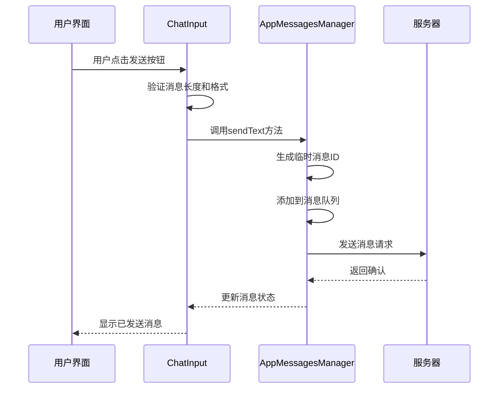
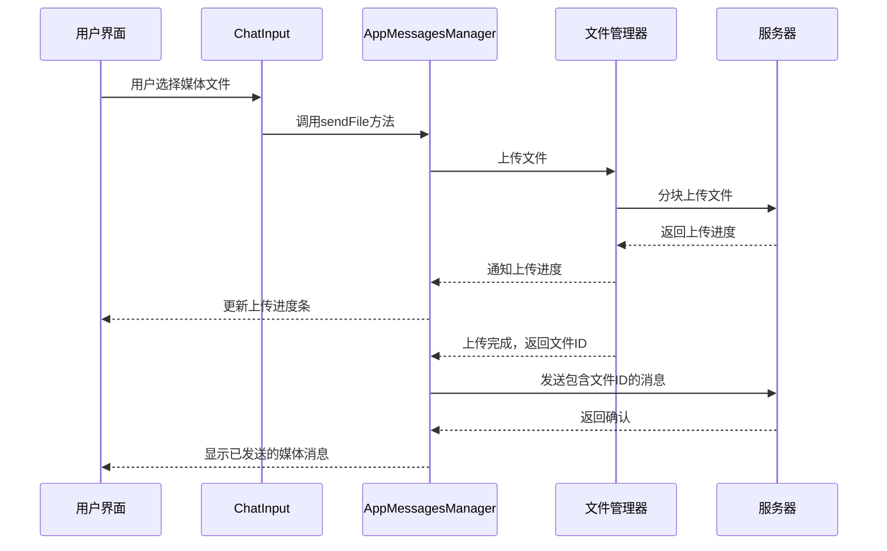
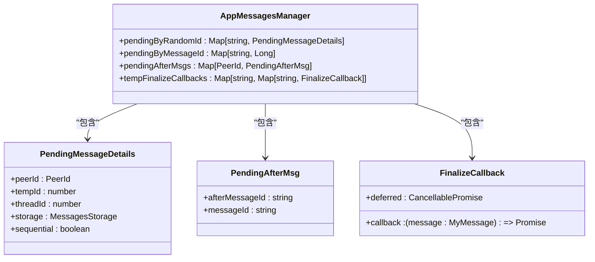
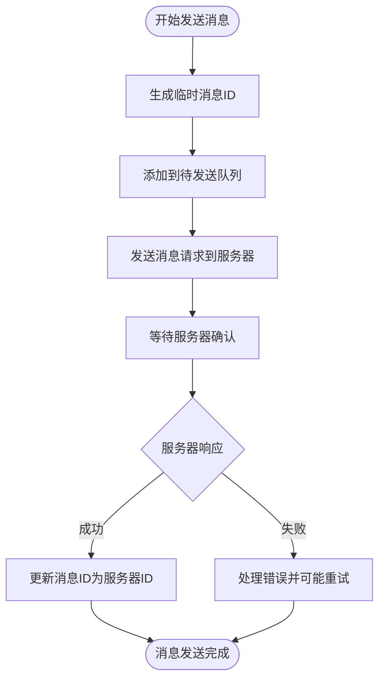
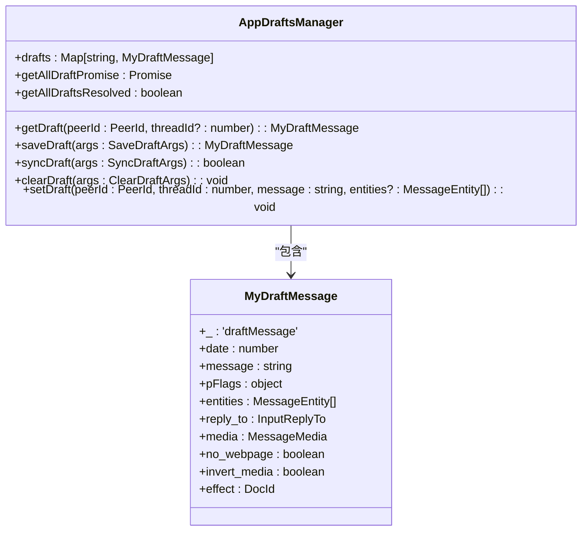
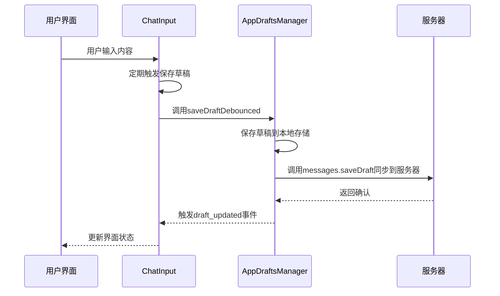
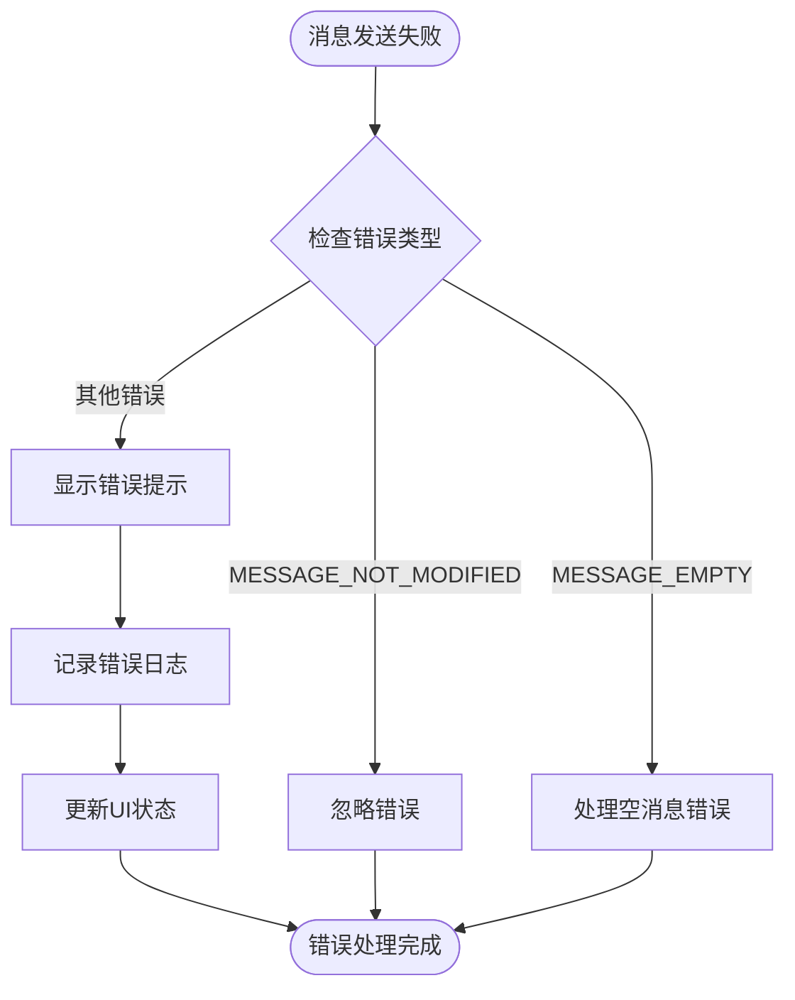
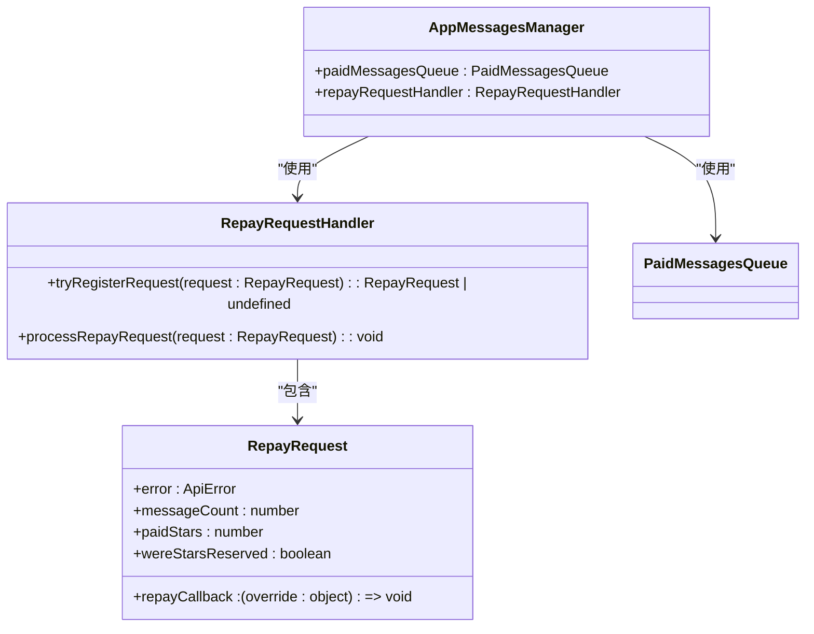

# 消息发送

<cite>
**本文档引用的文件**   
- [input.ts](file://src/components/chat/input.ts)
- [appMessagesManager.ts](file://src/lib/appManagers/appMessagesManager.ts)
- [appDraftsManager.ts](file://src/lib/appManagers/appDraftsManager.ts)
- [getServerMessageId.ts](file://src/lib/appManagers/utils/messageId/getServerMessageId.ts)
</cite>

## 目录
1. [介绍](#介绍)
2. [核心组件](#核心组件)
3. [消息发送流程](#消息发送流程)
4. [消息队列与临时ID管理](#消息队列与临时ID管理)
5. [消息草稿功能](#消息草稿功能)
6. [消息发送失败处理与重试机制](#消息发送失败处理与重试机制)
7. [API调用示例](#api调用示例)

## 介绍
本文档详细介绍了Telegram Web客户端中消息发送功能的实现。重点分析了`sendMessage`、`sendMediaMessage`等核心API方法的实现细节，包括参数验证、消息队列管理、临时消息ID生成和服务器确认机制。文档还详细描述了文本、媒体、文件等不同类型消息的发送流程，说明了消息草稿保存和恢复功能的实现，并提供了消息发送失败处理、重试机制和错误码说明。

**Section sources**
- [input.ts](file://src/components/chat/input.ts#L1-L4468)
- [appMessagesManager.ts](file://src/lib/appManagers/appMessagesManager.ts#L1-L10133)

## 核心组件

消息发送功能主要由以下几个核心组件构成：

1. **ChatInput**: 负责用户界面的输入处理，包括文本输入、媒体选择、消息编辑等。
2. **AppMessagesManager**: 核心消息管理器，处理所有消息的发送、接收、编辑和删除操作。
3. **AppDraftsManager**: 负责消息草稿的保存和同步，确保用户未发送的消息不会丢失。
4. **AppMessagesIdsManager**: 管理消息ID的生成和转换，处理客户端ID与服务器ID的映射。

这些组件协同工作，实现了完整的消息发送功能。

**Section sources**
- [input.ts](file://src/components/chat/input.ts#L1-L4468)
- [appMessagesManager.ts](file://src/lib/appManagers/appMessagesManager.ts#L1-L10133)
- [appDraftsManager.ts](file://src/lib/appManagers/appDraftsManager.ts#L1-L390)

## 消息发送流程

### 文本消息发送
文本消息的发送流程主要由`ChatInput.sendMessage`方法驱动。该方法首先进行基本的参数验证，包括检查消息长度是否超过服务器限制（由`config.message_length_max`定义），然后调用`AppMessagesManager.sendText`方法发送消息。



**Diagram sources**
- [input.ts](file://src/components/chat/input.ts#L3754-L3870)
- [appMessagesManager.ts](file://src/lib/appManagers/appMessagesManager.ts#L890-L1108)

### 媒体消息发送
媒体消息的发送流程更为复杂，涉及文件上传和进度跟踪。`ChatInput.sendMessageWithDocument`方法负责处理媒体消息的发送，它会调用`AppMessagesManager.sendFile`方法。



**Diagram sources**
- [input.ts](file://src/components/chat/input.ts#L3872-L3935)
- [appMessagesManager.ts](file://src/lib/appManagers/appMessagesManager.ts#L1110-L1599)

## 消息队列与临时ID管理

### 消息队列管理
消息队列是确保消息按顺序发送的关键机制。`AppMessagesManager`维护了一个`pendingByRandomId`对象，用于跟踪所有待发送的消息。每条消息在创建时都会分配一个唯一的`random_id`，这个ID用于在消息确认时匹配客户端和服务器端的消息。



**Diagram sources**
- [appMessagesManager.ts](file://src/lib/appManagers/appMessagesManager.ts#L427-L440)

### 临时消息ID生成
临时消息ID的生成和管理是确保消息一致性的重要环节。客户端在发送消息前会生成一个临时ID，这个ID在消息被服务器确认后会被替换为服务器分配的真实ID。



**Diagram sources**
- [appMessagesManager.ts](file://src/lib/appManagers/appMessagesManager.ts#L1013-L1041)
- [getServerMessageId.ts](file://src/lib/appManagers/utils/messageId/getServerMessageId.ts#L1-L15)

## 消息草稿功能

### 草稿保存机制
消息草稿功能通过`AppDraftsManager`类实现。当用户在输入框中输入内容时，系统会定期（通过`debounce`函数，延迟2.5秒）调用`saveDraft`方法保存草稿。



**Diagram sources**
- [appDraftsManager.ts](file://src/lib/appManagers/appDraftsManager.ts#L1-L390)

### 草稿同步流程
草稿的同步流程确保了用户在不同设备间切换时能够恢复未发送的消息。系统通过监听`draft_updated`事件来同步草稿状态。



**Diagram sources**
- [input.ts](file://src/components/chat/input.ts#L1295-L1368)
- [appDraftsManager.ts](file://src/lib/appManagers/appDraftsManager.ts#L144-L181)

## 消息发送失败处理与重试机制

### 错误处理流程
当消息发送失败时，系统会触发相应的错误处理流程。`AppMessagesManager`中的`onMessagesSendError`方法负责处理发送错误，并更新UI状态。



**Diagram sources**
- [appMessagesManager.ts](file://src/lib/appManagers/appMessagesManager.ts#L822-L835)

### 重试机制
系统实现了智能的重试机制，通过`repayRequestHandler`来管理重试请求。当遇到需要用户确认的错误（如支付失败）时，系统会暂停发送并等待用户操作。



**Diagram sources**
- [appMessagesManager.ts](file://src/lib/appManagers/appMessagesManager.ts#L505-L507)
- [appMessagesManager.ts](file://src/lib/appManagers/appMessagesManager.ts#L1069-L1082)

## API调用示例

### 发送文本消息
```typescript
// 获取聊天输入组件
const chatInput = this.chat.input;

// 发送纯文本消息
await chatInput.sendMessage();

// 发送带有回复的消息
chatInput.initMessageReply({
  replyToMsgId: 12345,
  replyToPeerId: targetPeerId
});
await chatInput.sendMessage();
```

### 发送媒体消息
```typescript
// 发送文档（如图片、视频等）
const document = await this.managers.appDocsManager.getDoc(docId);
await chatInput.sendMessageWithDocument({
  document: document,
  clearDraft: true,
  silent: false
});

// 发送贴纸
if(document.sticker) {
  await chatInput.sendMessageWithDocument({
    document: document,
    ignoreNoPremium: true // 忽略高级功能限制
  });
}
```

### 处理消息发送响应
```typescript
// 监听消息发送事件
chatInput.onMessageSent2 = () => {
  console.log('消息已发送');
  // 执行发送后的操作
};

// 处理发送错误
try {
  await chatInput.sendMessage();
} catch(error) {
  if(error.type === 'VOICE_MESSAGES_FORBIDDEN') {
    toastNew({
      langPackKey: 'Chat.SendVoice.PrivacyError',
      langPackArguments: [await wrapPeerTitle({peerId})]
    });
  }
}
```

**Section sources**
- [input.ts](file://src/components/chat/input.ts#L3754-L3870)
- [input.ts](file://src/components/chat/input.ts#L3872-L3935)