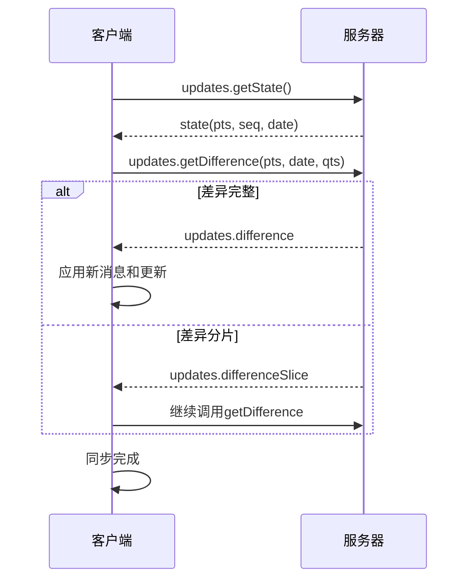
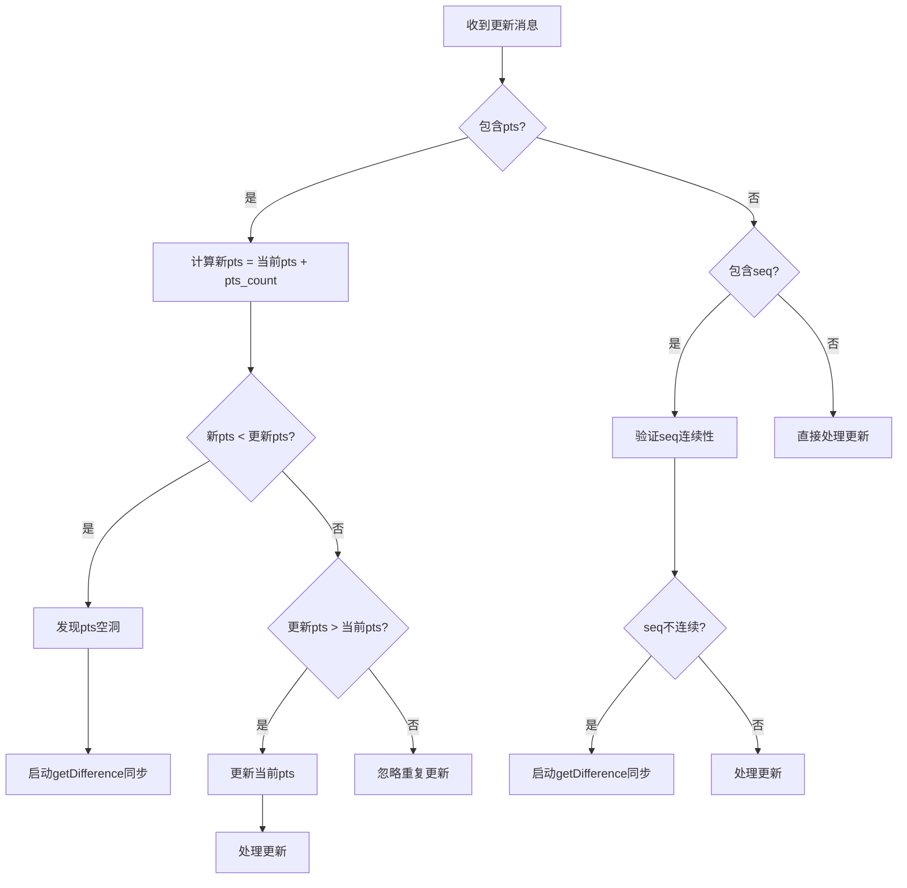
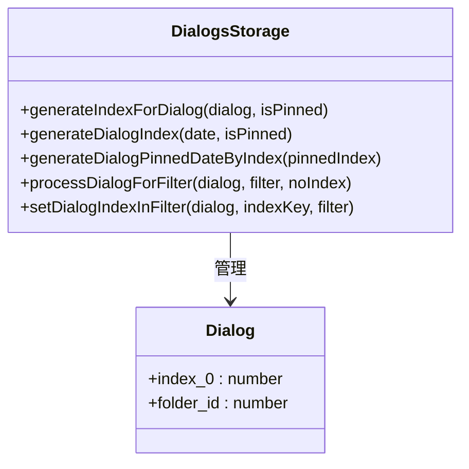
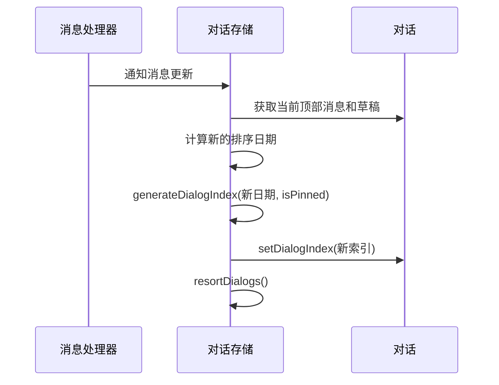
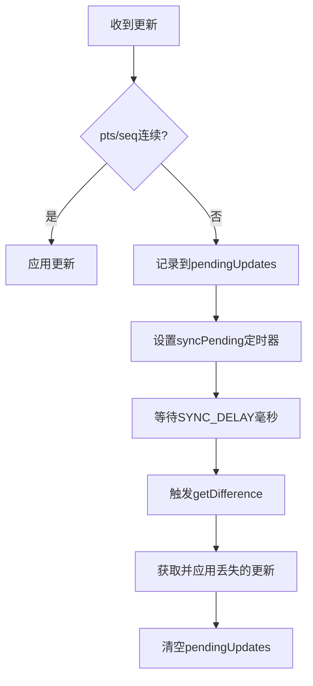
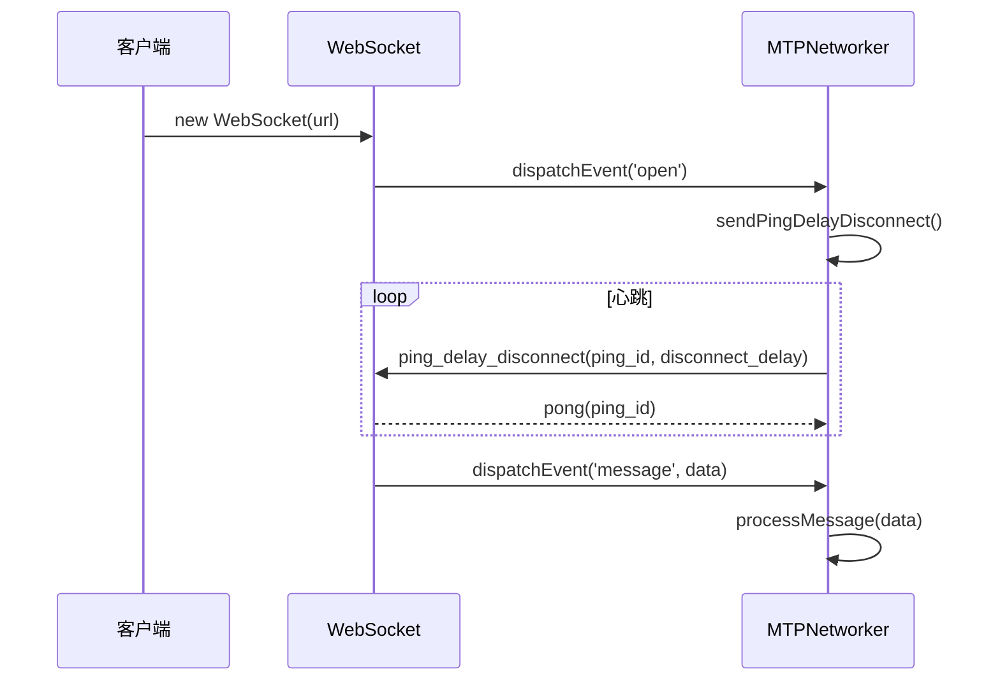
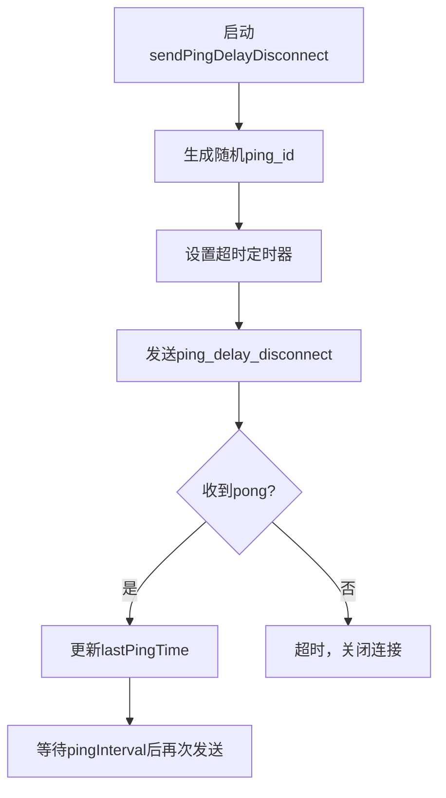
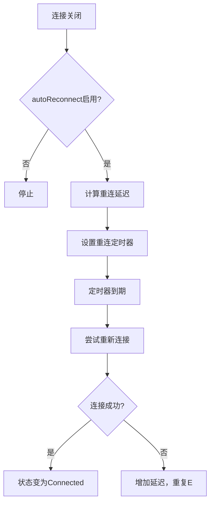
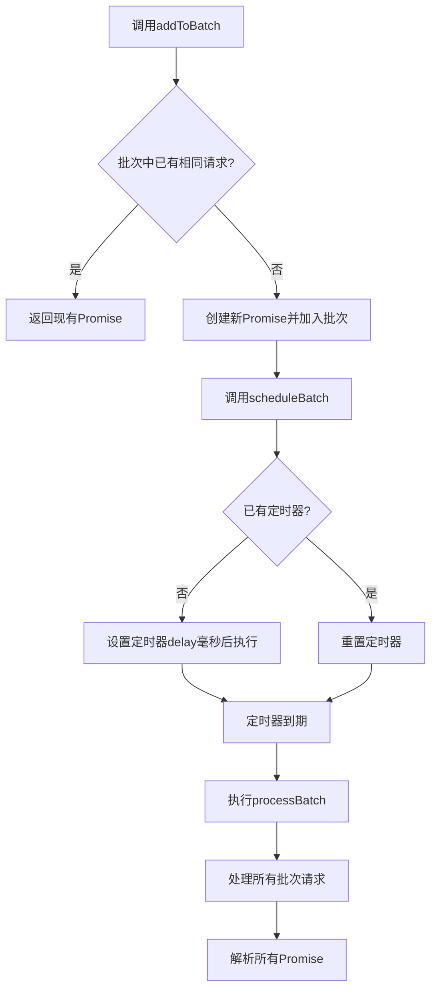

# 消息同步

<cite>
**本文档引用的文件**  
- [apiUpdatesManager.ts](file://src/lib/appManagers/apiUpdatesManager.ts)
- [networker.ts](file://src/lib/mtproto/networker.ts)
- [websocket.ts](file://src/lib/mtproto/transports/websocket.ts)
- [appMessagesManager.ts](file://src/lib/appManagers/appMessagesManager.ts)
- [layer.d.ts](file://src/layer.d.ts)
- [dialogs.ts](file://src/lib/storages/dialogs.ts)
- [getDialogIndex.ts](file://src/lib/appManagers/utils/dialogs/getDialogIndex.ts)
- [setDialogIndex.ts](file://src/lib/appManagers/utils/dialogs/setDialogIndex.ts)
</cite>

## 目录
1. [引言](#引言)
2. [增量更新与全量同步机制](#增量更新与全量同步机制)
3. [对话索引管理](#对话索引管理)
4. [消息差异计算与冲突解决](#消息差异计算与冲突解决)
5. [实时消息推送与WebSocket管理](#实时消息推送与websocket管理)
6. [网络异常处理与重连策略](#网络异常处理与重连策略)
7. [性能优化建议](#性能优化建议)
8. [结论](#结论)

## 引言

本文档详细阐述了Telegram Web客户端中消息同步机制的实现方式。系统基于MTProto协议，通过`updates.getDifference`和`updates.getLongPoll`方法实现增量更新和全量同步。文档涵盖了对话索引管理、消息差异计算、冲突解决策略、实时消息推送的WebSocket连接管理、心跳机制、网络异常处理、重连策略以及数据一致性保障等核心内容，并提供性能优化建议。

**Section sources**
- [apiUpdatesManager.ts](file://src/lib/appManagers/apiUpdatesManager.ts#L1-L800)
- [networker.ts](file://src/lib/mtproto/networker.ts#L1-L1998)

## 增量更新与全量同步机制

消息同步的核心是通过MTProto协议的`updates.getDifference`方法实现的。该方法允许客户端从服务器获取自上次同步以来的所有更新，从而实现高效的增量同步。

### 全量同步 (Full Synchronization)

全量同步发生在客户端首次启动或长时间离线后。系统通过调用`updates.getState`获取当前的同步状态（包括`pts`、`seq`和`date`），然后调用`updates.getDifference`获取完整的更新差异。

**Diagram sources**
- [apiUpdatesManager.ts](file://src/lib/appManagers/apiUpdatesManager.ts#L709-L757)

### 增量更新 (Incremental Updates)

在完成全量同步后，客户端进入增量更新模式。系统通过监听服务器推送的更新消息，结合`pts`（Message Sequence Number）和`seq`（Update Sequence Number）来处理增量更新。

- **`pts` (Message Sequence Number)**: 用于跟踪特定对话中的消息序列。
- **`pts_count`**: 表示本次更新中包含的消息数量。

当客户端收到一个`pts`更新时，它会验证`pts`的连续性。如果发现`pts`不连续（即存在“pts hole”），系统会启动`getDifference`流程来获取丢失的更新。

**Diagram sources**
- [apiUpdatesManager.ts](file://src/lib/appManagers/apiUpdatesManager.ts#L574-L617)

**Section sources**
- [apiUpdatesManager.ts](file://src/lib/appManagers/apiUpdatesManager.ts#L279-L372)
- [layer.d.ts](file://src/layer.d.ts#L3722-L3754)

## 对话索引管理

为了高效地对对话列表进行排序和渲染，系统使用了一套基于时间戳的索引管理机制。

### 索引生成

每个对话的排序索引（`index`）是一个32位整数，由两部分组成：
- **高16位**: 消息的`date`时间戳。
- **低16位**: 一个递增的计数器，用于处理同一秒内收到的多条消息。

对于置顶对话，系统会使用一个特殊的日期范围（`0x7fff0000`到`0x7fffffff`）来确保它们始终排在最前面。

**Diagram sources**
- [dialogs.ts](file://src/lib/storages/dialogs.ts#L494-L606)
- [setDialogIndex.ts](file://src/lib/appManagers/utils/dialogs/setDialogIndex.ts#L11-L17)

### 索引更新

当对话的顶部消息、草稿或置顶状态发生变化时，系统会重新计算其索引并触发列表的重新排序。

**Diagram sources**
- [dialogs.ts](file://src/lib/storages/dialogs.ts#L874-L890)
- [monoforumDialogs.ts](file://src/lib/storages/monoforumDialogs.ts#L338-L368)

**Section sources**
- [dialogs.ts](file://src/lib/storages/dialogs.ts#L494-L921)
- [getDialogIndex.ts](file://src/lib/appManagers/utils/dialogs/getDialogIndex.ts#L12-L17)

## 消息差异计算与冲突解决

系统通过维护`pts`和`seq`状态来检测和解决消息同步中的冲突。

### 差异计算

`updates.getDifference`的响应可能有以下几种类型：
- `updates.difference`: 包含完整的更新集。
- `updates.differenceSlice`: 包含部分更新，需要客户端继续调用`getDifference`以获取剩余部分。
- `updates.differenceTooLong`: 表示服务器上的更新太多，无法通过差异计算同步，客户端需要执行全量同步。

### 冲突解决策略

当检测到`pts`或`seq`不连续时，系统会启动冲突解决流程：

1. **检测空洞**: 当收到的`pts`大于预期值时，说明中间有更新丢失。
2. **延迟同步**: 系统会设置一个短暂的延迟（`SYNC_DELAY`），以避免因网络抖动而频繁触发同步。
3. **触发同步**: 延迟结束后，系统调用`getDifference`或`getChannelDifference`来获取丢失的更新。

**Diagram sources**
- [apiUpdatesManager.ts](file://src/lib/appManagers/apiUpdatesManager.ts#L574-L647)

**Section sources**
- [apiUpdatesManager.ts](file://src/lib/appManagers/apiUpdatesManager.ts#L117-L164)
- [apiUpdatesManager.ts](file://src/lib/appManagers/apiUpdatesManager.ts#L574-L667)

## 实时消息推送与WebSocket管理

系统使用WebSocket作为主要的实时通信通道，结合心跳机制来保持连接的活跃。

### WebSocket连接管理

WebSocket连接由`MTTransport`接口的`Socket`类实现。连接的生命周期包括创建、打开、消息处理和关闭。

**Diagram sources**
- [websocket.ts](file://src/lib/mtproto/transports/websocket.ts#L26-L114)
- [networker.ts](file://src/lib/mtproto/networker.ts#L613-L667)

### 心跳机制

为了检测连接是否存活，系统实现了`ping_delay_disconnect`心跳机制：

1. 客户端发送一个`ping_delay_disconnect`请求，其中包含一个`disconnect_delay`参数。
2. 如果服务器在`disconnect_delay`毫秒内没有响应，客户端将主动关闭连接。
3. 服务器响应`pong`消息，客户端据此计算网络延迟。

**Diagram sources**
- [networker.ts](file://src/lib/mtproto/networker.ts#L613-L667)

**Section sources**
- [websocket.ts](file://src/lib/mtproto/transports/websocket.ts#L26-L114)
- [networker.ts](file://src/lib/mtproto/networker.ts#L602-L667)

## 网络异常处理与重连策略

系统具备完善的网络异常处理和自动重连能力。

### 连接状态管理

`MTPNetworker`维护一个`ConnectionStatus`枚举，用于跟踪连接状态：
- `Closed`: 连接已关闭。
- `Connecting`: 正在连接。
- `Connected`: 连接成功。

当网络状态变化时，系统会通过事件通知上层应用。

### 重连策略

当连接断开时，系统会根据`autoReconnect`标志决定是否自动重连。重连尝试会以指数退避的方式进行，避免对服务器造成过大压力。

**Diagram sources**
- [tcpObfuscated.ts](file://src/lib/mtproto/transports/tcpObfuscated.ts#L227-L238)
- [networker.ts](file://src/lib/mtproto/networker.ts#L956-L969)

### 数据一致性保障

为了确保数据一致性，系统采用了以下措施：
- **消息去重**: 使用`lastServerMessages`集合记录最近收到的`messageId`，防止重复处理。
- **状态持久化**: 将`updatesState`（包含`pts`、`seq`、`date`）持久化到本地存储，确保应用重启后能正确恢复同步状态。
- **事务性处理**: 在处理`updates.difference`时，先保存用户和聊天信息，再应用消息和更新，保证数据的完整性。

**Section sources**
- [networker.ts](file://src/lib/mtproto/networker.ts#L141-L144)
- [apiUpdatesManager.ts](file://src/lib/appManagers/apiUpdatesManager.ts#L76-L83)

## 性能优化建议

### 批量更新处理

对于某些高频操作（如批量读取历史消息），系统提供了`BatchProcessor`机制，将多个请求合并为一个批次处理，减少网络往返次数。

**Diagram sources**
- [appMessagesManager.ts](file://src/lib/appManagers/appMessagesManager.ts#L10093-L10112)

### 增量同步频率控制

系统通过以下方式控制同步频率，避免不必要的网络请求：
- **延迟同步**: 发现`pts`空洞后，不立即同步，而是等待`SYNC_DELAY`（6秒）以合并可能的后续更新。
- **状态检查**: 在调用`getChannelDifference`前，会检查`lastDifferenceTime`，避免在短时间内重复请求。

**Section sources**
- [appMessagesManager.ts](file://src/lib/appManagers/appMessagesManager.ts#L10091-L10132)
- [apiUpdatesManager.ts](file://src/lib/appManagers/apiUpdatesManager.ts#L679-L682)

## 结论

本文档详细分析了Telegram Web客户端的消息同步机制。系统通过`updates.getDifference`实现高效的增量和全量同步，利用`pts`和`seq`机制确保消息的有序性和完整性。对话索引管理通过时间戳和计数器的组合实现了高效的排序。WebSocket连接配合`ping_delay_disconnect`心跳机制保证了实时通信的可靠性。完善的网络异常处理和重连策略保障了用户体验。最后，通过批量处理和频率控制等优化手段，系统在性能和资源消耗之间取得了良好的平衡。