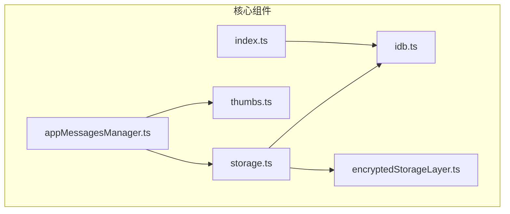
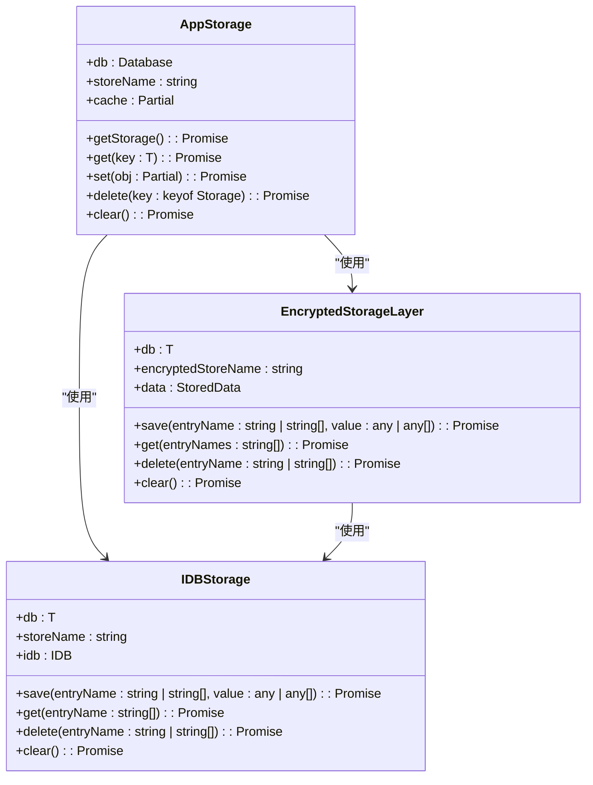
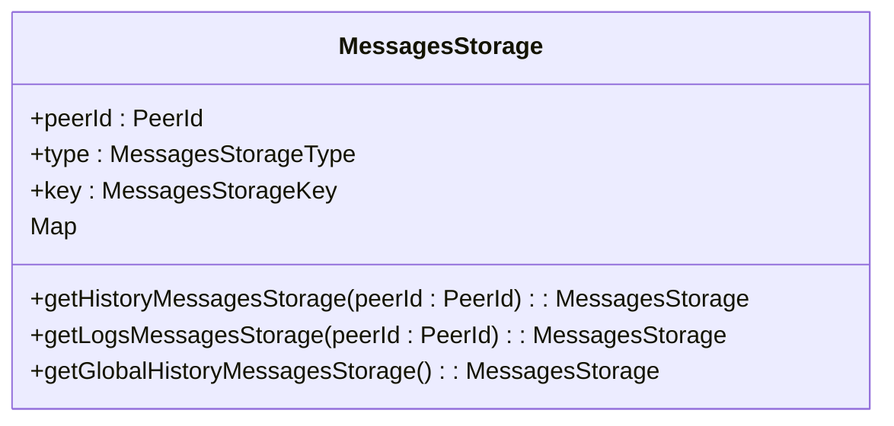
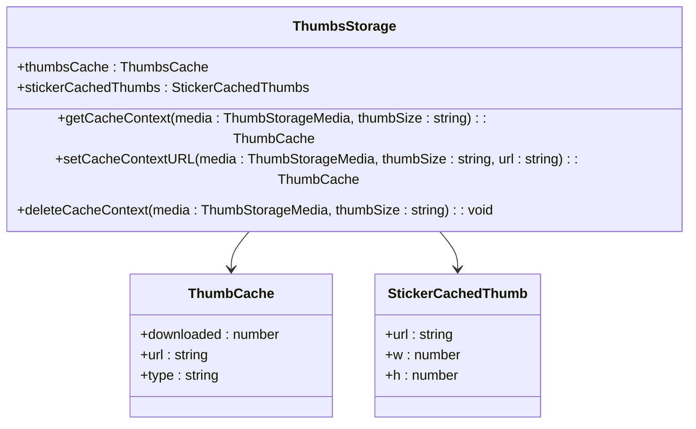
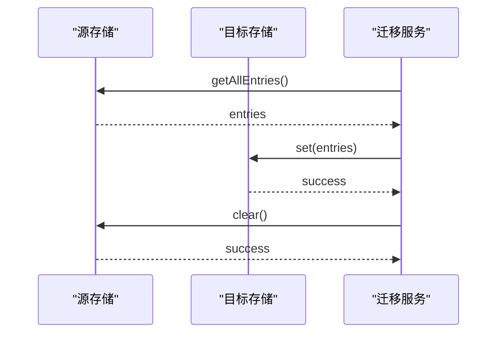
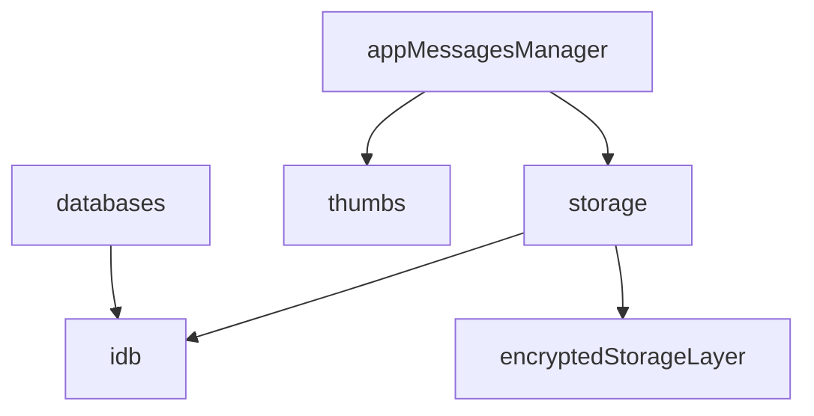

# 消息存储

<cite>
**本文档引用的文件**   
- [appMessagesManager.ts](file://src/lib/appManagers/appMessagesManager.ts)
- [storage.ts](file://src/lib/storage.ts)
- [idb.ts](file://src/lib/files/idb.ts)
- [encryptedStorageLayer.ts](file://src/lib/encryptedStorageLayer.ts)
- [thumbs.ts](file://src/lib/storages/thumbs.ts)
- [index.ts](file://src/config/databases/index.ts)
</cite>

## 目录
1. [简介](#简介)
2. [项目结构](#项目结构)
3. [核心组件](#核心组件)
4. [架构概述](#架构概述)
5. [详细组件分析](#详细组件分析)
6. [依赖分析](#依赖分析)
7. [性能考虑](#性能考虑)
8. [故障排除指南](#故障排除指南)
9. [结论](#结论)
10. [附录](#附录)（如有必要）

## 简介
本文档详细说明了消息存储机制的双层架构设计，包括内存存储和IndexedDB持久化存储。文档涵盖了历史消息存储结构、缓存淘汰策略、数据序列化方法、缩略图存储管理、消息索引构建、快速检索机制、存储空间监控、清理策略、迁移方案以及性能优化建议。

## 项目结构
项目结构显示了消息存储相关的核心文件位于`src/lib`目录下，包括`appManagers`中的`appMessagesManager.ts`用于管理消息，`files`中的`idb.ts`用于IndexedDB操作，`storages`中的`thumbs.ts`用于缩略图管理，以及`config/databases`中的数据库配置。

**图表来源**
- [appMessagesManager.ts](file://src/lib/appManagers/appMessagesManager.ts#L1-L200)
- [storage.ts](file://src/lib/storage.ts#L1-L490)
- [idb.ts](file://src/lib/files/idb.ts#L1-L580)
- [encryptedStorageLayer.ts](file://src/lib/encryptedStorageLayer.ts#L1-L230)
- [thumbs.ts](file://src/lib/storages/thumbs.ts#L1-L152)
- [index.ts](file://src/config/databases/index.ts#L1-L19)

**章节来源**
- [appMessagesManager.ts](file://src/lib/appManagers/appMessagesManager.ts#L1-L200)
- [storage.ts](file://src/lib/storage.ts#L1-L490)
- [idb.ts](file://src/lib/files/idb.ts#L1-L580)
- [encryptedStorageLayer.ts](file://src/lib/encryptedStorageLayer.ts#L1-L230)
- [thumbs.ts](file://src/lib/storages/thumbs.ts#L1-L152)
- [index.ts](file://src/config/databases/index.ts#L1-L19)

## 核心组件
核心组件包括`appMessagesManager.ts`中的消息管理器，负责处理消息的存储、检索和索引；`storage.ts`中的存储管理器，提供内存和持久化存储的接口；`idb.ts`中的IndexedDB操作类，实现持久化存储；`encryptedStorageLayer.ts`中的加密存储层，提供数据加密功能；`thumbs.ts`中的缩略图存储管理器，负责缩略图的缓存和管理。

**章节来源**
- [appMessagesManager.ts](file://src/lib/appManagers/appMessagesManager.ts#L1-L200)
- [storage.ts](file://src/lib/storage.ts#L1-L490)
- [idb.ts](file://src/lib/files/idb.ts#L1-L580)
- [encryptedStorageLayer.ts](file://src/lib/encryptedStorageLayer.ts#L1-L230)
- [thumbs.ts](file://src/lib/storages/thumbs.ts#L1-L152)

## 架构概述
消息存储机制采用双层架构设计，内存存储用于快速访问，IndexedDB持久化存储用于长期保存。内存存储通过Map对象实现，提供O(1)时间复杂度的读写操作。持久化存储基于IndexedDB，支持事务管理和批量写入，确保数据一致性。

**图表来源**
- [storage.ts](file://src/lib/storage.ts#L46-L490)
- [idb.ts](file://src/lib/files/idb.ts#L266-L579)
- [encryptedStorageLayer.ts](file://src/lib/encryptedStorageLayer.ts#L29-L230)

## 详细组件分析

### 消息存储管理器分析
`appMessagesManager.ts`中的消息存储管理器负责管理消息的生命周期，包括存储、检索、索引和清理。它使用内存存储和持久化存储相结合的方式，确保消息的高效访问和长期保存。

#### 消息存储结构
消息存储采用Map数据结构，以消息ID为键，消息对象为值。每个存储实例都有一个唯一的键，由对等ID和存储类型组成。

**图表来源**
- [appMessagesManager.ts](file://src/lib/appManagers/appMessagesManager.ts#L3764-L3804)

#### 缓存淘汰策略
缓存淘汰策略基于最近最少使用（LRU）算法，当缓存达到预设大小时，移除最久未使用的消息。

**章节来源**
- [appMessagesManager.ts](file://src/lib/appManagers/appMessagesManager.ts#L3527-L8426)

#### 数据序列化方法
数据序列化采用JSON格式，通过`JSON.stringify`和`JSON.parse`方法实现。对于二进制数据，使用`Uint8Array`进行转换。

**章节来源**
- [encryptedStorageLayer.ts](file://src/lib/encryptedStorageLayer.ts#L66-L98)

### 缩略图存储管理分析
`thumbs.ts`中的缩略图存储管理器负责管理缩略图的缓存和检索。它使用嵌套对象结构存储缩略图信息，以媒体ID和尺寸为键。

#### 缩略图存储结构
缩略图存储采用两级嵌套对象结构，第一级以媒体ID为键，第二级以尺寸为键，存储缩略图的URL、下载进度和类型。

**图表来源**
- [thumbs.ts](file://src/lib/storages/thumbs.ts#L18-L42)

#### 消息索引构建
消息索引通过`createHistoryStorage`函数构建，支持按时间、类型和过滤条件进行索引。索引存储在内存中，通过`SlicedArray`数据结构实现高效访问。

**章节来源**
- [appMessagesManager.ts](file://src/lib/appManagers/appMessagesManager.ts#L6188-L6202)

#### 快速检索机制
快速检索机制基于索引存储，通过`getSearchStorage`函数实现。它支持缓存搜索结果，提高检索效率。

**章节来源**
- [appMessagesManager.ts](file://src/lib/appManagers/appMessagesManager.ts#L5296-L5347)

### 存储空间监控与清理策略
存储空间监控通过`getAllEntries`方法实现，定期检查存储使用情况。清理策略包括定期清理过期数据和手动触发清理操作。

**章节来源**
- [idb.ts](file://src/lib/files/idb.ts#L509-L528)
- [appMessagesManager.ts](file://src/lib/appManagers/appMessagesManager.ts#L4153-L4201)

### 迁移方案
迁移方案通过`moveAccountStorages`静态方法实现，支持在不同账户间迁移存储数据。迁移过程包括读取源存储、写入目标存储和清理源存储。

**图表来源**
- [appStoragesManager.ts](file://src/lib/appManagers/appStoragesManager.ts#L57-L69)

## 依赖分析
消息存储机制依赖于多个核心组件，包括`appMessagesManager`、`storage`、`idb`、`encryptedStorageLayer`和`thumbs`。这些组件通过接口和类继承实现松耦合，确保系统的可维护性和可扩展性。

**图表来源**
- [appMessagesManager.ts](file://src/lib/appManagers/appMessagesManager.ts#L1-L200)
- [storage.ts](file://src/lib/storage.ts#L1-L490)
- [idb.ts](file://src/lib/files/idb.ts#L1-L580)
- [encryptedStorageLayer.ts](file://src/lib/encryptedStorageLayer.ts#L1-L230)
- [thumbs.ts](file://src/lib/storages/thumbs.ts#L1-L152)
- [index.ts](file://src/config/databases/index.ts#L1-L19)

**章节来源**
- [appMessagesManager.ts](file://src/lib/appManagers/appMessagesManager.ts#L1-L200)
- [storage.ts](file://src/lib/storage.ts#L1-L490)
- [idb.ts](file://src/lib/files/idb.ts#L1-L580)
- [encryptedStorageLayer.ts](file://src/lib/encryptedStorageLayer.ts#L1-L230)
- [thumbs.ts](file://src/lib/storages/thumbs.ts#L1-L152)
- [index.ts](file://src/config/databases/index.ts#L1-L19)

## 性能考虑
性能优化建议包括批量写入、事务管理和存储空间使用监控。批量写入通过`save`方法的数组参数实现，减少数据库操作次数。事务管理通过IndexedDB的事务机制确保数据一致性。存储空间使用监控通过定期调用`getAllEntries`方法实现，及时发现存储瓶颈。

**章节来源**
- [storage.ts](file://src/lib/storage.ts#L121-L161)
- [idb.ts](file://src/lib/files/idb.ts#L298-L320)
- [test_indexeddb_getAll.js](file://src/test_indexeddb_getAll.js#L1-L30)

## 故障排除指南
故障排除指南包括处理存储错误、恢复损坏数据和调试存储性能。存储错误通过`get`和`save`方法的错误处理机制捕获，恢复损坏数据通过`clear`方法实现，调试存储性能通过性能监控工具实现。

**章节来源**
- [storage.ts](file://src/lib/storage.ts#L213-L229)
- [idb.ts](file://src/lib/files/idb.ts#L158-L163)
- [encryptedStorageLayer.ts](file://src/lib/encryptedStorageLayer.ts#L163-L166)

## 结论
消息存储机制采用双层架构设计，结合内存存储和IndexedDB持久化存储，实现了高效的消息管理。通过合理的数据结构、缓存策略和性能优化，确保了系统的稳定性和可扩展性。未来可以进一步优化存储空间使用和提升检索效率。