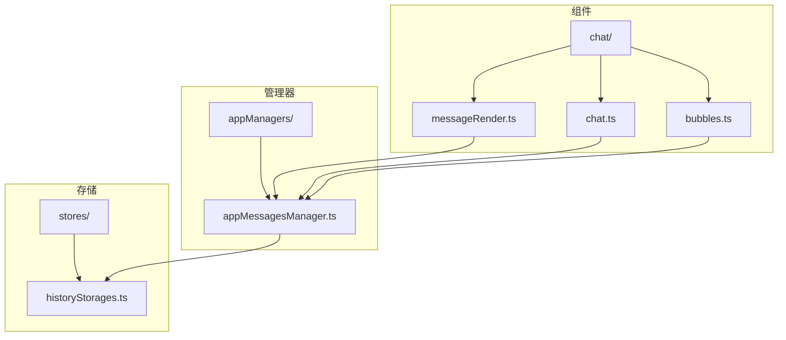
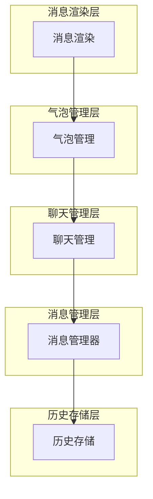
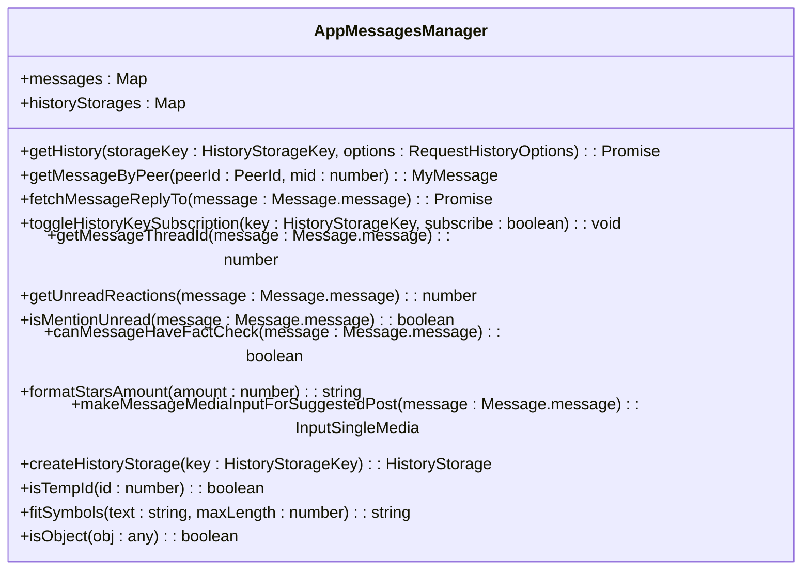
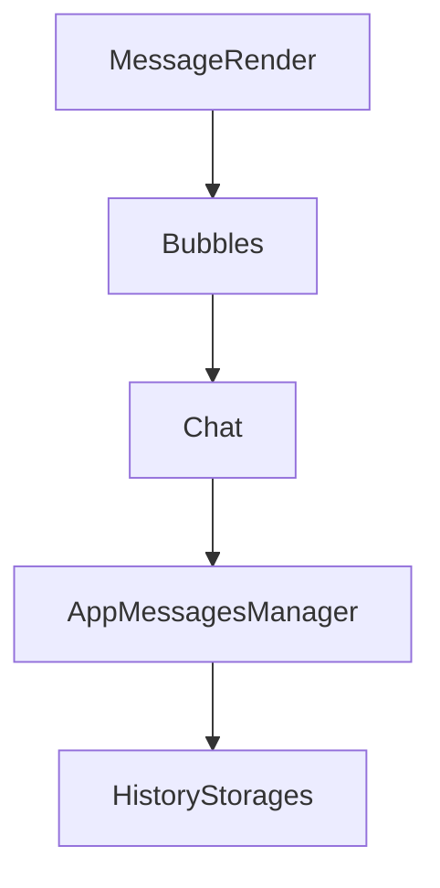

# 消息接收

<cite>
**本文档引用的文件**   
- [messageRender.ts](file://src/components/chat/messageRender.ts)
- [chat.ts](file://src/components/chat/chat.ts)
- [bubbles.ts](file://src/components/chat/bubbles.ts)
- [appMessagesManager.ts](file://src/lib/appManagers/appMessagesManager.ts)
- [historyStorages.ts](file://src/stores/historyStorages.ts)
</cite>

## 目录
1. [简介](#简介)
2. [项目结构](#项目结构)
3. [核心组件](#核心组件)
4. [架构概述](#架构概述)
5. [详细组件分析](#详细组件分析)
6. [依赖分析](#依赖分析)
7. [性能考虑](#性能考虑)
8. [故障排除指南](#故障排除指南)
9. [结论](#结论)
10. [附录](#附录)（如有必要）

## 简介
本文档详细说明了消息接收功能的实现机制，包括消息同步、存储、解析、状态更新和性能优化。文档涵盖了增量更新、历史消息加载、实时消息推送、消息存储结构、缓存策略、数据库持久化、消息解析流程、实体处理、媒体预览生成、链接检测、消息状态更新（已读、已送达）的实现机制，以及性能优化建议，如虚拟滚动和消息分页加载的最佳实践。

## 项目结构
项目结构清晰，主要分为以下几个部分：
- `src/components/chat/`：包含聊天相关的组件，如消息渲染、气泡、输入框等。
- `src/lib/appManagers/`：包含应用管理器，如消息管理器、聊天管理器等。
- `src/stores/`：包含状态存储，如历史存储、用户设置等。
- `src/helpers/`：包含各种辅助函数，如日期处理、字符串处理等。



**图表来源**
- [messageRender.ts](file://src/components/chat/messageRender.ts)
- [chat.ts](file://src/components/chat/chat.ts)
- [bubbles.ts](file://src/components/chat/bubbles.ts)
- [appMessagesManager.ts](file://src/lib/appManagers/appMessagesManager.ts)
- [historyStorages.ts](file://src/stores/historyStorages.ts)

**章节来源**
- [messageRender.ts](file://src/components/chat/messageRender.ts)
- [chat.ts](file://src/components/chat/chat.ts)
- [bubbles.ts](file://src/components/chat/bubbles.ts)
- [appMessagesManager.ts](file://src/lib/appManagers/appMessagesManager.ts)
- [historyStorages.ts](file://src/stores/historyStorages.ts)

## 核心组件
消息接收功能的核心组件包括消息渲染、聊天管理、气泡管理、消息管理器和历史存储。这些组件协同工作，确保消息的高效接收、存储和显示。

**章节来源**
- [messageRender.ts](file://src/components/chat/messageRender.ts)
- [chat.ts](file://src/components/chat/chat.ts)
- [bubbles.ts](file://src/components/chat/bubbles.ts)
- [appMessagesManager.ts](file://src/lib/appManagers/appMessagesManager.ts)
- [historyStorages.ts](file://src/stores/historyStorages.ts)

## 架构概述
消息接收功能的架构分为以下几个层次：
1. **消息渲染层**：负责消息的渲染和显示，包括时间戳、编辑标记、效果等。
2. **聊天管理层**：负责聊天界面的管理和控制，包括背景设置、主题切换等。
3. **气泡管理层**：负责消息气泡的管理和布局，包括回复、转发、点赞等。
4. **消息管理层**：负责消息的接收、存储和同步，包括增量更新、历史消息加载等。
5. **历史存储层**：负责消息历史的存储和管理，包括缓存策略、数据库持久化等。



**图表来源**
- [messageRender.ts](file://src/components/chat/messageRender.ts)
- [chat.ts](file://src/components/chat/chat.ts)
- [bubbles.ts](file://src/components/chat/bubbles.ts)
- [appMessagesManager.ts](file://src/lib/appManagers/appMessagesManager.ts)
- [historyStorages.ts](file://src/stores/historyStorages.ts)

## 详细组件分析
### 消息渲染组件分析
消息渲染组件负责消息的渲染和显示，包括时间戳、编辑标记、效果等。主要功能包括：
- **时间戳渲染**：根据消息的日期和时间生成时间戳。
- **编辑标记**：如果消息被编辑过，显示“已编辑”标记。
- **效果**：支持消息效果，如动画、贴纸等。

#### 消息渲染类图
```mermaid
classDiagram
class MessageRender {
+makeTime(date : Date, includeDate : boolean) : HTMLElement
+makeEdited() : HTMLElement
+makeEffect(props : {onlyElement? : boolean, docId? : DocId, middleware? : Middleware, loadPromises? : Promise<any>[]}) : HTMLElement
+fireMessageEffect(options : {e? : Event, isOut? : boolean, element : HTMLElement, middleware : Middleware, scrollable? : Scrollable, effectId : DocId}) : void
+fireMessageEffectByBubble(options : {timeEffect : HTMLElement, bubble : HTMLElement, e? : Event, scrollable? : Scrollable}) : void
}
```

**图表来源**
- [messageRender.ts](file://src/components/chat/messageRender.ts)

### 聊天管理组件分析
聊天管理组件负责聊天界面的管理和控制，包括背景设置、主题切换等。主要功能包括：
- **背景设置**：支持自定义背景，包括颜色、图片、模式等。
- **主题切换**：支持主题切换，包括夜间模式、高对比度模式等。

#### 聊天管理类图
```mermaid
classDiagram
class Chat {
+container : HTMLElement
+backgroundEl : HTMLElement
+topbar : ChatTopbar
+bubbles : ChatBubbles
+input : ChatInput
+selection : ChatSelection
+contextMenu : ChatContextMenu
+search : ChatSearch
+peerId : PeerId
+threadId : number
+monoforumThreadId : number
+savedReaction : (Reaction.reactionCustomEmoji | Reaction.reactionEmoji)[]
+isPublicHashtag : boolean
+isCacheableSearch : boolean
+query : string
+inputFilter : RequestHistoryOptions['inputFilter']
+hashtagType : 'this' | 'my' | 'public'
+setPeerPromise : Promise<void>
+peerChanged : boolean
+log : ReturnType<typeof logger>
+type : ChatType
+messagesStorageKey : MessagesStorageKey
+historyStorageKeySignal : ReturnType<typeof createUnifiedSignal<HistoryStorageKey>>
+historyStorageKeyNoThreadIdSignal : ReturnType<typeof createUnifiedSignal<HistoryStorageKey>>
+isStandalone : boolean
+noForwards : boolean
+inited : boolean
+isRestricted : boolean
+autoDownload : ChatAutoDownloadSettings
+gradientRenderer : ChatBackgroundGradientRenderer
+patternRenderer : ChatBackgroundPatternRenderer
+gradientCanvas : HTMLCanvasElement
+patternCanvas : HTMLCanvasElement
+backgroundTempId : number
+setBackgroundPromise : Promise<void>
+sharedMediaTab : AppSharedMediaTab
+sharedMediaTabs : AppSharedMediaTab[]
+isBot : boolean
+isChannel : boolean
+isBroadcast : boolean
+isLikeGroup : boolean
+isAnyGroup : boolean
+isMegagroup : boolean
+isForum : boolean
+isAllMessagesForum : boolean
+isAnonymousSending : boolean
+isUserBlocked : boolean
+isPremiumRequired : boolean
+isMonoforum : boolean
+isBotforum : boolean
+canManageDirectMessages : boolean
+isTemporaryThread : boolean
+noInput : boolean
+starsAmount : number | undefined
+animationGroup : AnimationItemGroup
+destroyPromise : CancellablePromise<void>
+middlewareHelper : MiddlewareHelper
+destroyMiddlewareHelper : MiddlewareHelper
+searchSignal : ReturnType<typeof createUnifiedSignal<Parameters<Chat['initSearch']>[0]>>
+theme : Parameters<typeof themeController['getThemeSettings']>[0]
+wallPaper : WallPaper
+hadAnyBackground : boolean
+ignoreSearchCleaning : boolean
+stars : Accessor<Long>
+appState : ReturnType<typeof useAppState>[0]
+setAppState : ReturnType<typeof useAppState>[1]
+appSettings : ReturnType<typeof useAppSettings>[0]
+setAppSettings : ReturnType<typeof useAppSettings>[1]
+appConfig : ReturnType<typeof useAppConfig>
+peer : ReturnType<typeof usePeer<PeerId>>
+historyStorage : ReturnType<typeof useHistoryStorage>
+historyStorageNoThreadId : ReturnType<typeof useHistoryStorage>
+peerTranslation : ReturnType<typeof usePeerTranslation>
+staticMessages : MyMessage[]
+init(peerId : PeerId) : void
+setType(type : ChatType) : void
+setBackground(options : {url? : string, theme? : Chat['theme'], wallPaper? : Chat['wallPaper'], skipAnimation? : boolean, manual? : boolean, onCachedStatus? : (cached : boolean) => void}) : Promise<() => void>
+setBackgroundIfNotSet(options : Parameters<Chat['setBackground']>[0]) : void
+_handleBackgrounds() : CancellablePromise<() => void>
+handleBackgrounds() : CancellablePromise<() => void>
}
```

**图表来源**
- [chat.ts](file://src/components/chat/chat.ts)

### 气泡管理组件分析
气泡管理组件负责消息气泡的管理和布局，包括回复、转发、点赞等。主要功能包括：
- **气泡生成**：根据消息内容生成气泡。
- **回复管理**：支持回复功能，包括回复气泡的生成和管理。
- **点赞管理**：支持点赞功能，包括点赞气泡的生成和管理。

#### 气泡管理类图
```mermaid
classDiagram
class ChatBubbles {
+container : HTMLDivElement
+chatInner : HTMLDivElement
+scrollable : Scrollable
+getHistoryTopPromise : Promise<boolean>
+getHistoryBottomPromise : Promise<boolean>
+unreadOut : Set<number>
+needUpdate : {replyToPeerId : PeerId, replyMid? : number, replyStoryId? : number, mid : number, peerId : PeerId, logId? : string | number}[]
+bubbles : {[fullMid : string] : HTMLElement}
+skippedMids : Set<string>
+bubblesNewByGroupedId : {[groupId : string] : Bubble}
+bubblesNew : {[mid : string] : Bubble}
+dateMessages : {[timestamp : number] : {div : HTMLElement, firstTimestamp : number, container : HTMLElement, groupsLength : number, timeout? : number}}
+currentlyTypingMessages : {[mid : number | string] : ReturnType<typeof wrapContinuouslyTypingMessage>}
+scrolledDown : boolean
+isScrollingTimeout : number
+stickyIntersector : StickyIntersector
+separatorIntersectorRoot : SeparatorIntersectorRoot
+unreaded : Map<HTMLElement, number>
+unreadedContent : Map<HTMLElement, number>
+unreadedSeen : Set<number>
+unreadedContentSeen : Set<number>
+readPromise : Promise<void>
+readContentPromise : Promise<void>
+bubbleGroups : BubbleGroups
+preloader : ProgressivePreloader
+lazyLoadQueue : LazyLoadQueue
+middlewareHelper : MiddlewareHelper
+log : ReturnType<typeof logger>
+listenerSetter : ListenerSetter
+followStack : FullMid[]
+isHeavyAnimationInProgress : boolean
+scrollingToBubble : HTMLElement
+isFirstLoad : boolean
+needReflowScroll : boolean
+fetchNewPromise : Promise<void>
+passEntities : Partial<{[_ in MessageEntity['_']] : boolean}>
+onAnimateLadder : () => Promise<any> | void
+resolveLadderAnimation : () => Promise<any>
+emptyPlaceholderBubble : HTMLElement
+viewsMids : Set<FullMid>
+sendViewCountersDebounced : () => Promise<void>
+isTopPaddingSet : boolean
+getSponsoredMessagePromise : Promise<void>
+previousStickyDate : HTMLElement
+hoverBubble : HTMLElement
+hoverReaction : HTMLElement
+sliceViewportDebounced : DebounceReturnType<ChatBubbles['sliceViewport']>
+resizeObserver : ResizeObserver
+willScrollOnLoad : boolean
+observer : SuperIntersectionObserver
+renderingMessages : Set<FullMid>
+setPeerCached : boolean
+attachPlaceholderOnRender : () => void
+bubblesToEject : Set<HTMLElement>
+bubblesToReplace : Map<HTMLElement, HTMLElement>
+updatePlaceholderPosition : () => void
+setPeerOptions : {lastMsgFullMid : FullMid, topMessageFullMid : FullMid, savedPosition : ChatSavedPosition}
+setPeerTempId : number
+renderNewPromises : Set<Promise<any>>
+updateGradient : boolean
+extendedMediaMessages : Set<number>
+pollExtendedMediaMessagesPromise : Promise<void>
+batchProcessor : BatchProcessor<Awaited<ReturnType<ChatBubbles['safeRenderMessage']>>>
+ranks : Map<PeerId, ReturnType<typeof getParticipantRank>>
+processRanks : Set<() => void>
+canShowRanks : boolean
+updateLocalOnEdit : Map<HTMLElement, (message : Message.message) => void>
+replySwipeHandler : SwipeHandler
+remover : HTMLDivElement
+floatingSeparatorsContainer : HTMLDivElement
+lastPlayingVideo : HTMLVideoElement
+batchingModifying : Array<() => void>
+changedMids : Map<number, number>
+peerSettings : PeerSettings
+placeholderTopicIconContainer? : HTMLElement
+inChatQuery? : string
+committedLogsFilters? : CommittedFilters
+logsByBubble : WeakMap<HTMLElement, AdminLog>
+logsBubbleByMid : Map<number, {element : HTMLElement, priorityDate : number}>
+constructor(chat : Chat, managers : AppManagers) : void
+constructBubbles() : void
+getBubble(fullMid : FullMid) : HTMLElement
+finalizeTypingMessage(message : Message.message | Message.messageService, tempId : number) : boolean
+groupBubbles(messages : {bubble : HTMLElement, message : Message.message | Message.messageService, reverse : boolean}[]) : {groups : BubbleGroup[], items : BubbleItem[]}
+mountUnmountGroups(groups : BubbleGroup[]) : void
+deleteMessagesByIds(mids : number[]) : void
+setBubbleSendingStatus(bubble : HTMLElement, status : 'read' | 'sent') : void
+sliceViewport() : void
+scrollToEnd() : void
+setInChatQuery(query : string) : void
}
```

**图表来源**
- [bubbles.ts](file://src/components/chat/bubbles.ts)

### 消息管理组件分析
消息管理组件负责消息的接收、存储和同步，包括增量更新、历史消息加载等。主要功能包括：
- **消息接收**：通过WebSocket接收实时消息。
- **增量更新**：支持增量更新，确保消息的实时性。
- **历史消息加载**：支持历史消息的加载，包括分页加载。

#### 消息管理类图


**图表来源**
- [appMessagesManager.ts](file://src/lib/appManagers/appMessagesManager.ts)

### 历史存储组件分析
历史存储组件负责消息历史的存储和管理，包括缓存策略、数据库持久化等。主要功能包括：
- **缓存策略**：支持内存缓存和本地存储缓存。
- **数据库持久化**：支持将消息历史持久化到数据库。

#### 历史存储类图
```mermaid
classDiagram
class HistoryStorage {
+_maxId : number
+count : number | null
+history? : SlicedArray<number>
+searchHistory? : SlicedArray<`${PeerId}_${number}`>
+maxId? : number
+readPromise? : Promise<void>
+readMaxId? : number
+readOutboxMaxId? : number
+triedToReadMaxId? : number
+maxOutId? : number
+replyMarkup? : Exclude<ReplyMarkup, ReplyMarkup.replyInlineMarkup>
+type : 'history' | 'replies' | 'search'
+key : HistoryStorageKey
+wasFetched? : boolean
+channelJoinedMid? : number
+originalInsertSlice? : SlicedArray<number>['insertSlice']
+filterMessages? : (messages : MyMessage[]) => MyMessage[]
+filterMessage? : (message : MyMessage) => boolean
+onMidInsertion? : (mid : number) => void
+nextRate? : number
}
```

**图表来源**
- [historyStorages.ts](file://src/stores/historyStorages.ts)

## 依赖分析
消息接收功能的依赖关系如下：
- **消息渲染组件**依赖于**气泡管理组件**，用于生成和管理消息气泡。
- **气泡管理组件**依赖于**聊天管理组件**，用于管理聊天界面。
- **聊天管理组件**依赖于**消息管理组件**，用于接收和存储消息。
- **消息管理组件**依赖于**历史存储组件**，用于存储消息历史。



**图表来源**
- [messageRender.ts](file://src/components/chat/messageRender.ts)
- [chat.ts](file://src/components/chat/chat.ts)
- [bubbles.ts](file://src/components/chat/bubbles.ts)
- [appMessagesManager.ts](file://src/lib/appManagers/appMessagesManager.ts)
- [historyStorages.ts](file://src/stores/historyStorages.ts)

**章节来源**
- [messageRender.ts](file://src/components/chat/messageRender.ts)
- [chat.ts](file://src/components/chat/chat.ts)
- [bubbles.ts](file://src/components/chat/bubbles.ts)
- [appMessagesManager.ts](file://src/lib/appManagers/appMessagesManager.ts)
- [historyStorages.ts](file://src/stores/historyStorages.ts)

## 性能考虑
为了提高消息接收功能的性能，建议采取以下措施：
- **虚拟滚动**：使用虚拟滚动技术，只渲染可见区域的消息，减少DOM操作。
- **消息分页加载**：支持消息分页加载，避免一次性加载大量消息。
- **缓存策略**：合理使用内存缓存和本地存储缓存，减少网络请求。
- **异步加载**：使用异步加载技术，避免阻塞主线程。

## 故障排除指南
### 消息未显示
- **检查网络连接**：确保网络连接正常。
- **检查WebSocket连接**：确保WebSocket连接正常。
- **检查消息ID**：确保消息ID正确。

### 消息加载缓慢
- **检查网络带宽**：确保网络带宽充足。
- **检查服务器性能**：确保服务器性能良好。
- **检查缓存策略**：确保缓存策略合理。

### 消息重复
- **检查消息ID**：确保消息ID唯一。
- **检查消息去重逻辑**：确保消息去重逻辑正确。

**章节来源**
- [messageRender.ts](file://src/components/chat/messageRender.ts)
- [chat.ts](file://src/components/chat/chat.ts)
- [bubbles.ts](file://src/components/chat/bubbles.ts)
- [appMessagesManager.ts](file://src/lib/appManagers/appMessagesManager.ts)
- [historyStorages.ts](file://src/stores/historyStorages.ts)

## 结论
本文档详细说明了消息接收功能的实现机制，包括消息同步、存储、解析、状态更新和性能优化。通过合理的架构设计和性能优化，确保了消息的高效接收、存储和显示。希望本文档能帮助开发者更好地理解和使用消息接收功能。