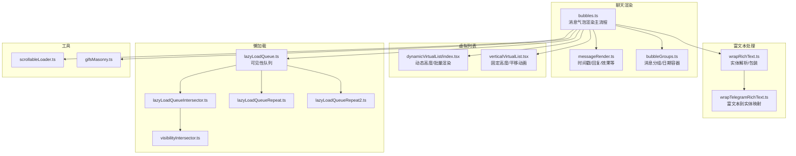
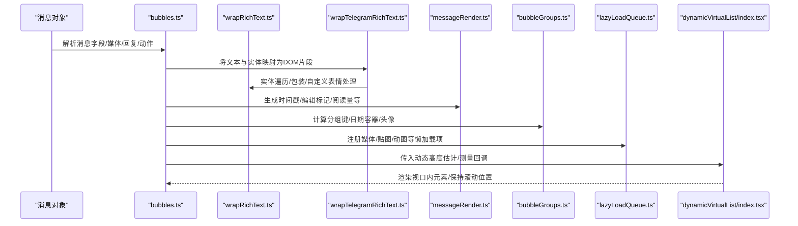
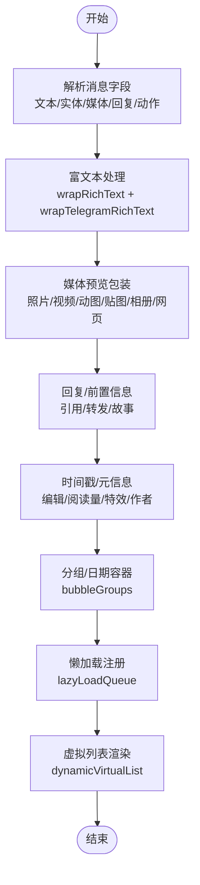
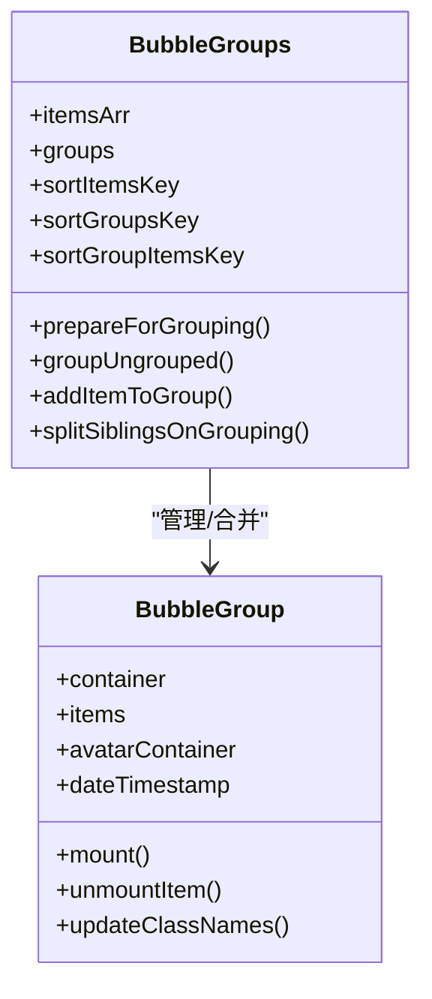
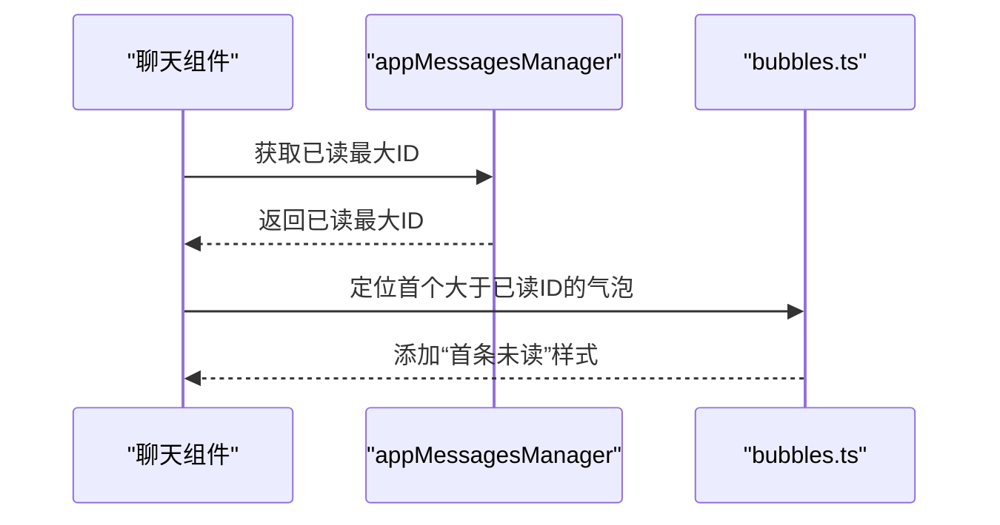
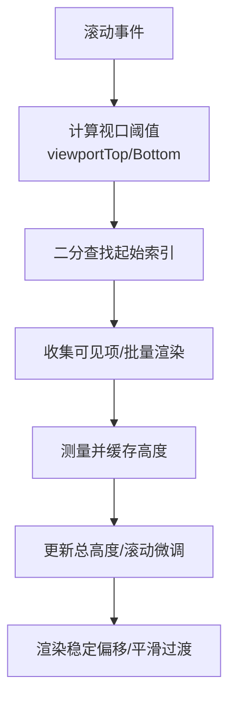
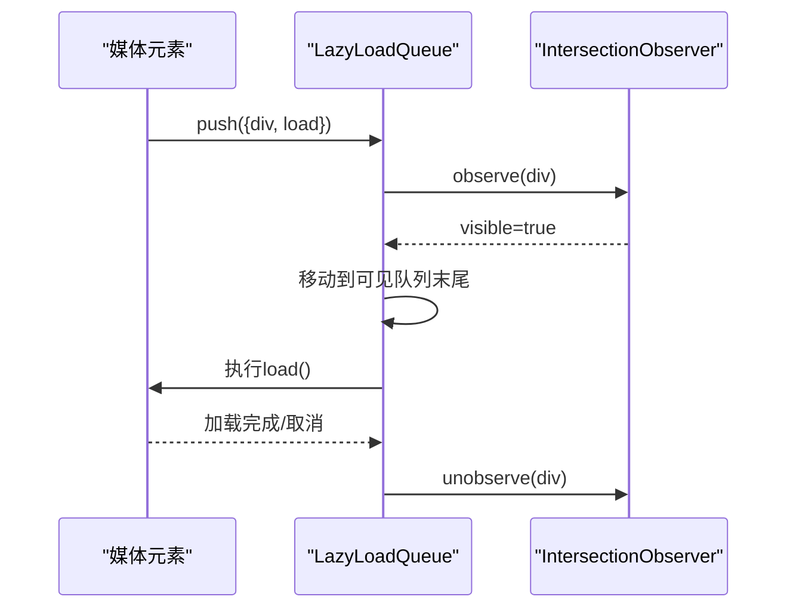
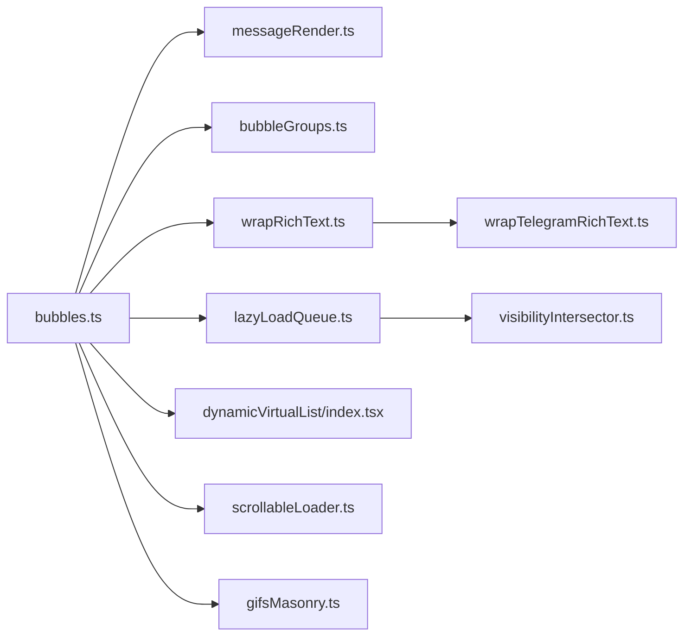

# 消息渲染

<cite>
**本文引用的文件**
- [messageRender.ts](file://src/components/chat/messageRender.ts)
- [bubbleGroups.ts](file://src/components/chat/bubbleGroups.ts)
- [bubbles.ts](file://src/components/chat/bubbles.ts)
- [wrapRichText.ts](file://src/lib/richTextProcessor/wrapRichText.ts)
- [wrapTelegramRichText.ts](file://src/lib/richTextProcessor/wrapTelegramRichText.ts)
- [index.tsx（动态虚拟列表）](file://src/components/dynamicVirtualList/index.tsx)
- [verticalVirtualList.tsx](file://src/components/verticalVirtualList.tsx)
- [lazyLoadQueue.ts](file://src/components/lazyLoadQueue.ts)
- [lazyLoadQueueIntersector.ts](file://src/components/lazyLoadQueueIntersector.ts)
- [lazyLoadQueueRepeat.ts](file://src/components/lazyLoadQueueRepeat.ts)
- [lazyLoadQueueRepeat2.ts](file://src/components/lazyLoadQueueRepeat2.ts)
- [visibilityIntersector.ts](file://src/components/visibilityIntersector.ts)
- [scrollableLoader.ts](file://src/helpers/scrollableLoader.ts)
- [gifsMasonry.ts](file://src/components/gifsMasonry.ts)
- [contextMenu.ts](file://src/components/chat/contextMenu.ts)
- [appMessagesManager.ts](file://src/lib/appManagers/appMessagesManager.ts)
</cite>

## 目录
1. [简介](#简介)
2. [项目结构](#项目结构)
3. [核心组件](#核心组件)
4. [架构总览](#架构总览)
5. [详细组件分析](#详细组件分析)
6. [依赖关系分析](#依赖关系分析)
7. [性能考量](#性能考量)
8. [故障排查指南](#故障排查指南)
9. [结论](#结论)

## 简介
本文件系统性梳理消息渲染机制，覆盖以下关键主题：
- 消息气泡生成流程：内容解析、实体渲染、媒体预览展示
- 消息分组策略、时间戳显示逻辑、已读状态指示
- 虚拟列表实现原理：滚动位置保持、动态高度计算、懒加载机制
- 性能优化建议：组件复用、防抖渲染、复杂消息体的异步加载最佳实践

## 项目结构
消息渲染相关代码主要集中在聊天模块与富文本处理层：
- 聊天渲染主入口：bubbles.ts
- 时间戳与回复等辅助：messageRender.ts
- 气泡分组与日期容器：bubbleGroups.ts
- 富文本与实体处理：wrapRichText.ts、wrapTelegramRichText.ts
- 虚拟列表：dynamicVirtualList/index.tsx、verticalVirtualList.tsx
- 懒加载队列：lazyLoadQueue.ts 及其基类与变体
- 辅助工具：visibilityIntersector.ts、scrollableLoader.ts、gifsMasonry.ts

图表来源
- [bubbles.ts](file://src/components/chat/bubbles.ts#L1-L200)
- [messageRender.ts](file://src/components/chat/messageRender.ts#L1-L120)
- [bubbleGroups.ts](file://src/components/chat/bubbleGroups.ts#L1-L120)
- [wrapRichText.ts](file://src/lib/richTextProcessor/wrapRichText.ts#L1-L120)
- [wrapTelegramRichText.ts](file://src/lib/richTextProcessor/wrapTelegramRichText.ts#L47-L138)
- [index.tsx（动态虚拟列表）](file://src/components/dynamicVirtualList/index.tsx#L1-L120)
- [verticalVirtualList.tsx](file://src/components/verticalVirtualList.tsx#L1-L120)
- [lazyLoadQueue.ts](file://src/components/lazyLoadQueue.ts#L1-L76)
- [lazyLoadQueueIntersector.ts](file://src/components/lazyLoadQueueIntersector.ts#L1-L100)
- [lazyLoadQueueRepeat.ts](file://src/components/lazyLoadQueueRepeat.ts#L1-L46)
- [lazyLoadQueueRepeat2.ts](file://src/components/lazyLoadQueueRepeat2.ts#L1-L32)
- [visibilityIntersector.ts](file://src/components/visibilityIntersector.ts#L1-L200)
- [scrollableLoader.ts](file://src/helpers/scrollableLoader.ts#L1-L53)
- [gifsMasonry.ts](file://src/components/gifsMasonry.ts#L32-L180)

章节来源
- [bubbles.ts](file://src/components/chat/bubbles.ts#L1-L200)
- [messageRender.ts](file://src/components/chat/messageRender.ts#L1-L120)
- [bubbleGroups.ts](file://src/components/chat/bubbleGroups.ts#L1-L120)

## 核心组件
- 消息气泡渲染主流程：负责解析消息、组装富文本、挂载媒体预览、设置时间戳与回复、处理已读/反应等。
- 时间戳与元信息：统一生成时间、编辑标记、转发来源、阅读量、贴纸特效等。
- 气泡分组：按发送者、时间窗口、是否匿名、论坛/话题一致性等规则进行消息分组，维护日期容器与头像。
- 富文本处理：将原始文本与实体映射为可渲染的 DOM 结构，支持多种实体类型与自定义表情。
- 虚拟列表：两种实现，分别适用于动态高度与固定高度场景；均包含滚动位置保持、批量渲染与测量回调。
- 懒加载队列：基于 IntersectionObserver 的可见性监听，支持并发限制、重入刷新与“已见”标记。

章节来源
- [bubbles.ts](file://src/components/chat/bubbles.ts#L6000-L6799)
- [messageRender.ts](file://src/components/chat/messageRender.ts#L170-L320)
- [bubbleGroups.ts](file://src/components/chat/bubbleGroups.ts#L575-L600)
- [wrapRichText.ts](file://src/lib/richTextProcessor/wrapRichText.ts#L120-L200)
- [index.tsx（动态虚拟列表）](file://src/components/dynamicVirtualList/index.tsx#L120-L246)
- [lazyLoadQueue.ts](file://src/components/lazyLoadQueue.ts#L1-L76)

## 架构总览
消息渲染从“消息对象”到“可视气泡”的端到端流程如下：

图表来源
- [bubbles.ts](file://src/components/chat/bubbles.ts#L6000-L6799)
- [wrapRichText.ts](file://src/lib/richTextProcessor/wrapRichText.ts#L120-L200)
- [wrapTelegramRichText.ts](file://src/lib/richTextProcessor/wrapTelegramRichText.ts#L47-L138)
- [messageRender.ts](file://src/components/chat/messageRender.ts#L170-L320)
- [bubbleGroups.ts](file://src/components/chat/bubbleGroups.ts#L575-L600)
- [lazyLoadQueue.ts](file://src/components/lazyLoadQueue.ts#L1-L76)
- [index.tsx（动态虚拟列表）](file://src/components/dynamicVirtualList/index.tsx#L120-L246)

## 详细组件分析

### 消息气泡生成流程（内容解析、实体渲染、媒体预览）
- 内容解析与富文本
  - 将消息文本与实体映射为 DOM 片段，处理加粗、斜体、链接、代码块、自定义表情等。
  - 对大表情场景进行特殊处理，必要时转为贴图或纯文本区域。
- 媒体预览
  - 支持相册、照片、视频、动图、贴图、网页卡片、故事等，按类型选择合适的包装器。
  - 预览尺寸根据类型与配置动态调整，并支持敏感内容遮罩与“已读”状态叠加。
- 回复与前置信息
  - 处理引用回复、故事引用、转发来源等前置信息，必要时插入“上一条消息”对比框。
- 时间戳与元信息
  - 统一生成时间显示、编辑标记、阅读量图标、贴纸特效、频道作者等。
- 已读/反应/广播
  - 根据消息方向与上下文添加“已读”样式或观察器；对广播消息进行特殊处理。

图表来源
- [bubbles.ts](file://src/components/chat/bubbles.ts#L6000-L6799)
- [wrapRichText.ts](file://src/lib/richTextProcessor/wrapRichText.ts#L120-L200)
- [wrapTelegramRichText.ts](file://src/lib/richTextProcessor/wrapTelegramRichText.ts#L47-L138)
- [messageRender.ts](file://src/components/chat/messageRender.ts#L170-L320)
- [bubbleGroups.ts](file://src/components/chat/bubbleGroups.ts#L575-L600)
- [lazyLoadQueue.ts](file://src/components/lazyLoadQueue.ts#L1-L76)
- [index.tsx（动态虚拟列表）](file://src/components/dynamicVirtualList/index.tsx#L120-L246)

章节来源
- [bubbles.ts](file://src/components/chat/bubbles.ts#L6000-L6799)
- [wrapRichText.ts](file://src/lib/richTextProcessor/wrapRichText.ts#L120-L200)
- [wrapTelegramRichText.ts](file://src/lib/richTextProcessor/wrapTelegramRichText.ts#L47-L138)
- [messageRender.ts](file://src/components/chat/messageRender.ts#L170-L320)
- [bubbleGroups.ts](file://src/components/chat/bubbleGroups.ts#L575-L600)

### 消息分组策略与时间戳显示逻辑
- 分组策略
  - 同一发送者、同一天窗、方向一致、匿名发送允许匿名、论坛/话题一致性、频道作者一致等条件决定是否合并。
  - 分组后维护日期容器、头像容器与首尾气泡样式，支持线程分隔与继续话题按钮。
- 时间戳显示
  - 根据消息方向、是否转发、是否频道文章、是否编辑等生成时间显示与标题提示。
  - 支持阅读量图标、贴纸特效、付费星数等附加信息。

图表来源
- [bubbleGroups.ts](file://src/components/chat/bubbleGroups.ts#L359-L800)
- [bubbleGroups.ts](file://src/components/chat/bubbleGroups.ts#L1-L120)

章节来源
- [bubbleGroups.ts](file://src/components/chat/bubbleGroups.ts#L575-L600)
- [bubbleGroups.ts](file://src/components/chat/bubbleGroups.ts#L600-L780)
- [messageRender.ts](file://src/components/chat/messageRender.ts#L170-L320)

### 已读状态指示与阅读时间
- 已读首条未读气泡
  - 在历史渲染中定位“已读最大 ID”，在首个大于该 ID 的非本人气泡前插入“首条未读”样式。
- 阅读时间查看
  - 上下文菜单中可查询消息的“已读时间”，并根据隐私与有效期控制显示。

图表来源
- [bubbles.ts](file://src/components/chat/bubbles.ts#L10094-L10141)
- [appMessagesManager.ts](file://src/lib/appManagers/appMessagesManager.ts#L8101-L8139)
- [contextMenu.ts](file://src/components/chat/contextMenu.ts#L1200-L1233)

章节来源
- [bubbles.ts](file://src/components/chat/bubbles.ts#L10094-L10141)
- [appMessagesManager.ts](file://src/lib/appManagers/appMessagesManager.ts#L8101-L8139)
- [contextMenu.ts](file://src/components/chat/contextMenu.ts#L1200-L1233)

### 虚拟列表实现原理
- 动态虚拟列表（DynamicVirtualList）
  - 基于滚动位置与视口阈值计算可见区间，批量渲染并维护偏移与缓存高度。
  - 提供测量回调以更新元素真实高度，并通过稳定偏移与平滑过渡避免跳动。
  - 支持底部触发回调、底部最少渲染数量等参数。
- 固定高度虚拟列表（VerticalVirtualList）
  - 适用于高度固定的列表项，通过平移动画减少重排。
  - 当所有可见项整体平移幅度一致时，自动跳过动画以提升体验。

图表来源
- [index.tsx（动态虚拟列表）](file://src/components/dynamicVirtualList/index.tsx#L120-L246)
- [verticalVirtualList.tsx](file://src/components/verticalVirtualList.tsx#L1-L188)

章节来源
- [index.tsx（动态虚拟列表）](file://src/components/dynamicVirtualList/index.tsx#L120-L246)
- [verticalVirtualList.tsx](file://src/components/verticalVirtualList.tsx#L1-L188)

### 懒加载机制与媒体预取
- 可见性队列（LazyLoadQueue）
  - 基于 IntersectionObserver 监听元素可见性，支持并发限制、重入刷新与“已见”标记。
  - 元素进入视口后被移动到队列末尾，保证优先级。
- 变体实现
  - Repeat/Repeat2：支持重复可见/不可见切换时的队列重排，适合动图/GIF 等资源。
- 使用示例
  - 图片/视频/动图/贴图/网页卡片等媒体包装器会将加载任务推入队列，在可见时执行。
  - GIF 网格组件使用 Repeat2 并结合滚动节流，避免频繁切换导致的抖动。

图表来源
- [lazyLoadQueue.ts](file://src/components/lazyLoadQueue.ts#L1-L76)
- [lazyLoadQueueIntersector.ts](file://src/components/lazyLoadQueueIntersector.ts#L1-L100)
- [lazyLoadQueueRepeat.ts](file://src/components/lazyLoadQueueRepeat.ts#L1-L46)
- [lazyLoadQueueRepeat2.ts](file://src/components/lazyLoadQueueRepeat2.ts#L1-L32)
- [visibilityIntersector.ts](file://src/components/visibilityIntersector.ts#L1-L200)
- [gifsMasonry.ts](file://src/components/gifsMasonry.ts#L32-L180)

章节来源
- [lazyLoadQueue.ts](file://src/components/lazyLoadQueue.ts#L1-L76)
- [lazyLoadQueueIntersector.ts](file://src/components/lazyLoadQueueIntersector.ts#L1-L100)
- [lazyLoadQueueRepeat.ts](file://src/components/lazyLoadQueueRepeat.ts#L1-L46)
- [lazyLoadQueueRepeat2.ts](file://src/components/lazyLoadQueueRepeat2.ts#L1-L32)
- [gifsMasonry.ts](file://src/components/gifsMasonry.ts#L32-L180)

## 依赖关系分析
- bubbles.ts 依赖
  - messageRender.ts：时间戳与元信息生成
  - bubbleGroups.ts：分组与日期容器
  - wrapRichText.ts / wrapTelegramRichText.ts：富文本与实体处理
  - lazyLoadQueue.ts：媒体懒加载
  - dynamicVirtualList/index.tsx：动态高度虚拟列表
  - visibilityIntersector.ts：可见性监听
  - scrollableLoader.ts：滚动到底部加载
  - gifsMasonry.ts：动图网格懒加载
- messageRender.ts 依赖
  - date/format：时间格式化
  - richTextProcessor：富文本包装
  - langPack：本地化文案
  - appReactionsManager：贴纸特效预取
- bubbleGroups.ts 依赖
  - chat/utils：消息ID/线程ID工具
  - avatarNew：头像渲染
  - bubbleParts：话题分隔/继续按钮等

图表来源
- [bubbles.ts](file://src/components/chat/bubbles.ts#L1-L200)
- [messageRender.ts](file://src/components/chat/messageRender.ts#L1-L120)
- [bubbleGroups.ts](file://src/components/chat/bubbleGroups.ts#L1-L120)
- [wrapRichText.ts](file://src/lib/richTextProcessor/wrapRichText.ts#L1-L120)
- [wrapTelegramRichText.ts](file://src/lib/richTextProcessor/wrapTelegramRichText.ts#L47-L138)
- [lazyLoadQueue.ts](file://src/components/lazyLoadQueue.ts#L1-L76)
- [visibilityIntersector.ts](file://src/components/visibilityIntersector.ts#L1-L200)
- [index.tsx（动态虚拟列表）](file://src/components/dynamicVirtualList/index.tsx#L1-L120)
- [scrollableLoader.ts](file://src/helpers/scrollableLoader.ts#L1-L53)
- [gifsMasonry.ts](file://src/components/gifsMasonry.ts#L32-L180)

章节来源
- [bubbles.ts](file://src/components/chat/bubbles.ts#L1-L200)
- [messageRender.ts](file://src/components/chat/messageRender.ts#L1-L120)
- [bubbleGroups.ts](file://src/components/chat/bubbleGroups.ts#L1-L120)

## 性能考量
- 组件复用
  - 使用 SolidJS 的 createMemo/createSignal 缓存列表状态与高度，避免不必要的重渲染。
  - 动态虚拟列表在测量后批量更新高度，减少滚动过程中的重排。
- 防抖渲染
  - 懒加载队列在可见性变化时延时处理，避免频繁触发加载。
  - GIF 网格组件在滚动时设置定时器，延迟处理不可见元素，降低抖动。
- 复杂消息体的异步加载
  - 对媒体、动图、贴图等采用懒加载，仅在进入视口时加载。
  - 富文本中的自定义表情与代码高亮按需渲染，避免一次性处理大量节点。
- 滚动位置保持
  - 动态虚拟列表在高度变化时进行微调滚动，避免跳动。
  - 固定高度虚拟列表检测整体平移幅度，自动跳过动画以提升体验。

章节来源
- [index.tsx（动态虚拟列表）](file://src/components/dynamicVirtualList/index.tsx#L120-L246)
- [verticalVirtualList.tsx](file://src/components/verticalVirtualList.tsx#L1-L188)
- [lazyLoadQueue.ts](file://src/components/lazyLoadQueue.ts#L1-L76)
- [gifsMasonry.ts](file://src/components/gifsMasonry.ts#L32-L180)

## 故障排查指南
- 消息未显示或显示异常
  - 检查富文本实体边界是否越界，wrapRichText 会对越界实体进行截断处理。
  - 确认媒体包装器是否正确传入 lazyLoadQueue 与 middleware。
- 滚动跳动或高度错乱
  - 确保动态虚拟列表的测量回调被正确触发，且高度缓存及时更新。
  - 检查是否存在未清理的懒加载项导致高度持续变化。
- 懒加载不生效
  - 确认元素已被 IntersectionObserver 观察，且未被提前 unobserve。
  - 对于动图/GIF，确认使用 Repeat/Repeat2 变体并正确处理可见性切换。
- 已读状态不准确
  - 检查 appMessagesManager 的已读最大 ID 获取逻辑与有效期判断。
  - 确认上下文菜单中“查看已读时间”的权限与隐私设置。

章节来源
- [wrapRichText.ts](file://src/lib/richTextProcessor/wrapRichText.ts#L120-L200)
- [lazyLoadQueueIntersector.ts](file://src/components/lazyLoadQueueIntersector.ts#L1-L100)
- [lazyLoadQueueRepeat.ts](file://src/components/lazyLoadQueueRepeat.ts#L1-L46)
- [lazyLoadQueueRepeat2.ts](file://src/components/lazyLoadQueueRepeat2.ts#L1-L32)
- [appMessagesManager.ts](file://src/lib/appManagers/appMessagesManager.ts#L8101-L8139)
- [contextMenu.ts](file://src/components/chat/contextMenu.ts#L1200-L1233)

## 结论
本消息渲染体系通过“富文本实体解析 + 媒体预览包装 + 分组与日期容器 + 虚拟列表 + 懒加载队列”的组合，实现了高性能、可扩展的消息气泡渲染。动态虚拟列表与固定高度虚拟列表分别适配不同场景，配合懒加载与可见性监听，有效降低了首屏与滚动时的开销。建议在复杂消息体场景中优先采用懒加载与异步渲染，并结合防抖与批处理策略，确保交互流畅与内存占用可控。