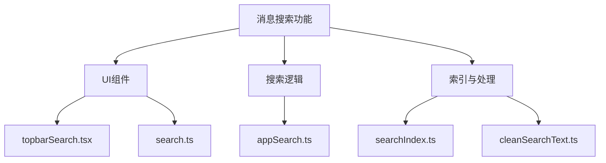
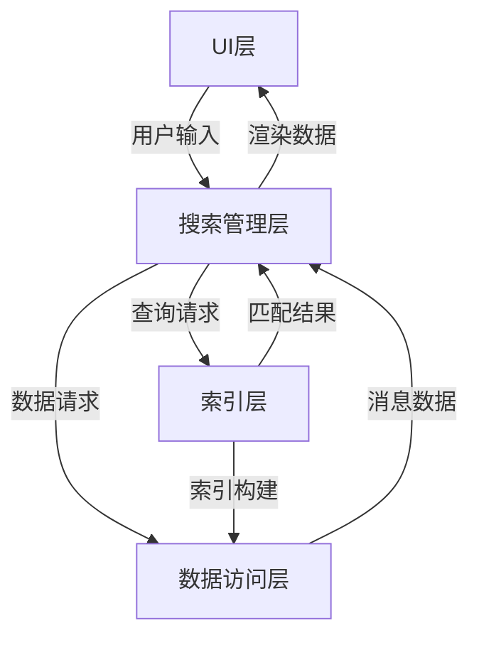
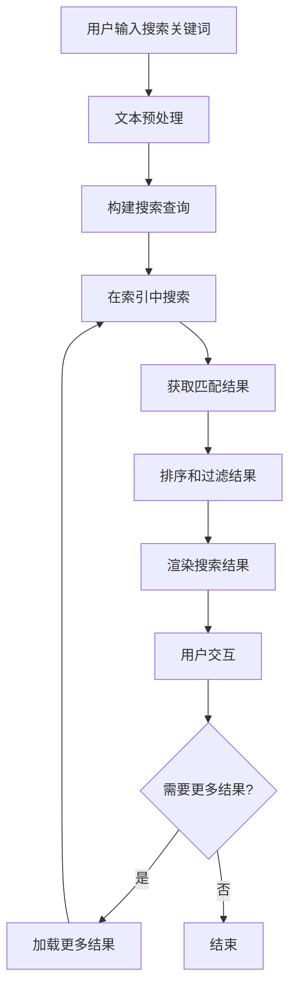
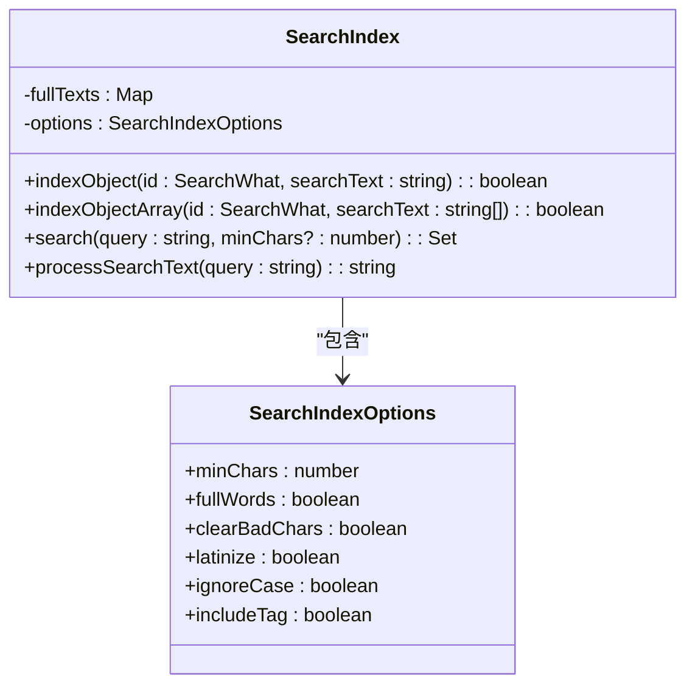
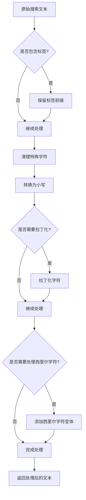
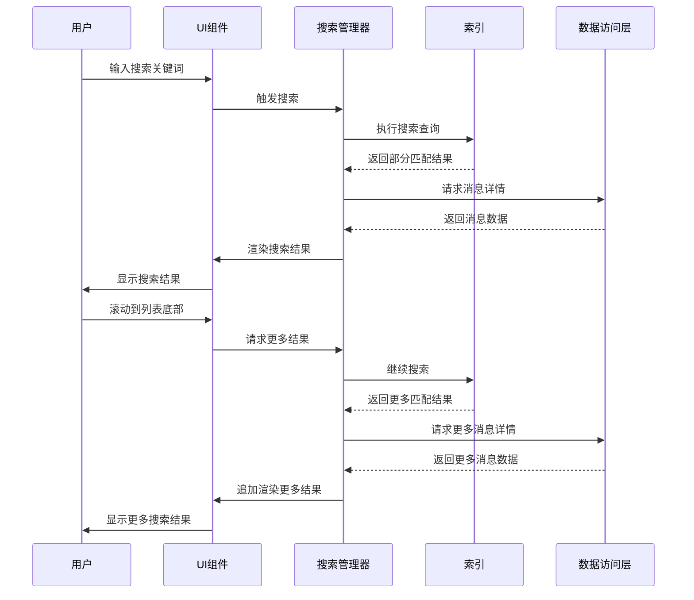
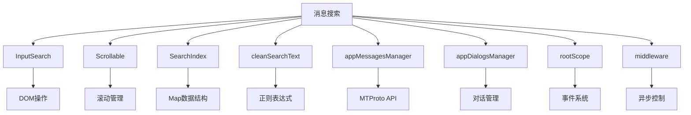

# 消息搜索

<cite>
**本文档引用的文件**  
- [search.ts](file://src/components/chat/search.ts)
- [appSearch.ts](file://src/components/appSearch.ts)
- [topbarSearch.tsx](file://src/components/chat/topbarSearch.tsx)
- [searchIndex.ts](file://src/lib/searchIndex.ts)
- [cleanSearchText.ts](file://src/helpers/cleanSearchText.ts)
- [search.ts](file://src/components/sidebarRight/tabs/search.ts)
- [emoticonsDropdown/search.tsx](file://src/components/emoticonsDropdown/search.tsx)
- [appMessagesManager.ts](file://src/lib/appManagers/appMessagesManager.ts)
</cite>

## 目录
1. [简介](#简介)
2. [项目结构](#项目结构)
3. [核心组件](#核心组件)
4. [架构概述](#架构概述)
5. [详细组件分析](#详细组件分析)
6. [依赖分析](#依赖分析)
7. [性能考虑](#性能考虑)
8. [故障排除指南](#故障排除指南)
9. [结论](#结论)

## 简介
本文档详细说明了Telegram Web客户端中消息搜索功能的实现。重点介绍全文搜索、按类型过滤、日期范围搜索等不同搜索模式的实现机制。文档还解释了搜索索引的构建和维护，包括倒排索引和分词处理技术。此外，描述了搜索结果的排序算法和分页策略，以及高级搜索语法的支持情况。最后，提供了搜索性能优化建议，如索引更新策略和查询优化技巧。

## 项目结构
消息搜索功能主要分布在`src/components/chat`和`src/lib`目录下。核心搜索逻辑由`appSearch.ts`和`search.ts`文件实现，而搜索索引和文本处理功能则位于`src/lib/searchIndex.ts`和`src/helpers/cleanSearchText.ts`中。UI组件如搜索输入框和结果展示分布在`topbarSearch.tsx`和相关组件中。



**Diagram sources**
- [topbarSearch.tsx](file://src/components/chat/topbarSearch.tsx)
- [search.ts](file://src/components/chat/search.ts)
- [appSearch.ts](file://src/components/appSearch.ts)
- [searchIndex.ts](file://src/lib/searchIndex.ts)
- [cleanSearchText.ts](file://src/helpers/cleanSearchText.ts)

**Section sources**
- [src/components/chat](file://src/components/chat)
- [src/lib](file://src/lib)

## 核心组件
消息搜索功能的核心组件包括搜索输入管理、搜索结果渲染、索引构建和查询处理。`InputSearch`组件负责处理用户输入和搜索查询，`AppSearch`类管理搜索流程和结果展示，`SearchIndex`类实现搜索索引的构建和查询，而`cleanSearchText`工具则负责搜索文本的预处理。

**Section sources**
- [appSearch.ts](file://src/components/appSearch.ts)
- [searchIndex.ts](file://src/lib/searchIndex.ts)
- [cleanSearchText.ts](file://src/helpers/cleanSearchText.ts)

## 架构概述
消息搜索功能采用分层架构设计，包括UI层、搜索管理层、索引层和数据访问层。UI层负责用户交互和结果显示，搜索管理层协调搜索流程，索引层处理搜索查询的匹配和排序，数据访问层从后端获取原始消息数据。



**Diagram sources**
- [topbarSearch.tsx](file://src/components/chat/topbarSearch.tsx)
- [appSearch.ts](file://src/components/appSearch.ts)
- [searchIndex.ts](file://src/lib/searchIndex.ts)
- [appMessagesManager.ts](file://src/lib/appManagers/appMessagesManager.ts)

## 详细组件分析

### 搜索输入与UI组件分析
搜索输入组件负责处理用户输入、显示搜索结果和提供交互控件。`InputSearch`类提供搜索输入框的基本功能，包括占位符、清除按钮和焦点管理。

```mermaid
classDiagram
class InputSearch {
+container : HTMLDivElement
+input : HTMLInputElement
+clearBtn : HTMLElement
+onChange : (value : string) => void
+onClear : () => void
+onFocusChange : (focused : boolean) => void
+value : string
+setValueSilently(value : string) : void
+toggleLoading(loading : boolean) : void
+remove() : void
}
class TopbarSearch {
+chat : Chat
+peerId : PeerId
+threadId : number
+value : Signal<string>
+count : Signal<number>
+list : Signal<{element : HTMLElement, type : string}>
+loadMore : Signal<() => Promise<void>>
+target : Signal<HTMLElement>
+filteringSender : Signal<boolean>
+filterPeerId : Signal<PeerId>
+reaction : Signal<Reaction>
+searchType : Signal<SearchType>
+showingSmallResults : Signal<boolean>
}
InputSearch --> TopbarSearch : "被使用"
```

**Diagram sources**
- [inputSearch.ts](file://src/components/inputSearch.ts)
- [topbarSearch.tsx](file://src/components/chat/topbarSearch.tsx)

#### 搜索流程分析
搜索功能的实现流程包括用户输入处理、查询构建、索引搜索和结果展示。当用户输入搜索关键词时，系统首先对文本进行预处理，然后在索引中查找匹配的消息，最后将结果渲染到UI上。



**Diagram sources**
- [cleanSearchText.ts](file://src/helpers/cleanSearchText.ts)
- [searchIndex.ts](file://src/lib/searchIndex.ts)
- [appSearch.ts](file://src/components/appSearch.ts)

### 搜索索引与查询分析
搜索索引是消息搜索功能的核心，它采用倒排索引结构来高效地支持全文搜索。`SearchIndex`类负责索引的构建和查询处理，支持多种搜索选项和排序策略。



**Diagram sources**
- [searchIndex.ts](file://src/lib/searchIndex.ts)

#### 文本预处理流程
搜索文本预处理是确保搜索准确性和一致性的关键步骤。系统对用户输入的搜索文本进行多种处理，包括特殊字符清理、大小写转换、拉丁化和西里尔字符处理。



**Diagram sources**
- [cleanSearchText.ts](file://src/helpers/cleanSearchText.ts)

### 搜索结果管理分析
搜索结果管理组件负责协调搜索流程、管理分页和处理用户交互。`AppSearch`类是搜索功能的核心管理器，它协调搜索输入、结果展示和分页加载。

```mermaid
classDiagram
class AppSearch {
-minMsgId : number
-loadedCount : number
-foundCount : number
-searchPromise : Promise<void>
-searchTimeout : number
-query : string
-listsContainer : HTMLDivElement
-peerId : PeerId
-threadId : number
-scrollable : Scrollable
-middlewareHelper : MiddlewareHelper
+container : HTMLElement
+searchInput : InputSearch
+searchGroups : {[group : string] : SearchGroup}
+onSearch : (count : number) => void
+noIcons : boolean
+fromSavedDialog : boolean
+reset(all : boolean) : void
+beginSearch(peerId : PeerId, threadId : number, query : string) : void
+searchMore() : Promise<void>
}
class SearchGroup {
+container : HTMLDivElement
+nameEl : HTMLDivElement
+list : HTMLUListElement
+placeholder : HTMLElement
+name : LangPackKey | boolean
+type : string
+clearable : boolean
+className : string
+clickable : boolean
+autonomous : boolean
+onFound : () => void
+noIcons : boolean
+createPlaceholder : () => HTMLElement
+addPlaceholder(el : HTMLElement) : void
+removePlaceholder() : void
+clear() : void
+setActive() : void
+toggle() : void
}
AppSearch --> SearchGroup : "包含"
```

**Diagram sources**
- [appSearch.ts](file://src/components/appSearch.ts)

#### 搜索分页与加载流程
搜索分页机制采用懒加载策略，当用户滚动到结果列表底部时自动加载更多结果。这种设计既保证了初始加载速度，又支持大量搜索结果的浏览。



**Diagram sources**
- [appSearch.ts](file://src/components/appSearch.ts)
- [searchIndex.ts](file://src/lib/searchIndex.ts)
- [appMessagesManager.ts](file://src/lib/appManagers/appMessagesManager.ts)

## 依赖分析
消息搜索功能依赖于多个核心组件和工具类，包括UI组件、数据管理器、文本处理工具和状态管理器。这些依赖关系确保了搜索功能的完整性和高效性。



**Diagram sources**
- [appSearch.ts](file://src/components/appSearch.ts)
- [searchIndex.ts](file://src/lib/searchIndex.ts)
- [cleanSearchText.ts](file://src/helpers/cleanSearchText.ts)
- [appMessagesManager.ts](file://src/lib/appManagers/appMessagesManager.ts)
- [appDialogsManager.ts](file://src/lib/appManagers/appDialogsManager.ts)

**Section sources**
- [appSearch.ts](file://src/components/appSearch.ts)
- [searchIndex.ts](file://src/lib/searchIndex.ts)
- [cleanSearchText.ts](file://src/helpers/cleanSearchText.ts)
- [appMessagesManager.ts](file://src/lib/appManagers/appMessagesManager.ts)

## 性能考虑
消息搜索功能在设计时充分考虑了性能因素，采用了多种优化策略来确保搜索的快速响应和流畅体验。这些策略包括索引预构建、查询缓存、懒加载和文本处理优化。

**Section sources**
- [searchIndex.ts](file://src/lib/searchIndex.ts)
- [appSearch.ts](file://src/components/appSearch.ts)
- [cleanSearchText.ts](file://src/helpers/cleanSearchText.ts)

## 故障排除指南
在使用消息搜索功能时，可能会遇到一些常见问题。本节提供了一些故障排除建议和解决方案。

**Section sources**
- [appSearch.ts](file://src/components/appSearch.ts)
- [searchIndex.ts](file://src/lib/searchIndex.ts)
- [cleanSearchText.ts](file://src/helpers/cleanSearchText.ts)

## 结论
本文档详细介绍了Telegram Web客户端中消息搜索功能的实现。通过分析核心组件、架构设计和实现细节，展示了如何构建一个高效、可扩展的搜索系统。搜索功能采用分层架构，结合倒排索引和文本预处理技术，提供了快速、准确的搜索体验。未来可以进一步优化索引构建策略，支持更复杂的搜索语法，并增强搜索结果的相关性排序。