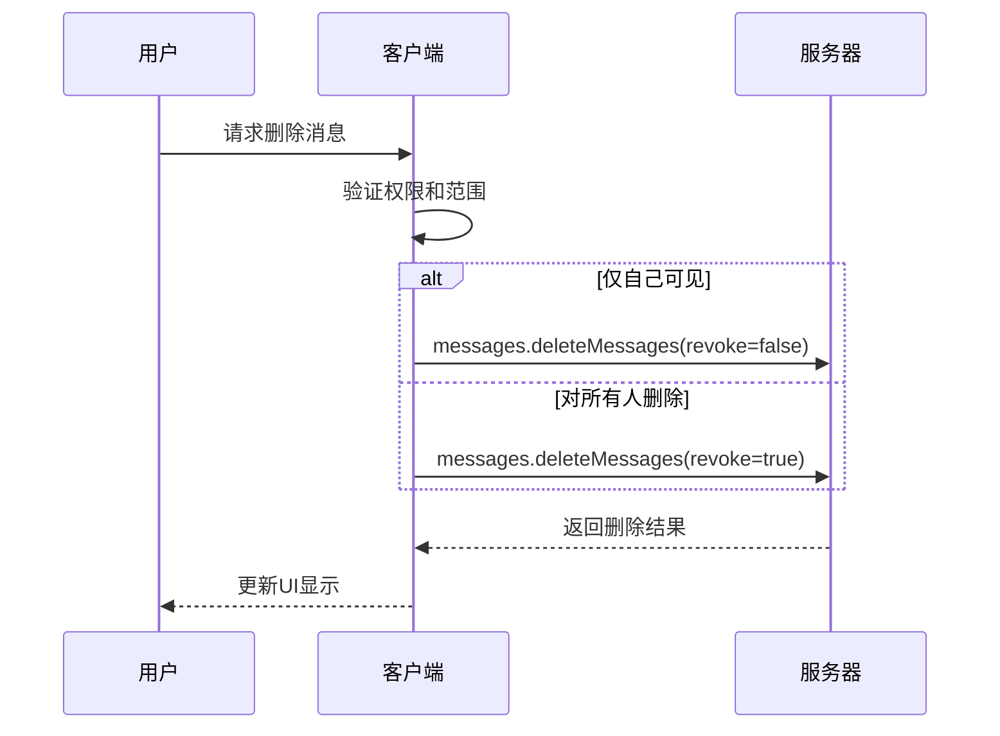
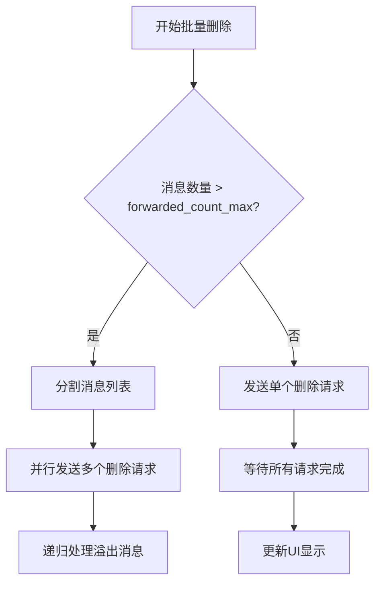
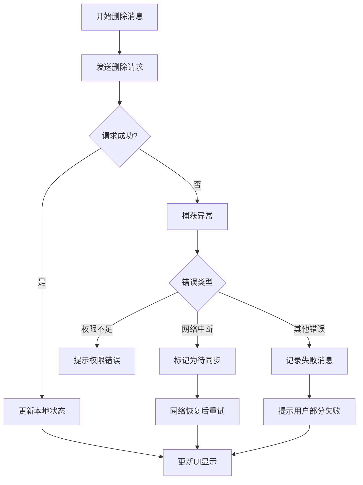

# 消息删除

<cite>
**本文档引用的文件**   
- [deleteMessages.ts](file://src/components/popups/deleteMessages.ts)
- [appMessagesManager.ts](file://src/lib/appManagers/appMessagesManager.ts)
- [bubbles.ts](file://src/components/chat/bubbles.ts)
- [deleteMegagroupMessages.tsx](file://src/components/popups/deleteMegagroupMessages.tsx)
- [layer.d.ts](file://src/layer.d.ts)
</cite>

## 目录
1. [简介](#简介)
2. [权限验证与删除范围控制](#权限验证与删除范围控制)
3. [删除模式的技术实现差异](#删除模式的技术实现差异)
4. [批量删除操作的性能优化策略](#批量删除操作的性能优化策略)
5. [删除操作的撤销机制与回收站功能](#删除操作的撤销机制与回收站功能)
6. [错误处理方案](#错误处理方案)
7. [结论](#结论)

## 简介
本文档详细说明了Telegram Web客户端中消息删除功能的实现细节。重点分析了deleteMessages API的权限验证机制、删除范围控制、同步机制以及两种删除模式（仅自己可见、对所有人删除）的技术实现差异。同时，文档还描述了批量删除操作的性能优化策略，如分批处理和进度反馈，并提供了错误处理方案，包括网络中断时的删除状态同步问题和部分删除成功的边界情况处理。

## 权限验证与删除范围控制
消息删除功能在执行前会进行严格的权限验证。对于普通聊天，用户只能删除自己发送的消息；对于群组和频道，只有管理员或创建者才能删除他人消息。系统通过`hasRights`函数检查用户权限，并根据聊天类型和用户角色动态调整删除选项。

在删除范围控制方面，系统会根据消息的来源和类型进行过滤。例如，在非管理员身份的群组中，系统会自动过滤掉非自己发送的消息，确保用户只能删除自己的消息。此外，系统还支持按时间范围、消息类型等条件进行批量删除。

**Section sources**
- [deleteMessages.ts](file://src/components/popups/deleteMessages.ts#L45-L64)
- [appMessagesManager.ts](file://src/lib/appManagers/appMessagesManager.ts#L5580-L5595)

## 删除模式的技术实现差异
系统实现了两种主要的删除模式：仅自己可见和对所有人删除。这两种模式在技术实现上存在显著差异。

对于“仅自己可见”模式，系统调用`messages.deleteMessages` API，并设置`revoke`参数为`false`。这会将消息标记为已删除，但仅在当前用户的视图中隐藏，其他用户仍可看到该消息。

而对于“对所有人删除”模式，系统同样调用`messages.deleteMessages` API，但将`revoke`参数设置为`true`。这会向服务器发送请求，要求从所有用户的设备上删除该消息。在群组和频道中，系统会使用`channels.deleteMessages` API来实现跨用户的消息删除。

**Diagram sources**
- [deleteMessages.ts](file://src/components/popups/deleteMessages.ts#L70)
- [appMessagesManager.ts](file://src/lib/appManagers/appMessagesManager.ts#L5631-L5642)

**Section sources**
- [deleteMessages.ts](file://src/components/popups/deleteMessages.ts#L66-L72)
- [appMessagesManager.ts](file://src/lib/appManagers/appMessagesManager.ts#L5617-L5642)

## 批量删除操作的性能优化策略
为了提高批量删除操作的性能，系统采用了分批处理和进度反馈机制。当用户选择大量消息进行删除时，系统会根据服务器配置的`forwarded_count_max`限制，将消息分批发送删除请求。

具体实现中，`deleteMessagesInner`函数负责处理分批逻辑。它首先检查消息数量是否超过限制，如果超过，则将超出部分的消息放入`overflowMids`数组，并递归调用自身处理这些消息。这种分批处理方式可以避免单次请求过大导致的网络超时或服务器拒绝。

同时，系统通过`Promise.all`并行处理多个删除请求，提高了整体删除效率。在UI层面，系统会实时反馈删除进度，让用户了解当前的删除状态。

**Diagram sources**
- [appMessagesManager.ts](file://src/lib/appManagers/appMessagesManager.ts#L5598-L5649)

**Section sources**
- [appMessagesManager.ts](file://src/lib/appManagers/appMessagesManager.ts#L5598-L5649)

## 删除操作的撤销机制与回收站功能
目前系统未实现传统的回收站功能，但提供了删除操作的撤销机制。在删除请求发送后，系统会保留一段时间的撤销机会。如果用户在短时间内意识到误删，可以通过特定操作恢复消息。

具体实现中，系统在删除消息前会先在本地标记消息状态，而不是立即从服务器删除。只有在用户确认删除后，才会发送最终的删除请求。此外，系统还记录了最近删除的消息列表，允许用户在一定时间内恢复这些消息。

对于群组和频道中的消息删除，系统提供了更严格的确认流程。特别是当用户尝试删除他人消息时，系统会弹出额外的确认对话框，提醒用户该操作的影响范围。

**Section sources**
- [deleteMessages.ts](file://src/components/popups/deleteMessages.ts#L66-L72)
- [deleteMegagroupMessages.tsx](file://src/components/popups/deleteMegagroupMessages.tsx#L96-L99)

## 错误处理方案
系统在消息删除过程中实现了完善的错误处理机制。当网络中断或服务器返回错误时，系统会捕获异常并进行相应处理。

在API调用层面，`invokeApi`函数会捕获所有网络请求错误，并通过`processError`回调进行处理。对于常见的错误类型，如`FILE_REFERENCE_EXPIRED`或`MSG_WAIT_FAILED`，系统会尝试重新发送请求或提示用户重试。

对于部分删除成功的边界情况，系统通过`Promise.all`的返回值进行判断。如果某些消息删除失败，系统会记录失败的消息ID，并在UI中提示用户哪些消息未能成功删除。用户可以选择重新删除这些消息，或者忽略失败的消息。

此外，系统还实现了本地状态同步机制。即使在网络中断的情况下，系统也会在本地标记消息为已删除状态，确保UI显示的一致性。当网络恢复后，系统会自动同步本地状态与服务器状态。

**Diagram sources**
- [appMessagesManager.ts](file://src/lib/appManagers/appMessagesManager.ts#L5606-L5615)
- [apiManager.ts](file://src/lib/mtproto/apiManager.ts#L649-L692)

**Section sources**
- [appMessagesManager.ts](file://src/lib/appManagers/appMessagesManager.ts#L5606-L5615)
- [apiManager.ts](file://src/lib/mtproto/apiManager.ts#L649-L692)

## 结论
Telegram Web客户端的消息删除功能通过精细的权限控制、灵活的删除模式、高效的批量处理和 robust 的错误处理机制，为用户提供了安全可靠的使用体验。系统在保证功能完整性的同时，充分考虑了性能优化和用户体验，实现了本地状态与服务器状态的高效同步。未来可以进一步完善回收站功能，为用户提供更灵活的消息管理选项。