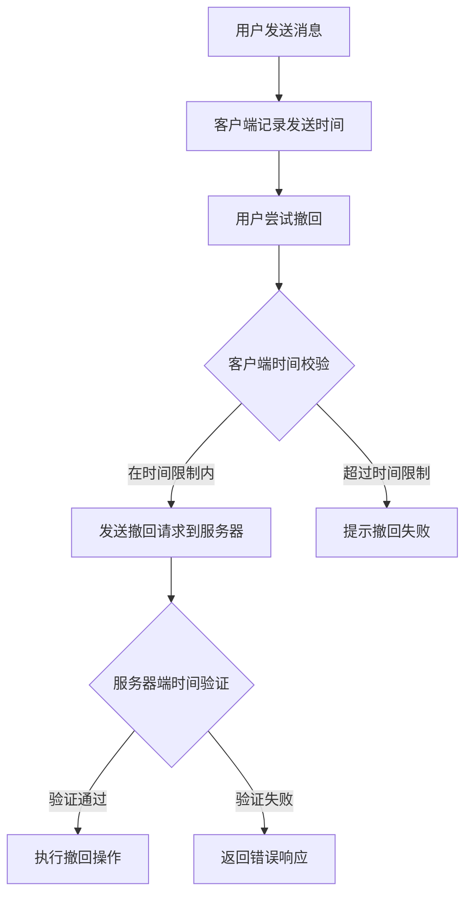
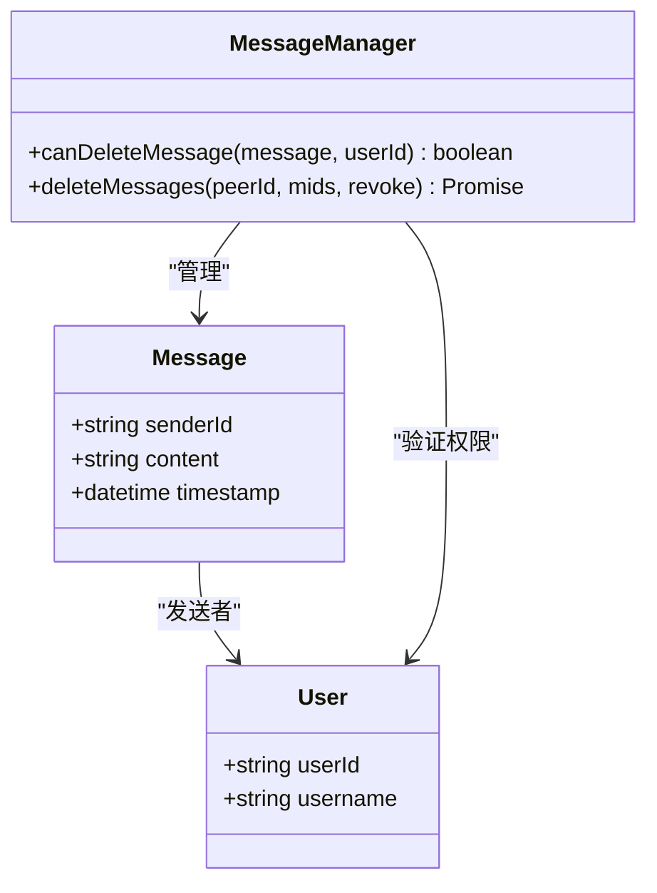
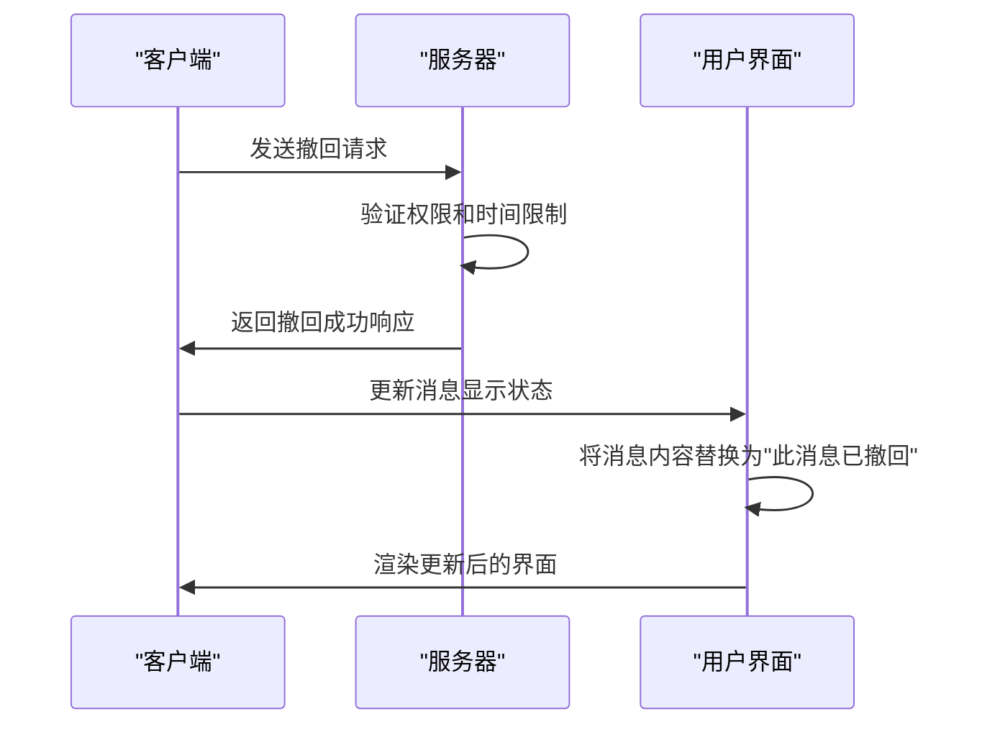
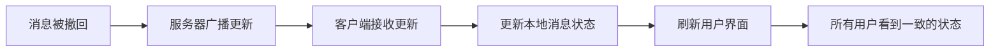
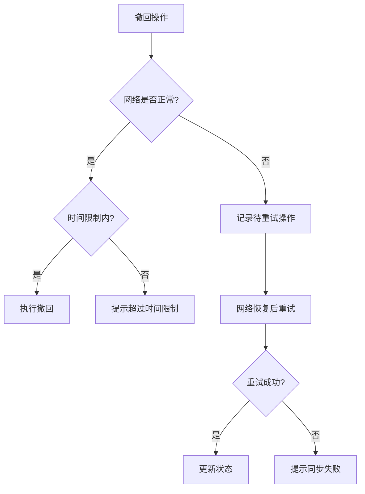

# 消息撤回

<cite>
**本文档引用的文件**
- [pendingUndoableMessage.ts](file://src/components/chat/pendingUndoableMessage.ts)
- [contextMenu.ts](file://src/components/chat/contextMenu.ts)
- [appMessagesManager.ts](file://src/lib/appManagers/appMessagesManager.ts)
- [bubbles.ts](file://src/components/chat/bubbles.ts)
- [deleteMessages.ts](file://src/components/popups/deleteMessages.ts)
- [hasRights.ts](file://src/lib/appManagers/utils/chats/hasRights.ts)
</cite>

## 目录
1. [引言](#引言)
2. [时间限制机制](#时间限制机制)
3. [权限控制](#权限控制)
4. [消息显示状态](#消息显示状态)
5. [实时同步机制](#实时同步机制)
6. [错误处理策略](#错误处理策略)

## 引言
消息撤回功能允许用户在发送消息后的一段时间内将其撤回。该功能通过客户端和服务器端的双重校验机制确保安全性，仅允许消息发送者撤回自己的消息。撤回后，消息在界面中显示为"此消息已撤回"的提示文本，并通过实时同步机制确保所有聊天参与方都能及时更新界面。

## 时间限制机制
消息撤回的时间限制机制通过客户端和服务器端的双重保障实现。客户端在发送消息时记录发送时间，并在用户尝试撤回时进行时间校验。服务器端也会验证消息的发送时间，确保撤回请求在有效时间窗口内。

**Diagram sources**
- [pendingUndoableMessage.ts](file://src/components/chat/pendingUndoableMessage.ts#L6-L57)
- [appMessagesManager.ts](file://src/lib/appManagers/appMessagesManager.ts#L5580-L5651)

**Section sources**
- [pendingUndoableMessage.ts](file://src/components/chat/pendingUndoableMessage.ts#L6-L57)
- [appMessagesManager.ts](file://src/lib/appManagers/appMessagesManager.ts#L5580-L5651)

## 权限控制
消息撤回的权限控制严格限制为仅消息发送者可以撤回自己的消息。系统通过检查消息的发送者ID与当前用户ID是否匹配来实现这一控制。在群组或频道中，管理员可能具有额外的删除权限，但普通用户的撤回操作仍仅限于自己的消息。

**Diagram sources**
- [appMessagesManager.ts](file://src/lib/appManagers/appMessagesManager.ts#L5580-L5651)
- [hasRights.ts](file://src/lib/appManagers/utils/chats/hasRights.ts#L135-L165)

**Section sources**
- [appMessagesManager.ts](file://src/lib/appManagers/appMessagesManager.ts#L5580-L5651)
- [hasRights.ts](file://src/lib/appManagers/utils/chats/hasRights.ts#L135-L165)

## 消息显示状态
消息撤回后，其显示状态会发生变化。原始消息内容会被替换为"此消息已撤回"的提示文本。这一状态变化通过UI组件的更新机制实现，确保用户界面能够正确反映消息的当前状态。

**Diagram sources**
- [bubbles.ts](file://src/components/chat/bubbles.ts#L5356-L5640)
- [contextMenu.ts](file://src/components/chat/contextMenu.ts#L1011-L1018)

**Section sources**
- [bubbles.ts](file://src/components/chat/bubbles.ts#L5356-L5640)
- [contextMenu.ts](file://src/components/chat/contextMenu.ts#L1011-L1018)

## 实时同步机制
消息撤回的实时同步机制确保所有聊天参与方都能及时更新界面。当一条消息被撤回时，服务器会向所有相关客户端发送更新通知，触发客户端的界面刷新操作。

**Diagram sources**
- [appMessagesManager.ts](file://src/lib/appManagers/appMessagesManager.ts#L7292-L7322)
- [bubbles.ts](file://src/components/chat/bubbles.ts#L616-L724)

**Section sources**
- [appMessagesManager.ts](file://src/lib/appManagers/appMessagesManager.ts#L7292-L7322)
- [bubbles.ts](file://src/components/chat/bubbles.ts#L616-L724)

## 错误处理策略
消息撤回功能包含完善的错误处理策略，以应对各种异常情况。当用户尝试撤回超过时间限制的消息时，系统会返回相应的错误信息。在网络异常情况下，系统会通过重试机制和状态一致性检查来维护数据完整性。

**Diagram sources**
- [appMessagesManager.ts](file://src/lib/appManagers/appMessagesManager.ts#L5580-L5651)
- [deleteMessages.ts](file://src/components/popups/deleteMessages.ts#L65-L77)

**Section sources**
- [appMessagesManager.ts](file://src/lib/appManagers/appMessagesManager.ts#L5580-L5651)
- [deleteMessages.ts](file://src/components/popups/deleteMessages.ts#L65-L77)