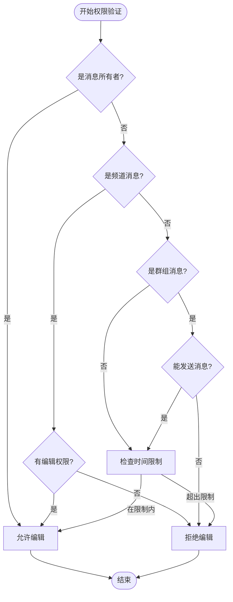
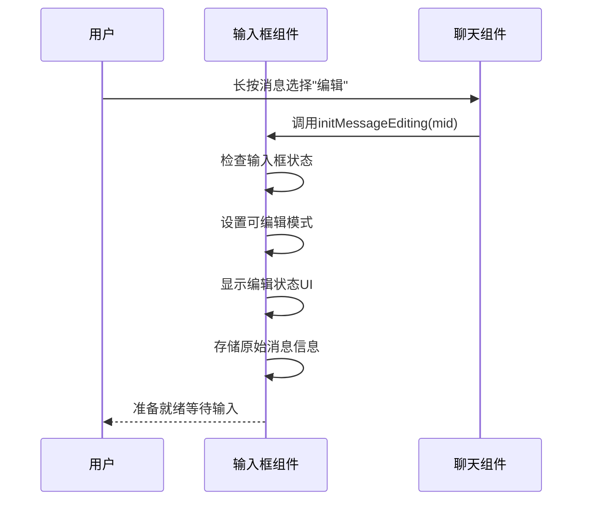
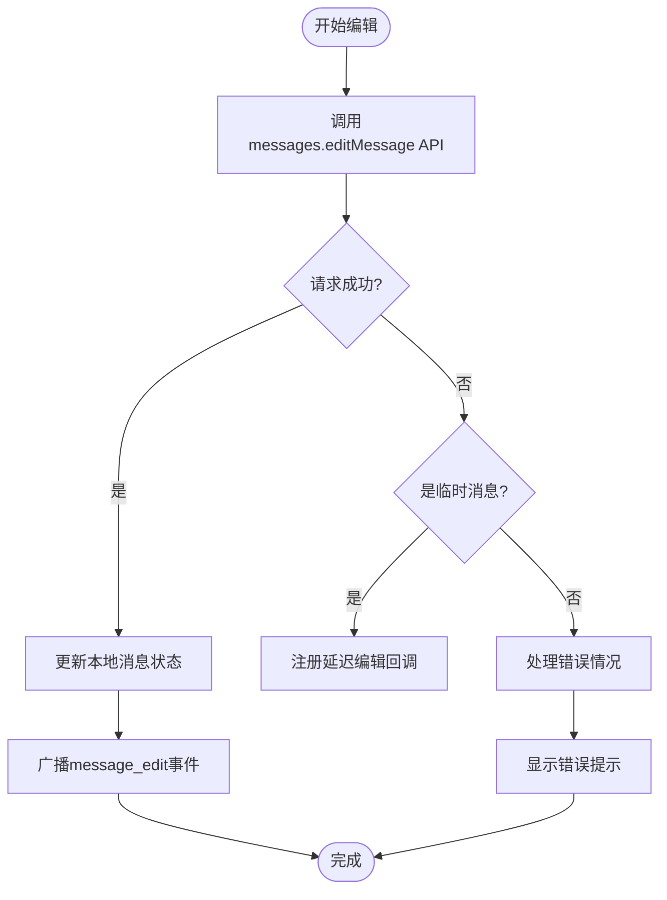
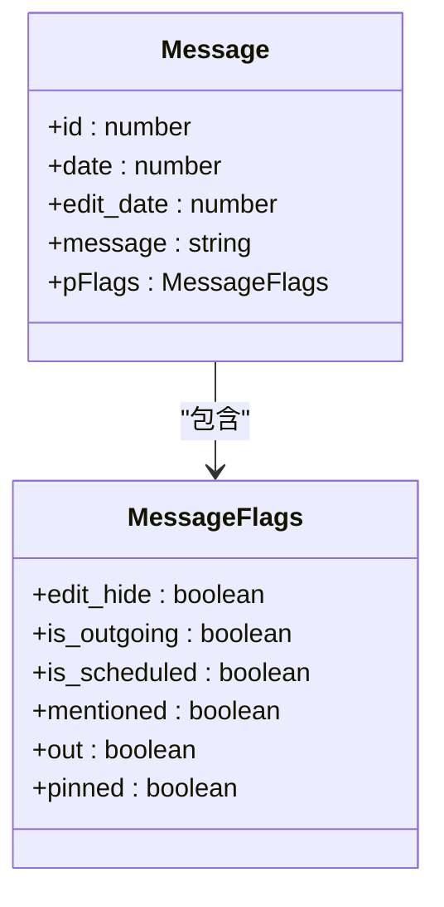
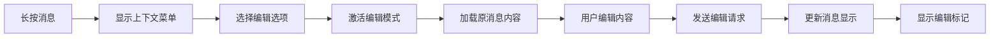
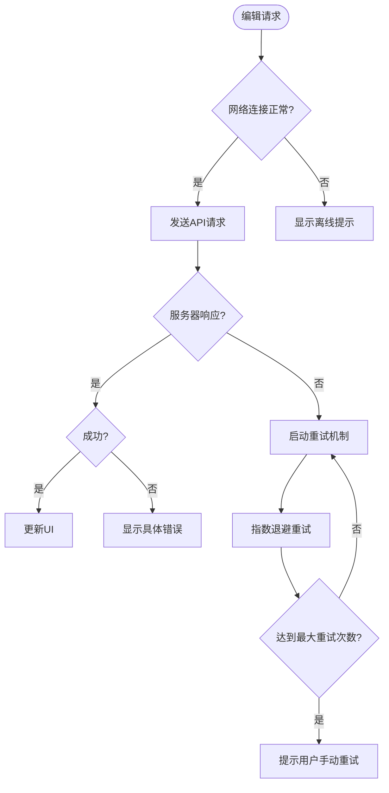

# 消息编辑

<cite>
**本文档引用的文件**   
- [appMessagesManager.ts](file://src/lib/appManagers/appMessagesManager.ts)
- [input.ts](file://src/components/chat/input.ts)
- [contextMenu.ts](file://src/components/chat/contextMenu.ts)
- [bubbles.ts](file://src/components/chat/bubbles.ts)
- [messageRender.ts](file://src/components/chat/messageRender.ts)
- [apiManager.ts](file://src/lib/mtproto/apiManager.ts)
</cite>

## 目录
1. [简介](#简介)
2. [权限验证机制](#权限验证机制)
3. [内容校验与版本控制](#内容校验与版本控制)
4. [本地编辑状态管理](#本地编辑状态管理)
5. [服务器确认流程](#服务器确认流程)
6. [时间戳更新策略](#时间戳更新策略)
7. [用户界面交互流程](#用户界面交互流程)
8. [错误处理机制](#错误处理机制)
9. [不同消息类型的编辑处理](#不同消息类型的编辑处理)

## 简介
消息编辑功能允许用户修改已发送的消息内容。该功能包含复杂的权限验证、内容校验、状态同步和错误处理机制。编辑操作会触发本地状态更新和服务器同步，同时保持消息的时间戳信息以确保消息历史的完整性。

**Section sources**
- [appMessagesManager.ts](file://src/lib/appManagers/appMessagesManager.ts#L779-L817)
- [input.ts](file://src/components/chat/input.ts#L3961-L4008)

## 权限验证机制
消息编辑功能首先通过权限验证来确定用户是否有权编辑特定消息。权限验证主要基于以下条件：

1. **消息所有者验证**：如果消息的发送者是当前用户，则允许编辑。
2. **群组权限验证**：在群组或频道中，需要检查用户是否具有编辑消息的权限（`edit_messages`）。
3. **时间限制验证**：普通用户只能在消息发送后的一定时间内进行编辑，这个时间限制由服务器配置决定。
4. **特殊消息类型限制**：某些特殊类型的消息（如投票）可能有额外的编辑限制。

权限验证通过 `canEditMessage` 方法实现，该方法综合考虑了消息类型、发送者身份、群组权限和时间限制等因素。

**Diagram sources **
- [appMessagesManager.ts](file://src/lib/appManagers/appMessagesManager.ts#L5151-L5183)

**Section sources**
- [appMessagesManager.ts](file://src/lib/appManagers/appMessagesManager.ts#L5151-L5183)
- [groupPermissions/index.ts](file://src/components/sidebarRight/tabs/groupPermissions/index.ts#L223-L226)

## 内容校验与版本控制
在编辑消息时，系统会对新内容进行严格的校验，并维护消息的版本控制。内容校验包括：

1. **Markdown解析**：对包含Markdown格式的文本进行解析和转换。
2. **实体处理**：处理消息中的各种实体（如链接、提及、表情符号等）。
3. **媒体验证**：验证新添加或修改的媒体文件是否符合要求。

版本控制通过以下机制实现：
- 保留原始消息的副本作为历史记录
- 在消息对象中维护 `edit_date` 字段来记录最后编辑时间
- 通过消息ID和版本号确保编辑操作的原子性

**Section sources**
- [appMessagesManager.ts](file://src/lib/appManagers/appMessagesManager.ts#L800-L803)
- [messageRender.ts](file://src/components/chat/messageRender.ts#L227-L270)

## 本地编辑状态管理
本地编辑状态管理负责在用户开始编辑消息时维护临时状态，并在编辑完成后同步到服务器。主要组件包括：

1. **编辑模式激活**：当用户选择编辑消息时，输入框切换到可编辑状态。
2. **临时状态存储**：保存当前正在编辑的消息ID和原始内容。
3. **输入框管理**：更新输入框的占位符和内容，显示"正在编辑"状态。

**Diagram sources **
- [input.ts](file://src/components/chat/input.ts#L3961-L3994)

**Section sources**
- [input.ts](file://src/components/chat/input.ts#L3961-L3994)
- [contextMenu.ts](file://src/components/chat/contextMenu.ts#L774-L783)

## 服务器确认流程
服务器确认流程确保编辑操作成功同步到服务器，并处理可能的网络问题。流程如下：

1. **API调用**：通过 `messages.editMessage` API发送编辑请求。
2. **异步处理**：对于尚未发送成功的消息，使用 `invokeAfterMessageIsSent` 进行延迟处理。
3. **响应处理**：接收服务器响应并更新本地状态。
4. **错误处理**：处理网络错误、权限错误等异常情况。

**Diagram sources **
- [appMessagesManager.ts](file://src/lib/appManagers/appMessagesManager.ts#L791-L817)

**Section sources**
- [appMessagesManager.ts](file://src/lib/appManagers/appMessagesManager.ts#L791-L817)
- [apiManager.ts](file://src/lib/mtproto/apiManager.ts#L718-L776)

## 时间戳更新策略
消息编辑后的时间戳更新策略旨在平衡用户体验和消息历史的准确性。主要规则包括：

1. **显示编辑标记**：在消息时间戳旁边显示"已编辑"标签。
2. **保留原始时间**：保留消息的原始发送时间。
3. **记录编辑时间**：使用 `edit_date` 字段记录最后一次编辑的时间。
4. **UI显示逻辑**：在消息气泡的标题中同时显示原始时间和编辑时间。

**Diagram sources **
- [messageRender.ts](file://src/components/chat/messageRender.ts#L227-L270)

**Section sources**
- [messageRender.ts](file://src/components/chat/messageRender.ts#L227-L270)
- [bubbles.ts](file://src/components/chat/bubbles.ts#L917-L949)

## 用户界面交互流程
用户界面交互流程描述了从用户操作到功能响应的完整过程：

1. **长按消息**：用户在消息气泡上长按触发上下文菜单。
2. **选择编辑选项**：在上下文菜单中选择"编辑"选项。
3. **进入编辑模式**：输入框自动填充原消息内容，显示"正在编辑"状态。
4. **修改内容**：用户编辑消息内容并发送。
5. **状态更新**：消息气泡更新显示编辑后的内容和时间戳。

**Diagram sources **
- [contextMenu.ts](file://src/components/chat/contextMenu.ts#L774-L783)
- [input.ts](file://src/components/chat/input.ts#L3961-L3994)

**Section sources**
- [contextMenu.ts](file://src/components/chat/contextMenu.ts#L774-L783)
- [input.ts](file://src/components/chat/input.ts#L3961-L3994)

## 错误处理机制
错误处理机制确保在各种异常情况下提供良好的用户体验：

1. **网络失败重试**：对于网络错误，系统会自动重试请求。
2. **冲突解决**：处理多个用户同时编辑同一消息的冲突情况。
3. **超时处理**：设置合理的请求超时时间，避免界面卡死。
4. **用户反馈**：向用户提供清晰的错误信息和恢复选项。

**Diagram sources **
- [apiManager.ts](file://src/lib/mtproto/apiManager.ts#L736-L768)

**Section sources**
- [apiManager.ts](file://src/lib/mtproto/apiManager.ts#L736-L768)
- [appMessagesManager.ts](file://src/lib/appManagers/appMessagesManager.ts#L787-L789)

## 不同消息类型的编辑处理
系统支持对多种消息类型进行编辑，每种类型有不同的处理逻辑：

1. **文本消息**：直接编辑文本内容，支持Markdown格式。
2. **媒体消息**：可以修改附带的说明文字，但不能更改媒体文件本身。
3. **表情符号消息**：作为特殊类型的文本消息处理。
4. **投票消息**：有专门的编辑权限和流程。

对于包含媒体的消息，编辑操作主要集中在修改说明文字部分，而媒体文件本身通常不可更改。这种设计既提供了灵活性，又保证了媒体内容的完整性。

**Section sources**
- [wrappers/messageForReply.ts](file://src/components/wrappers/messageForReply.ts#L129-L305)
- [bubbles.ts](file://src/components/chat/bubbles.ts#L6239-L6274)
- [newMedia.ts](file://src/components/popups/newMedia.ts#L689-L694)