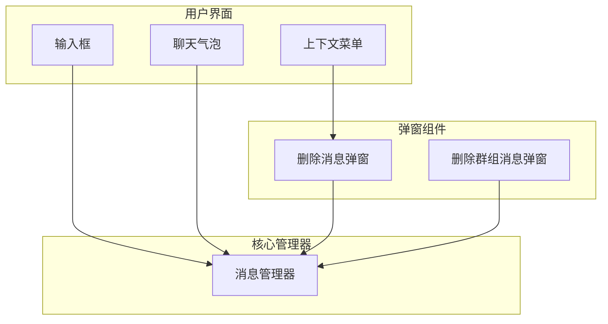
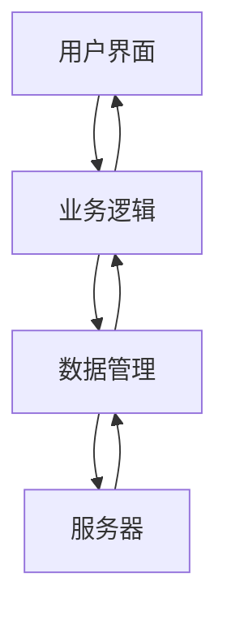
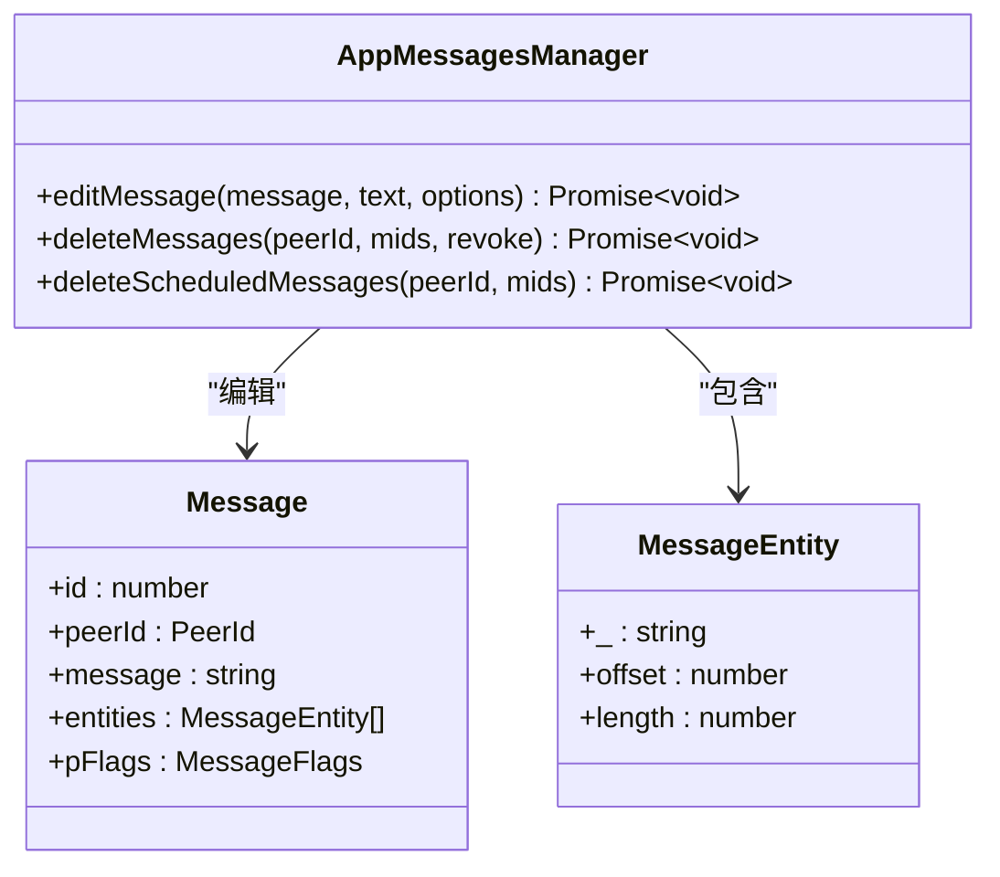
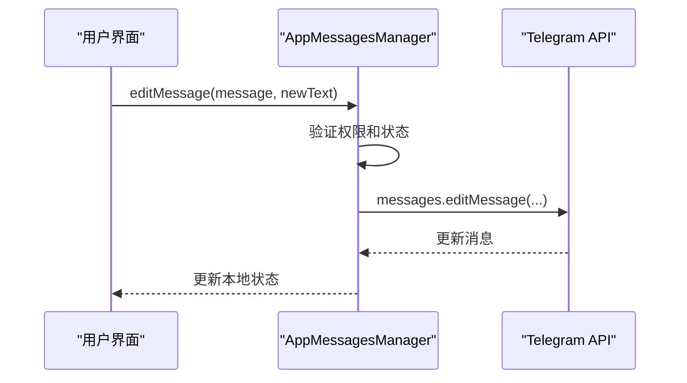
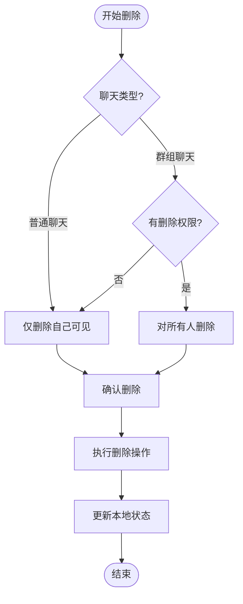
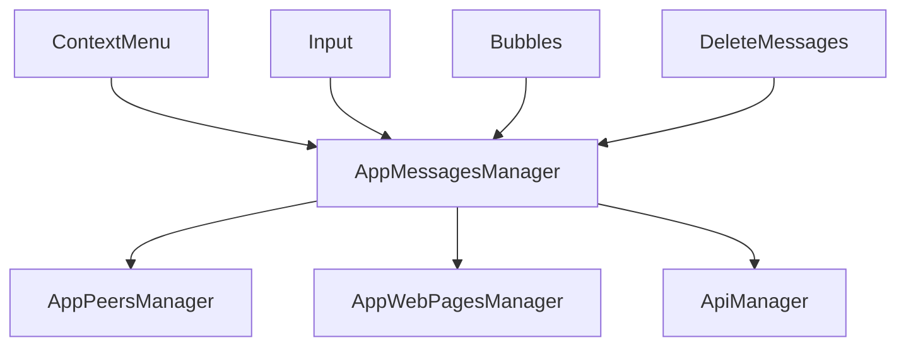

# 消息编辑与删除

<cite>
**本文档引用的文件**  
- [deleteMessages.ts](file://src/components/popups/deleteMessages.ts)
- [deleteMegagroupMessages.tsx](file://src/components/popups/deleteMegagroupMessages.tsx)
- [bubbles.ts](file://src/components/chat/bubbles.ts)
- [contextMenu.ts](file://src/components/chat/contextMenu.ts)
- [input.ts](file://src/components/chat/input.ts)
- [appMessagesManager.ts](file://src/lib/appManagers/appMessagesManager.ts)
- [layer.d.ts](file://src/layer.d.ts)
</cite>

## 目录
1. [简介](#简介)
2. [项目结构](#项目结构)
3. [核心组件](#核心组件)
4. [架构概述](#架构概述)
5. [详细组件分析](#详细组件分析)
6. [依赖分析](#依赖分析)
7. [性能考虑](#性能考虑)
8. [故障排除指南](#故障排除指南)
9. [结论](#结论)
10. [附录](#附录)（如有必要）

## 简介
本文档详细说明了Telegram Web客户端中消息编辑与删除功能的实现机制。重点分析了`editMessage`、`deleteMessages`等API的实现细节，包括权限验证、版本控制和同步机制。文档还解释了本地编辑状态管理和服务器确认流程，描述了消息删除的多种模式（仅自己可见、对所有人删除）的实现差异，以及撤回功能的时间限制和状态同步机制。最后，文档提供了错误处理和边界情况的解决方案。

## 项目结构
消息编辑与删除功能主要分布在`src/components/chat`和`src/lib/appManagers`目录下。核心功能由`appMessagesManager`类管理，用户界面通过`contextMenu`、`input`和`bubbles`等组件实现。删除操作的确认对话框由`popups`目录下的`deleteMessages`和`deleteMegagroupMessages`组件处理。

**图表来源**  
- [contextMenu.ts](file://src/components/chat/contextMenu.ts#L1080-L1279)
- [input.ts](file://src/components/chat/input.ts#L2680-L2879)
- [bubbles.ts](file://src/components/chat/bubbles.ts#L3700-L3899)
- [deleteMessages.ts](file://src/components/popups/deleteMessages.ts#L1-L163)
- [deleteMegagroupMessages.tsx](file://src/components/popups/deleteMegagroupMessages.tsx#L1-L323)
- [appMessagesManager.ts](file://src/lib/appManagers/appMessagesManager.ts#L777-L835)

**章节来源**
- [src/components/chat](file://src/components/chat)
- [src/lib/appManagers](file://src/lib/appManagers)
- [src/components/popups](file://src/components/popups)

## 核心组件
消息编辑与删除功能的核心组件包括`appMessagesManager`中的`editMessage`和`deleteMessages`方法，以及用户界面中的上下文菜单、输入框和气泡组件。这些组件协同工作，实现了完整的消息编辑与删除流程。

**章节来源**
- [appMessagesManager.ts](file://src/lib/appManagers/appMessagesManager.ts#L777-L835)
- [contextMenu.ts](file://src/components/chat/contextMenu.ts#L1080-L1279)

## 架构概述
消息编辑与删除功能采用分层架构，分为用户界面层、业务逻辑层和数据管理层。用户界面层负责接收用户操作，业务逻辑层处理权限验证和状态管理，数据管理层与服务器通信并更新本地状态。

**图表来源**  
- [appMessagesManager.ts](file://src/lib/appManagers/appMessagesManager.ts#L777-L835)
- [contextMenu.ts](file://src/components/chat/contextMenu.ts#L1080-L1279)

## 详细组件分析

### 消息编辑分析
消息编辑功能通过`editMessage`方法实现，该方法首先验证消息是否可以编辑，然后将编辑后的内容发送到服务器。

#### 消息编辑类图

**图表来源**  
- [appMessagesManager.ts](file://src/lib/appManagers/appMessagesManager.ts#L777-L835)
- [layer.d.ts](file://src/layer.d.ts#L3107-L3113)

#### 消息编辑序列图

**图表来源**  
- [appMessagesManager.ts](file://src/lib/appManagers/appMessagesManager.ts#L777-L835)
- [contextMenu.ts](file://src/components/chat/contextMenu.ts#L1080-L1279)

### 消息删除分析
消息删除功能根据聊天类型和用户权限提供不同的删除选项，包括仅删除自己可见和对所有人删除。

#### 消息删除流程图

**图表来源**  
- [deleteMessages.ts](file://src/components/popups/deleteMessages.ts#L1-L163)
- [appMessagesManager.ts](file://src/lib/appManagers/appMessagesManager.ts#L5651-L5659)

## 依赖分析
消息编辑与删除功能依赖于多个核心组件，包括消息管理器、用户界面组件和服务器API。这些组件之间通过明确的接口进行通信，确保了功能的稳定性和可维护性。

**图表来源**  
- [appMessagesManager.ts](file://src/lib/appManagers/appMessagesManager.ts#L397-L10072)
- [contextMenu.ts](file://src/components/chat/contextMenu.ts#L1080-L1279)

**章节来源**
- [appMessagesManager.ts](file://src/lib/appManagers/appMessagesManager.ts#L397-L10072)
- [contextMenu.ts](file://src/components/chat/contextMenu.ts#L1080-L1279)

## 性能考虑
消息编辑与删除功能在性能方面进行了优化，包括使用批量操作减少服务器请求，以及在本地状态更新时使用动画效果提升用户体验。

## 故障排除指南
在使用消息编辑与删除功能时，可能会遇到权限不足、网络错误等问题。建议检查用户权限设置，确保网络连接正常，并查看服务器返回的错误信息。

**章节来源**
- [appMessagesManager.ts](file://src/lib/appManagers/appMessagesManager.ts#L822-L834)
- [deleteMessages.ts](file://src/components/popups/deleteMessages.ts#L45-L64)

## 结论
消息编辑与删除功能是Telegram Web客户端的重要组成部分，通过合理的架构设计和详细的权限控制，为用户提供了安全可靠的消息管理体验。