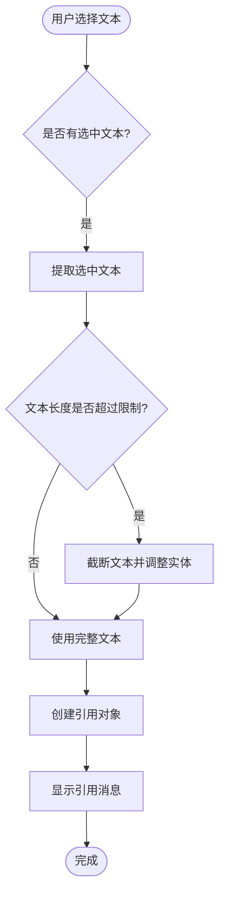
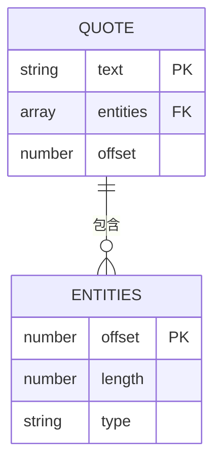
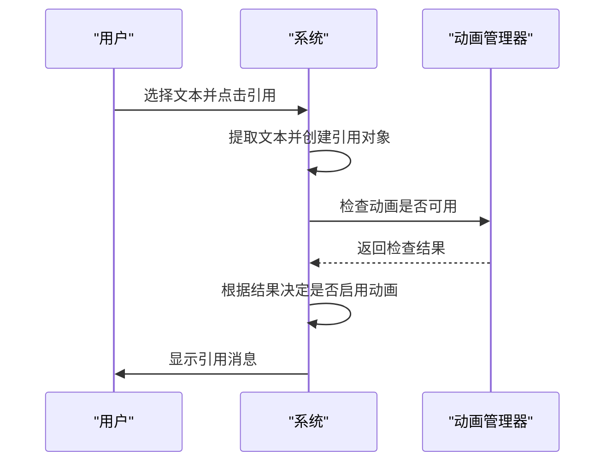

# 消息引用

<cite>
**本文档中引用的文件**   
- [contextMenu.ts](file://src/components/chat/contextMenu.ts)
- [reply.ts](file://src/components/wrappers/reply.ts)
- [input.ts](file://src/components/chat/input.ts)
- [bubbles.ts](file://src/components/chat/bubbles.ts)
- [wrapRichText.ts](file://src/lib/richTextProcessor/wrapRichText.ts)
- [_quote.scss](file://src/scss/partials/_quote.scss)
- [referenceDatabase.ts](file://src/lib/mtproto/referenceDatabase.ts)
- [adminLogsResolver\reply.tsx](file://src/components/chat/bubbleParts/adminLogsResolver/reply.tsx)
</cite>

## 目录
1. [引言](#引言)
2. [核心功能实现](#核心功能实现)
3. [引用链构建与上下文关联](#引用链构建与上下文关联)
4. [显示样式与交互行为](#显示样式与交互行为)
5. [元数据存储结构](#元数据存储结构)
6. [性能优化策略](#性能优化策略)
7. [使用示例与功能集成](#使用示例与功能集成)
8. [结论](#结论)

## 引言
消息引用功能允许用户在回复消息时选择特定文本片段进行引用，从而实现更精确的上下文关联。该功能通过引用链的构建、消息内容提取和上下文高亮等机制，提升了对话的连贯性和可读性。本文档详细说明了quoteMessage功能的实现机制，包括引用链的构建、消息内容提取和上下文关联，以及引用消息的显示样式设计和交互行为。

## 核心功能实现

消息引用功能的核心实现位于`contextMenu.ts`文件中，通过`onQuoteClick`方法处理引用操作。当用户选择文本并点击引用按钮时，系统会提取选中的文本内容，并根据应用配置限制引用长度。引用内容包括文本本身及其格式化实体（如加粗、斜体等），确保引用的文本保持原有的格式。

**Section sources**
- [contextMenu.ts](file://src/components/chat/contextMenu.ts#L1738-L1775)

## 引用链构建与上下文关联

引用链的构建依赖于`referenceDatabase.ts`中的`ReferenceDatabase`类，该类负责管理引用的上下文信息。每个引用都有一个唯一的`ReferenceBytes`标识符，并与一个或多个`ReferenceContext`关联，这些上下文信息包括消息、用户资料、自定义表情等。通过`saveContext`方法，系统可以将引用与特定的上下文关联起来，确保在需要时能够正确地恢复引用内容。

```mermaid
classDiagram
class ReferenceDatabase {
+contexts : Map<ReferenceBytes, ReferenceContexts>
+links : {[hex : string] : ReferenceBytes}
+saveContext(reference : ReferenceBytes, context : ReferenceContext)
+getContexts(reference : ReferenceBytes) : [ReferenceContexts, ReferenceBytes]
+getContext(reference : ReferenceBytes) : [ReferenceContext, ReferenceBytes]
+deleteContext(reference : ReferenceBytes, context : ReferenceContext)
+refreshReference(reference : ReferenceBytes, context? : ReferenceContext) : Promise<Uint8Array | number[]>
}
class ReferenceContext {
+type : string
+peerId : PeerId
+messageId : number
}
ReferenceDatabase --> ReferenceContext : "保存上下文"
```

**Diagram sources**
- [referenceDatabase.ts](file://src/lib/mtproto/referenceDatabase.ts#L146-L309)

**Section sources**
- [referenceDatabase.ts](file://src/lib/mtproto/referenceDatabase.ts#L146-L309)

## 显示样式与交互行为

引用消息的显示样式由`_quote.scss`文件定义，采用`.quote-like`类来创建具有边框和背景色的引用块。引用块的边框颜色根据发送者的主题色动态调整，以增强视觉识别。交互行为方面，用户可以通过点击引用块来展开或折叠长文本，系统通过`onQuoteResize`事件监听器自动调整引用块的高度，并在必要时显示展开/折叠图标。



**Diagram sources**
- [_quote.scss](file://src/scss/partials/_quote.scss#L7-L148)
- [wrapRichText.ts](file://src/lib/richTextProcessor/wrapRichText.ts#L83-L117)

**Section sources**
- [_quote.scss](file://src/scss/partials/_quote.scss#L7-L148)
- [wrapRichText.ts](file://src/lib/richTextProcessor/wrapRichText.ts#L83-L117)

## 元数据存储结构

引用消息的元数据存储在`ChatInputReplyTo`对象中，包含引用的文本、格式化实体和偏移量。这些信息在用户发送回复时被附加到新消息中，确保接收方能够正确解析和显示引用内容。元数据的存储结构设计考虑了性能和可扩展性，支持未来添加更多引用属性。



**Diagram sources**
- [input.ts](file://src/components/chat/input.ts#L4178-L4221)

**Section sources**
- [input.ts](file://src/components/chat/input.ts#L4178-L4221)

## 性能优化策略

为了处理深层引用链时的性能问题，系统采用了多种优化策略。首先，通过`liteMode.isAvailable('animations')`检查动画是否可用，避免在低性能设备上执行复杂的动画效果。其次，使用`observeResize`监听器仅在引用块尺寸变化时更新样式，减少不必要的重绘。此外，`ignoreQuoteResize`标志用于防止在动画过程中频繁触发尺寸调整，提高响应速度。



**Diagram sources**
- [bubbles.ts](file://src/components/chat/bubbles.ts#L2635-L2673)
- [wrapRichText.ts](file://src/lib/richTextProcessor/wrapRichText.ts#L83-L117)

**Section sources**
- [bubbles.ts](file://src/components/chat/bubbles.ts#L2635-L2673)
- [wrapRichText.ts](file://src/lib/richTextProcessor/wrapRichText.ts#L83-L117)

## 使用示例与功能集成

消息引用功能可以与其他功能（如回复、转发）无缝集成。例如，在管理员日志中，`reply.tsx`组件通过`wrapReply`函数创建引用消息，支持自定义标题和文本。用户可以在不同场景下使用引用功能，如在群组讨论中引用特定发言，或在私聊中引用对方的某句话进行回应。

```mermaid
classDiagram
class Reply {
+colorPeerId : PeerId
+title : string
+text : string
+entities : MessageEntity[]
+wrapReply(options : WrapReplyOptions) : {container : HTMLElement, fillPromise : Promise<void>}
}
class wrapReply {
+options : WrapReplyOptions
+replyContainer : ReplyContainer
+fillPromise : Promise<void>
}
Reply --> wrapReply : "调用"
```

**Diagram sources**
- [reply.tsx](file://src/components/chat/bubbleParts/adminLogsResolver/reply.tsx#L7-L34)
- [reply.ts](file://src/components/wrappers/reply.ts#L33-L123)

**Section sources**
- [reply.tsx](file://src/components/chat/bubbleParts/adminLogsResolver/reply.tsx#L7-L34)
- [reply.ts](file://src/components/wrappers/reply.ts#L33-L123)

## 结论
消息引用功能通过精细的实现机制和优化策略，为用户提供了一种高效、直观的方式来引用和回应消息。该功能不仅增强了对话的连贯性，还通过灵活的样式设计和交互行为提升了用户体验。未来可以通过进一步优化引用链的处理逻辑，支持更复杂的引用场景，如多层引用和跨会话引用。