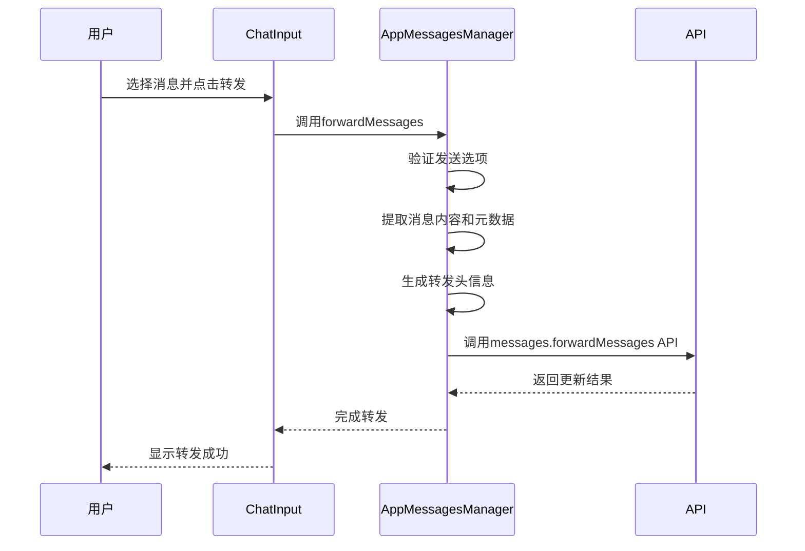
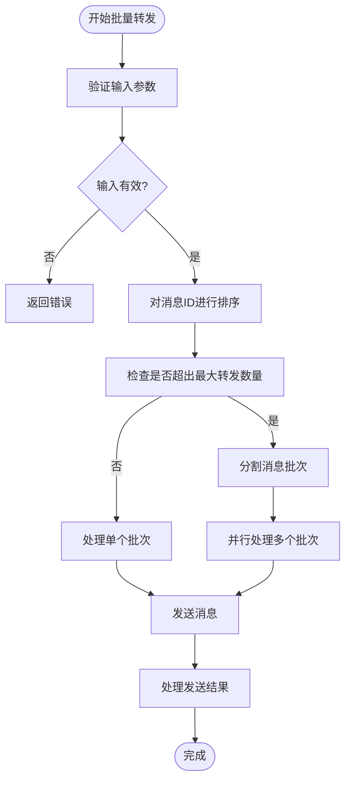
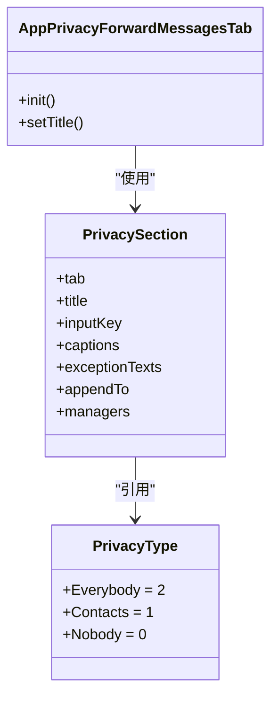
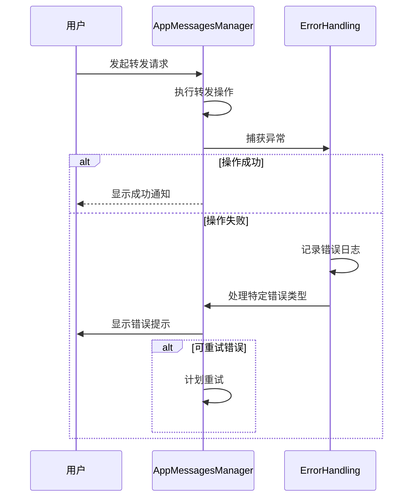

# 消息转发

<cite>
**本文档引用的文件**   
- [appMessagesManager.ts](file://src/lib/appManagers/appMessagesManager.ts)
- [forward.ts](file://src/components/popups/forward.ts)
- [input.ts](file://src/components/chat/input.ts)
- [privacySection.ts](file://src/components/privacySection.ts)
- [AppPrivacyForwardMessagesTab.ts](file://src/components/sidebarLeft/tabs/privacy/forwardMessages.ts)
- [layer.d.ts](file://src/layer.d.ts)
</cite>

## 目录
1. [简介](#简介)
2. [核心组件](#核心组件)
3. [消息转发实现细节](#消息转发实现细节)
4. [批量转发实现逻辑](#批量转发实现逻辑)
5. [隐私控制与权限验证](#隐私控制与权限验证)
6. [错误处理与状态反馈](#错误处理与状态反馈)

## 简介
消息转发功能是Telegram Web客户端的核心功能之一，允许用户将来自一个对话的消息转发到另一个对话。该功能支持单条和批量消息转发，提供丰富的元数据处理和隐私控制选项。系统通过异步操作和消息分组处理来优化性能，并集成权限验证流程确保消息转发的安全性。

## 核心组件

消息转发功能主要由以下几个核心组件构成：
- `AppMessagesManager`：负责消息转发的核心逻辑处理
- `PopupForward`：实现转发操作的UI弹窗组件
- `ChatInput`：聊天输入框中的转发功能集成
- `PrivacySection`：隐私设置中的转发权限管理

这些组件协同工作，为用户提供完整的消息转发体验。

**Section sources**
- [appMessagesManager.ts](file://src/lib/appManagers/appMessagesManager.ts#L269-L276)
- [forward.ts](file://src/components/popups/forward.ts#L17-L74)
- [input.ts](file://src/components/chat/input.ts#L4035-L4152)

## 消息转发实现细节

消息转发功能的实现主要集中在`AppMessagesManager`类中，通过`forwardMessages`和`forwardMessagesInner`方法处理转发逻辑。系统首先提取原始消息的内容和元数据，然后根据目标对话创建新的消息对象。

消息内容提取包括文本内容、媒体附件和格式化实体。元数据处理涉及创建转发头信息，包含原始消息的发送时间、来源标识等。当用户选择隐藏转发来源时，系统会相应地调整转发头的生成逻辑。

**Diagram sources**
- [appMessagesManager.ts](file://src/lib/appManagers/appMessagesManager.ts#L3216-L3477)
- [input.ts](file://src/components/chat/input.ts#L3846-L3860)

**Section sources**
- [appMessagesManager.ts](file://src/lib/appManagers/appMessagesManager.ts#L2648-L2727)
- [input.ts](file://src/components/chat/input.ts#L3846-L3860)

## 批量转发实现逻辑

批量转发功能通过消息分组处理和异步操作实现性能优化。系统首先将待转发的消息ID进行排序，然后根据服务器配置的最大转发数量进行分组处理。

当消息数量超过配置限制时，系统会自动将消息分割成多个批次进行处理。每个批次的转发操作都是异步执行的，确保不会阻塞用户界面。对于跨频道的消息转发，系统会智能地将消息按来源频道分组，分别处理。

**Diagram sources**
- [appMessagesManager.ts](file://src/lib/appManagers/appMessagesManager.ts#L3222-L3250)
- [appMessagesManager.ts](file://src/lib/appManagers/appMessagesManager.ts#L3437-L3458)

**Section sources**
- [appMessagesManager.ts](file://src/lib/appManagers/appMessagesManager.ts#L3216-L3477)

## 隐私控制与权限验证

消息转发功能集成了完善的隐私控制选项和权限验证流程。用户可以在隐私设置中配置谁可以转发他们的消息，系统提供了"所有人"、"联系人"和"无人"三个选项。

权限验证流程在转发操作前执行，检查目标对话的发送权限。对于包含媒体内容的消息，系统会额外验证相应的媒体发送权限。当用户尝试转发受限制的内容时，系统会显示相应的错误提示。

**Diagram sources**
- [forwardMessages.ts](file://src/components/sidebarLeft/tabs/privacy/forwardMessages.ts#L11-L27)
- [privacySection.ts](file://src/components/privacySection.ts#L217-L264)
- [privacyType.ts](file://src/lib/appManagers/utils/privacy/privacyType.ts#L1-L7)

**Section sources**
- [forwardMessages.ts](file://src/components/sidebarLeft/tabs/privacy/forwardMessages.ts#L11-L27)
- [privacySection.ts](file://src/components/privacySection.ts#L217-L264)

## 错误处理与状态反馈

消息转发功能实现了全面的错误处理和状态反馈机制。系统通过Promise链处理异步操作的结果，成功时更新UI显示转发成功，失败时捕获异常并提供用户友好的错误信息。

对于网络错误或API调用失败，系统会尝试重发请求，并在多次失败后显示最终错误状态。当转发操作涉及付费功能时，系统会额外处理支付相关的错误情况，如余额不足等。

**Diagram sources**
- [appMessagesManager.ts](file://src/lib/appManagers/appMessagesManager.ts#L3404-L3424)
- [forward.ts](file://src/components/popups/forward.ts#L3853-L3859)

**Section sources**
- [appMessagesManager.ts](file://src/lib/appManagers/appMessagesManager.ts#L3404-L3424)
- [forward.ts](file://src/components/popups/forward.ts#L3853-L3859)