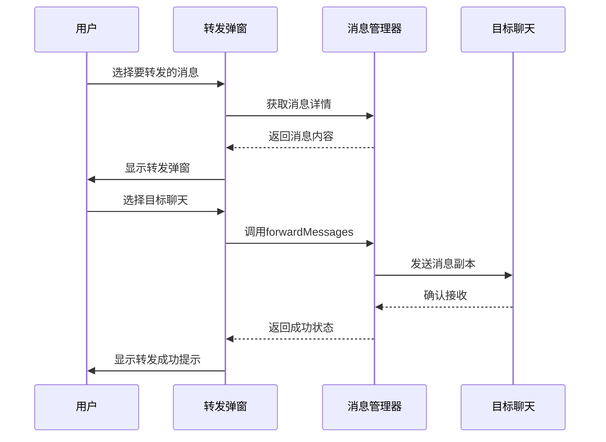
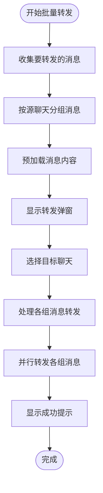
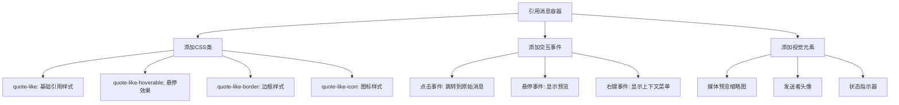
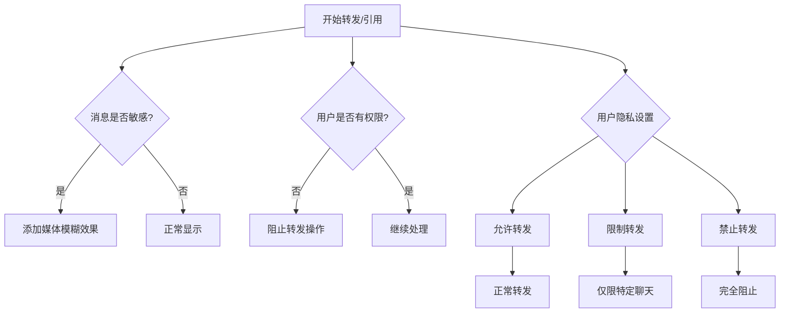

# 消息转发与引用

<cite>
**本文档中引用的文件**
- [forward.ts](file://src/components/popups/forward.ts)
- [reply.ts](file://src/components/wrappers/reply.ts)
- [replyContainer.ts](file://src/components/chat/replyContainer.ts)
- [replies.ts](file://src/components/chat/replies.ts)
- [adminLogsResolver/reply.tsx](file://src/components/chat/bubbleParts/adminLogsResolver/reply.tsx)
</cite>

## 目录
1. [简介](#简介)
2. [核心组件](#核心组件)
3. [消息转发实现](#消息转发实现)
4. [消息引用实现](#消息引用实现)
5. [批量转发机制](#批量转发机制)
6. [元数据处理与来源标识](#元数据处理与来源标识)
7. [显示样式与交互行为](#显示样式与交互行为)
8. [隐私控制](#隐私控制)
9. [性能考虑](#性能考虑)
10. [使用示例与最佳实践](#使用示例与最佳实践)

## 简介
本文件详细说明了Telegram Web客户端中消息转发与引用功能的实现细节。文档涵盖了`forwardMessages`、`quoteMessage`等API的实现机制，包括消息内容提取、引用链构建、隐私控制、元数据处理和来源标识等方面。同时描述了引用消息的显示样式和交互行为，以及批量转发的实现机制和性能优化策略。

## 核心组件

消息转发与引用功能主要由以下几个核心组件构成：
- `PopupForward`：负责实现消息转发弹窗功能
- `wrapReply`：用于包装和渲染引用消息
- `ReplyContainer`：引用消息的容器组件
- `replies.ts`：处理回复统计和显示
- `adminLogsResolver/reply.tsx`：管理员日志中的回复处理

这些组件协同工作，实现了完整的消息转发与引用功能体系。

**本节来源**
- [forward.ts](file://src/components/popups/forward.ts#L17-L142)
- [reply.ts](file://src/components/wrappers/reply.ts#L33-L123)
- [replyContainer.ts](file://src/components/chat/replyContainer.ts#L202-L234)
- [replies.ts](file://src/components/chat/replies.ts#L30-L157)
- [adminLogsResolver/reply.tsx](file://src/components/chat/bubbleParts/adminLogsResolver/reply.tsx#L7-L35)

## 消息转发实现

消息转发功能通过`PopupForward`类实现，该类继承自`PopupPickUser`，提供了选择目标聊天并转发消息的完整流程。转发操作的核心是调用`appMessagesManager.forwardMessages`方法，该方法接受源消息的`peerId`和`mid`信息，以及目标聊天的`peerId`。

在转发过程中，系统会根据消息内容自动判断所需权限，包括：
- `send_plain`：普通文本消息
- `send_photos`：包含图片的消息
- `send_videos`：包含视频的消息
- `send_audios`：包含音频的消息
- `send_docs`：包含文档的消息
- `embed_links`：包含网页链接的消息

转发功能还支持将消息转发到"已保存的消息"（Saved Messages），当目标`peerId`为当前用户ID时，系统会直接调用`forwardMessages`方法进行本地保存。



**图示来源**
- [forward.ts](file://src/components/popups/forward.ts#L39-L43)
- [forward.ts](file://src/components/popups/forward.ts#L87-L137)

**本节来源**
- [forward.ts](file://src/components/popups/forward.ts#L17-L142)

## 消息引用实现

消息引用功能通过`wrapReply`函数和`ReplyContainer`类实现。引用消息包含三个主要部分：发送者标题、原始消息内容和媒体预览。

引用消息的构建过程如下：
1. 创建`ReplyContainer`实例作为容器
2. 调用`wrapReplyDivAndCaption`函数填充内容
3. 根据消息类型设置相应的样式和交互

引用消息支持多种内容类型，包括文本、图片、视频、音频、文档和链接。对于包含敏感内容的消息，系统会添加媒体模糊效果以保护用户隐私。

```mermaid
classDiagram
class ReplyContainer {
+mediaEl : HTMLElement
+title : HTMLElement
+subtitle : HTMLElement
+content : HTMLElement
+fill(options) : Promise
}
class wrapReply {
+options : WrapReplyOptions
+return : {container : HTMLElement, fillPromise : Promise}
}
class wrapReplyDivAndCaption {
+titleEl : HTMLElement
+subtitleEl : HTMLElement
+mediaEl : HTMLElement
+message : Message
+return : boolean
}
ReplyContainer --> wrapReplyDivAndCaption : "调用"
wrapReply --> ReplyContainer : "使用"
```

**图示来源**
- [reply.ts](file://src/components/wrappers/reply.ts#L33-L123)
- [replyContainer.ts](file://src/components/chat/replyContainer.ts#L202-L234)
- [replyContainer.ts](file://src/components/chat/replyContainer.ts#L29-L200)

**本节来源**
- [reply.ts](file://src/components/wrappers/reply.ts#L21-L123)
- [replyContainer.ts](file://src/components/chat/replyContainer.ts#L29-L200)

## 批量转发机制

批量转发功能允许用户同时转发多条消息到目标聊天。系统通过`peerIdMids`对象管理批量转发的数据结构，该对象以源聊天的`peerId`为键，对应的消息ID数组为值。

批量转发的实现流程：
1. 收集所有要转发的消息，按源聊天分组
2. 为每组消息创建转发请求
3. 并行处理各组消息的转发操作
4. 显示统一的成功提示

系统在创建转发弹窗时会预加载所有相关消息，确保转发界面能够正确显示消息内容和统计信息。这种预加载机制提高了用户体验，避免了在转发过程中出现内容加载延迟。



**图示来源**
- [forward.ts](file://src/components/popups/forward.ts#L78-L85)
- [forward.ts](file://src/components/popups/forward.ts#L36-L44)

**本节来源**
- [forward.ts](file://src/components/popups/forward.ts#L19-L20)
- [forward.ts](file://src/components/popups/forward.ts#L76-L141)

## 元数据处理与来源标识

转发消息的元数据处理是确保消息可追溯性的关键。系统在转发消息时会保留原始消息的关键元数据，同时添加转发相关的标识信息。

元数据处理包括：
- 保留原始消息的发送时间
- 记录原始发送者的身份信息
- 添加"已转发"标识
- 维护引用链关系

来源标识通过视觉元素和结构化数据实现：
- 在消息顶部显示原始发送者名称
- 使用特殊的引用边框样式
- 添加媒体预览缩略图
- 在消息详情中显示完整的转发路径

对于引用消息，系统使用`MessageReplyHeader`结构存储引用信息，包括被引用消息的`peerId`和`mid`，以及可选的引用文本片段。

**本节来源**
- [reply.ts](file://src/components/wrappers/reply.ts#L28-L29)
- [replyContainer.ts](file://src/components/chat/replyContainer.ts#L64-L71)
- [replyContainer.ts](file://src/components/chat/replyContainer.ts#L41-L42)

## 显示样式与交互行为

引用消息的显示样式经过精心设计，以确保良好的可读性和用户体验。主要样式特征包括：

- **布局结构**：左侧显示媒体预览，右侧显示文本内容
- **视觉层次**：使用不同的字体大小和颜色区分标题和内容
- **交互反馈**：添加悬停效果和涟漪动画
- **响应式设计**：适配不同屏幕尺寸和设备类型

引用消息支持以下交互行为：
- 点击引用区域跳转到原始消息
- 悬停显示完整消息预览
- 右键菜单提供更多操作选项
- 触摸设备上的长按操作

系统使用`ripple`函数为引用容器添加涟漪动画效果，增强交互的视觉反馈。同时，通过CSS类控制不同的显示状态，如`quote-like`、`quote-like-hoverable`和`quote-like-border`。



**图示来源**
- [reply.ts](file://src/components/wrappers/reply.ts#L37-L46)
- [reply.ts](file://src/components/wrappers/reply.ts#L41)
- [replyContainer.ts](file://src/components/chat/replyContainer.ts#L209-L210)

**本节来源**
- [reply.ts](file://src/components/wrappers/reply.ts#L37-L50)
- [replyContainer.ts](file://src/components/chat/replyContainer.ts#L209-L210)

## 隐私控制

消息转发与引用功能内置了多层次的隐私控制机制，以保护用户的信息安全和隐私权益。

隐私控制措施包括：
- **敏感内容保护**：对包含敏感信息的消息添加模糊效果
- **权限检查**：在转发前检查目标聊天的权限设置
- **用户控制**：允许用户设置消息转发的隐私选项
- **内容过滤**：阻止转发受限制的内容类型

系统通过`isMessageSensitive`函数检测消息的敏感性，对于标记为敏感的消息，在引用时会自动添加媒体模糊层。此外，转发功能会尊重聊天的权限设置，如果用户没有在目标聊天中发送特定类型内容的权限，相关消息将无法被转发。



**图示来源**
- [replyContainer.ts](file://src/components/chat/replyContainer.ts#L138-L148)
- [replyContainer.ts](file://src/components/chat/replyContainer.ts#L214)
- [forward.ts](file://src/components/popups/forward.ts#L57-L58)

**本节来源**
- [replyContainer.ts](file://src/components/chat/replyContainer.ts#L25)
- [replyContainer.ts](file://src/components/chat/replyContainer.ts#L138-L148)
- [forward.ts](file://src/components/popups/forward.ts#L21-L22)

## 性能考虑

消息转发与引用功能在设计时充分考虑了性能优化，确保在各种使用场景下都能提供流畅的用户体验。

主要性能优化策略包括：
- **懒加载**：使用`LazyLoadQueue`管理媒体资源的加载
- **预加载**：在显示转发弹窗前预加载消息内容
- **异步处理**：将耗时操作放在异步队列中执行
- **资源复用**：缓存已加载的媒体资源
- **批量操作**：合并多个小的DOM操作

系统使用`loadPromises`数组跟踪所有异步加载任务，确保在所有资源加载完成后再进行界面更新。同时，通过`middleware`机制实现组件生命周期的精细控制，避免不必要的重绘和重排。

对于包含大量消息的批量转发操作，系统采用分组处理策略，避免一次性处理过多消息导致界面卡顿。每个消息组的处理都是独立的，可以并行执行，提高了整体处理效率。

**本节来源**
- [replyContainer.ts](file://src/components/chat/replyContainer.ts#L40)
- [replyContainer.ts](file://src/components/chat/replyContainer.ts#L46)
- [replyContainer.ts](file://src/components/chat/replyContainer.ts#L190-L197)
- [replies.ts](file://src/components/chat/replies.ts#L33)

## 使用示例与最佳实践

### 基本转发示例
```typescript
// 创建转发弹窗
PopupForward.create({
  [fromPeerId]: [mid1, mid2, mid3]
}, async (peerId) => {
  // 转发完成后的回调
  console.log('消息已转发到:', peerId);
});
```

### 引用消息示例
```typescript
// 包装引用消息
const {container, fillPromise} = wrapReply({
  title: '原始发送者',
  text: '这是被引用的消息内容',
  entities: messageEntities,
  setColorPeerId: peerId,
  isQuote: true
});
```

### 最佳实践指南
1. **批量转发**：尽量使用批量转发功能，减少多次单独转发的操作
2. **权限检查**：在转发前确认目标聊天的权限设置，避免操作失败
3. **敏感内容**：注意转发包含敏感信息的消息，尊重他人隐私
4. **引用长度**：保持引用内容简洁，避免过长的引用影响阅读体验
5. **性能优化**：对于大量消息的转发，考虑分批处理以保持界面流畅

**本节来源**
- [forward.ts](file://src/components/popups/forward.ts#L76-L141)
- [reply.ts](file://src/components/wrappers/reply.ts#L33-L123)