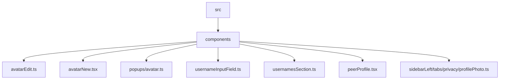
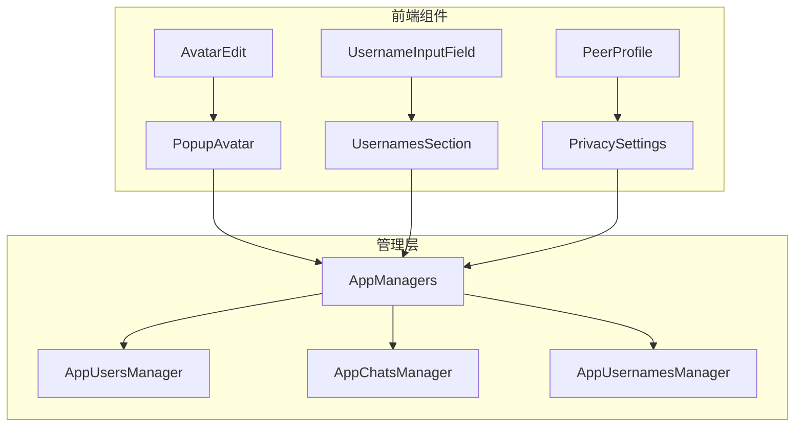
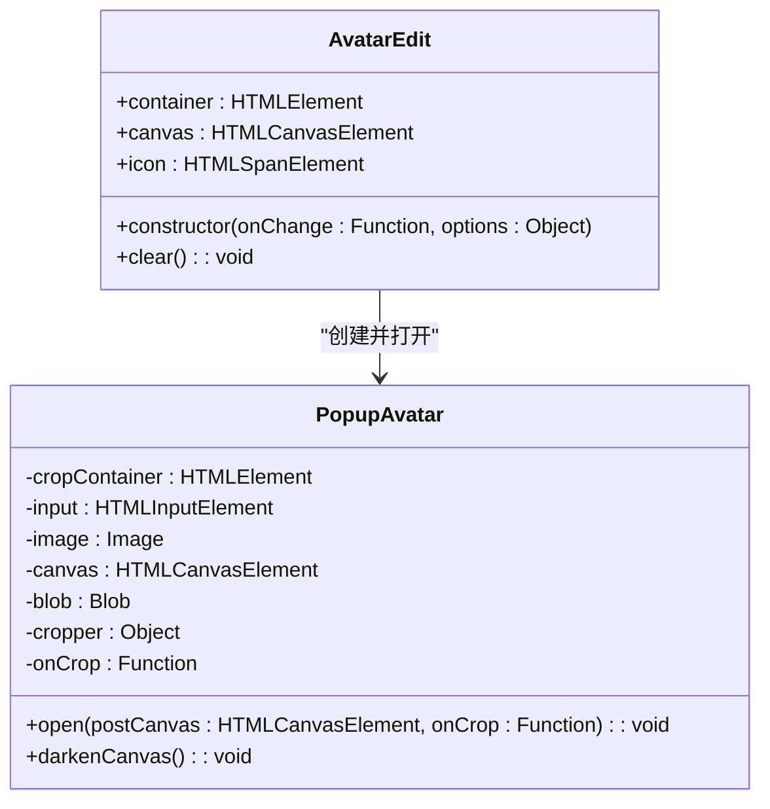
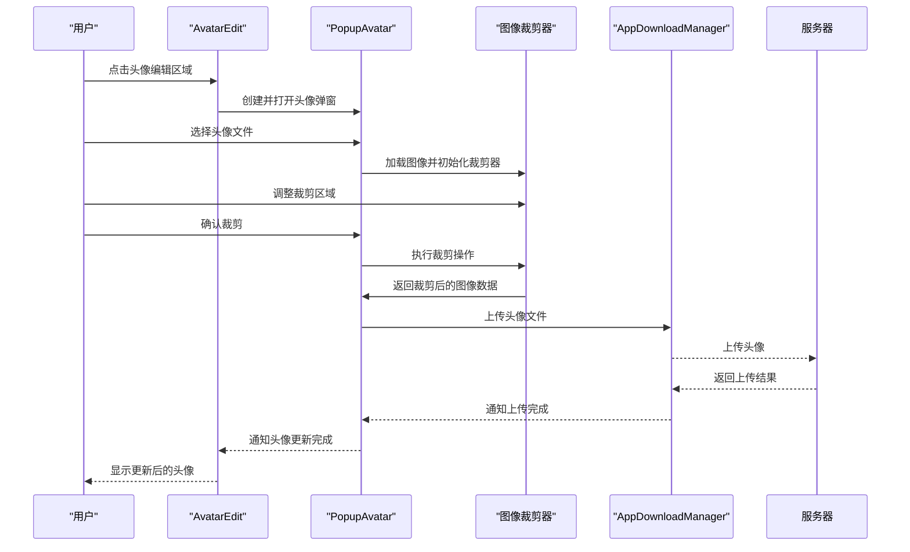
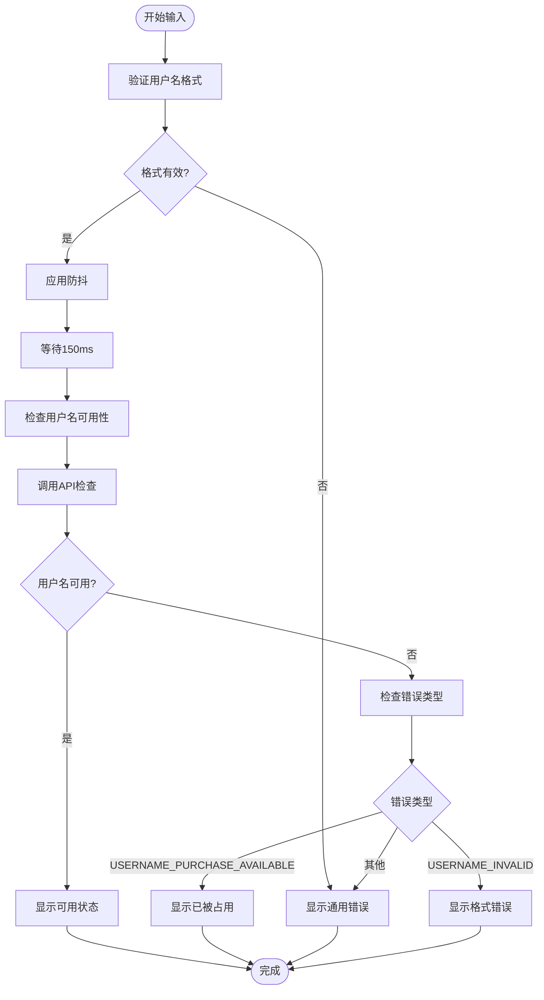
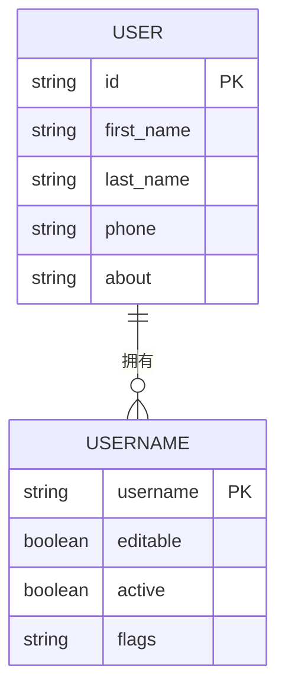
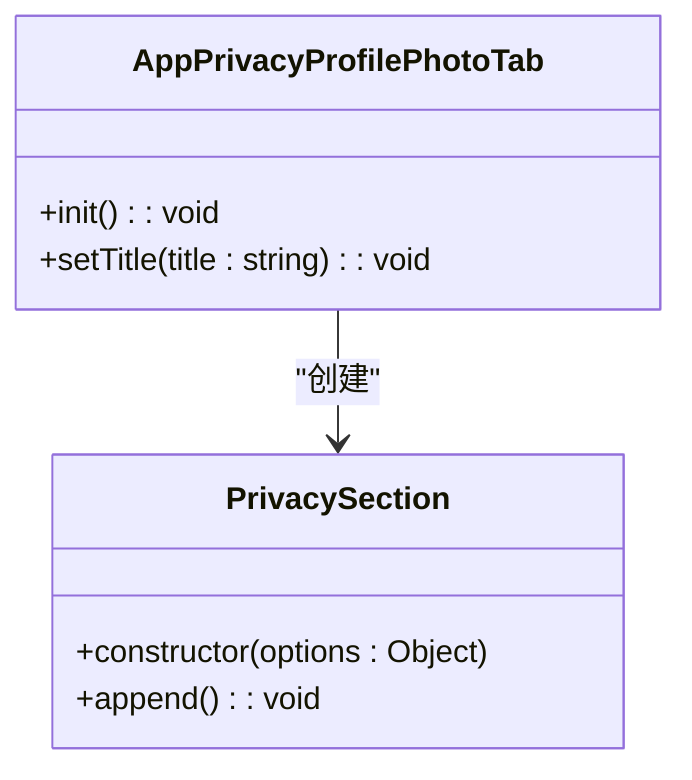
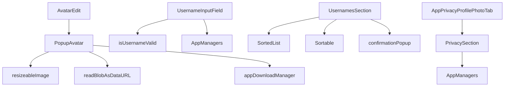

# 个人资料

<cite>
**本文档中引用的文件**  
- [avatarEdit.ts](file://src/components/avatarEdit.ts)
- [avatarNew.tsx](file://src/components/avatarNew.tsx)
- [avatar.ts](file://src/components/popups/avatar.ts)
- [usernameInputField.ts](file://src/components/usernameInputField.ts)
- [usernamesSection.ts](file://src/components/usernamesSection.ts)
- [profilePhoto.ts](file://src/components/sidebarLeft/tabs/privacy/profilePhoto.ts)
- [peerProfile.tsx](file://src/components/peerProfile.tsx)
</cite>

## 目录
1. [简介](#简介)
2. [项目结构](#项目结构)
3. [核心组件](#核心组件)
4. [架构概述](#架构概述)
5. [详细组件分析](#详细组件分析)
6. [依赖分析](#依赖分析)
7. [性能考虑](#性能考虑)
8. [故障排除指南](#故障排除指南)
9. [结论](#结论)

## 简介
本文档全面记录了Telegram Web客户端中个人资料管理功能的实现细节，重点涵盖用户昵称、头像、简介等个人资料的读取和修改接口。文档详细描述了个人资料数据模型和验证规则，说明了头像上传、裁剪和存储的技术实现，解释了昵称和用户名的唯一性保证机制，并提供了个人资料更新的安全验证流程和错误处理指南。此外，还包含了资料可见性设置和自定义字段管理的功能说明。

## 项目结构
项目结构清晰地组织了个人资料管理相关的组件和功能模块。核心的个人资料管理功能主要集中在`src/components`目录下，包括头像编辑、用户名输入、个人资料展示等关键组件。

**图表来源**
- [avatarEdit.ts](file://src/components/avatarEdit.ts)
- [avatarNew.tsx](file://src/components/avatarNew.tsx)
- [avatar.ts](file://src/components/popups/avatar.ts)

**章节来源**
- [avatarEdit.ts](file://src/components/avatarEdit.ts)
- [avatarNew.tsx](file://src/components/avatarNew.tsx)

## 核心组件
个人资料管理的核心组件包括头像编辑、用户名管理和个人资料展示。这些组件协同工作，为用户提供完整的个人资料管理体验。

**章节来源**
- [avatarEdit.ts](file://src/components/avatarEdit.ts)
- [usernameInputField.ts](file://src/components/usernameInputField.ts)
- [usernamesSection.ts](file://src/components/usernamesSection.ts)

## 架构概述
个人资料管理系统的架构基于事件驱动和组件化设计原则。系统通过`rootScope`事件总线协调各个组件之间的通信，确保个人资料的更新能够及时反映在用户界面中。

**图表来源**
- [avatarEdit.ts](file://src/components/avatarEdit.ts)
- [usernameInputField.ts](file://src/components/usernameInputField.ts)
- [usernamesSection.ts](file://src/components/usernamesSection.ts)

## 详细组件分析

### 头像管理组件分析
头像管理组件负责处理用户头像的显示、编辑和上传功能。`AvatarEdit`类提供了一个可点击的头像编辑容器，用户点击后会弹出`PopupAvatar`对话框进行头像上传和裁剪。

#### 类图

**图表来源**
- [avatarEdit.ts](file://src/components/avatarEdit.ts#L14-L39)
- [avatar.ts](file://src/components/popups/avatar.ts#L16-L118)

#### 头像上传流程序列图

**图表来源**
- [avatarEdit.ts](file://src/components/avatarEdit.ts#L30-L32)
- [avatar.ts](file://src/components/popups/avatar.ts#L106-L111)
- [avatar.ts](file://src/components/popups/avatar.ts#L101-L103)

**章节来源**
- [avatarEdit.ts](file://src/components/avatarEdit.ts#L1-L40)
- [avatar.ts](file://src/components/popups/avatar.ts#L1-L119)

### 用户名管理组件分析
用户名管理组件负责处理用户名的输入验证、唯一性检查和状态管理。`UsernameInputField`类扩展了基础输入框功能，添加了用户名特有的验证逻辑。

#### 用户名验证流程图

**图表来源**
- [usernameInputField.ts](file://src/components/usernameInputField.ts#L34-L114)

#### 用户名数据模型

**图表来源**
- [usernameInputField.ts](file://src/components/usernameInputField.ts#L11-L12)
- [usernamesSection.ts](file://src/components/usernamesSection.ts#L16-L17)

**章节来源**
- [usernameInputField.ts](file://src/components/usernameInputField.ts#L1-L118)
- [usernamesSection.ts](file://src/components/usernamesSection.ts#L1-L243)

### 个人资料隐私设置分析
个人资料隐私设置组件允许用户控制个人资料的可见性。`AppPrivacyProfilePhotoTab`类实现了头像可见性的隐私设置功能。

**图表来源**
- [profilePhoto.ts](file://src/components/sidebarLeft/tabs/privacy/profilePhoto.ts#L12-L29)

**章节来源**
- [profilePhoto.ts](file://src/components/sidebarLeft/tabs/privacy/profilePhoto.ts#L1-L30)

## 依赖分析
个人资料管理功能依赖于多个核心管理层和工具类，形成了一个完整的依赖网络。

**图表来源**
- [avatarEdit.ts](file://src/components/avatarEdit.ts)
- [avatar.ts](file://src/components/popups/avatar.ts)
- [usernameInputField.ts](file://src/components/usernameInputField.ts)
- [usernamesSection.ts](file://src/components/usernamesSection.ts)
- [profilePhoto.ts](file://src/components/sidebarLeft/tabs/privacy/profilePhoto.ts)

**章节来源**
- [avatarEdit.ts](file://src/components/avatarEdit.ts)
- [avatar.ts](file://src/components/popups/avatar.ts)
- [usernameInputField.ts](file://src/components/usernameInputField.ts)
- [usernamesSection.ts](file://src/components/usernamesSection.ts)
- [profilePhoto.ts](file://src/components/sidebarLeft/tabs/privacy/profilePhoto.ts)

## 性能考虑
个人资料管理功能在性能方面进行了多项优化，包括：

1. **防抖机制**：用户名检查使用150ms的防抖，避免频繁的API调用
2. **懒加载**：头像组件支持懒加载队列，优化页面加载性能
3. **缓存机制**：头像加载结果会被缓存，避免重复加载
4. **事件委托**：使用事件委托减少事件监听器的数量

这些优化措施确保了个人资料管理功能在各种网络条件下的流畅体验。

## 故障排除指南
以下是个人资料管理功能的常见问题及解决方案：

1. **头像上传失败**
   - 检查网络连接
   - 确认文件大小和格式符合要求
   - 查看浏览器控制台是否有错误信息

2. **用户名验证无响应**
   - 检查API服务是否正常
   - 确认防抖时间设置是否合理
   - 查看是否有跨域问题

3. **头像显示异常**
   - 清除浏览器缓存
   - 检查头像URL是否正确
   - 确认图像裁剪参数是否合理

**章节来源**
- [avatar.ts](file://src/components/popups/avatar.ts#L83-L87)
- [usernameInputField.ts](file://src/components/usernameInputField.ts#L88-L103)

## 结论
Telegram Web客户端的个人资料管理功能通过模块化设计和事件驱动架构，实现了高效、可靠的用户体验。系统通过清晰的组件划分和合理的依赖管理，确保了代码的可维护性和扩展性。未来可以进一步优化头像上传的用户体验，增加更多的图像处理功能，并完善错误处理机制。