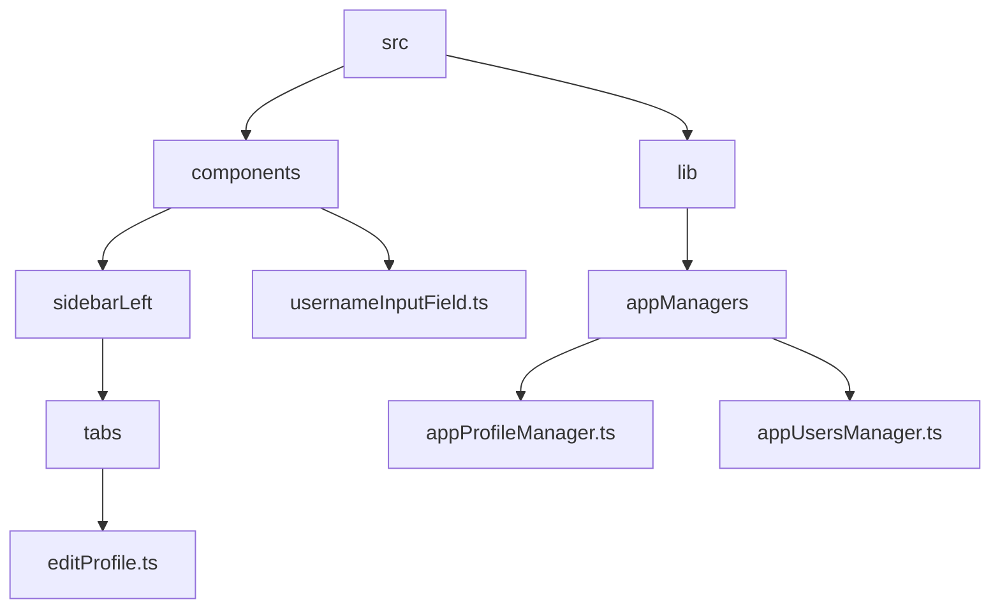
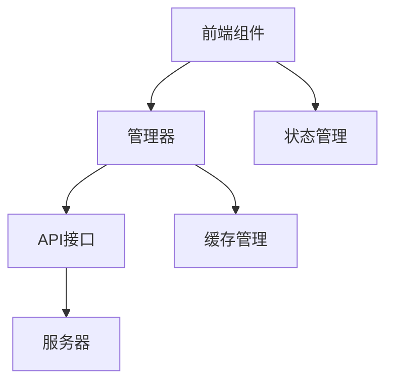
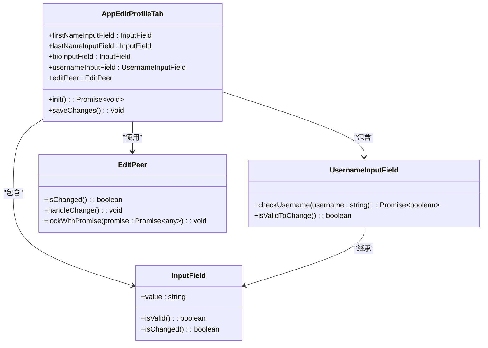
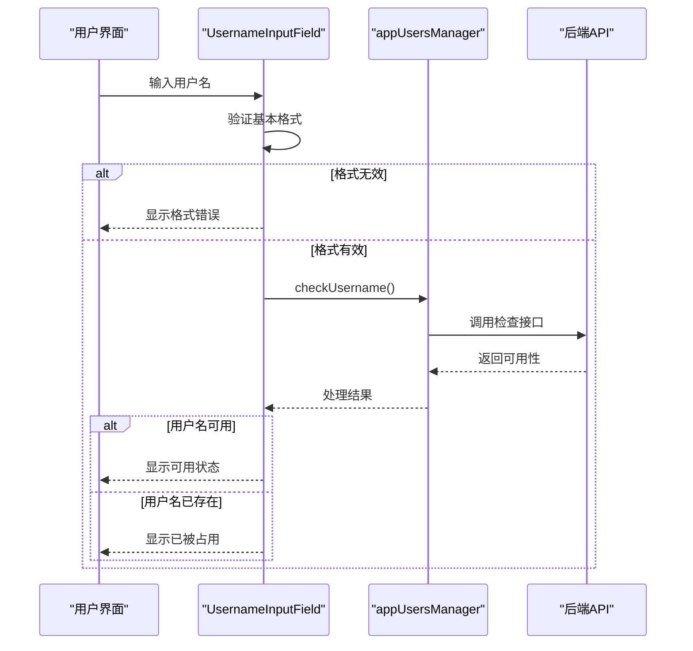
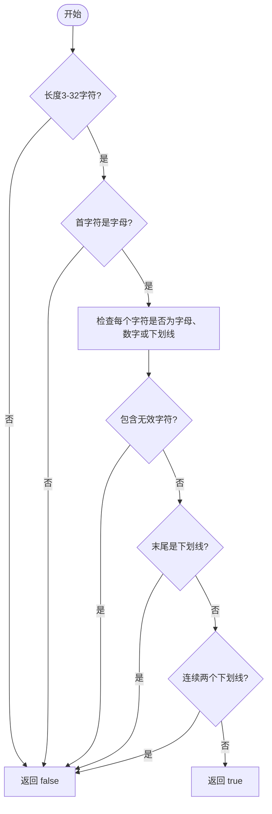
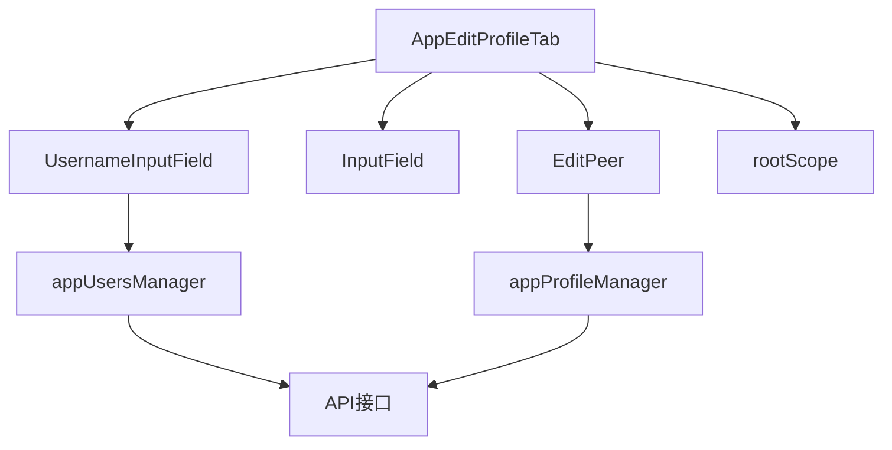

# 基本信息管理

<cite>
**本文档引用的文件**  
- [editProfile.ts](file://src/components/sidebarLeft/tabs/editProfile.ts)
- [usernameInputField.ts](file://src/components/usernameInputField.ts)
- [appProfileManager.ts](file://src/lib/appManagers/appProfileManager.ts)
- [appUsersManager.ts](file://src/lib/appManagers/appUsersManager.ts)
- [validators.ts](file://src/lib/richTextProcessor/validators.ts)
- [inputField.ts](file://src/components/inputField.ts)
- [peerProfile.tsx](file://src/components/peerProfile.tsx)
- [formatUserPhone.ts](file://src/components/wrappers/formatUserPhone.ts)
</cite>

## 目录
1. [简介](#简介)
2. [项目结构](#项目结构)
3. [核心组件](#核心组件)
4. [架构概述](#架构概述)
5. [详细组件分析](#详细组件分析)
6. [依赖分析](#依赖分析)
7. [性能考虑](#性能考虑)
8. [故障排除指南](#故障排除指南)
9. [结论](#结论)

## 简介
本文档全面记录了Telegram Web客户端中个人资料基本信息管理功能的实现。重点描述了用户昵称、简介、电话号码等基本信息的读取和修改接口，详细说明了数据模型、字段类型、验证规则以及安全验证流程。

## 项目结构
项目结构显示了个人信息管理功能主要分布在`src/components/sidebarLeft/tabs/`目录下的`editProfile.ts`文件中，相关的输入验证组件位于`src/components/`目录，而核心的用户数据管理逻辑则在`src/lib/appManagers/`目录下。

**图表来源**
- [editProfile.ts](file://src/components/sidebarLeft/tabs/editProfile.ts)
- [usernameInputField.ts](file://src/components/usernameInputField.ts)
- [appProfileManager.ts](file://src/lib/appManagers/appProfileManager.ts)
- [appUsersManager.ts](file://src/lib/appManagers/appUsersManager.ts)

**章节来源**
- [editProfile.ts](file://src/components/sidebarLeft/tabs/editProfile.ts)
- [usernameInputField.ts](file://src/components/usernameInputField.ts)

## 核心组件
核心组件包括`AppEditProfileTab`类，负责管理用户个人资料的编辑界面，以及`UsernameInputField`类，专门处理用户名的输入验证。这些组件通过`appProfileManager`和`appUsersManager`与后端API进行交互，实现数据的读取和更新。

**章节来源**
- [editProfile.ts](file://src/components/sidebarLeft/tabs/editProfile.ts#L48-L251)
- [usernameInputField.ts](file://src/components/usernameInputField.ts#L14-L117)

## 架构概述
系统架构采用分层设计，前端组件负责用户界面展示和交互，通过中间层的管理器（Managers）与后端API进行通信。`appProfileManager`和`appUsersManager`作为核心业务逻辑层，封装了与用户资料相关的所有操作。

**图表来源**
- [appProfileManager.ts](file://src/lib/appManagers/appProfileManager.ts#L698-L710)
- [appUsersManager.ts](file://src/lib/appManagers/appUsersManager.ts#L553-L574)

## 详细组件分析

### AppEditProfileTab 分析
`AppEditProfileTab`是用户编辑个人资料的主要界面组件，它集成了姓名、简介、用户名和头像的编辑功能。

#### 类图

**图表来源**
- [editProfile.ts](file://src/components/sidebarLeft/tabs/editProfile.ts#L48-L251)
- [inputField.ts](file://src/components/inputField.ts)
- [usernameInputField.ts](file://src/components/usernameInputField.ts#L14-L117)
- [editPeer.ts](file://src/components/editPeer.ts#L102-L129)

### 用户名验证流程分析
用户名验证是一个关键的安全功能，确保用户名的唯一性和格式正确性。

#### 序列图

**图表来源**
- [usernameInputField.ts](file://src/components/usernameInputField.ts#L69-L114)
- [appUsersManager.ts](file://src/lib/appManagers/appUsersManager.ts#L528-L534)

### 数据模型与验证规则
个人信息的数据模型和验证规则是确保数据质量和安全性的基础。

#### 数据模型表
| 字段 | 类型 | 最大长度 | 验证规则 | 必填 |
|------|------|----------|----------|------|
| 姓名 | 字符串 | 70 | 仅允许字母和空格 | 是 |
| 姓氏 | 字符串 | 64 | 仅允许字母和空格 | 否 |
| 简介 | 字符串 | 动态 | 由API限制决定 | 否 |
| 用户名 | 字符串 | 32 | 仅允许字母、数字和下划线，首字符必须是字母 | 否 |

**图表来源**
- [editProfile.ts](file://src/components/sidebarLeft/tabs/editProfile.ts#L83-L93)
- [validators.ts](file://src/lib/richTextProcessor/validators.ts#L2-L29)

#### 用户名验证算法流程图

**图表来源**
- [validators.ts](file://src/lib/richTextProcessor/validators.ts#L2-L29)

## 依赖分析
个人信息管理功能依赖于多个核心组件和管理器，形成了清晰的依赖关系。

**图表来源**
- [editProfile.ts](file://src/components/sidebarLeft/tabs/editProfile.ts)
- [usernameInputField.ts](file://src/components/usernameInputField.ts)
- [appProfileManager.ts](file://src/lib/appManagers/appProfileManager.ts)
- [appUsersManager.ts](file://src/lib/appManagers/appUsersManager.ts)

**章节来源**
- [editProfile.ts](file://src/components/sidebarLeft/tabs/editProfile.ts#L7-11)
- [usernameInputField.ts](file://src/components/usernameInputField.ts#L7-12)

## 性能考虑
在实现个人信息管理功能时，需要考虑以下性能因素：
- 使用防抖（debounce）技术避免频繁的用户名可用性检查
- 合理使用Promise.race来并行处理多个更新操作
- 缓存用户数据以减少不必要的API调用

## 故障排除指南
### 常见错误及解决方案
| 错误类型 | 可能原因 | 解决方案 |
|---------|--------|---------|
| 网络错误 | 网络连接不稳定 | 检查网络连接，重试操作 |
| 验证失败 | 输入数据不符合规则 | 检查输入格式，确保符合验证规则 |
| 权限不足 | 用户没有修改权限 | 确认用户身份和权限 |
| 用户名冲突 | 用户名已被占用 | 尝试其他用户名或购买可用用户名 |

**章节来源**
- [appProfileManager.ts](file://src/lib/appManagers/appProfileManager.ts#L698-L710)
- [appUsersManager.ts](file://src/lib/appManagers/appUsersManager.ts#L528-L534)

## 结论
本文档详细记录了Telegram Web客户端中个人信息管理功能的实现细节。通过分析核心组件、数据模型和验证规则，为开发者提供了全面的技术参考。该功能设计合理，具有良好的可维护性和扩展性。