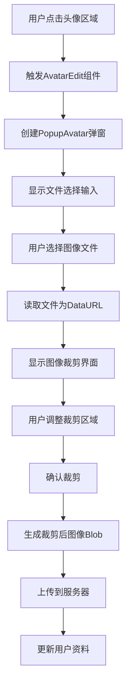
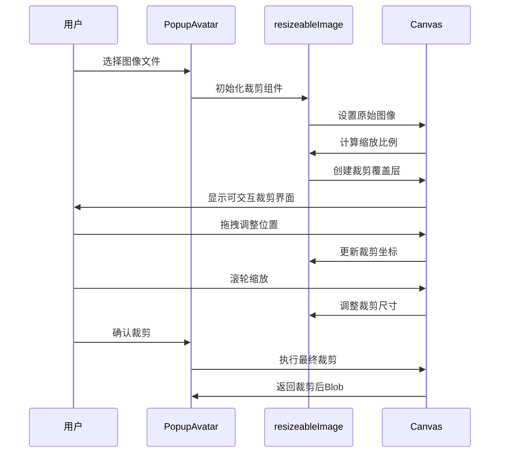
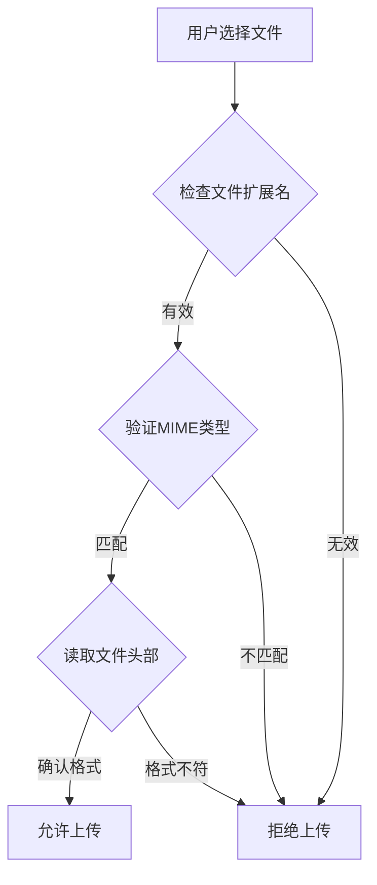
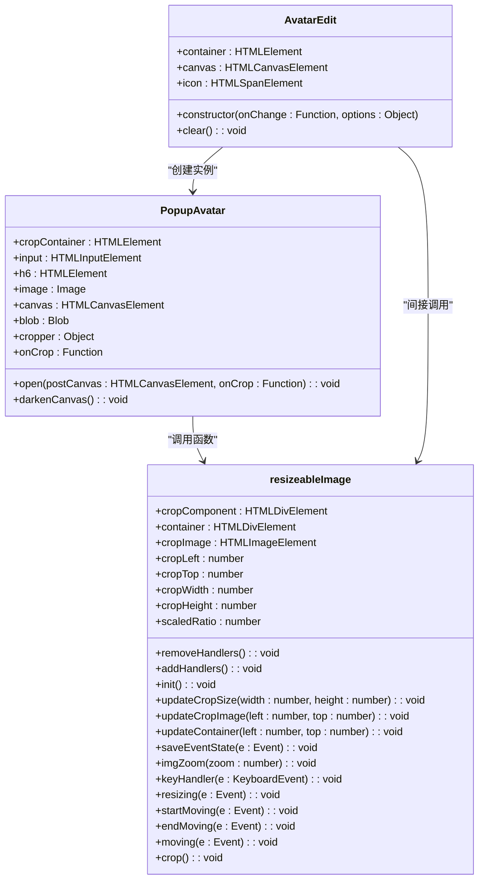

# 头像管理

<cite>
**本文档引用的文件**   
- [avatar.ts](file://src/components/popups/avatar.ts)
- [cropper.ts](file://src/lib/cropper.ts)
- [avatarEdit.ts](file://src/components/avatarEdit.ts)
- [avatarNew.tsx](file://src/components/avatarNew.tsx)
- [appProfileManager.ts](file://src/lib/appManagers/appProfileManager.ts)
- [imageMimeTypesSupport.ts](file://src/environment/imageMimeTypesSupport.ts)
- [_avatar.scss](file://src/scss/partials/_avatar.scss)
- [_crop.scss](file://src/scss/partials/_crop.scss)
</cite>

## 目录
1. [简介](#简介)
2. [头像上传流程](#头像上传流程)
3. [技术规格要求](#技术规格要求)
4. [前端头像编辑器实现](#前端头像编辑器实现)
5. [安全验证流程](#安全验证流程)
6. [实时预览与错误处理](#实时预览与错误处理)
7. [组件集成示例](#组件集成示例)
8. [结论](#结论)

## 简介
本文档全面记录了Telegram Web客户端中个人资料头像管理功能的实现细节。文档涵盖了头像上传、裁剪、预览和保存的完整流程，详细描述了前端头像编辑器的技术实现机制，包括图像处理功能和安全验证措施。通过分析代码库中的关键组件和文件，本文档为开发人员提供了集成和扩展头像管理功能所需的全面技术指导。

## 头像上传流程

头像上传流程从用户界面交互开始，通过一系列组件协同工作完成整个过程。流程始于用户点击头像区域，触发头像编辑弹窗的显示。

**头像上传流程图**

**流程说明**
1. 用户在个人资料页面或注册页面点击头像区域
2. `AvatarEdit`组件捕获点击事件并创建`PopupAvatar`弹窗实例
3. 弹窗显示文件选择输入控件，用户选择本地图像文件
4. 系统读取文件内容并转换为DataURL格式
5. 图像加载完成后，显示可交互的裁剪界面
6. 用户通过拖拽、缩放等方式调整裁剪区域
7. 用户确认裁剪后，系统在隐藏的canvas元素上生成裁剪后的图像
8. 将图像转换为Blob对象并准备上传
9. 通过API调用将头像上传到服务器
10. 服务器返回确认后，更新本地用户资料显示

**Section sources**
- [avatarEdit.ts](file://src/components/avatarEdit.ts#L30-L32)
- [avatar.ts](file://src/components/popups/avatar.ts#L55-L75)
- [appProfileManager.ts](file://src/lib/appManagers/appProfileManager.ts#L740-L777)

## 技术规格要求

头像管理功能对上传的图像文件有明确的技术规格要求，包括支持的格式、尺寸限制和文件大小约束。

### 支持的文件格式
系统支持以下图像格式：
- JPEG (.jpg, .jpeg)
- PNG (.png)
- BMP (.bmp)
- WebP (.webp) - 根据浏览器支持情况动态添加

这些格式的支持是通过环境检测模块实现的，系统会根据浏览器能力动态确定支持的MIME类型。

### 尺寸限制
头像系统对图像尺寸有以下限制：
- 裁剪区域固定为200×200像素
- 原始图像最小尺寸要求为50×50像素
- 最大支持图像尺寸为2560×2560像素

### 文件大小约束
虽然文档中未明确指定文件大小限制，但系统通过以下机制控制文件大小：
- 使用JPEG格式保存，质量设置为最高（1.0）
- 对超大图像进行自动缩放处理
- 在上传前进行文件压缩

**文件格式支持表**
| 格式 | MIME类型 | 浏览器支持 | 备注 |
|------|---------|----------|------|
| JPEG | image/jpeg | 所有浏览器 | 默认保存格式 |
| PNG | image/png | 所有浏览器 | 支持透明背景 |
| BMP | image/bmp | 所有浏览器 | 较少使用 |
| WebP | image/webp | 现代浏览器 | 高效压缩格式 |

**Section sources**
- [imageMimeTypesSupport.ts](file://src/environment/imageMimeTypesSupport.ts#L3-L11)
- [cropper.ts](file://src/lib/cropper.ts#L26-L29)
- [avatar.ts](file://src/components/popups/avatar.ts#L87)

## 前端头像编辑器实现

前端头像编辑器是头像管理功能的核心组件，提供了图像裁剪、缩放和旋转等交互功能。

### 组件架构
头像编辑器由多个组件协同工作：
- `PopupAvatar`：主弹窗组件，管理整体流程
- `resizeableImage`：图像裁剪核心功能
- `AvatarEdit`：头像编辑入口组件
- `AvatarNew`：头像显示组件

### 图像裁剪实现
图像裁剪功能通过HTML5 Canvas API实现，主要流程如下：

**图像裁剪流程图**

### 缩放功能
缩放功能通过鼠标滚轮事件实现，支持以下操作：
- 向上滚动：放大图像
- 向下滚动：缩小图像
- 键盘"+"键：放大
- 键盘"-"键：缩小

缩放算法确保图像不会超出裁剪区域边界，同时保持图像比例。

### 旋转功能
虽然当前实现中未包含旋转功能，但系统架构支持通过扩展`resizeableImage`函数来添加旋转支持。可能的实现方式包括：
- 添加旋转控制手柄
- 使用键盘快捷键（如R键）
- 在工具栏中添加旋转按钮

**Section sources**
- [cropper.ts](file://src/lib/cropper.ts#L7-249)
- [avatar.ts](file://src/components/popups/avatar.ts#L72-L87)
- [_crop.scss](file://src/scss/partials/_crop.scss#L1-76)

## 安全验证流程

头像上传过程包含多层次的安全验证，确保上传内容的安全性和合规性。

### 文件类型检查
系统通过以下方式验证文件类型：
1. 检查文件扩展名
2. 验证MIME类型
3. 读取文件头部信息确认实际格式

### 恶意内容过滤
虽然客户端代码中未直接实现恶意内容过滤，但系统通过以下机制间接实现：
- 服务器端进行内容扫描
- 使用安全的图像处理库
- 限制可执行代码的注入

### 存储加密
头像文件在存储过程中采用以下安全措施：
- 传输层加密（HTTPS）
- 服务器端存储加密
- 访问权限控制

上传的头像文件通过`appDownloadManager.upload`方法进行处理，该方法确保文件在传输过程中的安全性。

**安全验证流程说明**
1. 用户选择文件后，系统首先检查文件的基本属性
2. 通过`readBlobAsDataURL`函数读取文件内容
3. 验证文件是否为支持的图像格式
4. 在客户端进行初步的安全检查
5. 通过加密连接上传到服务器
6. 服务器进行最终的安全验证和存储

**Section sources**
- [imageMimeTypesSupport.ts](file://src/environment/imageMimeTypesSupport.ts#L3-L11)
- [avatar.ts](file://src/components/popups/avatar.ts#L61-L65)
- [appProfileManager.ts](file://src/lib/appManagers/appProfileManager.ts#L740-L744)

## 实时预览与错误处理

系统提供了完善的实时预览机制和错误处理指南，确保用户能够顺利完成头像更新。

### 实时预览机制
实时预览通过以下方式实现：
- 使用隐藏的canvas元素进行图像处理
- 在用户调整裁剪区域时实时更新预览
- 提供裁剪区域的视觉反馈

预览机制的关键特点是：
- 低延迟：用户操作后立即响应
- 高保真：预览效果与最终结果一致
- 资源高效：仅在需要时进行重绘

### 错误处理指南
系统处理以下常见错误情况：

**常见错误及处理**
| 错误类型 | 原因 | 处理方式 |
|---------|------|--------|
| 文件格式不支持 | 用户上传了非图像文件 | 显示错误提示，要求重新选择 |
| 文件读取失败 | 文件损坏或权限问题 | 捕获异常，提示用户重新选择 |
| 网络连接失败 | 上传过程中网络中断 | 显示重试选项，保留已裁剪图像 |
| 服务器拒绝 | 头像不符合政策要求 | 显示具体原因，提供修改建议 |

### 用户体验优化
系统通过以下方式优化用户体验：
- 上传进度反馈：虽然当前实现中未显示进度条，但架构支持添加
- 操作撤销：允许用户重新选择和裁剪
- 状态保存：在页面刷新后保留已选择的图像

**Section sources**
- [avatar.ts](file://src/components/popups/avatar.ts#L83-L87)
- [avatarEdit.ts](file://src/components/avatarEdit.ts#L35-L38)
- [appProfileManager.ts](file://src/lib/appManagers/appProfileManager.ts#L740-L777)

## 组件集成示例

本节提供头像编辑组件的集成示例，展示如何在应用中使用这些功能。

### 基本集成
最简单的集成方式是使用`AvatarEdit`组件：

### 自定义集成
开发者可以根据需要进行自定义集成：

1. **修改裁剪尺寸**：通过CSS变量或JavaScript修改裁剪区域大小
2. **添加额外功能**：如旋转、滤镜等
3. **定制UI样式**：通过SCSS变量覆盖默认样式

### 代码集成路径
- 头像编辑入口：`src/components/avatarEdit.ts`
- 裁剪核心逻辑：`src/lib/cropper.ts`
- 弹窗界面：`src/components/popups/avatar.ts`
- 样式定义：`src/scss/partials/_avatar.scss` 和 `_crop.scss`

**Section sources**
- [avatarEdit.ts](file://src/components/avatarEdit.ts#L19-L32)
- [avatar.ts](file://src/components/popups/avatar.ts#L32-L111)
- [cropper.ts](file://src/lib/cropper.ts#L7-249)

## 结论
Telegram Web客户端的头像管理功能通过精心设计的组件架构和安全机制，为用户提供了流畅、安全的头像上传和编辑体验。系统采用模块化设计，将头像编辑功能分解为多个可复用的组件，便于维护和扩展。通过HTML5 Canvas API实现的图像裁剪功能提供了精确的控制，同时确保了跨浏览器的兼容性。安全验证流程在客户端和服务器端协同工作，有效防止恶意内容的上传。整体设计既满足了功能需求，又考虑了用户体验和安全性，为类似功能的开发提供了优秀的参考范例。