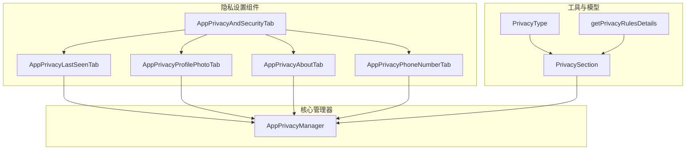
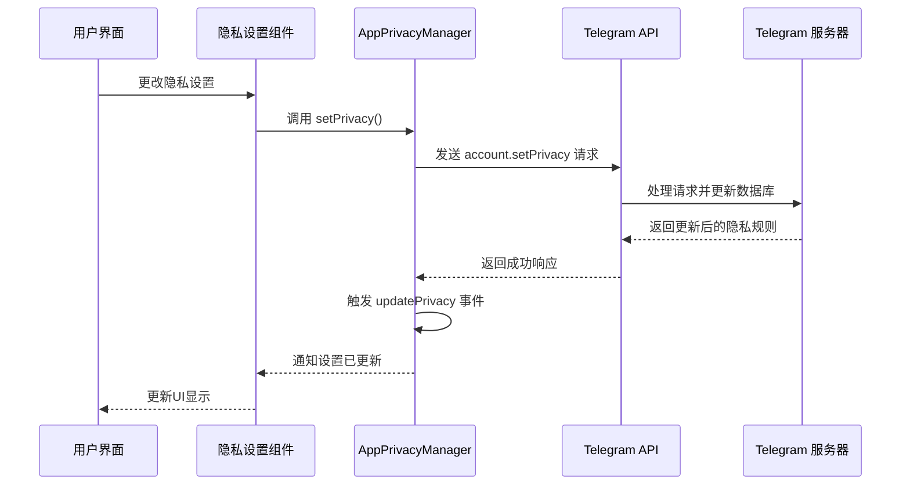
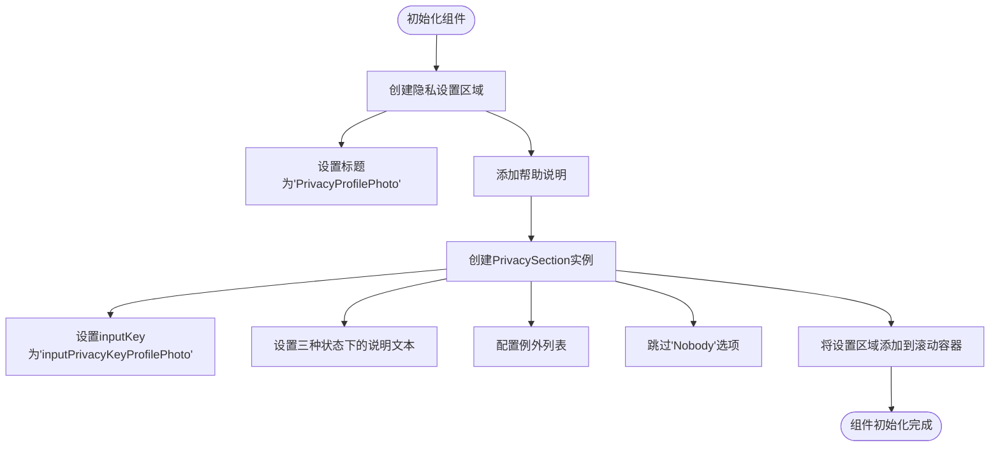
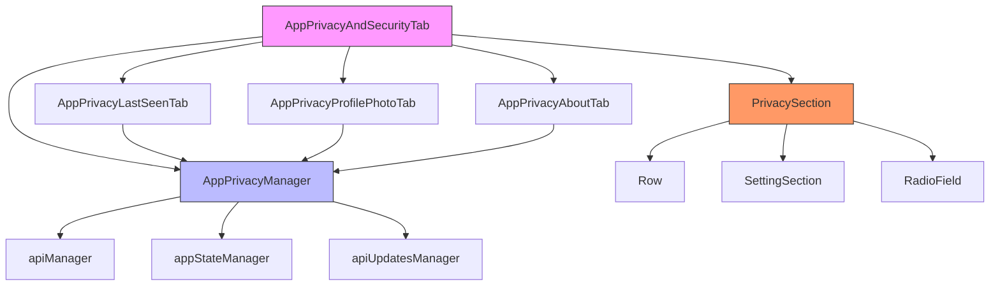

# 隐私设置

<cite>
**本文档中引用的文件**  
- [privacySection.ts](file://src/components/privacySection.ts)
- [appPrivacyManager.ts](file://src/lib/appManagers/appPrivacyManager.ts)
- [privacyType.ts](file://src/lib/appManagers/utils/privacy/privacyType.ts)
- [getPrivacyRulesDetails.ts](file://src/lib/appManagers/utils/privacy/getPrivacyRulesDetails.ts)
- [AppPrivacyLastSeenTab.ts](file://src/components/sidebarLeft/tabs/privacy/lastSeen.ts)
- [AppPrivacyProfilePhotoTab.ts](file://src/components/sidebarLeft/tabs/privacy/profilePhoto.ts)
- [AppPrivacyAboutTab.ts](file://src/components/sidebarLeft/tabs/privacy/about.ts)
- [AppPrivacyAndSecurityTab.ts](file://src/components/sidebarLeft/tabs/privacyAndSecurity.ts)
- [layer.d.ts](file://src/layer.d.ts)
</cite>

## 目录
1. [简介](#简介)
2. [项目结构](#项目结构)
3. [核心组件](#核心组件)
4. [架构概述](#架构概述)
5. [详细组件分析](#详细组件分析)
6. [依赖分析](#依赖分析)
7. [性能考虑](#性能考虑)
8. [故障排除指南](#故障排除指南)
9. [结论](#结论)
10. [附录](#附录)（如有必要）

## 简介
本文档全面记录了Telegram Web客户端中用户资料隐私设置功能的实现。重点涵盖用户资料可见性控制的各项设置，包括昵称、头像、在线状态和最后上线时间的隐私规则配置。文档详细描述了隐私设置的数据模型和存储机制，解释了不同隐私级别（公开、联系人、私密）的实现原理，以及隐私设置变更的同步机制和实时生效流程。同时提供了各隐私设置项的使用场景说明和安全建议，并通过代码逻辑展示了如何查询当前隐私设置、更新特定项以及处理设置冲突的完整流程。

## 项目结构
隐私设置功能主要分布在`src/components/sidebarLeft/tabs/privacy`目录下，每个隐私设置项都有独立的组件文件。核心逻辑由`appPrivacyManager`统一管理，而通用的UI组件如`PrivacySection`则封装了隐私设置的交互模式。



**Diagram sources**
- [AppPrivacyAndSecurityTab.ts](file://src/components/sidebarLeft/tabs/privacyAndSecurity.ts)
- [AppPrivacyLastSeenTab.ts](file://src/components/sidebarLeft/tabs/privacy/lastSeen.ts)
- [AppPrivacyProfilePhotoTab.ts](file://src/components/sidebarLeft/tabs/privacy/profilePhoto.ts)
- [AppPrivacyAboutTab.ts](file://src/components/sidebarLeft/tabs/privacy/about.ts)
- [appPrivacyManager.ts](file://src/lib/appManagers/appPrivacyManager.ts)
- [privacySection.ts](file://src/components/privacySection.ts)

**Section sources**
- [AppPrivacyAndSecurityTab.ts](file://src/components/sidebarLeft/tabs/privacyAndSecurity.ts)
- [appPrivacyManager.ts](file://src/lib/appManagers/appPrivacyManager.ts)

## 核心组件
核心组件包括`AppPrivacyManager`，它负责与Telegram API交互，获取和设置用户的隐私规则。`PrivacySection`组件封装了隐私设置的UI和交互逻辑，支持三种基本的隐私级别：公开、联系人和私密。`getPrivacyRulesDetails`工具函数用于解析从API获取的隐私规则，将其转换为前端可用的格式。

**Section sources**
- [appPrivacyManager.ts](file://src/lib/appManagers/appPrivacyManager.ts#L13-L117)
- [privacySection.ts](file://src/components/privacySection.ts#L31-L350)
- [getPrivacyRulesDetails.ts](file://src/lib/appManagers/utils/privacy/getPrivacyRulesDetails.ts#L10-L45)

## 架构概述
系统架构采用分层设计，前端组件通过`AppPrivacyManager`与后端API进行通信。当用户更改隐私设置时，前端组件会调用`AppPrivacyManager`的相应方法，该方法会向Telegram服务器发送请求。服务器处理请求后，会通过`updatePrivacy`更新推送通知所有客户端，确保设置的实时同步。



**Diagram sources**
- [appPrivacyManager.ts](file://src/lib/appManagers/appPrivacyManager.ts#L33-L80)
- [privacySection.ts](file://src/components/privacySection.ts#L239-L296)

## 详细组件分析

### 最后上线时间隐私设置分析
`AppPrivacyLastSeenTab`组件负责管理用户最后上线时间的隐私设置。它允许用户选择谁可以看到自己的在线状态和最后上线时间。

```mermaid
classDiagram
class AppPrivacyLastSeenTab {
+container : HTMLElement
+listenerSetter : ListenerSetter
+managers : AppManagers
+init(globalPrivacy : GlobalPrivacySettings)
-canHideReadTime() : boolean
-onRadioChange() : void
}
class PrivacySection {
+radioRows : Map<PrivacyType, Row>
+radioSection : SettingSection
+exceptionsSection : SettingSection
+peerIds : {disallow? : PeerId[], allow? : PeerId[]}
+type : PrivacyType
+constructor(options : PrivacySectionOptions)
+isLocked() : boolean
+onTabDestroy() : Promise<void>
+onRadioChange(value : string | PrivacyType) : void
+setRadio(type : PrivacyType) : void
}
class SettingSection {
+container : HTMLElement
+content : HTMLElement
+caption : HTMLElement
}
class Row {
+container : HTMLElement
+radioField : RadioField
+checkboxField : CheckboxField
}
AppPrivacyLastSeenTab --> PrivacySection : "使用"
AppPrivacyLastSeenTab --> SettingSection : "使用"
AppPrivacyLastSeenTab --> Row : "使用"
PrivacySection --> Row : "包含"
SettingSection --> Row : "包含"
```

**Diagram sources**
- [AppPrivacyLastSeenTab.ts](file://src/components/sidebarLeft/tabs/privacy/lastSeen.ts#L20-L110)
- [privacySection.ts](file://src/components/privacySection.ts#L31-L350)

### 头像隐私设置分析
`AppPrivacyProfilePhotoTab`组件管理用户头像的可见性设置。用户可以设置谁可以查看自己的个人头像。



**Diagram sources**
- [AppPrivacyProfilePhotoTab.ts](file://src/components/sidebarLeft/tabs/privacy/profilePhoto.ts#L12-L29)

### 关于我（Bio）隐私设置分析
`AppPrivacyAboutTab`组件负责管理用户个人简介（Bio）的隐私设置。

```mermaid
classDiagram
class AppPrivacyAboutTab {
+container : HTMLElement
+listenerSetter : ListenerSetter
+managers : AppManagers
+init()
}
class PrivacySection {
+options : PrivacySectionOptions
+radioRows : Map<PrivacyType, Row>
+radioSection : SettingSection
+exceptionsSection : SettingSection
+peerIds : {disallow? : PeerId[], allow? : PeerId[]}
+type : PrivacyType
}
AppPrivacyAboutTab --> PrivacySection : "创建实例"
PrivacySection --> "inputPrivacyKeyAbout" : "关联隐私键"
```

**Diagram sources**
- [AppPrivacyAboutTab.ts](file://src/components/sidebarLeft/tabs/privacy/about.ts#L12-L30)
- [privacySection.ts](file://src/components/privacySection.ts#L31-L350)

**Section sources**
- [AppPrivacyAboutTab.ts](file://src/components/sidebarLeft/tabs/privacy/about.ts#L12-L30)
- [privacySection.ts](file://src/components/privacySection.ts#L31-L350)

## 依赖分析
隐私设置功能依赖于多个核心模块和组件。`AppPrivacyManager`是核心依赖，它提供了与Telegram API交互的接口。`PrivacySection`组件依赖于`Row`、`SettingSection`等UI组件来构建用户界面。数据模型方面，依赖于`PrivacyType`枚举和`layer.d.ts`中定义的类型。



**Diagram sources**
- [AppPrivacyAndSecurityTab.ts](file://src/components/sidebarLeft/tabs/privacyAndSecurity.ts)
- [appPrivacyManager.ts](file://src/lib/appManagers/appPrivacyManager.ts)
- [privacySection.ts](file://src/components/privacySection.ts)

**Section sources**
- [AppPrivacyAndSecurityTab.ts](file://src/components/sidebarLeft/tabs/privacyAndSecurity.ts#L51-L200)
- [appPrivacyManager.ts](file://src/lib/appManagers/appPrivacyManager.ts#L13-L117)

## 性能考虑
隐私设置功能在性能方面进行了优化。`AppPrivacyManager`使用了缓存机制，避免重复请求相同的隐私规则。当用户更改设置时，系统会通过`updatePrivacy`更新推送来同步状态，而不是重新获取所有数据，这减少了网络请求和提高了响应速度。此外，组件的初始化是异步的，避免了阻塞主线程。

## 故障排除指南
如果用户无法更改隐私设置，首先检查网络连接是否正常。其次，确认用户是否已登录且具有相应的权限。在代码层面，可以检查`AppPrivacyManager`的`setPrivacy`方法是否被正确调用，以及API请求是否成功。如果遇到UI更新不及时的问题，检查`updatePrivacy`事件监听器是否正常工作。

**Section sources**
- [appPrivacyManager.ts](file://src/lib/appManagers/appPrivacyManager.ts#L33-L80)
- [privacySection.ts](file://src/components/privacySection.ts#L239-L296)

## 结论
Telegram Web客户端的隐私设置功能设计合理，结构清晰。通过`AppPrivacyManager`统一管理所有隐私相关的API调用，确保了数据的一致性和安全性。`PrivacySection`组件的封装使得不同隐私设置项的实现保持了一致的用户体验。整个系统通过事件驱动的方式实现了设置的实时同步，为用户提供了流畅的隐私管理体验。

## 附录

### 隐私级别定义
| 隐私级别 | 数值 | 说明 |
|---------|------|------|
| 公开 | 2 | 所有用户都可以查看 |
| 联系人 | 1 | 只有联系人可以查看 |
| 私密 | 0 | 无人可以查看 |

**Section sources**
- [privacyType.ts](file://src/lib/appManagers/utils/privacy/privacyType.ts#L1-L7)

### 隐私键定义
| 隐私键 | 说明 |
|-------|------|
| inputPrivacyKeyStatusTimestamp | 在线状态和最后上线时间 |
| inputPrivacyKeyProfilePhoto | 头像 |
| inputPrivacyKeyAbout | 个人简介 |
| inputPrivacyKeyPhoneNumber | 电话号码 |

**Section sources**
- [layer.d.ts](file://src/layer.d.ts#L4465-L4506)